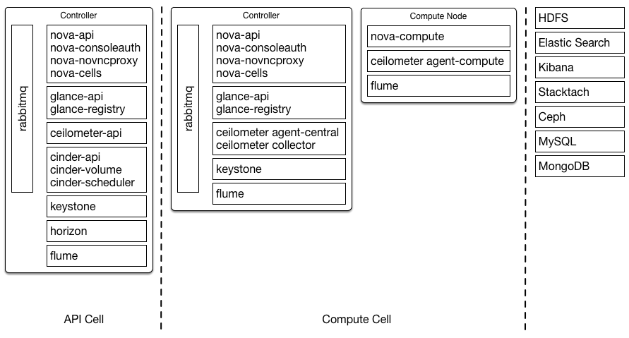

.. _general-compute-cloud:

=====================
General compute cloud
=====================

Design model
~~~~~~~~~~~~

Hybrid cloud environments are designed for these use cases:

* Bursting workloads from private to public OpenStack clouds
* Bursting workloads from private to public non-OpenStack clouds
* High availability across clouds (for technical diversity)

This chapter provides examples of environments that address
each of these use cases.

Component block diagram
~~~~~~~~~~~~~~~~~~~~~~~

Stakeholder
~~~~~~~~~~~

User stories
~~~~~~~~~~~~

General cloud example
---------------------

An online classified advertising company wants to run web applications
consisting of Tomcat, Nginx and MariaDB in a private cloud. To meet the
policy requirements, the cloud infrastructure will run in their
own data center. The company has predictable load requirements, but
requires scaling to cope with nightly increases in demand. Their current
environment does not have the flexibility to align with their goal of
running an open source API environment. The current environment consists
of the following:

* Between 120 and 140 installations of Nginx and Tomcat, each with 2
  vCPUs and 4 GB of RAM

* A three node MariaDB and Galera cluster, each with 4 vCPUs and 8 GB
  RAM

The company runs hardware load balancers and multiple web applications
serving their websites, and orchestrates environments using combinations
of scripts and Puppet. The website generates large amounts of log data
daily that requires archiving.

The solution would consist of the following OpenStack components:

* A firewall, switches and load balancers on the public facing network
  connections.

* OpenStack Controller service running Image service, Identity service,
  Networking service, combined with support services such as MariaDB and
  RabbitMQ, configured for high availability on at least three controller
  nodes.

* OpenStack Compute nodes running the KVM hypervisor.

* OpenStack Block Storage for use by compute instances, requiring
  persistent storage (such as databases for dynamic sites).

* OpenStack Object Storage for serving static objects (such as images).

.. figure:: ../figures/General_Architecture3.png

Running up to 140 web instances and the small number of MariaDB
instances requires 292 vCPUs available, as well as 584 GB RAM. On a
typical 1U server using dual-socket hex-core Intel CPUs with
Hyperthreading, and assuming 2:1 CPU overcommit ratio, this would
require 8 OpenStack Compute nodes.

The web application instances run from local storage on each of the
OpenStack Compute nodes. The web application instances are stateless,
meaning that any of the instances can fail and the application will
continue to function.

MariaDB server instances store their data on shared enterprise storage,
such as NetApp or Solidfire devices. If a MariaDB instance fails,
storage would be expected to be re-attached to another instance and
rejoined to the Galera cluster.

Logs from the web application servers are shipped to OpenStack Object
Storage for processing and archiving.

Additional capabilities can be realized by moving static web content to
be served from OpenStack Object Storage containers, and backing the
OpenStack Image service with OpenStack Object Storage.

.. note::

   Increasing OpenStack Object Storage means network bandwidth needs to
   be taken into consideration. Running OpenStack Object Storage with
   network connections offering 10 GbE or better connectivity is
   advised.

Leveraging Orchestration and Telemetry services is also a potential
issue when providing auto-scaling, orchestrated web application
environments. Defining the web applications in a
:term:`Heat Orchestration Template (HOT)`
negates the reliance on the current scripted Puppet
solution.

OpenStack Networking can be used to control hardware load balancers
through the use of plug-ins and the Networking API. This allows users to
control hardware load balance pools and instances as members in these
pools, but their use in production environments must be carefully
weighed against current stability.

Compute-focused cloud example
-----------------------------

The Conseil Européen pour la Recherche Nucléaire (CERN), also known as
the European Organization for Nuclear Research, provides particle
accelerators and other infrastructure for high-energy physics research.

As of 2011 CERN operated these two compute centers in Europe with plans
to add a third.

+-----------------------+------------------------+
| Data center           | Approximate capacity   |
+=======================+========================+
| Geneva, Switzerland   | -  3.5 Mega Watts      |
|                       |                        |
|                       | -  91000 cores         |
|                       |                        |
|                       | -  120 PB HDD          |
|                       |                        |
|                       | -  100 PB Tape         |
|                       |                        |
|                       | -  310 TB Memory       |
+-----------------------+------------------------+
| Budapest, Hungary     | -  2.5 Mega Watts      |
|                       |                        |
|                       | -  20000 cores         |
|                       |                        |
|                       | -  6 PB HDD            |
+-----------------------+------------------------+

To support a growing number of compute-heavy users of experiments
related to the Large Hadron Collider (LHC), CERN ultimately elected to
deploy an OpenStack cloud using Scientific Linux and RDO. This effort
aimed to simplify the management of the center's compute resources with
a view to doubling compute capacity through the addition of a data
center in 2013 while maintaining the same levels of compute staff.

The CERN solution uses :term:`cells <cell>` for segregation of compute
resources and for transparently scaling between different data centers.
This decision meant trading off support for security groups and live
migration. In addition, they must manually replicate some details, like
flavors, across cells. In spite of these drawbacks, cells provide the
required scale while exposing a single public API endpoint to users.

CERN created a compute cell for each of the two original data centers
and created a third when it added a new data center in 2013. Each cell
contains three availability zones to further segregate compute resources
and at least three RabbitMQ message brokers configured for clustering
with mirrored queues for high availability.

The API cell, which resides behind a HAProxy load balancer, is in the
data center in Switzerland and directs API calls to compute cells using
a customized variation of the cell scheduler. The customizations allow
certain workloads to route to a specific data center or all data
centers, with cell RAM availability determining cell selection in the
latter case.

.. figure:: ../figures/Generic_CERN_Example.png

There is also some customization of the filter scheduler that handles
placement within the cells:

ImagePropertiesFilter
 Provides special handling depending on the guest operating system in
 use (Linux-based or Windows-based).

ProjectsToAggregateFilter
 Provides special handling depending on which project the instance is
 associated with.

default_schedule_zones
 Allows the selection of multiple default availability zones, rather
 than a single default.

A central database team manages the MySQL database server in each cell
in an active/passive configuration with a NetApp storage back end.
Backups run every 6 hours.

Network architecture
^^^^^^^^^^^^^^^^^^^^

To integrate with existing networking infrastructure, CERN made
customizations to legacy networking (nova-network). This was in the form
of a driver to integrate with CERN's existing database for tracking MAC
and IP address assignments.

The driver facilitates selection of a MAC address and IP for new
instances based on the compute node where the scheduler places the
instance.

The driver considers the compute node where the scheduler placed an
instance and selects a MAC address and IP from the pre-registered list
associated with that node in the database. The database updates to
reflect the address assignment to that instance.

Storage architecture
^^^^^^^^^^^^^^^^^^^^

CERN deploys the OpenStack Image service in the API cell and configures
it to expose version 1 (V1) of the API. This also requires the image
registry. The storage back end in use is a 3 PB Ceph cluster.

CERN maintains a small set of Scientific Linux 5 and 6 images onto which
orchestration tools can place applications. Puppet manages instance
configuration and customization.

Monitoring
^^^^^^^^^^

CERN does not require direct billing, but uses the Telemetry service to
perform metering for the purposes of adjusting project quotas. CERN uses
a sharded, replicated, MongoDB back-end. To spread API load, CERN
deploys instances of the nova-api service within the child cells for
Telemetry to query against. This also requires the configuration of
supporting services such as keystone, glance-api, and glance-registry in
the child cells.

Additional monitoring tools in use include
`Flume <http://flume.apache.org/>`_, `Elastic
Search <http://www.elasticsearch.org/>`_,
`Kibana <http://www.elasticsearch.org/overview/kibana/>`_, and the CERN
developed `Lemon <http://lemon.web.cern.ch/lemon/index.shtml>`_
project.

Hybrid cloud example: bursting to a public OpenStack cloud
~~~~~~~~~~~~~~~~~~~~~~~~~~~~~~~~~~~~~~~~~~~~~~~~~~~~~~~~~~

Company A's data center is running low on capacity.
It is not possible to expand the data center in the foreseeable future.
In order to accommodate the continuously growing need for
development resources in the organization,
Company A decides to use resources in the public cloud.

Company A has an established data center with a substantial amount
of hardware. Migrating the workloads to a public cloud is not feasible.

The company has an internal cloud management platform that directs
requests to the appropriate cloud, depending on the local capacity.
This is a custom in-house application written for this specific purpose.

This solution is depicted in the figure below:

.. figure:: ../figures/Multi-Cloud_Priv-Pub3.png
   :width: 100%

This example shows two clouds with a Cloud Management
Platform (CMP) connecting them. This guide does not
discuss a specific CMP, but describes how the Orchestration and
Telemetry services handle, manage, and control workloads.

The private OpenStack cloud has at least one controller and at least
one compute node. It includes metering using the Telemetry service.
The Telemetry service captures the load increase and the CMP
processes the information.  If there is available capacity,
the CMP uses the OpenStack API to call the Orchestration service.
This creates instances on the private cloud in response to user requests.
When capacity is not available on the private cloud, the CMP issues
a request to the Orchestration service API of the public cloud.
This creates the instance on the public cloud.

In this example, Company A does not direct the deployments to an
external public cloud due to concerns regarding resource control,
security, and increased operational expense.

Hybrid cloud example: bursting to a public non-OpenStack cloud
~~~~~~~~~~~~~~~~~~~~~~~~~~~~~~~~~~~~~~~~~~~~~~~~~~~~~~~~~~~~~~

The second example examines bursting workloads from the private cloud
into a non-OpenStack public cloud using Amazon Web Services (AWS)
to take advantage of additional capacity and to scale applications.

The following diagram demonstrates an OpenStack-to-AWS hybrid cloud:

.. figure:: ../figures/Multi-Cloud_Priv-AWS4.png
   :width: 100%

Company B states that its developers are already using AWS
and do not want to change to a different provider.

If the CMP is capable of connecting to an external cloud
provider with an appropriate API, the workflow process remains
the same as the previous scenario.
The actions the CMP takes, such as monitoring loads and
creating new instances, stay the same.
However, the CMP performs actions in the public cloud
using applicable API calls.

If the public cloud is AWS, the CMP would use the
EC2 API to create a new instance and assign an Elastic IP.
It can then add that IP to HAProxy in the private cloud.
The CMP can also reference AWS-specific
tools such as CloudWatch and CloudFormation.

Several open source tool kits for building CMPs are
available and can handle this kind of translation.
Examples include ManageIQ, jClouds, and JumpGate.

Hybrid cloud example: high availability and disaster recovery
~~~~~~~~~~~~~~~~~~~~~~~~~~~~~~~~~~~~~~~~~~~~~~~~~~~~~~~~~~~~~

Company C requires their local data center to be able to
recover from failure.  Some of the workloads currently in
use are running on their private OpenStack cloud.
Protecting the data involves Block Storage, Object Storage,
and a database. The architecture supports the failure of
large components of the system while ensuring that the
system continues to deliver services.
While the services remain available to users, the failed
components are restored in the background based on standard
best practice data replication policies.
To achieve these objectives, Company C replicates data to
a second cloud in a geographically distant location.
The following diagram describes this system:

.. figure:: ../figures/Multi-Cloud_failover2.png
   :width: 100%

This example includes two private OpenStack clouds connected with a CMP.
The source cloud, OpenStack Cloud 1, includes a controller and
at least one instance running MySQL. It also includes at least
one Block Storage volume and one Object Storage volume.
This means that data is available to the users at all times.
The details of the method for protecting each of these sources
of data differs.

Object Storage relies on the replication capabilities of
the Object Storage provider.
Company C enables OpenStack Object Storage so that it creates
geographically separated replicas that take advantage of this feature.
The company configures storage so that at least one replica
exists in each cloud. In order to make this work, the company
configures a single array spanning both clouds with OpenStack Identity.
Using Federated Identity, the array talks to both clouds, communicating
with OpenStack Object Storage through the Swift proxy.

For Block Storage, the replication is a little more difficult,
and involves tools outside of OpenStack itself.
The OpenStack Block Storage volume is not set as the drive itself
but as a logical object that points to a physical back end.
Disaster recovery is configured for Block Storage for
synchronous backup for the highest level of data protection,
but asynchronous backup could have been set as an alternative
that is not as latency sensitive.
For asynchronous backup, the Block Storage API makes it possible
to export the data and also the metadata of a particular volume,
so that it can be moved and replicated elsewhere.
More information can be found here:
https://blueprints.launchpad.net/cinder/+spec/cinder-backup-volume-metadata-support.

The synchronous backups create an identical volume in both
clouds and chooses the appropriate flavor so that each cloud
has an identical back end. This is done by creating volumes
through the CMP. After this is configured, a solution
involving DRDB synchronizes the physical drives.

The database component is backed up using synchronous backups.
MySQL does not support geographically diverse replication,
so disaster recovery is provided by replicating the file itself.
As it is not possible to use Object Storage as the back end of
a database like MySQL, Swift replication is not an option.
Company C decides not to store the data on another geo-tiered
storage system, such as Ceph, as Block Storage.
This would have given another layer of protection.
Another option would have been to store the database on an OpenStack
Block Storage volume and backing it up like any other Block Storage.
