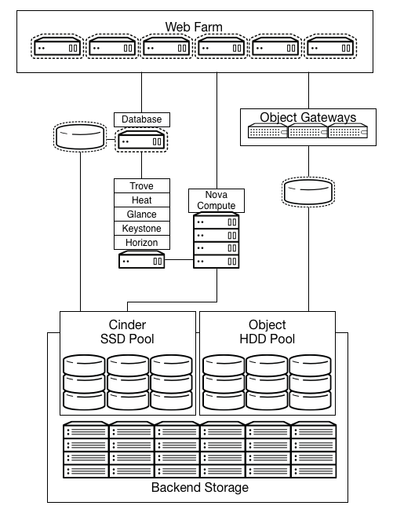

.. _storage-cloud:

=============
Storage cloud
=============

Design model
~~~~~~~~~~~~

Storage-focused architecture depends on specific use cases. This section
discusses three example use cases:

*  An object store with a RESTful interface

*  Compute analytics with parallel file systems

*  High performance database

An object store with a RESTful interface
----------------------------------------

The example below shows a REST interface without a high performance
requirement. The following diagram depicts the example architecture:

.. figure:: ../figures/Storage_Object.png

The example REST interface, presented as a traditional Object Store
running on traditional spindles, does not require a high performance
caching tier.

This example uses the following components:

Network:

*  10 GbE horizontally scalable spine leaf back-end storage and front
   end network.

Storage hardware:

*  10 storage servers each with 12x4 TB disks equaling 480 TB total
   space with approximately 160 TB of usable space after replicas.

Proxy:

*  3x proxies

*  2x10 GbE bonded front end

*  2x10 GbE back-end bonds

*  Approximately 60 Gb of total bandwidth to the back-end storage
   cluster

.. note::

   It may be necessary to implement a third party caching layer for some
   applications to achieve suitable performance.

Compute analytics with data processing service
----------------------------------------------

Analytics of large data sets are dependent on the performance of the
storage system. Clouds using storage systems such as Hadoop Distributed
File System (HDFS) have inefficiencies which can cause performance
issues.

One potential solution to this problem is the implementation of storage
systems designed for performance. Parallel file systems have previously
filled this need in the HPC space and are suitable for large scale
performance-orientated systems.

OpenStack has integration with Hadoop to manage the Hadoop cluster
within the cloud. The following diagram shows an OpenStack store with a
high performance requirement:

.. figure:: ../figures/Storage_Hadoop3.png

The hardware requirements and configuration are similar to those of the
High Performance Database example below. In this case, the architecture
uses Ceph's Swift-compatible REST interface, features that allow for
connecting a caching pool to allow for acceleration of the presented
pool.

High performance database with Database service
~~~~~~~~~~~~~~~~~~~~~~~~~~~~~~~~~~~~~~~~~~~~~~~

Databases are a common workload that benefit from high performance
storage back ends. Although enterprise storage is not a requirement,
many environments have existing storage that OpenStack cloud can use as
back ends. You can create a storage pool to provide block devices with
OpenStack Block Storage for instances as well as object interfaces. In
this example, the database I-O requirements are high and demand storage
presented from a fast SSD pool.

A storage system presents a LUN backed by a set of SSDs using a
traditional storage array with OpenStack Block Storage integration or a
storage platform such as Ceph or Gluster.

This system can provide additional performance. For example, in the
database example below, a portion of the SSD pool can act as a block
device to the Database server. In the high performance analytics
example, the inline SSD cache layer accelerates the REST interface.

In this example, Ceph presents a swift-compatible REST interface, as
well as a block level storage from a distributed storage cluster. It is
highly flexible and has features that enable reduced cost of operations
such as self healing and auto balancing. Using erasure coded pools are a
suitable way of maximizing the amount of usable space.

.. note::

   There are special considerations around erasure coded pools. For
   example, higher computational requirements and limitations on the
   operations allowed on an object; erasure coded pools do not support
   partial writes.

Using Ceph as an applicable example, a potential architecture would have
the following requirements:

Network:

*  10 GbE horizontally scalable spine leaf back-end storage and
   front-end network

Storage hardware:

*  5 storage servers for caching layer 24x1 TB SSD

*  10 storage servers each with 12x4 TB disks which equals 480 TB total
   space with about approximately 160 TB of usable space after 3
   replicas

REST proxy:

*  3x proxies

*  2x10 GbE bonded front end

*  2x10 GbE back-end bonds

*  Approximately 60 Gb of total bandwidth to the back-end storage
   cluster

Using an SSD cache layer, you can present block devices directly to
hypervisors or instances. The REST interface can also use the SSD cache
systems as an inline cache.

Requirements
~~~~~~~~~~~~

Component block diagram
~~~~~~~~~~~~~~~~~~~~~~~
