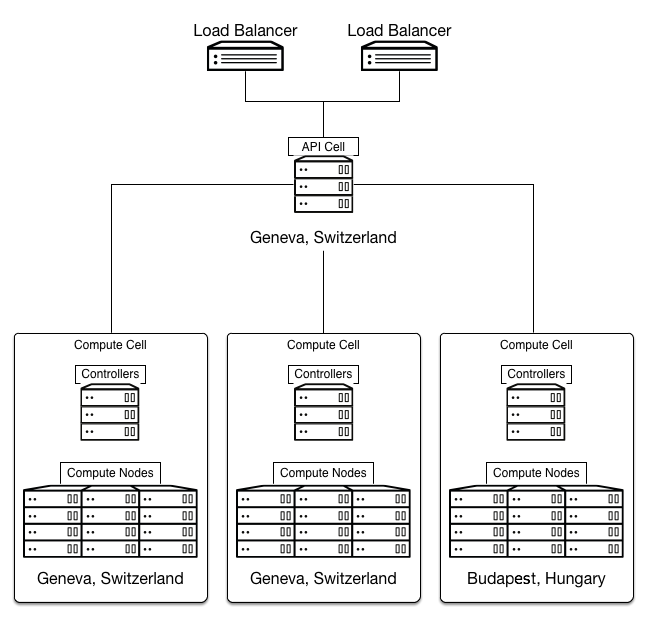

=====================
Prescriptive examples
=====================

The Conseil Européen pour la Recherche Nucléaire (CERN), also known as
the European Organization for Nuclear Research, provides particle
accelerators and other infrastructure for high-energy physics research.

As of 2011 CERN operated these two compute centers in Europe with plans
to add a third.

+-----------------------+------------------------+
| Data center           | Approximate capacity   |
+=======================+========================+
| Geneva, Switzerland   | -  3.5 Mega Watts      |
|                       |                        |
|                       | -  91000 cores         |
|                       |                        |
|                       | -  120 PB HDD          |
|                       |                        |
|                       | -  100 PB Tape         |
|                       |                        |
|                       | -  310 TB Memory       |
+-----------------------+------------------------+
| Budapest, Hungary     | -  2.5 Mega Watts      |
|                       |                        |
|                       | -  20000 cores         |
|                       |                        |
|                       | -  6 PB HDD            |
+-----------------------+------------------------+

To support a growing number of compute-heavy users of experiments
related to the Large Hadron Collider (LHC), CERN ultimately elected to
deploy an OpenStack cloud using Scientific Linux and RDO. This effort
aimed to simplify the management of the center's compute resources with
a view to doubling compute capacity through the addition of a data
center in 2013 while maintaining the same levels of compute staff.

The CERN solution uses :term:`cells <cell>` for segregation of compute
resources and for transparently scaling between different data centers.
This decision meant trading off support for security groups and live
migration. In addition, they must manually replicate some details, like
flavors, across cells. In spite of these drawbacks cells provide the
required scale while exposing a single public API endpoint to users.

CERN created a compute cell for each of the two original data centers
and created a third when it added a new data center in 2013. Each cell
contains three availability zones to further segregate compute resources
and at least three RabbitMQ message brokers configured for clustering
with mirrored queues for high availability.

The API cell, which resides behind a HAProxy load balancer, is in the
data center in Switzerland and directs API calls to compute cells using
a customized variation of the cell scheduler. The customizations allow
certain workloads to route to a specific data center or all data
centers, with cell RAM availability determining cell selection in the
latter case.

There is also some customization of the filter scheduler that handles
placement within the cells:

ImagePropertiesFilter
 Provides special handling depending on the guest operating system in
 use (Linux-based or Windows-based).

ProjectsToAggregateFilter
 Provides special handling depending on which project the instance is
 associated with.

default_schedule_zones
 Allows the selection of multiple default availability zones, rather
 than a single default.

A central database team manages the MySQL database server in each cell
in an active/passive configuration with a NetApp storage back end.
Backups run every 6 hours.

Network architecture
~~~~~~~~~~~~~~~~~~~~

To integrate with existing networking infrastructure, CERN made
customizations to legacy networking (nova-network). This was in the form
of a driver to integrate with CERN's existing database for tracking MAC
and IP address assignments.

The driver facilitates selection of a MAC address and IP for new
instances based on the compute node where the scheduler places the
instance.

The driver considers the compute node where the scheduler placed an
instance and selects a MAC address and IP from the pre-registered list
associated with that node in the database. The database updates to
reflect the address assignment to that instance.

Storage architecture
~~~~~~~~~~~~~~~~~~~~

CERN deploys the OpenStack Image service in the API cell and configures
it to expose version 1 (V1) of the API. This also requires the image
registry. The storage back end in use is a 3 PB Ceph cluster.

CERN maintains a small set of Scientific Linux 5 and 6 images onto which
orchestration tools can place applications. Puppet manages instance
configuration and customization.

Monitoring
~~~~~~~~~~

CERN does not require direct billing, but uses the Telemetry service to
perform metering for the purposes of adjusting project quotas. CERN uses
a sharded, replicated, MongoDB back-end. To spread API load, CERN
deploys instances of the nova-api service within the child cells for
Telemetry to query against. This also requires the configuration of
supporting services such as keystone, glance-api, and glance-registry in
the child cells.

.. figure:: figures/Generic_CERN_Architecture.png

Additional monitoring tools in use include
`Flume <http://flume.apache.org/>`__, `Elastic
Search <http://www.elasticsearch.org/>`__,
`Kibana <http://www.elasticsearch.org/overview/kibana/>`__, and the CERN
developed `Lemon <http://lemon.web.cern.ch/lemon/index.shtml>`__
project.
