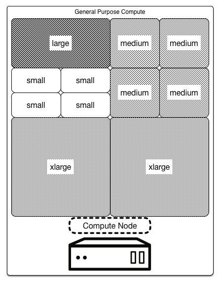

========================
Technical considerations
========================

In a compute-focused OpenStack cloud, the type of instance workloads you
provision heavily influences technical decision making.

Public and private clouds require deterministic capacity planning to
support elastic growth in order to meet user SLA expectations.
Deterministic capacity planning is the path to predicting the effort and
expense of making a given process perform consistently. This process is
important because, when a service becomes a critical part of a user's
infrastructure, the user's experience links directly to the SLAs of the
cloud itself.

There are two aspects of capacity planning to consider:

* Planning the initial deployment footprint

* Planning expansion of the environment to stay ahead of cloud user demands

Begin planning an initial OpenStack deployment footprint with
estimations of expected uptake, and existing infrastructure workloads.

The starting point is the core count of the cloud. By applying relevant
ratios, the user can gather information about:

* The number of expected concurrent instances: (overcommit fraction ×
  cores) / virtual cores per instance

* Required storage: flavor disk size × number of instances

These ratios determine the amount of additional infrastructure needed to
support the cloud. For example, consider a situation in which you
require 1600 instances, each with 2 vCPU and 50 GB of storage. Assuming
the default overcommit rate of 16:1, working out the math provides an
equation of:

* 1600 = (16 × (number of physical cores)) / 2

* Storage required = 50 GB × 1600

On the surface, the equations reveal the need for 200 physical cores and
80 TB of storage for ``/var/lib/nova/instances/``. However, it is also
important to look at patterns of usage to estimate the load that the API
services, database servers, and queue servers are likely to encounter.

Aside from the creation and termination of instances, consider the
impact of users accessing the service, particularly on nova-api and its
associated database. Listing instances gathers a great deal of
information and given the frequency with which users run this operation,
a cloud with a large number of users can increase the load
significantly. This can even occur unintentionally. For example, the
OpenStack Dashboard instances tab refreshes the list of instances every
30 seconds, so leaving it open in a browser window can cause unexpected
load.

Consideration of these factors can help determine how many cloud
controller cores you require. A server with 8 CPU cores and 8 GB of RAM
server would be sufficient for a rack of compute nodes, given the above
caveats.

Key hardware specifications are also crucial to the performance of user
instances. Be sure to consider budget and performance needs, including
storage performance (spindles/core), memory availability (RAM/core),
network bandwidth (Gbps/core), and overall CPU performance (CPU/core).

The cloud resource calculator is a useful tool in examining the impacts
of different hardware and instance load outs. See `cloud-resource-calculator
<https://github.com/noslzzp/cloud-resource-calculator/blob/master/cloud-resource-calculator.ods>`_.

Expansion planning
~~~~~~~~~~~~~~~~~~

A key challenge for planning the expansion of cloud compute services is
the elastic nature of cloud infrastructure demands.

Planning for expansion is a balancing act. Planning too conservatively
can lead to unexpected oversubscription of the cloud and dissatisfied
users. Planning for cloud expansion too aggressively can lead to
unexpected underuse of the cloud and funds spent unnecessarily
on operating infrastructure.

The key is to carefully monitor the trends in cloud usage over time. The
intent is to measure the consistency with which you deliver services,
not the average speed or capacity of the cloud. Using this information
to model capacity performance enables users to more accurately determine
the current and future capacity of the cloud.

CPU and RAM
~~~~~~~~~~~

OpenStack enables users to overcommit CPU and RAM on compute nodes. This
allows an increase in the number of instances running on the cloud at
the cost of reducing the performance of the instances. OpenStack Compute
uses the following ratios by default:

* CPU allocation ratio: 16:1

* RAM allocation ratio: 1.5:1

The default CPU allocation ratio of 16:1 means that the scheduler
allocates up to 16 virtual cores per physical core. For example, if a
physical node has 12 cores, the scheduler sees 192 available virtual
cores. With typical flavor definitions of 4 virtual cores per instance,
this ratio would provide 48 instances on a physical node.

Similarly, the default RAM allocation ratio of 1.5:1 means that the
scheduler allocates instances to a physical node as long as the total
amount of RAM associated with the instances is less than 1.5 times the
amount of RAM available on the physical node.

You must select the appropriate CPU and RAM allocation ratio based on
particular use cases.

Additional hardware
~~~~~~~~~~~~~~~~~~~

Certain use cases may benefit from exposure to additional devices on the
compute node. Examples might include:

* High performance computing jobs that benefit from the availability of
  graphics processing units (GPUs) for general-purpose computing.

* Cryptographic routines that benefit from the availability of hardware
  random number generators to avoid entropy starvation.

* Database management systems that benefit from the availability of
  SSDs for ephemeral storage to maximize read/write time.

Host aggregates group hosts that share similar characteristics, which
can include hardware similarities. The addition of specialized hardware
to a cloud deployment is likely to add to the cost of each node, so
consider carefully whether all compute nodes, or just a subset targeted
by flavors, need the additional customization to support the desired
workloads.

Utilization
~~~~~~~~~~~

Infrastructure-as-a-Service offerings, including OpenStack, use flavors
to provide standardized views of virtual machine resource requirements
that simplify the problem of scheduling instances while making the best
use of the available physical resources.

In order to facilitate packing of virtual machines onto physical hosts,
the default selection of flavors provides a second largest flavor that
is half the size of the largest flavor in every dimension. It has half
the vCPUs, half the vRAM, and half the ephemeral disk space. The next
largest flavor is half that size again. The following figure provides a
visual representation of this concept for a general purpose computing
design:

The following figure displays a CPU-optimized, packed server:

.. figure:: figures/Compute_Tech_Bin_Packing_CPU_optimized1.png

These default flavors are well suited to typical configurations of
commodity server hardware. To maximize utilization, however, it may be
necessary to customize the flavors or create new ones in order to better
align instance sizes to the available hardware.

Workload characteristics may also influence hardware choices and flavor
configuration, particularly where they present different ratios of CPU
versus RAM versus HDD requirements.

For more information on Flavors see `OpenStack Operations Guide:
Flavors <https://docs.openstack.org/ops-guide/ops-user-facing-operations.html#flavors>`_.

OpenStack components
~~~~~~~~~~~~~~~~~~~~

Due to the nature of the workloads in this scenario, a number of
components are highly beneficial for a Compute-focused cloud. This
includes the typical OpenStack components:

* :term:`Compute service (nova)`

* :term:`Image service (glance)`

* :term:`Identity service (keystone)`

Also consider several specialized components:

* :term:`Orchestration service (heat)`
   Given the nature of the applications involved in this scenario, these
   are heavily automated deployments. Making use of Orchestration is
   highly beneficial in this case. You can script the deployment of a
   batch of instances and the running of tests, but it makes sense to
   use the Orchestration service to handle all these actions.

* :term:`Telemetry service (telemetry)`
   Telemetry and the alarms it generates support autoscaling of
   instances using Orchestration. Users that are not using the
   Orchestration service do not need to deploy the Telemetry service and
   may choose to use external solutions to fulfill their metering and
   monitoring requirements.

* :term:`Block Storage service (cinder)`
   Due to the burst-able nature of the workloads and the applications
   and instances that perform batch processing, this cloud mainly uses
   memory or CPU, so the need for add-on storage to each instance is not
   a likely requirement. This does not mean that you do not use
   OpenStack Block Storage (cinder) in the infrastructure, but typically
   it is not a central component.

* :term:`Networking service (neutron)`
   When choosing a networking platform, ensure that it either works with
   all desired hypervisor and container technologies and their OpenStack
   drivers, or that it includes an implementation of an ML2 mechanism
   driver. You can mix networking platforms that provide ML2 mechanisms
   drivers.
