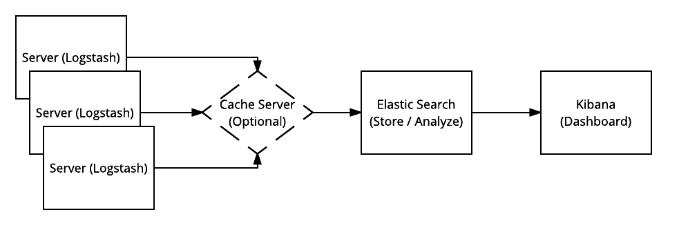

======================
Compute server logging
======================

The logs on the compute nodes, or any server running nova-compute (for example
in a hyperconverged architecture), are the primary points for troubleshooting
issues with the hypervisor and compute services. Additionally, operating system
logs can also provide useful information.

As the cloud environment grows, the amount of log data increases exponentially.
Enabling debugging on either the OpenStack services or the operating system
further compounds the data issues.

Logging is described in more detail in the `Logging and Monitoring
<https://docs.openstack.org/operations-guide/ops-logging-monitoring.html>`_.
However, it is an important design consideration to take into account before
commencing operations of your cloud.

OpenStack produces a great deal of useful logging information, but for
the information to be useful for operations purposes, you should consider
having a central logging server to send logs to, and a log parsing/analysis
system such as Elastic Stack [formerly known as ELK].

Elastic Stack consists of mainly three components: Elasticsearch (log search
and analysis), Logstash (log intake, processing and output) and Kibana (log
dashboard service).

Due to the amount of logs being sent from servers in the OpenStack environment,
an optional in-memory data structure store can be used. Common examples are
Redis and Memcached. In newer versions of Elastic Stack, a file buffer called
`Filebeat <https://www.elastic.co/products/beats/filebeat>`_ is used for a
similar purpose but adds a "backpressure-sensitive" protocol when sending data
to Logstash or Elasticsearch.

Log analysis often requires disparate logs of differing formats. Elastic
Stack (namely Logstash) was created to take many different log inputs and
transform them into a consistent format that Elasticsearch can catalog and
analyze. As seen in the image above, the process of ingestion starts on the
servers by Logstash, is forwarded to the Elasticsearch server for storage and
searching, and then displayed through Kibana for visual analysis and
interaction.

For instructions on installing Logstash, Elasticsearch and Kibana, see the
`Elasticsearch reference
<https://www.elastic.co/guide/en/elasticsearch/reference/current/getting-started.html>`_.

There are some specific configuration parameters that are needed to
configure Logstash for OpenStack. For example, in order to get Logstash to
collect, parse, and send the correct portions of log files to the Elasticsearch
server, you need to format the configuration file properly. There
are input, output and filter configurations. Input configurations tell Logstash
where to receive data from (log files/forwarders/filebeats/StdIn/Eventlog),
output configurations specify where to put the data, and filter configurations
define the input contents to forward to the output.

The Logstash filter performs intermediary processing on each event. Conditional
filters are applied based on the characteristics of the input and the event.
Some examples of filtering are:

* grok
* date
* csv
* json

There are also output filters available that send event data to many different
destinations. Some examples are:

* csv
* redis
* elasticsearch
* file
* jira
* nagios
* pagerduty
* stdout

Additionally there are several codecs that can be used to change the data
representation of events such as:

* collectd
* graphite
* json
* plan
* rubydebug

These input, output and filter configurations are typically stored in
:file:`/etc/logstash/conf.d` but may vary by linux distribution. Separate
configuration files should be created for different logging systems such as
syslog, Apache, and OpenStack.

General examples and configuration guides can be found on the Elastic `Logstash
Configuration page
<https://www.elastic.co/guide/en/logstash/current/configuration-file-structure.html>`_.

OpenStack input, output and filter examples can be found at
`sorantis/elkstack
<https://github.com/sorantis/elkstack/tree/master/elk/logstash>`_.

Once a configuration is complete, Kibana can be used as a visualization tool
for OpenStack and system logging. This will allow operators to configure custom
dashboards for performance, monitoring and security.
