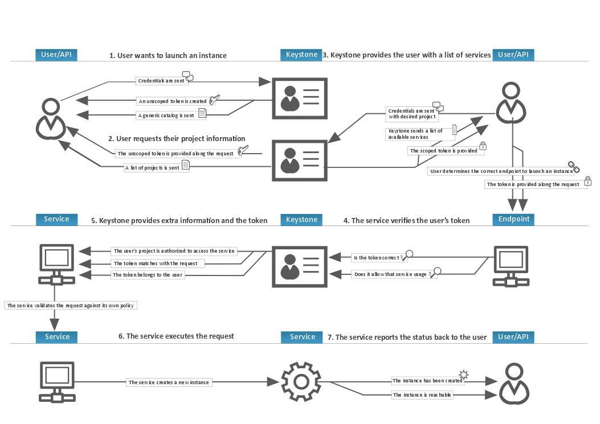

==================
OpenStack Identity
==================

The OpenStack Identity service performs the following functions:

- Tracking users and their permissions.

- Providing a catalog of available services with their API endpoints.

When installing OpenStack Identity service, you must register each
service in your OpenStack installation. Identity service can then track
which OpenStack services are installed, and where they are located on
the network.

To understand OpenStack Identity, you must understand the following
concepts:

User
  Digital representation of a person, system, or service who uses
  OpenStack cloud services. The Identity service validates that
  incoming requests are made by the user who claims to be making the
  call. Users have a login and may be assigned tokens to access
  resources. Users can be directly assigned to a particular tenant and
  behave as if they are contained in that tenant.

Credentials
  Data that confirms the user's identity. For example: user name and
  password, user name and API key, or an authentication token provided
  by the Identity service.

Authentication
  The process of confirming the identity of a user. OpenStack Identity
  confirms an incoming request by validating a set of credentials
  supplied by the user.

  These credentials are initially a user name and password, or a user
  name and API key. When user credentials are validated, OpenStack
  Identity issues an authentication token which the user provides in
  subsequent requests.

Token
  An alpha-numeric string of text used to access OpenStack APIs and
  resources. A token may be revoked at any time and is valid for a
  finite duration.

  While OpenStack Identity supports token-based authentication in this
  release, the intention is to support additional protocols in the
  future. Its main purpose is to be an integration service, and not
  aspire to be a full-fledged identity store and management solution.

Tenant
  A container used to group or isolate resources. Tenants also group
  or isolate identity objects. Depending on the service operator, a
  tenant may map to a customer, account, organization, or project.

Service
  An OpenStack service, such as Compute (nova), Object Storage
  (swift), or Image service (glance). It provides one or more
  endpoints in which users can access resources and perform
  operations.

Endpoint
  A network-accessible address where you access a service, usually a
  URL address. If you are using an extension for templates, an
  endpoint template can be created, which represents the templates of
  all the consumable services that are available across the regions.

Role
  A personality with a defined set of user rights and privileges to
  perform a specific set of operations.

  In the Identity service, a token that is issued to a user includes
  the list of roles. Services that are being called by that user
  determine how they interpret the set of roles a user has and to
  which operations or resources each role grants access.

Keystone Client
  A command line interface for the OpenStack Identity API. For
  example, users can run the ``keystone service-create`` and
  ``keystone endpoint-create`` commands to register services in their
  OpenStack installations.

The following diagram shows the OpenStack Identity process flow:

