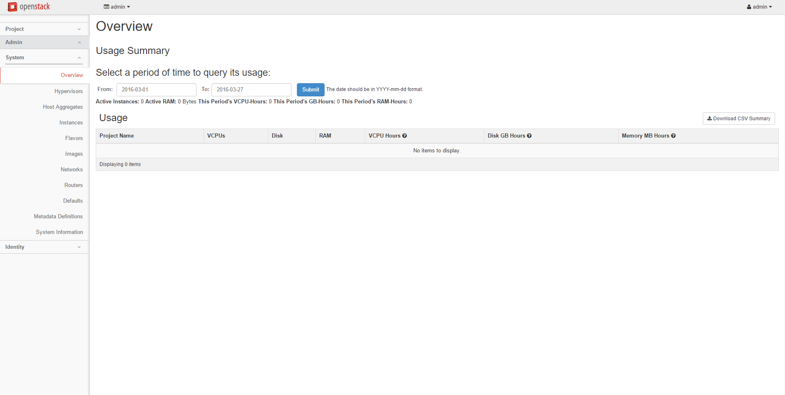

==================
Dashboard overview
==================

The OpenStack dashboard is a modular `Django web
application <https://www.djangoproject.com/>`__ that provides a
graphical interface to OpenStack services.

The dashboard is usually deployed through
`mod_wsgi <http://code.google.com/p/modwsgi/>`__ in Apache. You can
modify the dashboard code to make it suitable for different sites.

From a network architecture point of view, this service must be
accessible to customers and the public API for each OpenStack service.
To use the administrator functionality for other services, it must also
connect to Admin API endpoints, which should not be accessible by
customers.

