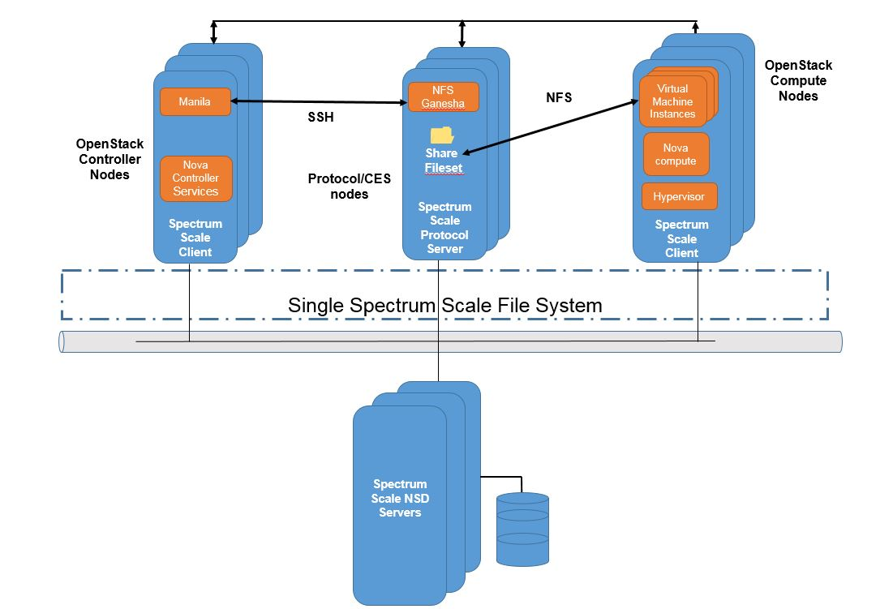

===============================
IBM Spectrum Scale share driver
===============================

IBM Spectrum Scale is a flexible software-defined storage product that can be
deployed as high-performance file storage or a cost optimized
large-scale content repository. IBM Spectrum Scale, previously known as
IBM General Parallel File System (GPFS), is designed to scale performance
and capacity with no bottlenecks. IBM Spectrum Scale is a cluster file system
that provides concurrent access to file systems from multiple nodes. The
storage provided by these nodes can be direct attached, network attached, SAN
attached, or a combination of these methods. Spectrum Scale provides many
features beyond common data access, including data replication, policy based
storage management, and space efficient file snapshot and clone operations.

Supported shared filesystems and operations (NFS shares only)
~~~~~~~~~~~~~~~~~~~~~~~~~~~~~~~~~~~~~~~~~~~~~~~~~~~~~~~~~~~~~

The Spectrum Scale share driver supports NFS shares.

The following operations are supported:

- Create a share.

- Delete a share.

- Allow share access.

  - Only IP access type is supported.

  - Both RW & RO access level is supported.

- Deny share access.

- Create a share snapshot.

- Delete a share snapshot.

- Create a share from a snapshot.

- Extend a share.

- Manage a share.

- Unmanage a share.

Requirements
~~~~~~~~~~~~

Spectrum Scale must be installed and a cluster must be created that includes
one or more storage nodes and protocol server nodes. The NFS server
running on these nodes is used to export shares to storage consumers in
OpenStack virtual machines or even to bare metal storage consumers in the
OpenStack environment. A file system must also be created and
mounted on these nodes before configuring the manila service to use Spectrum
Scale storage. For more details, refer to `Spectrum Scale product
documentation <https://ibm.biz/Bdi84g>`_.

Spectrum Scale supports two ways of exporting data through NFS with high
availability.

#. CES (which uses Ganesha NFS)

   * This is provided inherently by the protocol support in Spectrum Scale
     and is a recommended method for NFS access.

#. CNFS (which uses kernel NFS)

For more information on NFS support in Spectrum Scale, refer to
`Protocol support in Spectrum Scale <https://ibm.biz/BdiuZN>`_ and
`NFS Support overview in Spectrum Scale <https://ibm.biz/BdiuZ7>`_.

The following figure is an example of Spectrum Scale architecture
with OpenStack services:

Quotas should be enabled for the Spectrum Scale filesystem to be exported
through NFS using Spectrum Scale share driver.
Use the following command to enable quota for a filesystem:

.. code-block:: console

   $ mmchfs <filesystem> -Q yes

Limitation
~~~~~~~~~~

Spectrum Scale share driver currently supports creation of NFS shares in the
flat network space only. For example, the Spectrum Scale storage node exporting
the data should be in the same network as that of the Compute VMs which mount
the shares acting as NFS clients.

Driver configuration
~~~~~~~~~~~~~~~~~~~~

Spectrum Scale share driver supports creation of shares using both NFS servers
(Ganesha using Spectrum Scale CES/Kernel NFS).

For both the NFS server types, you need to set the ``share_driver`` in the
``manila.conf`` as:

.. code-block:: ini

   share_driver = manila.share.drivers.ibm.gpfs.GPFSShareDriver

Spectrum Scale CES (NFS Ganesha server)
---------------------------------------

To use Spectrum Scale share driver in this mode, set the ``gpfs_share_helpers``
in the ``manila.conf`` as:

.. code-block:: ini

   gpfs_share_helpers = CES=manila.share.drivers.ibm.gpfs.CESHelper

Following table lists the additional configuration options which are used with
this driver configuration.

.. include:: ../../tables/manila-spectrumscale_ces.rst

.. note::

    Configuration options related to ssh are required only if ``is_gpfs_node``
    is set to ``False``.

Spectrum Scale Clustered NFS (Kernel NFS server)
------------------------------------------------

To use Spectrum Scale share driver in this mode, set the ``gpfs_share_helpers``
in the ``manila.conf`` as:

.. code-block:: ini

   gpfs_share_helpers = KNFS=manila.share.drivers.ibm.gpfs.KNFSHelper

Following table lists the additional configuration options which are used with
this driver configuration.

.. include:: ../../tables/manila-spectrumscale_knfs.rst

.. note::

    Configuration options related to ssh are required only if ``is_gpfs_node``
    is set to ``False``.

Share creation steps
~~~~~~~~~~~~~~~~~~~~

Sample configuration
--------------------

.. code-block:: ini

    [gpfs]
    share_driver = manila.share.drivers.ibm.gpfs.GPFSShareDriver
    gpfs_share_export_ip = x.x.x.x
    gpfs_mount_point_base = /ibm/gpfs0
    gpfs_nfs_server_type = CES
    is_gpfs_node = True
    gpfs_share_helpers = CES=manila.share.drivers.ibm.gpfs.CESHelper
    share_backend_name = GPFS
    driver_handles_share_servers = False

Create GPFS share type and set extra spec
-----------------------------------------

.. code-block:: ini

   $ manila type-create --snapshot_support True \
     --create_share_from_snapshot_support True gpfs False

   $ manila type-key gpfs set share_backend_name=GPFS
