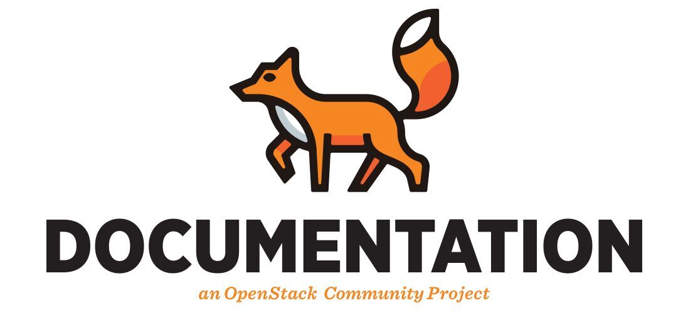

=========================================
OpenStack Documentation Contributor Guide
=========================================

Abstract
~~~~~~~~

This guide provides detailed instructions on the contribution workflow and
conventions to be considered by all documentation contributors. Please
follow these guidelines to keep the documentation structure, style, and
syntax consistent.

Contents
~~~~~~~~

.. toctree::
   :maxdepth: 2

   quickstart.rst
   team-structure.rst
   non-native-english-speakers.rst
   blueprints-and-specs.rst
   project-guides
   api-guides.rst
   doc-bugs.rst
   writing-docs.rst
   writing-style.rst
   user-guidelines.rst
   rst-conv.rst
   json-conv.rst
   diagram-guidelines.rst
   docs-review.rst
   docs-builds.rst
   doc-tools.rst
   release.rst

Glossary
~~~~~~~~

.. toctree::
   :maxdepth: 1

   common/glossary.rst

Search in this guide
~~~~~~~~~~~~~~~~~~~~

* :ref:`search`
