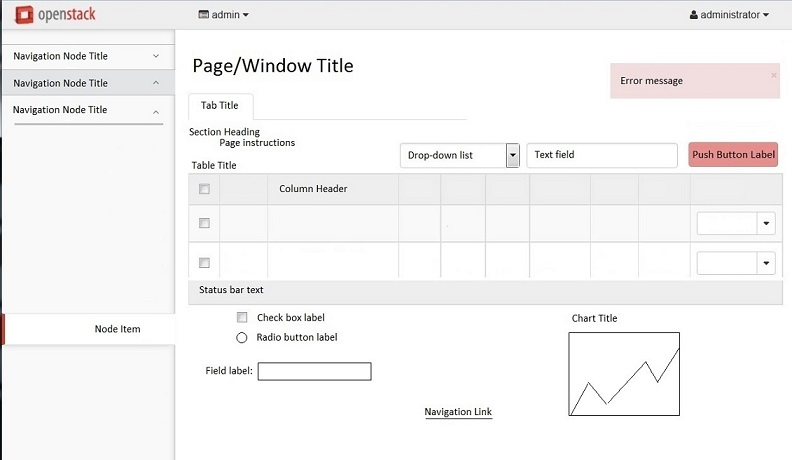

.. _uitextcapitalization:

========================================
Follow UI text capitalization guidelines
========================================

Interface element labels use a combination of
headline-style capitalization and sentence-style
capitalization. It is important to apply these
capitalization guidelines consistently to make
the UI clear and succinct.

Headline-style capitalization capitalizes every word in the text,
except:

* Articles, except as the first word (a, an, the)
* Coordinating conjunctions (and, or)
* Prepositions, except the first or last word
* Infinitives (to, in, an)

Examples of headline-style capitalization:
Restore Defaults, Allocate to Project

Sentence-style capitalization only capitalizes the first word in
the text. Unless the word is a proper noun that must be
capitalized.

Example of sentence-style capitalization:
Maximum number of downloads

Capitalization style for common UI elements
~~~~~~~~~~~~~~~~~~~~~~~~~~~~~~~~~~~~~~~~~~~

Headline-style capitalization
-----------------------------

* Chart titles
* Dialog box titles
* Icon labels
* Links used for an action or navigation
* Menu items (both menu bar and context menus)
* Menu titles
* Page titles
* Button labels
* Section headings
* Step titles
* Table column headers
* Tab titles
* Table titles
* Toolbar buttons
* Window titles

Sentence-style capitalization
-----------------------------

* Check box labels
* Field labels
* File names
* Group box labels
* Headings for groups of radio buttons or check boxes
* Hover help text
* Input hints
* List box, drop-down list, and combination box entries
* List box labels
* Messages (information, warning, and error)
* Page instructions or descriptions
* Progress bar label
* Radio button labels
* Status bar text

UI capitalization cheat sheet
~~~~~~~~~~~~~~~~~~~~~~~~~~~~~

Use this image to quickly view common capitalization styles:

