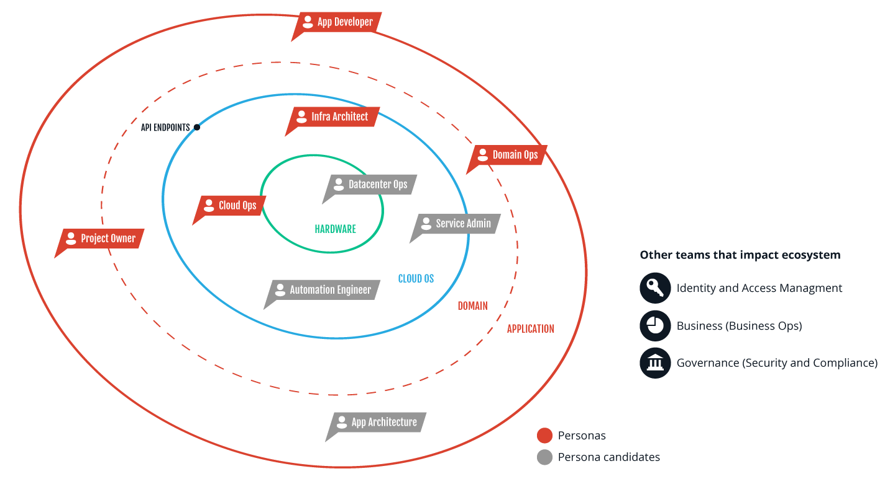

.. _ux-personas:

===========================
Meet the OpenStack personas
===========================

In order to share the knowledge about the target users, we have created these
representations of our key audience segments based on qualitative and
quantitative user research. The goals are to create more empathy for our
customers and to better display the different types of customers performing
different jobs.

We have identified five personas:

* Adrian - Infrastructure Architect
* Rey - Cloud Operator
* Taylor - Domain Operator
* Wei - Project Owner
* Quinn - App Developer

These personas are based on model companies and user ecosystems. Each
persona takes part in different cloud adoption stages and can assume multiple
roles within each company.

The personas
~~~~~~~~~~~~

The personas fall into different phases of the cloud adoption workflow based
on their specific contribution.

.. toctree::
   :maxdepth: 1

   ux-personas/arnie-infrastructure-arch.rst
   ux-personas/carlos-cloud-ops.rst
   ux-personas/doug-domain-operator.rst
   ux-personas/pei-project-owner.rst
   ux-personas/alan-app-developer.rst

.. The original SVG copy of this figure is available in
   in the same directory

The model companies
~~~~~~~~~~~~~~~~~~~

We have identified three organizational models that best exemplify the roles
that the personas assume depending on their ecosystems.

.. important::

   The institutions described in this document are fictitious and serve only
   as representations of different organizational models.

Nikishi University - research
-----------------------------

At Nikishi university, each cloud user can potentially assume all personas'
roles. Although typically each individual specializes in two or more of the
roles. The Infrastructure Architect and the Cloud Operations roles
could be assumed by a single individual. Similarly, the Domain Operations and
Project Owner roles could be merged. This organizational model has a low
staffing budget and is concerned with capital expenditure causing them to
create their own implementation.

.. list-table:: **Nikishi University - Key Info**
   :widths: 15 15 15 15
   :header-rows: 1

   *  - Adoption model
      - Process and compliance
      - Skill depth
      - Number of users
   *  - Roll your own
      - Minimal
      - Deep
      - 100 to 999 users

CNBB Securities - large enterprise
----------------------------------

At CNBB Securities, the company's large organization chart represents each of
the personas. Depending on the company's culture of collaboration, the
personas could interact as if they were part of a single entity. However,
usually the Cloud Operations and the Infrastructure Architect interact as
service providers with the other personas. The personas within CNBB
Securities look for a fast implementation and are responsible for the
operations capital expenditure. The implementation has no customization and
the organization usually outsources its support.

.. list-table:: **CNBB Securities - Key Info**
   :widths: 15 15 15 15
   :header-rows: 1

   *  - Adoption model
      - Process and compliance
      - Skill depth
      - Number of users
   *  - Distribution with professional services
      - High
      - Medium
      - Over 10000 users

Rifkom - service provider
-------------------------

At Rifkom, employees provide services to external customers that do not want
or have the internal resources. Rifkom customizes solutions and
prioritizes a flexible approach to architecture. The highly skilled staff
represents the largest expenditure for Rifkom. Only Infrastructure Architects
and Cloud Operators work at Rifkom since the other personas are their
customers at MOI. Customers usually interact with Rifkom employees through a
ticket system.

.. list-table:: **Rifkom - Key Info**
   :widths: 15 15 15 15
   :header-rows: 1

   *  - Adoption model
      - Process and compliance
      - Skill depth
      - Number of users
   *  - Roll your own
      - Medium to High (depends on customer)
      - Deep
      - 1000 to 9999 users

MOI - customer
--------------

At MOI, speed and convenience rule. Its staff encompasses the roles of App
Developers, Project Owners, and Domain Operations. They do not perform any
customization of the cloud and are willing to sacrifice functionality in
order to save some costs. They interact with their cloud service provider,
Rifkom, through a ticket system in case of problems with their cloud
instance.

.. list-table:: **MOI - Key Info**
   :widths: 15 15 15 15
   :header-rows: 1

   *  - Adoption model
      - Process and compliance
      - Skill depth
      - Number of users
   *  - Professional services
      - Medium
      - Minimal
      - No OpenStack users
