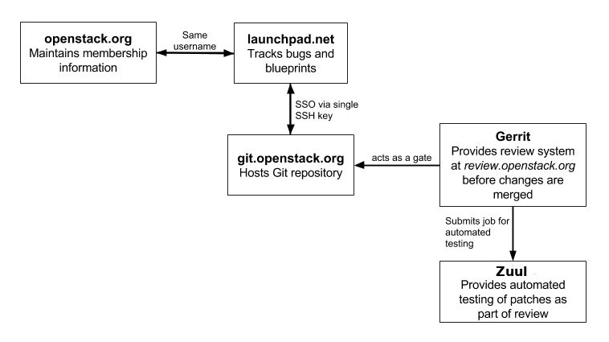

.. _first_timers:

============
First timers
============

One of the best ways to start contributing to OpenStack documentation
is to walk through the Installation Guide and complete it by hand.
Keep notes as you go, and offer suggestions for improvement by filing
documentation bugs at Launchpad.

The following diagram shows the basic setup workflow:

.. _setting_up_for_contribution:

Setting up for contribution
~~~~~~~~~~~~~~~~~~~~~~~~~~~

To get started, complete the following steps:

#. Set up your account and agree to the ``Individual Contributor License
   Agreement (ICLA)``. See `Account Setup`_ for details.

To set up your environment for contributions, proceed with the
subsections below.

Set up a text editor
--------------------

Use any text editor of your choice to work with the documentation. For
example:

* https://wiki.gnome.org/Apps/Gedit
* https://wiki.typo3.org/Editors_%28reST%29#Open_source_.28.3D_free_of_cost.29

To keep the documents clean and easy to compare, all of the OpenStack
projects require that text is wrapped at `79 characters maximum`_,
with no white spaces at the end of the line.

You can configure the text editor to do that automatically.

For example, in the :file:`.vimrc`:

.. code-block:: vim

   set list
   set listchars=tab:>-,trail:-,extends:#,nbsp:-
   set modeline
   set tw=78
   set tabstop=8 expandtab shiftwidth=4 softtabstop=4

.. _git_setup:

Set up git and git-review
-------------------------

#. Install ``git``. See `GitHub help`_ for details.

   If you use Windows to contribute to OpenStack, install
   `Git for Windows <https://git-for-windows.github.io/>`_.
   In the subsequent procedures, run commands from the Git Bash console.

#. Install ``git-review`` so that you are able to submit patches.
   See `Installing git-review`_ for details.

   .. note::

      If you use Windows to contribute to OpenStack, install
      `Python <https://docs.python.org/3/using/windows.html>`_
      as prerequisites. As part of the Python installation,
      be sure to install setuptools and pip as instructed.

Set up SSH
----------

#. On the computer which you commit from, generate an SSH key:

   .. code-block:: console

      $ ssh-keygen –t rsa

#. Optionally, enter a password. If you enter one, remember it because
   you must enter it every time you commit.

#. View and copy your SSH key:

   **Linux/Mac**

   .. code-block:: console

      $ less ~/.ssh/id_rsa.pub

   **Windows**

   .. code-block:: console

      $ notepad ~/.ssh/id_rsa.pub

#. Sign into gerrit at https://review.openstack.org/.

#. In the upper right, click your username. Click the `Settings > SSH Public
   Keys`_ page. Click ``Add Key``. Paste the key in the ``Add SSH Public Key``
   web form and click ``Add``.

Set up a repository
-------------------

For the instructions on how to set up a repository so that you can work
on it locally, refer to the `Starting Work on a New Project`_
of the Infrastructure manual.

.. note::

   Substitute ``<projectname>`` in the examples included in this section
   with ``openstack-manuals`` as the documentation is mostly stored in
   the *openstack-manuals* repository. However, if you need specific
   guide sources, refer to *openstack/api-site*,
   *openstack/security-guide*, or *openstack/training-guides*
   repository.

See :ref:`troubleshoot_setup` if you have difficulty with a repository
setup.

Finding a bug
~~~~~~~~~~~~~

After setting up your environment for contribution, it is time to find
something to work on:

#. Go to the bug lists at https://bugs.launchpad.net/openstack-manuals/+bugs.

#. Find a bug that has been confirmed by another contributor and assign it
   to yourself.

Committing a change
~~~~~~~~~~~~~~~~~~~

#. Update the repository and create a new topic branch as described in
   the `Starting a Change`_ section of the Infrastructure manual.

#. Fix the bug in the docs.

   Read the :ref:`Writing style <stg_writing_style>` section, also pay
   attention to the :ref:`RST formatting conventions <rst_conv>` section.

#. Create your commit message. See `Committing a change`_ for details.

#. Create a patch for review.openstack.org following the `Submitting a Change
   for Review`_ instructions.

#. Follow the URL returned from ``git-review`` to check your commit::

     https://review.openstack.org/<COMMIT-NUMBER>

#. In Gerrit, wait for the automatic Jenkins checks to succeed.

Celebrate and wait for reviews!

.. seealso:: * :ref:`troubleshoot_setup`
             * :ref:`docs_builds`

Responding to requests
~~~~~~~~~~~~~~~~~~~~~~

After you submit a patch, reviewers may ask you to make changes before
they approve the patch.

To submit changes to your patch, proceed with the following steps:

#. Copy the commit number from the review.openstack.org URL.

#. At the command line, change into your local copy of the repository.

#. Check out the patch:

   .. code-block:: console

      $ git review -d <COMMIT-NUMBER>

#. Make your edits.

#. Commit the changes using the `amend` flag:

   .. code-block:: console

      $ git commit -a --amend

   Ensure that the Change-ID line remains intact in your commit message. This
   prevents Gerrit from creating a new patch.

#. Push the changes to review as described in the `Updating a Change`_ section
   of the Infrastructure manual.

Wait for more reviews.

.. _troubleshoot_setup:

Troubleshooting your setup
~~~~~~~~~~~~~~~~~~~~~~~~~~

git and git review
------------------

* Authenticity error

  The first time that you run git review, you might see this error::

    The authenticity of host '[review.openstack.org]:29418 ([198.101.231.251]:29418) can't be established.

  Type *yes* (all three letters) at the prompt.

* Gerrit connection error

  When you connect to gerrit for the first time, you might see this error:

  .. code-block:: console

     Could not connect to gerrit.
     Enter your gerrit username:

  Enter the user name that matches the user name in the :guilabel:`Settings`
  page at review.openstack.org.

* Not a git repository error

  If you see this error::

    fatal: Not a git repository (or any of the parent directories): .git
    You are not in a directory that is a git repository: A .git file was not found.

  Change into your local copy of the repository and re-run the command.

* Gerrit location unknown error

  If you see this error::

    We don't know where your gerrit is. Please manually create a remote named "gerrit" and try again.

  You need to make a git remote that maps to the review.openstack.org ssh port
  for your repo. For example, for a user with the ``username_example`` username
  and the openstack-manuals repo, you should run this command::

    git remote add gerrit ssh://username_example@review.openstack.org:29418/openstack/openstack-manuals.git

* Remote rejected error

  If you see this error::

    ! [remote rejected] HEAD -> refs/publish/master/addopenstackdocstheme (missing Change-Id in commit message footer)

  The first time you set up a gerrit remote and try to create a patch for
  review.openstack.org, you may see this message because the tool needs one
  more edit of your commit message in order to automatically insert
  the *Change-Id*. When this happens, run :code:`git commit -a --amend`,
  save the commit message and run :code:`git review -v` again.

* Permission denied error

  If you see this error:

  .. code-block:: console

     Permission denied (publickey).

  Double check the :guilabel:`Settings` page at
  https://review.openstack.org to make sure your public key on the computer
  or virtual server has been copied to SSH public keys on
  https://review.openstack.org/#/settings/ssh-keys. If you have not adjusted
  your ``.ssh`` configuration, your system may not be connecting using
  the correct key for gerrit.

  List your local public key on Mac or Linux with:

  .. code-block:: console

     less ~/.ssh/id_rsa.pub

  On Windows, look for it in the same location.

* Merge conflict, rebase required

  Sometimes your change creates a merge conflict with another patch.
  In this case, you need to rebase your commit on top of the current
  state of the repository. In many cases, this can be achieved by pressing
  the ``Rebase`` button in the gerrit interface. If this fails, you must
  `rebase manually
  <https://docs.openstack.org/infra/manual/developers.html#understanding-changes-and-patch-sets>`_.

  For a basic introduction to solving merge conflicts, see the GitHub article
  `Resolving merge conflicts after a git rebase
  <https://help.github.com/articles/resolving-merge-conflicts-after-a-git-rebase/>`_.

* ``FAILURE`` in the ``Jenkins check`` section of your commit in Gerrit

  #. Click the link next to the ``FAILURE`` test.
  #. Verify the output of the :file:`console.html`:

     * If it contains errors or warnings related to your commit with
       a problematic file name and line in question, fix the issues and
       push the new changes on review.
     * If the issue is not related to your commit, re-run the gate jobs by
       leaving the word *recheck* in the comments section of your
       Gerrit review.

  .. seealso:: * `Automated Testing <https://docs.openstack.org/infra/manual/developers.html#automated-testing>`_
               * :ref:`build_jobs`

Network
-------

If your network connection is weak, you might see this error:

.. code-block:: console

   Read from socket failed: Connection reset by peer

Try again when your network connection improves.

**Accessing gerrit over HTTP/HTTPS**

If you suspect that SSH over non-standards ports might be blocked or need to
access the web using http/https, you can configure git-review to `use an http
endpoint instead of ssh <https://docs.openstack.org/infra/manual/developers.html#accessing-gerrit-over-https>`_
as explained in the Infrastructure Manual.

Python
------

If you see this error:

.. code-block:: console

   /usr/bin/env: python: No such file or directory

Your Python environment is not set up correctly. See the Python documentation
for your operating system.

i18n
----

If you see this error:

.. code-block:: console

   $ git review -s
   Problems encountered installing commit-msg hook
   The following command failed with exit code 1
      "scp  :hooks/commit-msg .git/hooks/commit-msg"
   -----------------------
   .git/hooks/commit-msg: No such file or directory
   -----------------------

You may have a LANGUAGE variable setup to something else than C. Try using
instead:

.. code-block:: console

   $ LANG=C LANGUAGE=C git review -s

.. Links

.. _`Account Setup`: https://docs.openstack.org/infra/manual/developers.html#account-setup
.. _`Sign the appropriate Individual Contributor License Agreement`: https://docs.openstack.org/infra/manual/developers.html#sign-the-appropriate-individual-contributor-license-agreement
.. _`Installing git-review`: https://docs.openstack.org/infra/manual/developers.html#installing-git-review
.. _`OpenStack Documentation Bug Team`: https://launchpad.net/~openstack-doc-bugs
.. _`OpenStack Foundation`: https://www.openstack.org/join
.. _`Development Workflow`: https://docs.openstack.org/infra/manual/developers.html#development-workflow
.. _`git`: http://msysgit.github.io
.. _`curl`: http://curl.haxx.se/
.. _`tar`: http://gnuwin32.sourceforge.net/packages/gtar.htm
.. _`7-zip`: http://sourceforge.net/projects/sevenzip/?source=recommended
.. _`Python 2.7 environment`: http://docs.python-guide.org/en/latest/starting/install/win/
.. _`79 characters maximum`: https://www.python.org/dev/peps/pep-0008/#maximum-line-length
.. _`GitHub help`: https://help.github.com/articles/set-up-git
.. _`Settings page on gerrit`: https://review.openstack.org/#/settings/
.. _`Settings > SSH Public Keys`: https://review.openstack.org/#/settings/ssh-keys
.. _`Starting Work on a New Project`: https://docs.openstack.org/infra/manual/developers.html#starting-work-on-a-new-project
.. _`Starting a Change`: https://docs.openstack.org/infra/manual/developers.html#starting-a-change
.. _`Committing a change`: https://docs.openstack.org/infra/manual/developers.html#committing-a-change
.. _`Submitting a Change for Review`: https://docs.openstack.org/infra/manual/developers.html#submitting-a-change-for-review
.. _`Updating a Change`: https://docs.openstack.org/infra/manual/developers.html#updating-a-change
