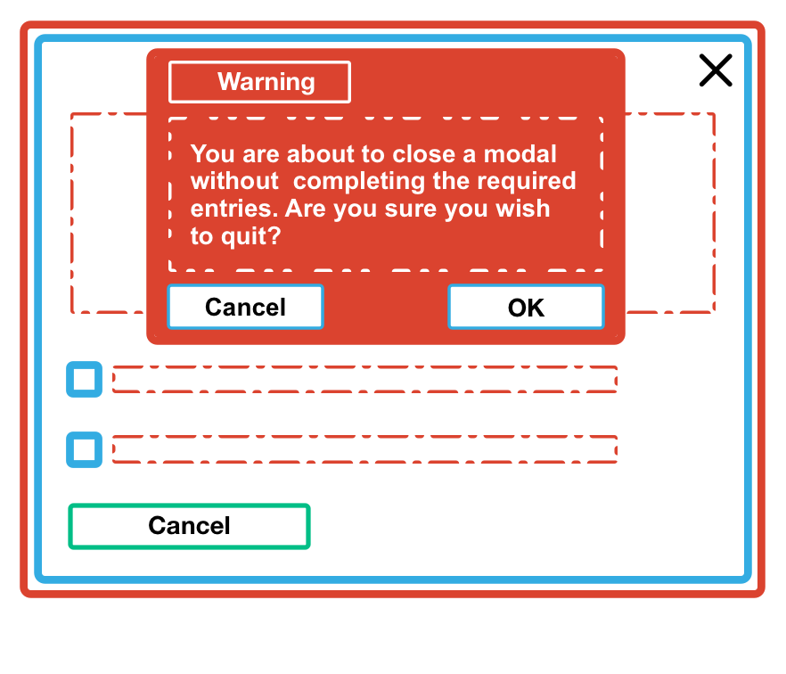
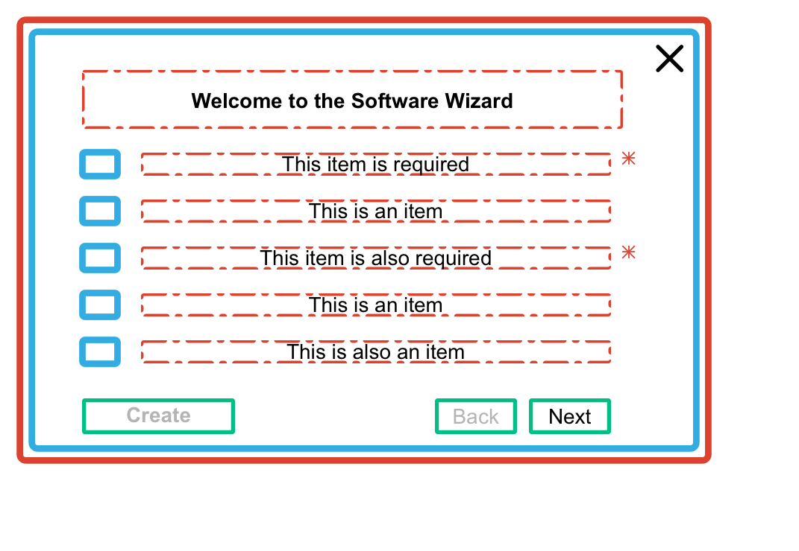
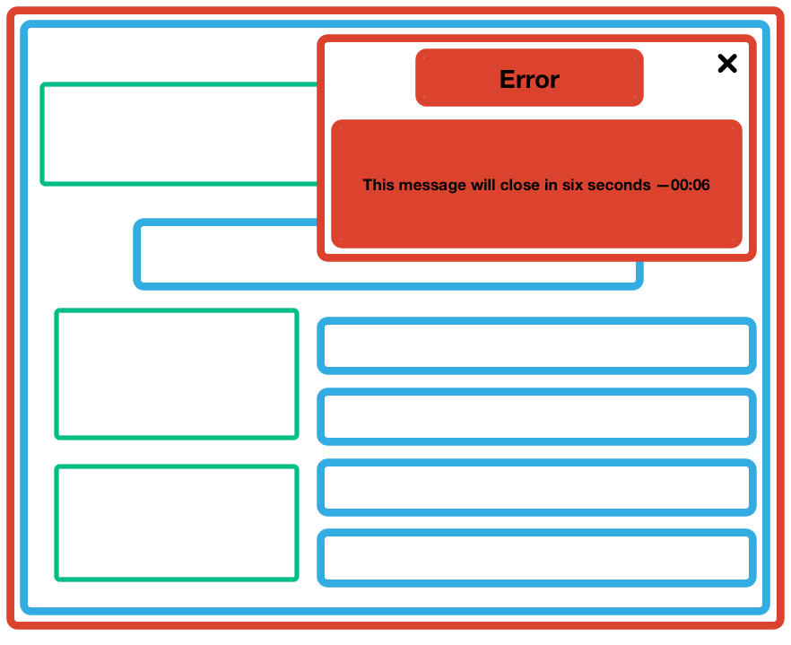
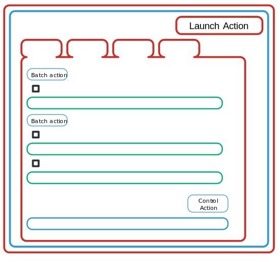

==============
GUI guidelines
==============

Principles
~~~~~~~~~~

The following principles describe concepts that help drive GUI development.
They are also designed to avoid common issues.

.. note::

   The following principles are recommendations only, it is at your discretion
   whether or not to use and implement these guidelines.

For the purpose of this document, and to avoid confusion, the following
terms will be defined:

Modal
  A modal window is a graphical control element subordinate to an
  application's main window.
Workflow
  A workflow that describes the steps to complete an action.

Design to scale
---------------

Your designs should reflect production environments rather than development
environments.
For example, a production environment can have fifty images rather than the
three included in devstack. Using a control that is appropriate for three
images can impact the usability associated with production environments.

For example:

* Instances: 2,000
* Images: 50
* Projects: 2,000
* Users: 1,000
* Operators: 8
* Regions: 8

Use cases
---------

Open source developer-driven projects do not always consider the end user when
creating products. Educating and helping novices to complete a resource is
vital. There are two assumptions within the community:

#. Novices users require a GUI
#. Advanced users use a CLI or API

Ensure workflows provide enough information for users to drive the decision-
making process. We recommend referring to the OpenStack personas when
designing and creating. The personas are:

* :ref:`infrastructure-arch`
* :ref:`cloud-ops`
* :ref:`domain-operator`
* :ref:`project-owner`
* :ref:`app-developer`

Specific use case interfaces vary based on the individual use case.
For example, a GUI may be appropriate to launch 1-x of the same instance, but
difficult for multiple instances that are different.

See :ref:`ux-personas` for more information.

Mandatory parameters
--------------------

Mandatory parameters are the minimum parameters required to create a resource.
This is especially important for complex nested resources, like load balancers
or networks. Mandatory parameters allow users to create resources without
being intimidated by a significant number of steps. We suggest creating the
top level resource and then send the user to the network details page.

The 80% rule is a software framework that ensures 80% of use cases are
easy to implement, and 20% of use cases are difficult to implement. We
recommend using mandatory parameters to encourage designers and developers
to keep to the 80% rule when creating a workflow.

.. note::

   Using mandatory parameters assumes that users are able to add
   parameters in the resource.

Patterns
~~~~~~~~

The following patterns provide GUI frameworks to assist designers and engineers
to create interfaces that are consistent across OpenStack products.

For example, the horizon project chooses to use ``bootstrap``.
See `Styling in Horizon (SCSS) <https://docs.openstack.org/horizon/latest/contributor/topics/styling.html>`_
for more information.

Cancel buttons
--------------

On modals, the cancel button should be located at the bottom left and
the ``X`` to close should be located at the top right.

.. figure:: figures/gui-cancelbutton.png
    :align: right
    :width: 65%

Modal error messages
--------------------

When canceling a modal that has forms that are partially completed,
we recommend a warning should be displayed at the top center of the modal.

.. note::

   Any error message displayed should be inside the corresponding modal to
   avoid GUI conflicts.

A red background and a warning icon on the top left are also recommended.

For more information on guidelines for UI text, see
:ref:`uitextguidelines`.

Wizards
-------

A software wizard presents a workflow and helps users through it. The
``Back`` and ``Next`` buttons should be located at the bottom and to the
right of the modal, but to the left of the create button. The ``Back``
button should be disabled, instead of invisible. Initially, the ``Create``
button should remain disabled until the mandatory parameters have been
provided. All required items should have an asterisk on the right.

Page errors
-----------

Any error messages should be displayed on the upper right corner of the
browser. A counter should be displayed for error messages that persist for
a certain number of seconds. All error messages should close  by pressing
the ``X`` on the upper right corner of the message.

.. note::

   The error message height should vary to fit the content.

For more information on guidelines for UI text, see :ref:`uitextguidelines`.

Actions
-------

Global actions should align to the top right and be placed on the top
of the table. For example, the ``Launch Instance`` button is a global
table action.

Batch actions, which apply to single or multiple rows, should align to
the left and be above the rows' checkboxes.

Control actions should align to the right of the row. In addition,
checkboxes should align to the left of each row and be used for deleting
single or multiple rows.

Search
------

There are typically two search box types within GUIs. There is the global
search, which applies to all pages, and local (panel) search box, which
searches within pages. We recommend global search boxes be located in the
masthead, and the local (panel) search be located within the page.

.. figure:: figures/gui-search.png
    :align: right
    :width: 65%

.. note::

   Using the search boxes interchangeably can cause confusion as it is not always
   clear what is being searched.

Icons
-----

We recommend using the following icons from
`Font Awesome <http://fontawesome.io>`_ with the corresponding meaning.

`Create <http://fontawesome.io/icon/plus/>`_
       The create icon is used for global actions, such as launch instance or
       create volume. No other icons, such as ‘upload to cloud’, should be
       used with global actions.

`Delete <http://fontawesome.io/icon/trash/>`_
       The delete button should be used with any destructive actions
       including, global, batch, and control actions.

`Warning <http://fontawesome.io/icon/exclamation-triangle/>`_
       Use the warning icon to ensure the user is aware that data will be
       lost if they proceed with an action. For example, canceling out of a
       modal even if the user has completed some of the forms. In addition,
       it should indicate that a resource is unusable. For example, use the
       warning icon to indicate that a flavor cannot be used because all
       available quota for a project has been consumed.

Expand and collapse
       The following icons should be used to allow users to either expand or
       collapse when viewing additional information for a resource. This icon
       should be used instead of the ``+`` and ``-`` icons.
       `Expanded <http://fontawesome.io/icon/chevron-down/>`_
       `Collapsed <http://fontawesome.io/icon/chevron-right/>`_

`Help <http://fontawesome.io/icon/question-circle/>`_
       Use the help icon when referring the user to additional
       content that provides additional information.

Download and upload files
       These icons should be used when the user is either uploading a file,
       such as an image, or downloading files, such as a key pair. However,
       it should not be used for global actions such as launching an instance.
       `Download <http://fontawesome.io/icon/download/>`_
       `Upload <http://fontawesome.io/icon/upload/>`_

`Cancel <http://fontawesome.io/icon/times/>`_
       The cancel icon should be used for any actions where the user would
       want to exit a workflow. For example, when you are exiting a wizard,
       there should be an ``X`` in the top right of the modal.
       This icon should not be used for destructive actions, such as delete.

`Search <http://fontawesome.io/icon/search/>`_
       Whether searching globally or within a panel, the search icon
       should always be on the inside and aligned to the left of any
       text boxes.

Accessibility
~~~~~~~~~~~~~

We recommend using :abbr:`ARIA (Accessible Rich Internet Applications)`
when developing content to ensure accessibility is accounted for
appropriately.

ARIA defines ways to make web content and web applications, especially those
developed with Ajax and JavaScript, more accessible to people with
disabilities.
For example, ARIA enables accessible navigation landmarks, JavaScript widgets,
form hints and error messages, live content updates, and more.

For more information, visit: `<https://developer.mozilla.org/en-US/docs/Web/Accessibility/ARIA>`_.

