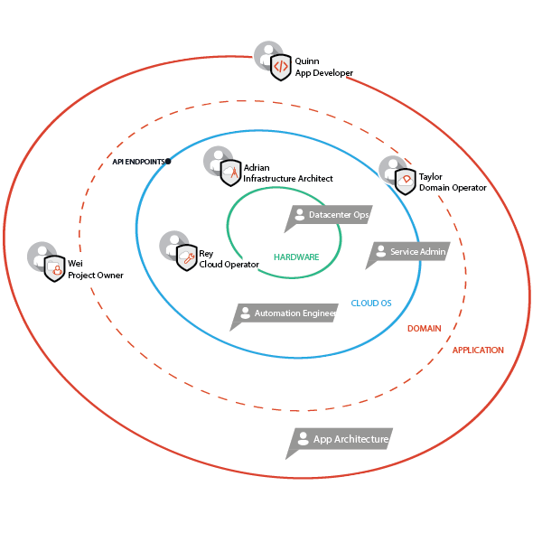

.. _ux-personas:

==================
OpenStack personas
==================

We created personas to help you better define the OpenStack end-users who
benefit from your OpenStack contributions. After much qualitative
and quantitative research, we identified five personas that embody the most
common roles performed by OpenStack users. We also considered where these
personas fit into the cloud adoption workflow and how their roles may change
depending on the size and user ecosystem of their company. You can utilize
these personas in the design and development stage to help ensure user-centric
contributions and well defined use cases. When used consistently, personas
can help ensure your contributions lead to a positive user experience for
OpenStack adopters.

.. toctree::
   :maxdepth: 1

   ux-personas/infrastructure-arch.rst
   ux-personas/cloud-ops.rst
   ux-personas/domain-operator.rst
   ux-personas/project-owner.rst
   ux-personas/app-developer.rst
   ux-personas/model-companies.rst

Meet the personas
-----------------

:ref:`infrastructure-arch`
  Adrian is responsible for the strategy and road-map for his company’s
  cloud and identifies reasons to compel management to adopt OpenStack for
  production environments.
:ref:`cloud-ops`
  Rey is involved in installing, operating, using, and updating the
  OpenStack cloud services.
:ref:`domain-operator`
  Taylor manages the relationship with the cloud services provider. This
  includes managing quotas, number of users, applicable policies, and
  support tickets.
:ref:`project-owner`
  Wei manages projects by adding or removing project members’ access to
  the cloud instance. Wei’s main concern is to have enough resources
  available to support Wei’s projects.
:ref:`app-developer`
  Quinn develops and deploys cloud applications but does not necessarily
  know much about the underlying infrastructure of the cloud.

Role ecosystem
--------------

To better understand each persona role, see the following overall role
ecosystem, which is based on levels of abstraction from hardware to
application level. Within this ecosystem, we can see the current
personas as well as candidates for future personas.

.. The original SVG copy of this figure is available in
   in the same directory.

The personas in the above ecosystem fall into different phases of the cloud
adoption workflow and are seen as separate and distinct from one another.
Although it is advantageous to separate the personas based on typical users,
some people, whom the personas represent, can assume multiple roles
depending on their workplace and company responsibilities. To appreciate
the personas in a different role ecosystem, see the following
:ref:`model-companies`:

:ref:`Nikishi-University` - Academic/Nonprofit
Wants to provide cloud services to their internal labs and have bare metal.
Do not want to hire resources internally to deploy trunk.

:ref:`CNBB-Securities` - Enterprise
Wants to provide cloud services to internal customers for applications that
are not customers facing. Has both bare metal and operations.

:ref:`Rifkom` - Service provider
Wants to provide services to external customers that do not want or have
internal resources. Has both bare metal and operations resources internally.

:ref:`MOI` - Small/medium business
Wants to deploy customer-facing applications, but do not have bare metal or
a budget for operations resources.

