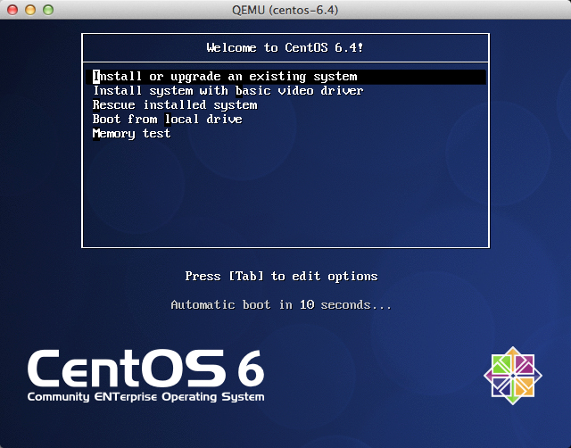
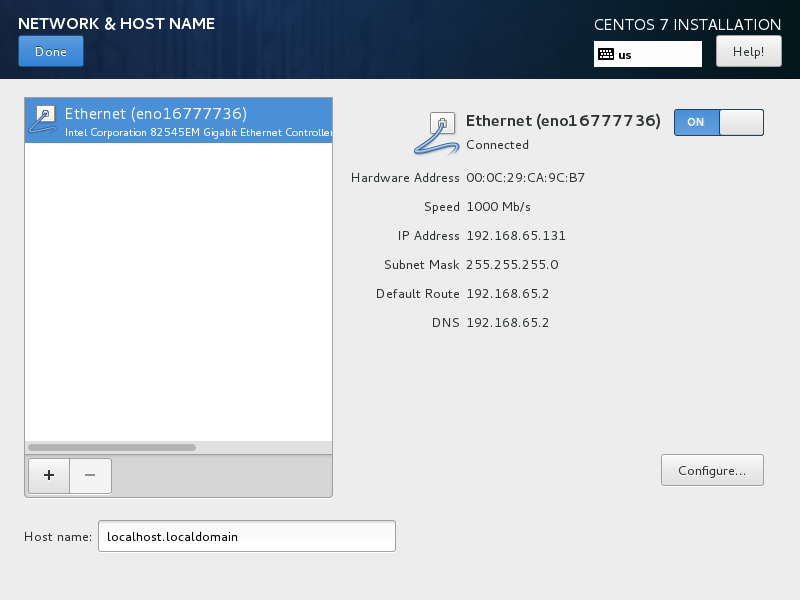
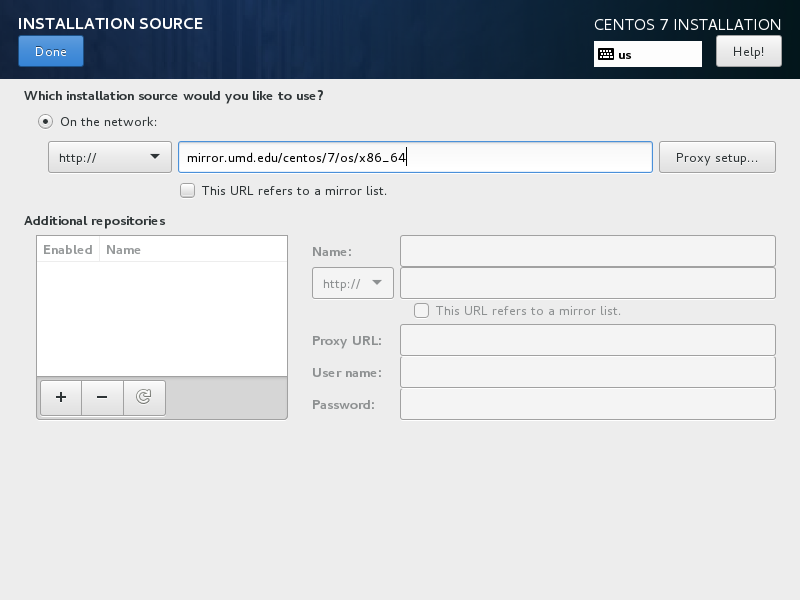
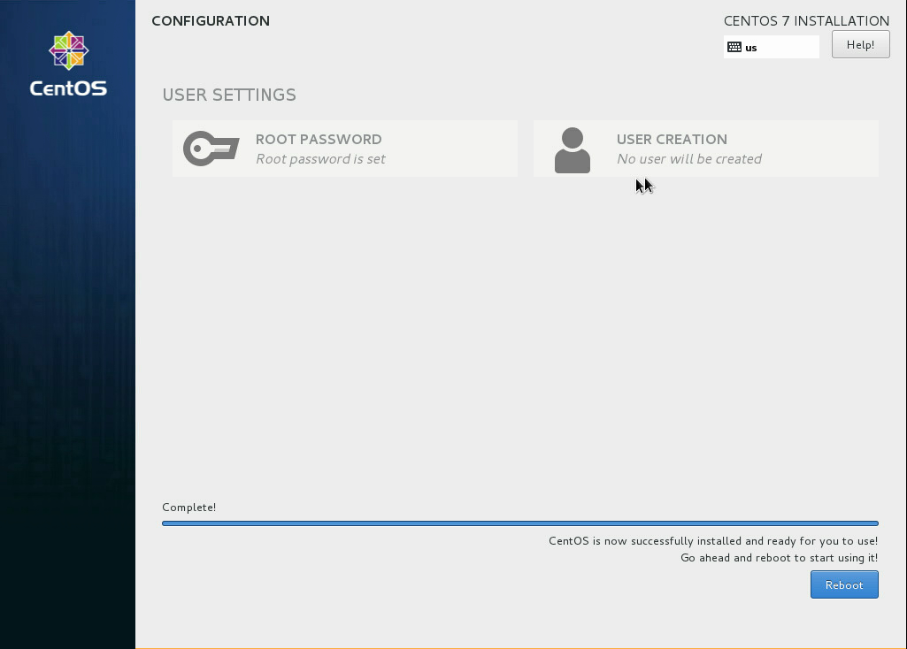

=====================
Example: CentOS image
=====================

This example shows you how to install a CentOS image and focuses
mainly on CentOS 7. Because the CentOS installation process
might differ across versions, the installation steps might
differ if you use a different version of CentOS.

Download a CentOS install ISO
~~~~~~~~~~~~~~~~~~~~~~~~~~~~~

#. Navigate to the `CentOS mirrors
   <https://www.centos.org/download/mirrors/>`_ page.
#. Click one of the ``HTTP`` links in the right-hand
   column next to one of the mirrors.
#. Click the folder link of the CentOS version that
   you want to use. For example, ``7/``.
#. Click the ``isos/`` folder link.
#. Click the ``x86_64/`` folder link for 64-bit images.
#. Click the netinstall ISO image that you want to download.
   For example, ``CentOS-7-x86_64-NetInstall-1611.iso`` is a good
   choice because it is a smaller image that downloads missing
   packages from the Internet during installation.

Start the installation process
~~~~~~~~~~~~~~~~~~~~~~~~~~~~~~

Start the installation process using either the :command:`virt-manager`
or the :command:`virt-install` command as described previously.
If you use the :command:`virt-install` command, do not forget to connect your
VNC client to the virtual machine.

Assume that:

* The name of your virtual machine image is ``centos``;
  you need this name when you use :command:`virsh` commands
  to manipulate the state of the image.
* You saved the netinstall ISO image to the ``/data/isos`` directory.

If you use the :command:`virt-install` command, the commands should look
something like this:

.. code-block:: console

   # qemu-img create -f qcow2 /tmp/centos.qcow2 10G
   # virt-install --virt-type kvm --name centos --ram 1024 \
     --disk /tmp/centos.qcow2,format=qcow2 \
     --network network=default \
     --graphics vnc,listen=0.0.0.0 --noautoconsole \
     --os-type=linux --os-variant=centos7.0 \
     --location=/data/isos/CentOS-7-x86_64-NetInstall-1611.iso

Step through the installation
~~~~~~~~~~~~~~~~~~~~~~~~~~~~~

At the initial Installer boot menu, choose the
:guilabel:`Install CentOS 7` option. After the installation program starts,
choose your preferred language and click :guilabel:`Continue` to get to the
installation summary. Accept the defaults.

Change the Ethernet status
--------------------------

The default Ethernet setting is ``OFF``. Change the setting of
the Ethernet form ``OFF`` to ``ON``. In particular, ensure that
``IPv4 Settings' Method`` is ``Automatic (DHCP)``, which is the
default.

Hostname
--------

The installer allows you to choose a host name.
The default (``localhost.localdomain``) is fine.
You install the ``cloud-init`` package later,
which sets the host name on boot when a new instance
is provisioned using this image.

Point the installer to a CentOS web server
------------------------------------------

Depending on the version of CentOS, the net installer requires
the user to specify either a URL or the web site and
a CentOS directory that corresponds to one of the CentOS mirrors.
If the installer asks for a single URL, a valid URL might be
``http://mirror.umd.edu/centos/7/os/x86_64``.

.. note::

   Consider using other mirrors as an alternative to ``mirror.umd.edu``.

If the installer asks for web site name and CentOS directory
separately, you might enter:

* Web site name: ``mirror.umd.edu``
* CentOS directory: ``centos/7/os/x86_64``

See `CentOS mirror page <https://www.centos.org/download/mirrors/>`_
to get a full list of mirrors, click on the ``HTTP`` link
of a mirror to retrieve the web site name of a mirror.

Storage devices
---------------

If prompted about which type of devices your installation uses,
choose :guilabel:`Virtio Block Device`.

Partition the disks
-------------------

There are different options for partitioning the disks.
The default installation uses LVM partitions, and creates
three partitions (``/boot``, ``/``, ``swap``), which works fine.
Alternatively, you might want to create a single ext4
partition that is mounted to ``/``, which also works fine.

If unsure, use the default partition scheme for the installer.
While no scheme is inherently better than another, having the
partition that you want to dynamically grow at the end of the
list will allow it to grow without crossing another
partition's boundary.

Select installation option
--------------------------

Step through the installation, using the default options.
The simplest thing to do is to choose the ``Minimal Install``
install, which installs an SSH server.

Set the root password
---------------------

During the installation, remember to set the root password when prompted.

Detach the CD-ROM and reboot
----------------------------

Wait until the installation is complete.

To eject a disk by using the :command:`virsh` command,
libvirt requires that you attach an empty disk at the same target
that the CD-ROM was previously attached, which may be ``hda``.
You can confirm the appropriate target using the
:command:`virsh dumpxml vm-image` command.

.. code-block:: console

   # virsh dumpxml centos
   <domain type='kvm' id='19'>
     <name>centos</name>
   ...
       <disk type='block' device='cdrom'>
         <driver name='qemu' type='raw'/>
         <target dev='hda' bus='ide'/>
         <readonly/>
         <address type='drive' controller='0' bus='1' target='0' unit='0'/>
       </disk>
   ...
   </domain>

Run the following commands from the host to eject the disk
and reboot using ``virsh``, as root. If you are using ``virt-manager``,
the commands below will work, but you can also use the GUI to detach
and reboot it by manually stopping and starting.

.. code-block:: console

   # virsh attach-disk --type cdrom --mode readonly centos "" hda
   # virsh reboot centos

Install the ACPI service
~~~~~~~~~~~~~~~~~~~~~~~~

To enable the hypervisor to reboot or shutdown an instance,
you must install and run the ``acpid`` service on the guest system.

Log in as root to the CentOS guest and run the following commands
to install the ACPI service and configure it to start when the
system boots:

.. code-block:: console

   # yum install acpid
   # systemctl enable acpid

Configure to fetch metadata
~~~~~~~~~~~~~~~~~~~~~~~~~~~

An instance must interact with the metadata service to perform
several tasks on start up. For example, the instance must get
the ssh public key and run the user data script. To ensure that
the instance performs these tasks, use one of these methods:

* Install a ``cloud-init`` RPM, which is a port of the Ubuntu
  `cloud-init <https://launchpad.net/cloud-init>`_ package.
  This is the recommended approach.
* Modify the ``/etc/rc.local`` file to fetch desired information from
  the metadata service, as described in the next section.

Use cloud-init to fetch the public key
~~~~~~~~~~~~~~~~~~~~~~~~~~~~~~~~~~~~~~

The ``cloud-init`` package automatically fetches the public key
from the metadata server and places the key in an account.
Install ``cloud-init`` inside the CentOS guest by
running:

.. code-block:: console

   # yum install cloud-init

The account varies by distribution. On CentOS-based virtual machines,
the account is called ``centos``.

You can change the name of the account used by ``cloud-init``
by editing the ``/etc/cloud/cloud.cfg`` file and adding a line
with a different user. For example, to configure ``cloud-init``
to put the key in an account named ``admin``, use the following
syntax in the configuration file:

.. code-block:: console

   users:
     - name: admin
       (...)

Install cloud-utils-growpart to allow partitions to resize
~~~~~~~~~~~~~~~~~~~~~~~~~~~~~~~~~~~~~~~~~~~~~~~~~~~~~~~~~~

In order for the root partition to properly resize, install the
``cloud-utils-growpart`` package, which contains the proper tools
to allow the disk to resize using cloud-init.

.. code-block:: console

   # yum install cloud-utils-growpart

Write a script to fetch the public key (if no cloud-init)
~~~~~~~~~~~~~~~~~~~~~~~~~~~~~~~~~~~~~~~~~~~~~~~~~~~~~~~~~

If you are not able to install the ``cloud-init`` package in your
image, to fetch the ssh public key and add it to the root account,
edit the ``/etc/rc.d/rc.local`` file and add the following lines
before the line ``touch /var/lock/subsys/local``:

.. code-block:: bash

   if [ ! -d /root/.ssh ]; then
     mkdir -p /root/.ssh
     chmod 700 /root/.ssh
   fi

   # Fetch public key using HTTP
   ATTEMPTS=30
   FAILED=0
   while [ ! -f /root/.ssh/authorized_keys ]; do
     curl -f http://169.254.169.254/latest/meta-data/public-keys/0/openssh-key \
       > /tmp/metadata-key 2>/dev/null
     if [ \$? -eq 0 ]; then
       cat /tmp/metadata-key >> /root/.ssh/authorized_keys
       chmod 0600 /root/.ssh/authorized_keys
       restorecon /root/.ssh/authorized_keys
       rm -f /tmp/metadata-key
       echo "Successfully retrieved public key from instance metadata"
       echo "*****************"
       echo "AUTHORIZED KEYS"
       echo "*****************"
       cat /root/.ssh/authorized_keys
       echo "*****************"
     fi
   done

.. note::

   Some VNC clients replace the colon (``:``) with a semicolon
   (``;``) and the underscore (``_``) with a hyphen (``-``).
   Make sure to specify ``http:`` and not ``http;``.
   Make sure to specify ``authorized_keys`` and not ``authorized-keys``.

.. note::

   The previous script only gets the ssh public key from the
   metadata server. It does not get user data, which is optional
   data that can be passed by the user when requesting a new instance.
   User data is often used to run a custom script when an instance boots.

   As the OpenStack metadata service is compatible with version
   2009-04-04 of the Amazon EC2 metadata service, consult the
   Amazon EC2 documentation on `Using Instance Metadata
   <http://docs.amazonwebservices.com/AWSEC2/2009-04-04/UserGuide/
   AESDG-chapter-instancedata.html>`_ for details on how to get user data.

Disable the zeroconf route
~~~~~~~~~~~~~~~~~~~~~~~~~~

For the instance to access the metadata service,
you must disable the default zeroconf route:

.. code-block:: console

   # echo "NOZEROCONF=yes" >> /etc/sysconfig/network

Configure console
~~~~~~~~~~~~~~~~~

For the :command:`nova console-log` command to work properly
on CentOS 7, you might need to do the following steps:

#. Edit the ``/etc/default/grub`` file and configure the
   ``GRUB_CMDLINE_LINUX`` option. Delete the ``rhgb quiet``
   and add ``console=tty0 console=ttyS0,115200n8`` to the option.

   For example:

   .. code-block:: none

     ...
     GRUB_CMDLINE_LINUX="crashkernel=auto rd.lvm.lv=cl/root rd.lvm.lv=cl/swap console=tty0 console=ttyS0,115200n8"

#. Run the following command to save the changes:

   .. code-block:: console

     # grub2-mkconfig -o /boot/grub2/grub.cfg
     Generating grub configuration file ...
     Found linux image: /boot/vmlinuz-3.10.0-229.14.1.el7.x86_64
     Found initrd image: /boot/initramfs-3.10.0-229.14.1.el7.x86_64.img
     Found linux image: /boot/vmlinuz-3.10.0-229.4.2.el7.x86_64
     Found initrd image: /boot/initramfs-3.10.0-229.4.2.el7.x86_64.img
     Found linux image: /boot/vmlinuz-3.10.0-229.el7.x86_64
     Found initrd image: /boot/initramfs-3.10.0-229.el7.x86_64.img
     Found linux image: /boot/vmlinuz-0-rescue-605f01abef434fb98dd1309e774b72ba
     Found initrd image: /boot/initramfs-0-rescue-605f01abef434fb98dd1309e774b72ba.img
     done

Shut down the instance
~~~~~~~~~~~~~~~~~~~~~~

From inside the instance, run as root:

.. code-block:: console

   # poweroff

Clean up (remove MAC address details)
~~~~~~~~~~~~~~~~~~~~~~~~~~~~~~~~~~~~~

The operating system records the MAC address of the virtual Ethernet
card in locations such as ``/etc/sysconfig/network-scripts/ifcfg-eth0``
during the instance process. However, each time the image boots up, the virtual
Ethernet card will have a different MAC address, so this information must
be deleted from the configuration file.

There is a utility called :command:`virt-sysprep`, that performs
various cleanup tasks such as removing the MAC address references.
It will clean up a virtual machine image in place:

.. code-block:: console

   # virt-sysprep -d centos

Undefine the libvirt domain
~~~~~~~~~~~~~~~~~~~~~~~~~~~

Now that you can upload the image to the Image service, you no
longer need to have this virtual machine image managed by libvirt.
Use the :command:`virsh undefine vm-image` command to inform libvirt:

.. code-block:: console

   # virsh undefine centos

Image is complete
~~~~~~~~~~~~~~~~~

The underlying image file that you created with the
:command:`qemu-img create` command is ready to be uploaded.
For example, you can upload the ``/tmp/centos.qcow2``
image to the Image service by using the :command:`openstack image create`
command. For more information, see the
`Create or update an image
<https://docs.openstack.org/user-guide/common/cli-manage-images.html#create-or-update-an-image-glance>`__.
