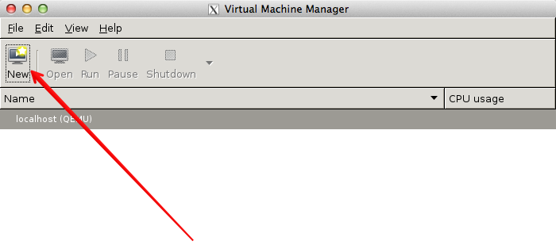

=====================================
Tools: libvirt and virsh/virt-manager
=====================================

.. contents:: :depth: 3

Prerequisites
-------------

Verify the libvirt default network is running
~~~~~~~~~~~~~~~~~~~~~~~~~~~~~~~~~~~~~~~~~~~~~

Before starting a virtual machine with libvirt, verify
that the libvirt ``default`` network has started.
This network must be active for your virtual machine
to be able to connect out to the network.
Starting this network will create a Linux bridge (usually
called ``virbr0``), iptables rules, and a dnsmasq process
that will serve as a DHCP server.

To verify that the libvirt ``default`` network is enabled,
use the :command:`virsh net-list` command and verify
that the ``default`` network is active:

.. code-block:: console

   # virsh net-list
   Name                 State      Autostart
   -----------------------------------------
   default              active     yes

If the network is not active, start it by doing:

.. code-block:: console

   # virsh net-start default

Use the virt-manager X11 GUI
----------------------------

If you plan to create a virtual machine image on a machine that
can run X11 applications, the simplest way to do so is to use
the :command:`virt-manager` GUI, which is installable as the
``virt-manager`` package on both Fedora-based and Debian-based systems.
This GUI has an embedded VNC client that will let you view and
interact with the guest's graphical console.

If you are building the image on a headless server, and
you have an X server on your local machine, you can launch
:command:`virt-manager` using ssh X11 forwarding to access the GUI.
Since virt-manager interacts directly with libvirt, you typically
need to be root to access it. If you can ssh directly in as root
(or with a user that has permissions to interact with libvirt), do:

.. code-block:: console

   $ ssh -X root@server virt-manager

If the account you use to ssh into your server does not have
permissions to run libvirt, but has sudo privileges, do:

.. code-block:: console

   $ ssh -X user@server
   $ sudo virt-manager

.. note::

   The ``-X`` flag passed to ssh will enable X11 forwarding over ssh.
   If this does not work, try replacing it with the ``-Y`` flag.

Click the :guilabel:`Create a new virtual machine` button at the top-left,
or go to :menuselection:`File --> New Virtual Machine`. Then, follow the
instructions.

You will be shown a series of dialog boxes that will allow you
to specify information about the virtual machine.

.. note::

   When using qcow2 format images, you should check the option
   ``Customize configuration before install``, go to disk properties and
   explicitly select the :guilabel:`qcow2` format.
   This ensures the virtual machine disk size will be correct.

Use virt-install and connect by using a local VNC client
--------------------------------------------------------

If you do not wish to use :command:`virt-manager` (for example,
you do not want to install the dependencies on your server, you do
not have an X server running locally, the X11 forwarding over SSH
is not working), you can use the :command:`virt-install` tool to boot
the virtual machine through libvirt and connect to the graphical
console from a VNC client installed on your local machine.

Because VNC is a standard protocol, there are multiple clients
available that implement the VNC spec, including
`TigerVNC <https://tigervnc.org/>`_ (multiple platforms),
`TightVNC <http://tightvnc.com/>`_ (multiple platforms),
`RealVNC <http://realvnc.com/>`_ (multiple platforms),
`Chicken <http://sourceforge.net/projects/chicken/>`_ (Mac OS X),
`Krde <http://userbase.kde.org/Krdc>`_ (KDE),
`Vinagre <https://wiki.gnome.org/Apps/Vinagre>`_ (GNOME).

The following example shows how to use the :command:`qemu-img`
command to create an empty image file, and :command:`virt-install`
command to start up a virtual machine using that image file. As root:

.. code-block:: console

   # qemu-img create -f qcow2 /tmp/centos.qcow2 10G
   # virt-install --virt-type kvm --name centos --ram 1024 \
     --disk /tmp/centos.qcow2,format=qcow2 \
     --network network=default \
     --graphics vnc,listen=0.0.0.0 --noautoconsole \
     --os-type=linux --os-variant=centos7.0 \
     --location=/data/isos/CentOS-7-x86_64-NetInstall-1611.iso

   Starting install...
   Creating domain...                     |    0 B     00:00
   Domain installation still in progress. You can reconnect to
   the console to complete the installation process.

The KVM hypervisor starts the virtual machine with the
libvirt name, ``centos``, with 1024 MB of RAM.
The virtual machine also has a virtual CD-ROM drive associated
with the ``/data/isos/CentOS-7-x86_64-NetInstall-1611.iso`` file and
a local 10 GB hard disk in qcow2 format that is stored
in the host at ``/tmp/centos.qcow2``.
It configures networking to use libvirt default network.
There is a VNC server that is listening on all interfaces,
and libvirt will not attempt to launch a VNC client automatically
nor try to display the text console (``--no-autoconsole``).
Finally, libvirt will attempt to optimize the configuration
for a Linux guest running a CentOS 7 distribution.

.. note::

   When using the libvirt ``default`` network, libvirt will
   connect the virtual machine's interface to a bridge
   called ``virbr0``. There is a dnsmasq process managed
   by libvirt that will hand out an IP address on the
   192.168.122.0/24 subnet, and libvirt has iptables rules
   for doing NAT for IP addresses on this subnet.

Run the :command:`osinfo-query os` command
to see a range of allowed ``--os-variant`` options.

Use the :command:`virsh vncdisplay vm-name` command
to get the VNC port number.

.. code-block:: console

   # virsh vncdisplay centos
   :1

In the example above, the guest ``centos`` uses VNC
display ``:1``, which corresponds to TCP port ``5901``.
You should be able to connect a VNC client running on
your local machine to display ``:1`` on the remote
machine and step through the installation process.
