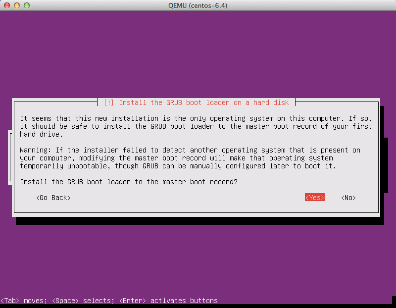

=====================
Example: Ubuntu image
=====================

This example installs an Ubuntu 18.04 (Bionic Beaver) image.
To create an image for a different version of Ubuntu,
follow these steps with the noted differences.

Download an Ubuntu installation ISO
~~~~~~~~~~~~~~~~~~~~~~~~~~~~~~~~~~~

Because the goal is to make the smallest possible base image,
this example uses the network installation ISO.
The Ubuntu 64-bit 18.04 network installation ISO is at the `Ubuntu download
page <http://archive.ubuntu.com/ubuntu/dists/bionic/main/installer-amd64/current/images/netboot/mini.iso>`_.

Start the installation process
~~~~~~~~~~~~~~~~~~~~~~~~~~~~~~

Start the installation process by using either :command:`virt-manager`
or :command:`virt-install` as described in the previous section.
If you use :command:`virt-install`, do not forget to connect
your VNC client to the virtual machine.

Assume that the name of your virtual machine image is ``ubuntu-18.04``,
which you need to know when you use :command:`virsh` commands
to manipulate the state of the image.

If you are using :command:`virt-manager`,
the commands should look something like this:

.. code-block:: console

   # wget -O /var/lib/libvirt/boot/bionic-mini.iso \
     http://archive.ubuntu.com/ubuntu/dists/bionic/main/installer-amd64/current/images/netboot/mini.iso
   # chown libvirt-qemu:kvm /var/lib/libvirt/boot/bionic-mini.iso
   # qemu-img create -f qcow2 /var/lib/libvirt/images/bionic.qcow2 10G
   # chown libvirt-qemu:kvm /var/lib/libvirt/images/bionic.qcow2
   # virt-install --virt-type kvm --name bionic --ram 1024 \
     --cdrom=/var/lib/libvirt/boot/bionic-mini.iso \
     --disk /var/lib/libvirt/images/bionic.qcow2,bus=virtio,size=10,format=qcow2 \
     --network network=default \
     --graphics vnc,listen=0.0.0.0 --noautoconsole \
     --os-type=linux --os-variant=ubuntu18.04

Step through the installation
~~~~~~~~~~~~~~~~~~~~~~~~~~~~~

At the initial Installer boot menu, choose the :guilabel:`Install` option.
Step through the installation prompts, the defaults should be fine.

.. figure:: figures/ubuntu-install.png
   :width: 100%

Hostname
~~~~~~~~

The installer may ask you to choose a host name.
The default (``ubuntu``) is fine. We will install the cloud-init
package later, which will set the host name on boot when a new
instance is provisioned using this image.

Select a mirror
~~~~~~~~~~~~~~~

The default mirror proposed by the installer should be fine.

Step through the install
~~~~~~~~~~~~~~~~~~~~~~~~

Step through the install, using the default options.
When prompted for a user name, the default (``ubuntu``) is fine.

Partition the disks
~~~~~~~~~~~~~~~~~~~

There are different options for partitioning the disks.
The default installation will use LVM partitions, and will create
three partitions (``/boot``, ``/``, swap), and this will work fine.
Alternatively, you may wish to create a single ext4 partition,
mounted to "``/``", should also work fine.

If unsure, we recommend you use the installer's default partition
scheme, since there is no clear advantage to one scheme or another.

Automatic updates
~~~~~~~~~~~~~~~~~

The Ubuntu installer will ask how you want to manage upgrades
on your system. This option depends on your specific use case.
If your virtual machine instances will be connected to the
Internet, we recommend "Install security updates automatically".

Software selection: OpenSSH server
~~~~~~~~~~~~~~~~~~~~~~~~~~~~~~~~~~

Choose :guilabel:`OpenSSH server` so that you will be able to SSH into
the virtual machine when it launches inside of an OpenStack cloud.

.. figure:: figures/ubuntu-software-selection.png

Install GRUB boot loader
~~~~~~~~~~~~~~~~~~~~~~~~

Select :guilabel:`Yes` when asked about installing the GRUB boot loader
to the master boot record.

For more information on configuring Grub, see the section
called ":ref:`write-to-console`".

Log in to newly created image
~~~~~~~~~~~~~~~~~~~~~~~~~~~~~

When you boot for the first time after install, it may ask
you about authentication tools, you can just choose :guilabel:`Exit`.
Then, log in as admin user using the password you specified.

Install cloud-init
~~~~~~~~~~~~~~~~~~

The :command:`cloud-init` script starts on instance boot and
will search for a metadata provider to fetch a public key from.
The public key will be placed in the default user account for the image.

Install the ``cloud-init`` package:

.. code-block:: console

   # apt install cloud-init

When building Ubuntu images :command:`cloud-init` must be
explicitly configured for the metadata source in use.
The OpenStack metadata server emulates the EC2 metadata
service used by images in Amazon EC2.

To set the metadata source to be used by the image run the
:command:`dpkg-reconfigure` command against the ``cloud-init``
package. When prompted select the :guilabel:`EC2` data source:

.. code-block:: console

   # dpkg-reconfigure cloud-init

The account varies by distribution.
On Ubuntu-based virtual machines, the account is called ``ubuntu``.
On Fedora-based virtual machines, the account is called ``ec2-user``.

You can change the name of the account used by ``cloud-init``
by editing the ``/etc/cloud/cloud.cfg`` file and adding a line
with a different user. For example, to configure ``cloud-init``
to put the key in an account named ``admin``, use the following
syntax in the configuration file:

.. code-block:: console

   users:
     - name: admin
       (...)

Shut down the instance
~~~~~~~~~~~~~~~~~~~~~~

From inside the instance, as root:

.. code-block:: console

   # /sbin/shutdown -h now

Clean up (remove MAC address details)
~~~~~~~~~~~~~~~~~~~~~~~~~~~~~~~~~~~~~

The operating system records the MAC address of the virtual Ethernet
card in locations such as ``/etc/udev/rules.d/70-persistent-net.rules``
during the installation process. However, each time the image boots up,
the virtual Ethernet card will have a different MAC address,
so this information must be deleted from the configuration file.

There is a utility called :command:`virt-sysprep`, that performs
various cleanup tasks such as removing the MAC address references.
It will clean up a virtual machine image in place:

.. code-block:: console

   # virt-sysprep -d bionic

Undefine the libvirt domain
~~~~~~~~~~~~~~~~~~~~~~~~~~~

Now that the image is ready to be uploaded to the Image service,
you no longer need to have this virtual machine image managed by libvirt.
Use the :command:`virsh undefine vm-image` command to inform libvirt:

.. code-block:: console

   # virsh undefine bionic

Image is complete
~~~~~~~~~~~~~~~~~

The underlying image file that you created with the
:command:`qemu-img create` command, such as
``/var/lib/libvirt/images/bionic.qcow2``,
is now ready for uploading to the Image service by using the
:command:`openstack image create` command. For more information,
see the `Glance User Guide <https://docs.openstack.org/glance/latest/user/index.html>`__.
