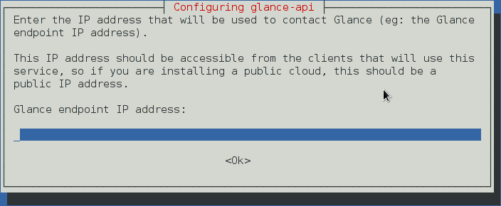

:orphan:

======================
Register API endpoints
======================

All Debian packages for API services, except the ``heat-api`` package,
register the service in the Identity service catalog. This feature is
helpful because API endpoints are difficult to remember.

.. note::

   The ``heat-common`` package and not the ``heat-api`` package configures the
   Orchestration service.

When you install a package for an API service, you are prompted to
register that service. However, after you install or upgrade the package
for an API service, Debian immediately removes your response to this
prompt from the debconf database. Consequently, you are prompted to
re-register the service with the Identity service. If you already
registered the API service, respond ``no`` when you upgrade.

.. image:: ../figures/debconf-screenshots/api-endpoint_1_register_endpoint.png

|

This screen registers packages in the Identity service catalog:

.. image:: ../figures/debconf-screenshots/api-endpoint_2_keystone_server_ip.png

|

You are prompted for the Identity service ``admin_token`` value. The
Identity service uses this value to register the API service. When you
set up the ``keystone`` package, this value is configured automatically.

.. image:: ../figures/debconf-screenshots/api-endpoint_3_keystone_authtoken.png

|

This screen configures the IP addresses for the service. The
configuration script automatically detects the IP address used by the
interface that is connected to the default route (``/sbin/route`` and
``/sbin/ip``).

Unless you have a unique set up for your network, press **ENTER**.

|

This screen configures the region name for the service. For example,
``us-east-coast`` or ``europe-paris``.

.. image:: ../figures/debconf-screenshots/api-endpoint_5_region_name.png

|

The Debian package post installation scripts will then perform the below
commands for you:

.. code-block:: console

   # openstack --os-token ${AUTH_TOKEN} \
     --os-url=http://${KEYSTONE_ENDPOINT_IP}:35357/v3/ \
     --os-domain-name default \
     --os-identity-api-version=3 \
     service create \
     --name=${SERVICE_NAME} \
     --description="${SERVICE_DESC}" \
     ${SERVICE_TYPE}

   # openstack --os-token ${AUTH_TOKEN} \
     --os-url=http://${KEYSTONE_ENDPOINT_IP}:35357/v3/ \
     --os-domain-name default \
     --os-identity-api-version=3 \
     endpoint create \
     --region "${REGION_NAME}" \
     ${SERVICE_NAME} public http://${PKG_ENDPOINT_IP}:${SERVICE_PORT}${SERVICE_URL}

   # openstack --os-token ${AUTH_TOKEN} \
     --os-url=http://${KEYSTONE_ENDPOINT_IP}:35357/v3/ \
     --os-domain-name default \
     --os-identity-api-version=3 \
     endpoint create \
     --region "${REGION_NAME}" \
     ${SERVICE_NAME} internal http://${PKG_ENDPOINT_IP}:${SERVICE_PORT}${SERVICE_URL}

   # openstack --os-token ${AUTH_TOKEN} \
     --os-url=http://${KEYSTONE_ENDPOINT_IP}:35357/v3/ \
     --os-domain-name default \
     --os-identity-api-version=3 \
     endpoint create \
     --region "${REGION_NAME}" \
     ${SERVICE_NAME} admin http://${PKG_ENDPOINT_IP}:${SERVICE_PORT}${SERVICE_URL}

The values of ``AUTH_TOKEN``, ``KEYSTONE_ENDPOINT_IP``,
``PKG_ENDPOINT_IP``, and ``REGION_NAME`` depend on the answer you will
provide to the debconf prompts. But the values of ``SERVICE_NAME``,
``SERVICE_TYPE``, ``SERVICE_DESC``, and ``SERVICE_URL`` are already
pre-wired in each package, so you don't have to remember them.
