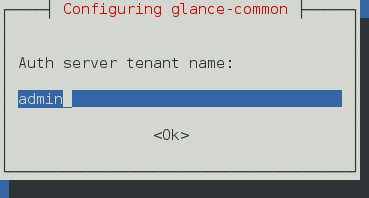
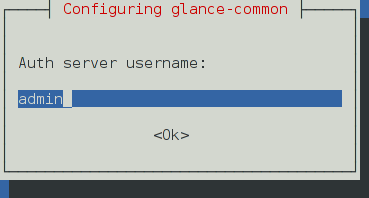

:orphan:

======================================
Services and the [keystone_authtoken]
======================================

Because most OpenStack services must access the Identity service, you
must configure the IP address of the ``keystone`` server to be able to
access it. You must also configure the ``admin_tenant_name``,
``admin_user``, and ``admin_password`` options for each service to work.

Generally, this section looks like this:

.. code-block:: ini

   [keystone_authtoken]
   auth_uri = http://controller:5000/v2.0
   identity_uri = http://controller:35357
   admin_tenant_name = %SERVICE_TENANT_NAME%
   admin_user = %SERVICE_USER%
   admin_password = %SERVICE_PASSWORD%

The debconf system helps users configure the ``auth_uri``,
``identity_uri``, ``admin_tenant_name``, ``admin_user``, and
``admin_password`` options.

The following screens show an example Image service configuration:

.. image:: ../figures/debconf-screenshots/service_keystone_authtoken_server_hostname.png

|

|

|

.. image:: ../figures/debconf-screenshots/service_keystone_authtoken_admin_password.png

This information is stored in the configuration file for each service.
For example:

.. code-block:: ini

   /etc/ceilometer/ceilometer.conf
   /etc/nova/api-paste.ini
   /etc/glance/glance-api-paste.ini
   /etc/glance/glance-registry.ini
   /etc/cinder/cinder.conf
   /etc/neutron/neutron.conf

The Debian OpenStack packages offer automation for this, so OpenStack
users do not have to manually edit the configuration files.
