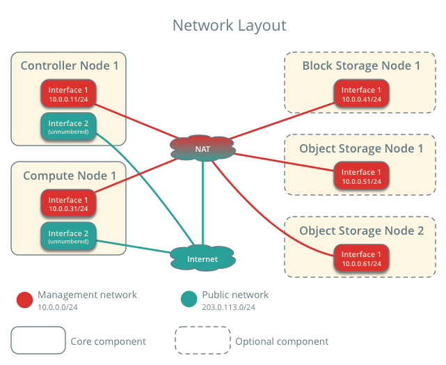

.. _environment-networking:

Host networking
~~~~~~~~~~~~~~~

.. only:: ubuntu

   After installing the operating system on each node for the architecture
   that you choose to deploy, you must configure the network interfaces. We
   recommend that you disable any automated network management tools and
   manually edit the appropriate configuration files for your distribution.
   For more information on how to configure networking on your
   distribution, see the `documentation <https://help.ubuntu.com/lts/serverguide/network-configuration.html>`__ .

.. only:: debian

   After installing the operating system on each node for the architecture
   that you choose to deploy, you must configure the network interfaces. We
   recommend that you disable any automated network management tools and
   manually edit the appropriate configuration files for your distribution.
   For more information on how to configure networking on your
   distribution, see the `documentation <https://wiki.debian.org/NetworkConfiguration>`__ .

.. only:: rdo

   After installing the operating system on each node for the architecture
   that you choose to deploy, you must configure the network interfaces. We
   recommend that you disable any automated network management tools and
   manually edit the appropriate configuration files for your distribution.
   For more information on how to configure networking on your
   distribution, see the `documentation <https://access.redhat.com/documentation/en-US/Red_Hat_Enterprise_Linux/7/html/Networking_Guide/sec-Using_the_Command_Line_Interface.html>`__ .

.. only:: obs

   After installing the operating system on each node for the architecture
   that you choose to deploy, you must configure the network interfaces. We
   recommend that you disable any automated network management tools and
   manually edit the appropriate configuration files for your distribution.
   For more information on how to configure networking on your
   distribution, see the `SLES 12 <https://www.suse.com/documentation/sles-12/book_sle_admin/data/sec_basicnet_manconf.html>`__ or `openSUSE <http://activedoc.opensuse.org/book/opensuse-reference/chapter-13-basic-networking>`__ documentation.

All nodes require Internet access for administrative purposes such as package
installation, security updates, :term:`DNS`, and :term:`NTP`. In most cases,
nodes should obtain internet access through the management network interface.
To highlight the importance of network separation, the example architectures
use `private address space <https://tools.ietf.org/html/rfc1918>`__ for the
management network and assume that the physical network infrastructure
provides Internet access via :term:`NAT` or other method. The example
architectures use routable IP address space for the provider (external)
network and assume that the physical network infrastructure provides direct
Internet access.

In the provider networks architecture, all instances attach directly
to the provider network. In the self-service (private) networks architecture,
instances can attach to a self-service or provider network. Self-service
networks can reside entirely within OpenStack or provide some level of external
network access using :term:`NAT` through the provider network.

.. _figure-networklayout:

The example architectures assume use of the following networks:

* Management on 10.0.0.0/24 with gateway 10.0.0.1

  This network requires a gateway to provide Internet access to all
  nodes for administrative purposes such as package installation,
  security updates, :term:`DNS`, and :term:`NTP`.

* Provider on 203.0.113.0/24 with gateway 203.0.113.1

  This network requires a gateway to provide Internet access to
  instances in your OpenStack environment.

You can modify these ranges and gateways to work with your particular
network infrastructure.

Network interface names vary by distribution. Traditionally,
interfaces use "eth" followed by a sequential number. To cover all
variations, this guide simply refers to the first interface as the
interface with the lowest number and the second interface as the
interface with the highest number.

Unless you intend to use the exact configuration provided in this
example architecture, you must modify the networks in this procedure to
match your environment. Also, each node must resolve the other nodes by
name in addition to IP address. For example, the ``controller`` name must
resolve to ``10.0.0.11``, the IP address of the management interface on
the controller node.

.. warning::

   Reconfiguring network interfaces will interrupt network
   connectivity. We recommend using a local terminal session for these
   procedures.

.. note::

   .. only:: rdo or obs

      Your distribution enables a restrictive :term:`firewall` by
      default. During the installation process, certain steps will
      fail unless you alter or disable the firewall. For more
      information about securing your environment, refer to the
      `OpenStack Security Guide <http://docs.openstack.org/sec/>`__.

   .. only:: ubuntu or debian

      Your distribution does not enable a restrictive :term:`firewall`
      by default. For more information about securing your environment,
      refer to the
      `OpenStack Security Guide <http://docs.openstack.org/sec/>`__.

.. toctree::
   :maxdepth: 1

   environment-networking-controller.rst
   environment-networking-compute.rst
   environment-networking-storage-cinder.rst
   environment-networking-storage-swift.rst
   environment-networking-verify.rst
