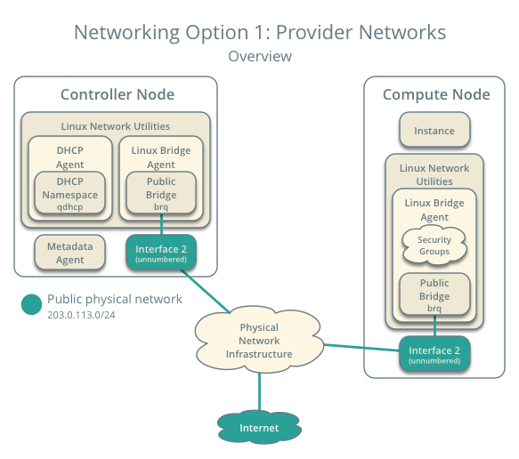
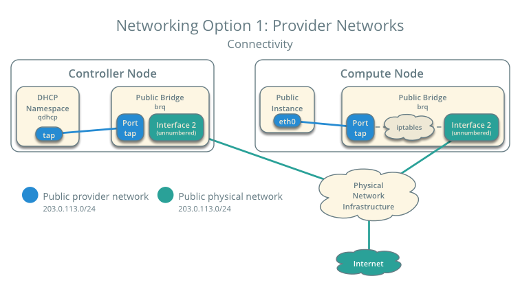

.. _launch-instance-networks-provider:

Provider network
~~~~~~~~~~~~~~~~

Before launching an instance, you must create the necessary virtual network
infrastructure. For networking option 1, an instance uses a provider
(external) network that connects to the physical network infrastructure via
layer-2 (bridging/switching). This network includes a DHCP server that
provides IP addresses to instances.

The ``admin`` or other privileged user must create this network because it
connects directly to the physical network infrastructure.

.. note::

   The following instructions and diagrams use example IP address ranges. You
   must adjust them for your particular environment.

   **Networking Option 1: Provider networks - Overview**

   **Networking Option 1: Provider networks - Connectivity**

Create the provider network
---------------------------

#. On the controller node, source the ``admin`` credentials to gain access to
   admin-only CLI commands:

   .. code-block:: console

      $ . admin-openrc

   .. end

#. Create the network:

   .. code-block:: console

      $ openstack network create  --share \
        --provider-physical-network provider \
        --provider-network-type flat provider

      Created a new network:

      +---------------------------+--------------------------------------+
      | Field                     | Value                                |
      +---------------------------+--------------------------------------+
      | admin_state_up            | UP                                   |
      | availability_zone_hints   |                                      |
      | availability_zones        |                                      |
      | created_at                | 2016-11-02T20:36:18Z                 |
      | description               |                                      |
      | headers                   |                                      |
      | id                        | 9793a02d-4f05-40d2-a280-407c48db0161 |
      | ipv4_address_scope        | None                                 |
      | ipv6_address_scope        | None                                 |
      | mtu                       | 1500                                 |
      | name                      | provider                             |
      | port_security_enabled     | True                                 |
      | project_id                | 7e188c33604d4b02ae0a99b5da68cae0     |
      | provider:network_type     | flat                                 |
      | provider:physical_network | provider                             |
      | provider:segmentation_id  | None                                 |
      | revision_number           | 3                                    |
      | router:external           | Internal                             |
      | shared                    | True                                 |
      | status                    | ACTIVE                               |
      | subnets                   |                                      |
      | tags                      | []                                   |
      | updated_at                | 2016-11-02T20:36:18Z                 |
      +---------------------------+--------------------------------------+

   .. end

   The ``--share`` option allows all projects to use the virtual network.

   The ``--provider-physical-network provider`` and
   ``--provider-network-type flat`` options connect the flat virtual network
   to the flat (native/untagged) physical network on the ``eth1`` interface
   on the host using information from the following files:

   ``ml2_conf.ini``:

   .. code-block:: ini

      [ml2_type_flat]
      flat_networks = provider

   .. end

   ``linuxbridge_agent.ini``:

   .. code-block:: ini

      [linux_bridge]
      physical_interface_mappings = provider:eth1

   .. end

#. Create a subnet on the network:

   .. code-block:: console

      $ openstack subnet create --network provider \
        --allocation-pool start=START_IP_ADDRESS,end=END_IP_ADDRESS \
        --dns-nameserver DNS_RESOLVER --gateway PROVIDER_NETWORK_GATEWAY \
        --subnet-range PROVIDER_NETWORK_CIDR provider

   .. end

   Replace ``PROVIDER_NETWORK_CIDR`` with the subnet on the provider
   physical network in CIDR notation.

   Replace ``START_IP_ADDRESS`` and ``END_IP_ADDRESS`` with the first and
   last IP address of the range within the subnet that you want to allocate
   for instances. This range must not include any existing active IP
   addresses.

   Replace ``DNS_RESOLVER`` with the IP address of a DNS resolver. In
   most cases, you can use one from the ``/etc/resolv.conf`` file on
   the host.

   Replace ``PROVIDER_NETWORK_GATEWAY`` with the gateway IP address on the
   provider network, typically the ".1" IP address.

   **Example**

   The provider network uses 203.0.113.0/24 with a gateway on 203.0.113.1.
   A DHCP server assigns each instance an IP address from 203.0.113.101
   to 203.0.113.250. All instances use 8.8.4.4 as a DNS resolver.

   .. code-block:: console

      $ openstack subnet create --network provider \
        --allocation-pool start=203.0.113.101,end=203.0.113.250 \
        --dns-nameserver 8.8.4.4 --gateway 203.0.113.1 \
        --subnet-range 203.0.113.0/24 provider

      Created a new subnet:
      +-------------------+--------------------------------------+
      | Field             | Value                                |
      +-------------------+--------------------------------------+
      | allocation_pools  | 203.0.113.101-203.0.113.250          |
      | cidr              | 203.0.113.0/24                       |
      | created_at        | 2017-03-29T05:48:29Z                 |
      | description       |                                      |
      | dns_nameservers   | 8.8.4.4                              |
      | enable_dhcp       | True                                 |
      | gateway_ip        | 203.0.113.1                          |
      | host_routes       |                                      |
      | id                | e84b4972-c7fc-4ce9-9742-fdc845196ac5 |
      | ip_version        | 4                                    |
      | ipv6_address_mode | None                                 |
      | ipv6_ra_mode      | None                                 |
      | name              | provider                             |
      | network_id        | 1f816a46-7c3f-4ccf-8bf3-fe0807ddff8d |
      | project_id        | 496efd248b0c46d3b80de60a309177b5     |
      | revision_number   | 2                                    |
      | segment_id        | None                                 |
      | service_types     |                                      |
      | subnetpool_id     | None                                 |
      | updated_at        | 2017-03-29T05:48:29Z                 |
      +-------------------+--------------------------------------+

   .. end

Return to :ref:`Launch an instance - Create virtual networks
<launch-instance-networks>`.
