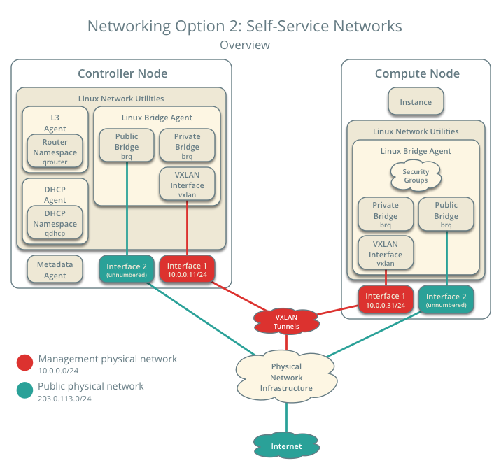
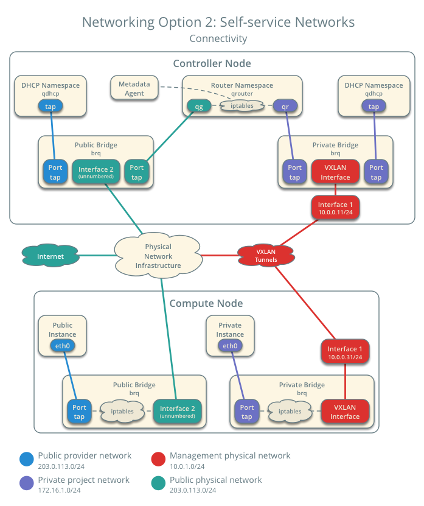

.. _launch-instance-networks-selfservice:

Self-service network
~~~~~~~~~~~~~~~~~~~~

If you chose networking option 2, you can also create a self-service (private)
network that connects to the physical network infrastructure via NAT.
This network includes a DHCP server that provides IP addresses to instances.
An instance on this network can automatically access external networks such
as the Internet. However, access to an instance on this network from external
networks such as the Internet requires a :term:`floating IP address`.

The ``demo`` or other unprivileged user can create this network because it
provides connectivity to instances within the ``demo`` project only.

.. warning::

   You must :ref:`create the provider network
   <launch-instance-networks-provider>` before the self-service network.

.. note::

   The following instructions and diagrams use example IP address ranges. You
   must adjust them for your particular environment.

   **Networking Option 2: Self-service networks - Overview**

   **Networking Option 2: Self-service networks - Connectivity**

Create the self-service network
-------------------------------

#. On the controller node, source the ``demo`` credentials to gain access to
   user-only CLI commands:

   .. code-block:: console

      $ . demo-openrc

   .. end

#. Create the network:

   .. code-block:: console

      $ openstack network create selfservice

      Created a new network:
      +-------------------------+--------------------------------------+
      | Field                   | Value                                |
      +-------------------------+--------------------------------------+
      | admin_state_up          | UP                                   |
      | availability_zone_hints |                                      |
      | availability_zones      |                                      |
      | created_at              | 2016-11-04T18:20:59Z                 |
      | description             |                                      |
      | headers                 |                                      |
      | id                      | 7c6f9b37-76b4-463e-98d8-27e5686ed083 |
      | ipv4_address_scope      | None                                 |
      | ipv6_address_scope      | None                                 |
      | mtu                     | 1450                                 |
      | name                    | selfservice                          |
      | port_security_enabled   | True                                 |
      | project_id              | 3828e7c22c5546e585f27b9eb5453788     |
      | project_id              | 3828e7c22c5546e585f27b9eb5453788     |
      | revision_number         | 3                                    |
      | router:external         | Internal                             |
      | shared                  | False                                |
      | status                  | ACTIVE                               |
      | subnets                 |                                      |
      | tags                    | []                                   |
      | updated_at              | 2016-11-04T18:20:59Z                 |
      +-------------------------+--------------------------------------+

   .. end

   Non-privileged users typically cannot supply additional parameters to
   this command. The service automatically chooses parameters using
   information from the following files:

   ``ml2_conf.ini``:

   .. code-block:: ini

      [ml2]
      tenant_network_types = vxlan

      [ml2_type_vxlan]
      vni_ranges = 1:1000

   .. end

#. Create a subnet on the network:

   .. code-block:: console

      $ openstack subnet create --network selfservice \
        --dns-nameserver DNS_RESOLVER --gateway SELFSERVICE_NETWORK_GATEWAY \
        --subnet-range SELFSERVICE_NETWORK_CIDR selfservice

   .. end

   Replace ``DNS_RESOLVER`` with the IP address of a DNS resolver. In
   most cases, you can use one from the ``/etc/resolv.conf`` file on
   the host.

   Replace ``SELFSERVICE_NETWORK_GATEWAY`` with the gateway you want to use on
   the self-service network, typically the ".1" IP address.

   Replace ``SELFSERVICE_NETWORK_CIDR`` with the subnet you want to use on the
   self-service network. You can use any arbitrary value, although we recommend
   a network from `RFC 1918 <https://tools.ietf.org/html/rfc1918>`_.

   **Example**

   The self-service network uses 172.16.1.0/24 with a gateway on 172.16.1.1.
   A DHCP server assigns each instance an IP address from 172.16.1.2
   to 172.16.1.254. All instances use 8.8.4.4 as a DNS resolver.

   .. code-block:: console

      $ openstack subnet create --network selfservice \
        --dns-nameserver 8.8.4.4 --gateway 172.16.1.1 \
        --subnet-range 172.16.1.0/24 selfservice

      Created a new subnet:
      +-------------------+--------------------------------------+
      | Field             | Value                                |
      +-------------------+--------------------------------------+
      | allocation_pools  | 172.16.1.2-172.16.1.254              |
      | cidr              | 172.16.1.0/24                        |
      | created_at        | 2016-11-04T18:30:54Z                 |
      | description       |                                      |
      | dns_nameservers   | 8.8.4.4                              |
      | enable_dhcp       | True                                 |
      | gateway_ip        | 172.16.1.1                           |
      | headers           |                                      |
      | host_routes       |                                      |
      | id                | 5c37348e-e7da-439b-8c23-2af47d93aee5 |
      | ip_version        | 4                                    |
      | ipv6_address_mode | None                                 |
      | ipv6_ra_mode      | None                                 |
      | name              | selfservice                          |
      | network_id        | b9273876-5946-4f02-a4da-838224a144e7 |
      | project_id        | 3828e7c22c5546e585f27b9eb5453788     |
      | project_id        | 3828e7c22c5546e585f27b9eb5453788     |
      | revision_number   | 2                                    |
      | service_types     | []                                   |
      | subnetpool_id     | None                                 |
      | updated_at        | 2016-11-04T18:30:54Z                 |
      +-------------------+--------------------------------------+

   .. end

Create a router
---------------

Self-service networks connect to provider networks using a virtual router
that typically performs bidirectional NAT. Each router contains an interface
on at least one self-service network and a gateway on a provider network.

The provider network must include the ``router:external`` option to
enable self-service routers to use it for connectivity to external networks
such as the Internet. The ``admin`` or other privileged user must include this
option during network creation or add it later. In this case, the
``router:external`` option was set by using the ``--external`` parameter
when creating the ``provider`` network.

#. On the controller node, source the ``admin`` credentials to gain access to
   admin-only CLI commands:

   .. code-block:: console

      $ . admin-openrc

   .. end

#. Source the ``demo`` credentials to gain access to user-only CLI commands:

   .. code-block:: console

      $ . demo-openrc

   .. end

#. Create the router:

   .. code-block:: console

      $ openstack router create router

      Created a new router:
      +-------------------------+--------------------------------------+
      | Field                   | Value                                |
      +-------------------------+--------------------------------------+
      | admin_state_up          | UP                                   |
      | availability_zone_hints |                                      |
      | availability_zones      |                                      |
      | created_at              | 2016-11-04T18:32:56Z                 |
      | description             |                                      |
      | external_gateway_info   | null                                 |
      | flavor_id               | None                                 |
      | headers                 |                                      |
      | id                      | 67324374-396a-4db6-9443-c70be167a42b |
      | name                    | router                               |
      | project_id              | 3828e7c22c5546e585f27b9eb5453788     |
      | project_id              | 3828e7c22c5546e585f27b9eb5453788     |
      | revision_number         | 2                                    |
      | routes                  |                                      |
      | status                  | ACTIVE                               |
      | updated_at              | 2016-11-04T18:32:56Z                 |
      +-------------------------+--------------------------------------+

   .. end

#. Add the self-service network subnet as an interface on the router:

   .. code-block:: console

      $ neutron router-interface-add router selfservice

      Added interface bff6605d-824c-41f9-b744-21d128fc86e1 to router router.

   .. end

#. Set a gateway on the provider network on the router:

   .. code-block:: console

      $ neutron router-gateway-set router provider

      Set gateway for router router

   .. end

Verify operation
----------------

We recommend that you verify operation and fix any issues before proceeding.
The following steps use the IP address ranges from the network and subnet
creation examples.

#. On the controller node, source the ``admin`` credentials to gain access to
   admin-only CLI commands:

   .. code-block:: console

      $ . admin-openrc

   .. end

#. List network namespaces. You should see one ``qrouter`` namespace and two
   ``qdhcp`` namespaces.

   .. code-block:: console

      $ ip netns

      qrouter-89dd2083-a160-4d75-ab3a-14239f01ea0b
      qdhcp-7c6f9b37-76b4-463e-98d8-27e5686ed083
      qdhcp-0e62efcd-8cee-46c7-b163-d8df05c3c5ad

   .. end

#. List ports on the router to determine the gateway IP address on the
   provider network:

   .. code-block:: console

      $ neutron router-port-list router

      +--------------------------------------+------+-------------------+------------------------------------------+
      | id                                   | name | mac_address       | fixed_ips                                |
      +--------------------------------------+------+-------------------+------------------------------------------+
      | bff6605d-824c-41f9-b744-21d128fc86e1 |      | fa:16:3e:2f:34:9b | {"subnet_id":                            |
      |                                      |      |                   | "3482f524-8bff-4871-80d4-5774c2730728",  |
      |                                      |      |                   | "ip_address": "172.16.1.1"}              |
      | d6fe98db-ae01-42b0-a860-37b1661f5950 |      | fa:16:3e:e8:c1:41 | {"subnet_id":                            |
      |                                      |      |                   | "5cc70da8-4ee7-4565-be53-b9c011fca011",  |
      |                                      |      |                   | "ip_address": "203.0.113.102"}           |
      +--------------------------------------+------+-------------------+------------------------------------------+

   .. end

#. Ping this IP address from the controller node or any host on the physical
   provider network:

   .. code-block:: console

      $ ping -c 4 203.0.113.102

      PING 203.0.113.102 (203.0.113.102) 56(84) bytes of data.
      64 bytes from 203.0.113.102: icmp_req=1 ttl=64 time=0.619 ms
      64 bytes from 203.0.113.102: icmp_req=2 ttl=64 time=0.189 ms
      64 bytes from 203.0.113.102: icmp_req=3 ttl=64 time=0.165 ms
      64 bytes from 203.0.113.102: icmp_req=4 ttl=64 time=0.216 ms

      --- 203.0.113.102 ping statistics ---
      rtt min/avg/max/mdev = 0.165/0.297/0.619/0.187 ms

   .. end

Return to :ref:`Launch an instance - Create virtual networks
<launch-instance-networks>`.
