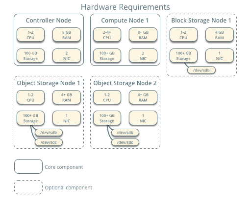
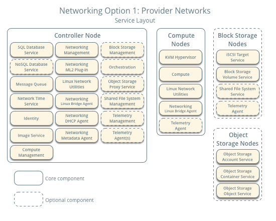
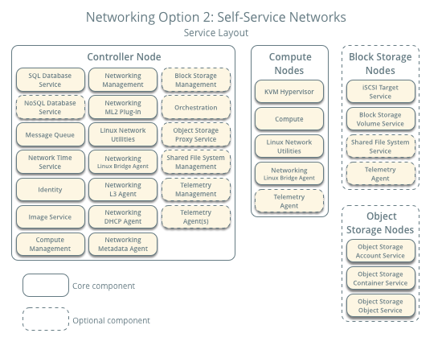

========
Overview
========

The :term:`OpenStack` project is an open source cloud computing platform that
supports all types of cloud environments. The project aims for simple
implementation, massive scalability, and a rich set of features. Cloud
computing experts from around the world contribute to the project.

OpenStack provides an :term:`Infrastructure-as-a-Service (IaaS)<IaaS>` solution
through a variety of complemental services. Each service offers an
:term:`Application Programming Interface (API)` that facilitates this
integration.

This guide covers step-by-step deployment of the following major OpenStack
services using a functional example architecture suitable for new users of
OpenStack with sufficient Linux experience:

.. list-table:: **OpenStack services**
   :widths: 20 15 70
   :header-rows: 1

   * - Service
     - Project name
     - Description
   * - `Dashboard <http://www.openstack.org/software/releases/liberty/components/horizon>`_
     - `Horizon <http://docs.openstack.org/developer/horizon/>`_
     - Provides a web-based self-service portal
       to interact with underlying OpenStack services,
       such as launching an instance, assigning IP
       addresses and configuring access controls.
   * - `Compute <http://www.openstack.org/software/releases/liberty/components/nova>`_
     - `Nova <http://docs.openstack.org/developer/nova/>`_
     - Manages the lifecycle of compute instances in an
       OpenStack environment. Responsibilities include
       spawning, scheduling and decommissioning of virtual
       machines on demand.
   * - `Networking <http://www.openstack.org/software/releases/liberty/components/neutron>`_
     - `Neutron <http://docs.openstack.org/developer/neutron/>`_
     - Enables Network-Connectivity-as-a-Service for
       other OpenStack services, such as OpenStack Compute.
       Provides an API for users to define networks and the
       attachments into them. Has a pluggable architecture
       that supports many popular networking vendors and
       technologies.
   * - **Storage**
     -
     -
   * - `Object Storage <http://www.openstack.org/software/releases/liberty/components/swift>`_
     - `Swift <http://docs.openstack.org/developer/swift/>`_
     - Stores and retrieves arbitrary unstructured
       data objects via a :term:`RESTful`, HTTP based API.
       It is highly fault tolerant with its data replication and
       scale-out architecture. Its implementation is not like a
       file server with mountable directories. In this case,
       it writes objects and files to multiple drives, ensuring the
       data is replicated across a server cluster.
   * - `Block Storage <http://www.openstack.org/software/releases/liberty/components/cinder>`_
     - `Cinder <http://docs.openstack.org/developer/cinder/>`_
     - Provides persistent block storage to running instances. Its pluggable
       driver architecture facilitates the creation and management of
       block storage devices.
   * - **Shared services**
     -
     -
   * - `Identity service <http://www.openstack.org/software/releases/liberty/components/keystone>`_
     - `Keystone <http://docs.openstack.org/developer/keystone/>`_
     - Provides an authentication and authorization service
       for other OpenStack services. Provides a catalog of endpoints
       for all OpenStack services.
   * - `Image service <http://www.openstack.org/software/releases/liberty/components/glance>`_
     - `Glance <http://docs.openstack.org/developer/glance/>`_
     - Stores and retrieves virtual machine disk images.
       OpenStack Compute makes use of this during instance
       provisioning.
   * - `Telemetry <http://www.openstack.org/software/releases/liberty/components/ceilometer>`_
     - `Ceilometer <http://docs.openstack.org/developer/ceilometer/>`_
     - Monitors and meters the OpenStack cloud for billing, benchmarking,
       scalability, and statistical purposes.
   * - **Higher-level services**
     -
     -
   * - `Orchestration <http://www.openstack.org/software/releases/liberty/components/heat>`_
     - `Heat <http://docs.openstack.org/developer/heat/>`_
     - Orchestrates multiple composite cloud applications by using
       either the native :term:`HOT <Heat Orchestration Template (HOT)>` template
       format or the AWS CloudFormation template format, through both an
       OpenStack-native REST API and a CloudFormation-compatible
       Query API.

|

After becoming familiar with basic installation, configuration, operation,
and troubleshooting of these OpenStack services, you should consider the
following steps toward deployment using a production architecture:

* Determine and implement the necessary core and optional services to
  meet performance and redundancy requirements.

* Increase security using methods such as firewalls, encryption, and
  service policies.

* Implement a deployment tool such as Ansible, Chef, Puppet, or Salt
  to automate deployment and management of the production environment.

.. _overview-example-architectures:

Example architecture
~~~~~~~~~~~~~~~~~~~~

The example architecture requires at least two nodes (hosts) to launch a basic
:term:`virtual machine <virtual machine (VM)>` or instance. Optional
services such as Block Storage and Object Storage require additional nodes.

This example architecture differs from a minimal production architecture as
follows:

* Networking agents reside on the controller node instead of one or more
  dedicated network nodes.

* Overlay (tunnel) traffic for self-service networks traverses the management
  network instead of a dedicated network.

For more information on production architectures, see the
`Architecture Design Guide <http://docs.openstack.org/arch-design/>`__,
`Operations Guide <http://docs.openstack.org/ops/>`__, and
`Networking Guide <http://docs.openstack.org/mitaka/networking-guide/>`__.

.. _figure-hwreqs:

   **Hardware requirements**

Controller
----------

The controller node runs the Identity service, Image service, management
portions of Compute, management portion of Networking, various Networking
agents, and the dashboard. It also includes supporting services such as
an SQL database, :term:`message queue`, and :term:`NTP`.

Optionally, the controller node runs portions of Block Storage, Object
Storage, Orchestration, and Telemetry services.

The controller node requires a minimum of two network interfaces.

Compute
-------

The compute node runs the :term:`hypervisor` portion of Compute that
operates instances. By default, Compute uses the
:term:`KVM <kernel-based VM (KVM)>` hypervisor. The compute node also
runs a Networking service agent that connects instances to virtual networks
and provides firewalling services to instances via
:term:`security groups <security group>`.

You can deploy more than one compute node. Each node requires a minimum
of two network interfaces.

Block Storage
-------------

The optional Block Storage node contains the disks that the Block
Storage and Shared File System services provision for instances.

For simplicity, service traffic between compute nodes and this node
uses the management network. Production environments should implement
a separate storage network to increase performance and security.

You can deploy more than one block storage node. Each node requires a
minimum of one network interface.

Object Storage
--------------

The optional Object Storage node contain the disks that the
Object Storage service uses for storing accounts, containers, and
objects.

For simplicity, service traffic between compute nodes and this node
uses the management network. Production environments should implement
a separate storage network to increase performance and security.

This service requires two nodes. Each node requires a minimum of one
network interface. You can deploy more than two object storage nodes.

Networking
~~~~~~~~~~

Choose one of the following virtual networking options.

.. _network1:

Networking Option 1: Provider networks
--------------------------------------

The provider networks option deploys the OpenStack Networking service
in the simplest way possible with primarily layer-2 (bridging/switching)
services and VLAN segmentation of networks. Essentially, it bridges virtual
networks to physical networks and relies on physical network infrastructure
for layer-3 (routing) services. Additionally, a :term:`DHCP` service provides
IP address information to instances.

.. note::

   This option lacks support for self-service (private) networks, layer-3
   (routing) services, and advanced services such as :term:`LBaaS` and
   :term:`FWaaS`. Consider the self-service networks option if you
   desire these features.

.. _figure-network1-services:

.. _network2:

Networking Option 2: Self-service networks
------------------------------------------

The self-service networks option augments the provider networks option
with layer-3 (routing) services that enable
:term:`self-service` networks using overlay segmentation methods such
as :term:`VXLAN`. Essentially, it routes virtual networks to physical networks
using :term:`NAT`. Additionally, this option provides the foundation
for advanced services such as LBaaS and FWaaS.

.. _figure-network2-services:

