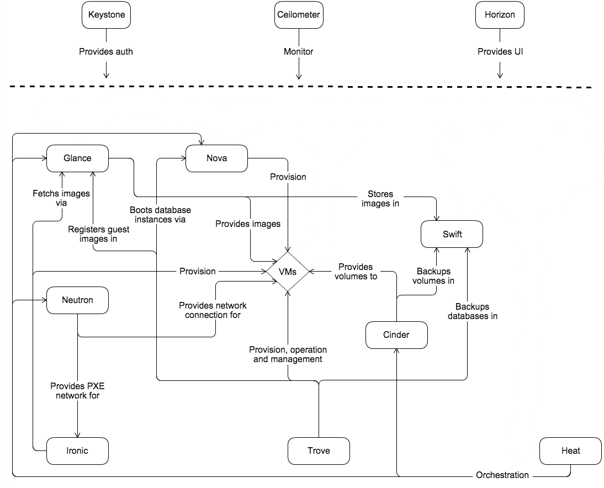
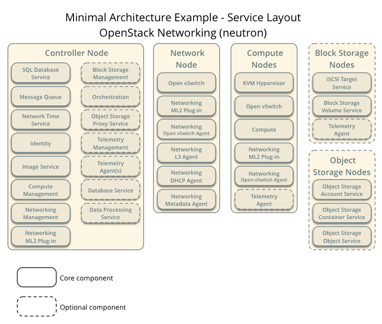
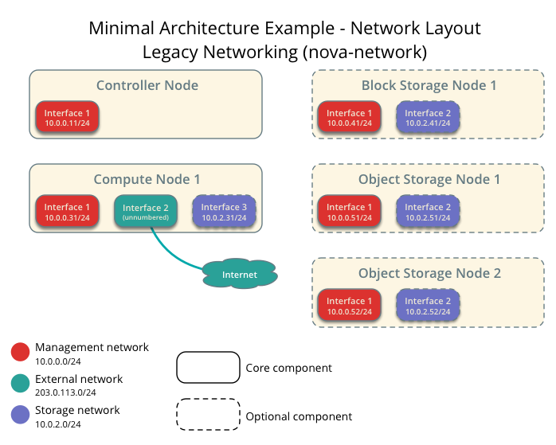

============
Architecture
============

Overview
~~~~~~~~

The :term:`OpenStack` project is an open source cloud computing platform that
supports all types of cloud environments. The project aims for simple
implementation, massive scalability, and a rich set of features. Cloud
computing experts from around the world contribute to the project.

OpenStack provides an :term:`Infrastructure-as-a-Service (IaaS)<IaaS>` solution
through a variety of complemental services. Each service offers an
:term:`application programming interface (API)<API>` that facilitates this
integration. The following table provides a list of OpenStack services:

.. list-table:: **OpenStack services**
   :widths: 20 15 70
   :header-rows: 1

   * - Service
     - Project name
     - Description
   * - `Dashboard <http://www.openstack.org/software/openstack-dashboard/>`_
     - `Horizon <http://docs.openstack.org/developer/horizon/>`_
     - Provides a web-based self-service portal
       to interact with underlying OpenStack services,
       such as launching an instance, assigning IP
       addresses and configuring access controls.
   * - `Compute <http://www.openstack.org/software/openstack-compute/>`_
     - `Nova <http://docs.openstack.org/developer/nova/>`_
     - Manages the lifecycle of compute instances in an
       OpenStack environment. Responsibilities include
       spawning, scheduling and decommissioning of virtual
       machines on demand.
   * - `Networking <http://www.openstack.org/software/openstack-networking/>`_
     - `Neutron <http://docs.openstack.org/developer/neutron/>`_
     - Enables Network-Connectivity-as-a-Service for
       other OpenStack services, such as OpenStack Compute.
       Provides an API for users to define networks and the
       attachments into them. Has a pluggable architecture
       that supports many popular networking vendors and
       technologies.
   * -
     -
     - **Storage**
   * - `Object Storage <http://www.openstack.org/software/openstack-storage/>`_
     - `Swift <http://docs.openstack.org/developer/swift/>`_
     - Stores and retrieves arbitrary unstructured
       data objects via a :term:`RESTful`, HTTP based API.
       It is highly fault tolerant with its data replication and
       scale-out architecture. Its implementation is not like a
       file server with mountable directories. In this case,
       it writes objects and files to multiple drives, ensuring the
       data is replicated across a server cluster.
   * - `Block Storage <http://www.openstack.org/software/openstack-storage/>`_
     - `Cinder <http://docs.openstack.org/developer/cinder/>`_
     - Provides persistent block storage to running instances. Its pluggable
       driver architecture facilitates the creation and management of
       block storage devices.
   * -
     -
     - **Shared services**
   * - `Identity service <http://www.openstack.org/software/openstack-shared-services/>`_
     - `Keystone <http://docs.openstack.org/developer/keystone/>`_
     - Provides an authentication and authorization service
       for other OpenStack services. Provides a catalog of endpoints
       for all OpenStack services.
   * - `Image service <http://www.openstack.org/software/openstack-shared-services/>`_
     - `Glance <http://docs.openstack.org/developer/glance/>`_
     - Stores and retrieves virtual machine disk images.
       OpenStack Compute makes use of this during instance
       provisioning.
   * - `Telemetry <http://www.openstack.org/software/openstack-shared-services/>`_
     - `Ceilometer <http://docs.openstack.org/developer/ceilometer/>`_
     - Monitors and meters the OpenStack cloud for billing, benchmarking,
       scalability, and statistical purposes.
   * -
     -
     - **Higher-level services**
   * - `Orchestration <http://www.openstack.org/software/openstack-shared-services/>`_
     - `Heat <http://docs.openstack.org/developer/heat/>`_
     - Orchestrates multiple composite cloud applications by using
       either the native :term:`HOT <Heat Orchestration Template (HOT)>` template
       format or the AWS CloudFormation template format, through both an
       OpenStack-native REST API and a CloudFormation-compatible
       Query API.
   * - `Database service <http://www.openstack.org/software/openstack-shared-services/>`_
     - `Trove <http://docs.openstack.org/developer/trove/>`_
     - Provides scalable and reliable Cloud Database-as-a-Service
       functionality for both relational and non-relational database
       engines.
   * - `Data processing service
       <http://www.openstack.org/software/openstack-shared-services/>`_
     - `Sahara <http://docs.openstack.org/developer/sahara/>`_
     - Provides capabilities to provision and scale Hadoop clusters in OpenStack by
       specifying parameters like Hadoop version, cluster topology and nodes hardware
       details.

|

This guide describes how to deploy these services in a functional test
environment and, by example, teaches you how to build a production
environment. Realistically, you would use automation tools such as
Ansible, Chef, and Puppet to deploy and manage a production environment.

.. _overview-conceptual-architecture:

Conceptual architecture
~~~~~~~~~~~~~~~~~~~~~~~

Launching a virtual machine or instance involves many interactions among
several services. The following diagram provides the conceptual
architecture of a typical OpenStack environment.

   Figure 1.1 Conceptual architecture

|

.. _overview-example-architectures:

Example architectures
~~~~~~~~~~~~~~~~~~~~~

OpenStack is highly configurable to meet different needs with various
compute, networking, and storage options. This guide enables you to
choose your own OpenStack adventure using a combination of core and
optional services. This guide uses the following example architectures:

-  Three-node architecture with OpenStack Networking (neutron) and
   optional nodes for Block Storage and Object Storage services.

   -  The :term:`controller node <cloud controller node>` runs the
      Identity service, Image Service, management portions of Compute
      and Networking, Networking plug-in, and the dashboard. It also
      includes supporting services such as an SQL database,
      :term:`message queue`, and :term:`Network Time Protocol (NTP)`.

      Optionally, the controller node runs portions of Block Storage,
      Object Storage, Orchestration, Telemetry, Database, and Data
      processing services. These components provide additional features
      for your environment.

   -  The network node runs the Networking plug-in and several agents
      that provision tenant networks and provide switching, routing,
      :term:`NAT<Network Address Translation (NAT)>`, and
      :term:`DHCP` services. This node also handles external (Internet)
      connectivity for tenant virtual machine instances.

   -  The :term:`compute node` runs the :term:`hypervisor` portion of
      Compute that operates :term:`tenant`
      :term:`virtual machines <virtual machine (VM)>` or instances. By
      default, Compute uses :term:`KVM <kernel-based VM (KVM)>` as the
      :term:`hypervisor`. The compute node also runs the Networking
      plug-in and an agent that connect tenant networks to instances and
      provide firewalling (:term:`security groups <security group>`)
      services. You can run more than one compute node.

      Optionally, the compute node runs a Telemetry agent to collect
      meters. Also, it can contain a third network interface on a
      separate storage network to improve performance of storage
      services.

   -  The optional Block Storage node contains the disks that the Block
      Storage service provisions for tenant virtual machine instances.
      You can run more than one of these nodes.

      Optionally, the Block Storage node runs a Telemetry agent to
      collect meters. Also, it can contain a second network interface on
      a separate storage network to improve performance of storage
      services.

   -  The optional Object Storage nodes contain the disks that the
      Object Storage service uses for storing accounts, containers, and
      objects. You can run more than two of these nodes. However, the
      minimal architecture example requires two nodes.

      Optionally, these nodes can contain a second network interface on
      a separate storage network to improve performance of storage
      services.

      .. note::
         When you implement this architecture, skip the section
         :doc:`networking-nova`. Optional services might require
         additional nodes or additional resources on existing nodes.

|

.. _figure-neutron-network-hw:

.. figure:: figures/installguidearch-neutron-hw.png
   :alt: Minimal architecture example with OpenStack Networking
         (neutron)—Hardware requirements

   Figure 1.2 Minimal architecture example with OpenStack Networking
   (neutron)—Hardware requirements

|

.. _figure-neutron-networks:

.. figure:: figures/installguidearch-neutron-networks.png
   :alt: Minimal architecture example with OpenStack Networking
         (neutron)—Network layout

   Figure 1.3 Minimal architecture example with OpenStack Networking
   (neutron)—Network layout

|

         (neutron)—Service layout

   Figure 1.4 Minimal architecture example with OpenStack Networking
   (neutron)—Service layout

|

-  Two-node architecture with legacy networking (nova-network) and
   optional nodes for Block Storage and Object Storage services.

   -  The :term:`controller node <cloud controller node>` runs the
      Identity service, Image service, management portion of Compute,
      and the dashboard. It also includes supporting services such as an
      SQL database, :term:`message queue`, and :term:`Network Time
      Protocol (NTP)`.

      Optionally, the controller node runs portions of Block Storage,
      Object Storage, Orchestration, Telemetry, Database, and Data
      processing services. These components provide additional features
      for your environment.

   -  The :term:`compute node` runs the :term:`hypervisor` portion of
      Compute that operates :term:`tenant` :term:`virtual machines
      <virtual machine (VM)>` or instances. By default, Compute uses
      :term:`KVM <kernel-based VM (KVM)>` as the :term:`hypervisor`.
      Compute also provisions tenant networks and provides firewalling
      (:term:`security groups <security group>`) services. You can run
      more than one compute node.

      Optionally, the compute node runs a Telemetry agent to collect
      meters. Also, it can contain a third network interface on a
      separate storage network to improve performance of storage
      services.

   -  The optional Block Storage node contains the disks that the Block
      Storage service provisions for tenant virtual machine instances.
      You can run more than one of these nodes.

      Optionally, the Block Storage node runs a Telemetry agent to
      collect meters. Also, it can contain a second network interface on
      a separate storage network to improve performance of storage
      services.

   -  The optional Object Storage nodes contain the disks that the
      Object Storage service uses for storing accounts, containers, and
      objects. You can run more than two of these nodes. However, the
      minimal architecture example requires two nodes.

      Optionally, these nodes can contain a second network interface on
      a separate storage network to improve performance of storage
      services.

      .. note::

         When you implement this architecture, skip the section
         :doc:`networking-neutron`. To use optional services, you might need to
         build additional nodes.

|

.. _figure-legacy-network-hw:

.. figure:: figures/installguidearch-nova-hw.png
   :alt: Minimal architecture example with legacy networking
         (nova-network)—Hardware requirements

   Figure 1.5 Minimal architecture example with legacy networking
   (nova-network)—Hardware requirements

|

.. _figure-nova-networks:

         (nova-network)—Network layout

   Figure 1.6 Minimal architecture example with legacy networking
   (nova-network)—Network layout

|

.. figure:: figures/installguidearch-nova-services.png
   :alt: Minimal architecture example with legacy networking
         (nova-network)—Service layout

   Figure 1.7 Minimal architecture example with legacy networking
   (nova-network)—Service layout
