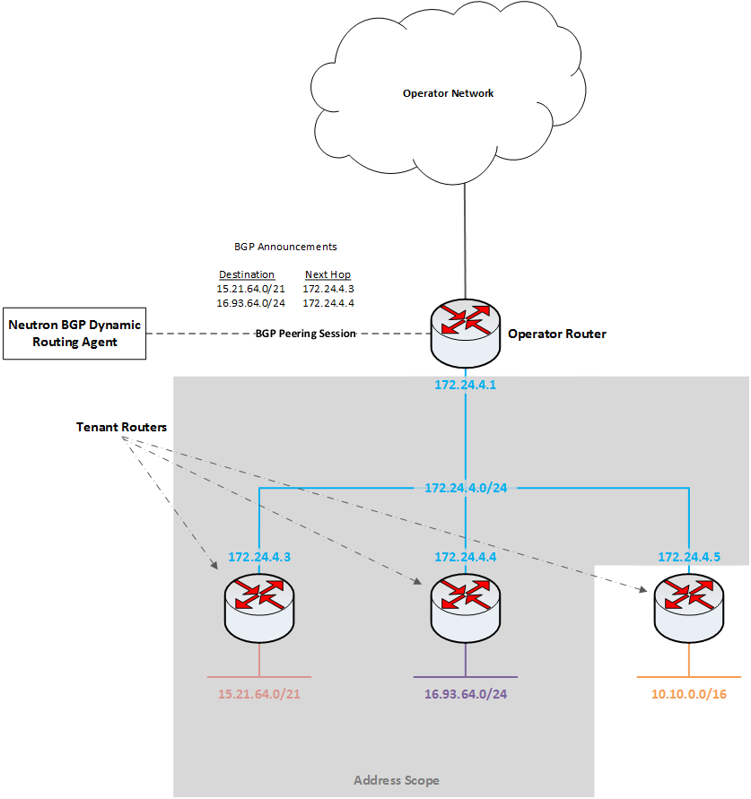
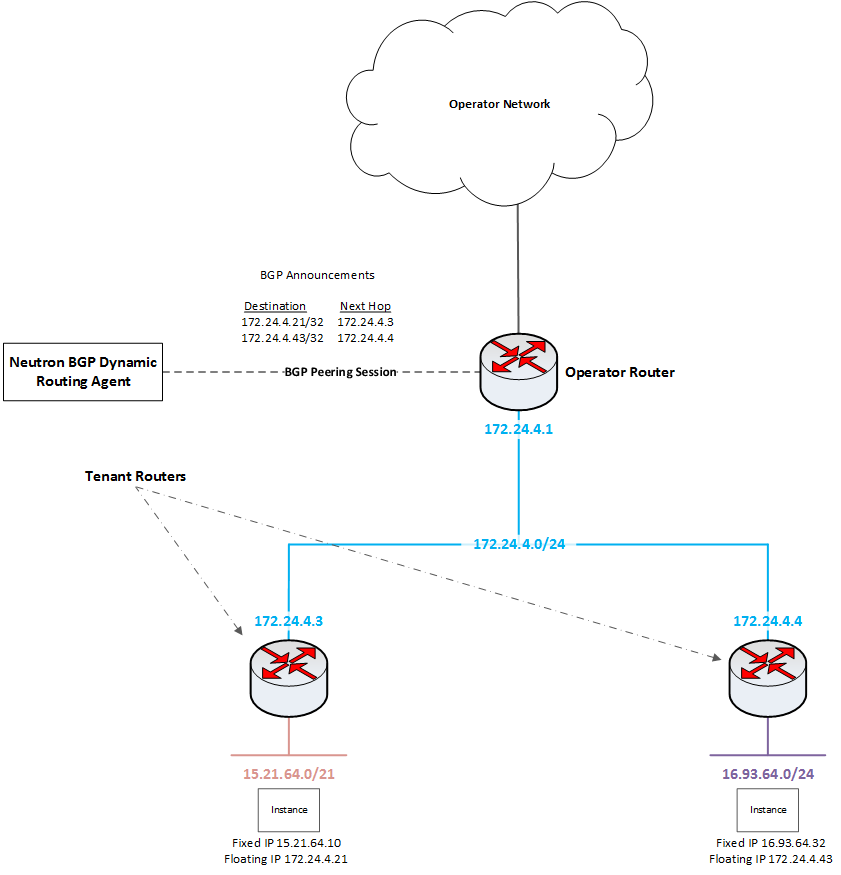

.. _adv-config-bgp-dynamic-routing:

===================
BGP dynamic routing
===================

BGP dynamic routing enables advertisement of self-service (private) network
prefixes to physical network devices that support BGP such as routers, thus
removing the conventional dependency on static routes. The feature relies
on address scopes and requires knowledge of their operation for proper
deployment.

BGP dynamic routing consists of a service plug-in and an agent. The service
plug-in implements the Networking service extension and the agent manages BGP
peering sessions. A cloud administrator creates and configures a BGP speaker
using the CLI or API and manually schedules it to one or more hosts running
the agent. Agents can reside on hosts with or without other Networking
service agents. Prefix advertisement depends on the binding of external
networks to a BGP speaker and the address scope of external and internal
subnets.

Example configuration
~~~~~~~~~~~~~~~~~~~~~

Use the following example configuration as a template to deploy BGP dynamic
routing in your environment. The example configuration references the
following environment:

.. image:: figures/bgp-basic-routing-example.png
   :alt: Basic BGP routing example

.. note::

   The example configuration assumes sufficient knowledge about the
   Networking service, routing, and BGP. For basic deployment of the
   Networking service, consult one of the
   :ref:`deployment-scenarios`. For more information on BGP, see
   `RFC 4271 <https://tools.ietf.org/html/rfc4271>`_.

Controller node
---------------

* In the ``neutron.conf`` file, enable the conventional layer-3 and BGP
  dynamic routing service plug-ins:

  .. code-block:: ini

     [DEFAULT]
     service_plugins = router,bgp

Agent nodes
-----------

* In the ``bgp_dragent.ini`` file:

  * Configure the driver.

    .. code-block:: ini

       [DEFAULT]
       bgp_speaker_driver = neutron.services.bgp.driver.ryu.driver.RyuBgpDriver

    .. note::

       The agent currently only supports the Ryu BGP driver.

  * Configure the router ID.

    .. code-block:: ini

       [DEFAULT]
       bgp_router_id = ROUTER_ID

    Replace ``ROUTER_ID`` with a suitable unique 32-bit number, typically an
    IPv4 address on the host running the agent. For example, 192.168.122.150.

Verify service operation
------------------------

#. Source the administrative project credentials.
#. Verify presence and operation of each BGP dynamic routing agent.

   .. code-block:: console

      $ neutron agent-list --agent-type=="BGP dynamic routing agent"
      +--------------------------------------+---------------------------+------------+-------------------+-------+----------------+---------------------------+
      | id                                   | agent_type                | host       | availability_zone | alive | admin_state_up | binary                    |
      +--------------------------------------+---------------------------+------------+-------------------+-------+----------------+---------------------------+
      | 37729181-2224-48d8-89ef-16eca8e2f77e | BGP dynamic routing agent | controller |                   | :-)   | True           | neutron-bgp-dragent       |
      +--------------------------------------+---------------------------+------------+-------------------+-------+----------------+---------------------------+

Create the address scope and subnet pools
-----------------------------------------

#. Create an address scope. The provider (external) and self-service networks
   must belong to the same address scope for the agent to advertise those
   self-service network prefixes.

   .. code-block:: console

      $ neutron address-scope-create --shared public 4
      Created a new address_scope:
      +------------+--------------------------------------+
      | Field      | Value                                |
      +------------+--------------------------------------+
      | id         | c02c358a-9d35-43ea-8313-986b3e4a91c0 |
      | ip_version | 4                                    |
      | name       | public                               |
      | shared     | True                                 |
      | tenant_id  | b3ac05ef10bf441fbf4aa17f16ae1e6d     |
      +------------+--------------------------------------+

#. Create subnet pools. The provider and self-service networks use different
   pools.

   * Create the provider network pool.

     .. code-block:: console

        $ neutron subnetpool-create --pool-prefix 172.24.4.0/24 \
          --address-scope public provider
        Created a new subnetpool:
        +-------------------+--------------------------------------+
        | Field             | Value                                |
        +-------------------+--------------------------------------+
        | address_scope_id  | c02c358a-9d35-43ea-8313-986b3e4a91c0 |
        | created_at        | 2016-03-17T23:11:12                  |
        | default_prefixlen | 8                                    |
        | default_quota     |                                      |
        | description       |                                      |
        | id                | 3771c0e7-7096-46d3-a3bd-699c58e70259 |
        | ip_version        | 4                                    |
        | is_default        | False                                |
        | max_prefixlen     | 32                                   |
        | min_prefixlen     | 8                                    |
        | name              | provider                             |
        | prefixes          | 172.24.4.0/24                        |
        | shared            | False                                |
        | tenant_id         | b3ac05ef10bf441fbf4aa17f16ae1e6d     |
        | updated_at        | 2016-03-17T23:11:12                  |
        +-------------------+--------------------------------------+

   * Create the self-service network pool.

     .. code-block:: console

        $ neutron subnetpool-create --pool-prefix 10.0.0.0/16 \
          --address-scope public --shared selfservice
        Created a new subnetpool:
        +-------------------+--------------------------------------+
        | Field             | Value                                |
        +-------------------+--------------------------------------+
        | address_scope_id  | c02c358a-9d35-43ea-8313-986b3e4a91c0 |
        | created_at        | 2016-03-17T23:11:51                  |
        | default_prefixlen | 8                                    |
        | default_quota     |                                      |
        | description       |                                      |
        | id                | c7e9737a-cfd3-45b5-a861-d1cee1135a92 |
        | ip_version        | 4                                    |
        | is_default        | False                                |
        | max_prefixlen     | 32                                   |
        | min_prefixlen     | 8                                    |
        | name              | selfservice                          |
        | prefixes          | 10.0.0.0/16                          |
        | shared            | True                                 |
        | tenant_id         | b3ac05ef10bf441fbf4aa17f16ae1e6d     |
        | updated_at        | 2016-03-17T23:11:51                  |
        +-------------------+--------------------------------------+

Create the provider and self-service networks
---------------------------------------------

#. Create the provider network.

   .. code-block:: console

      $ neutron net-create --router:external True --provider:physical_network provider \
        --provider:network_type flat provider
      Created a new network:
      +---------------------------+--------------------------------------+
      | Field                     | Value                                |
      +---------------------------+--------------------------------------+
      | admin_state_up            | True                                 |
      | id                        | 68ec148c-181f-4656-8334-8f4eb148689d |
      | name                      | provider                             |
      | provider:network_type     | flat                                 |
      | provider:physical_network | provider                             |
      | provider:segmentation_id  |                                      |
      | router:external           | True                                 |
      | shared                    | False                                |
      | status                    | ACTIVE                               |
      | subnets                   |                                      |
      | tenant_id                 | b3ac05ef10bf441fbf4aa17f16ae1e6d     |
      +---------------------------+--------------------------------------+

#. Create a subnet on the provider network using an IP address allocation from
   the provider subnet pool.

   .. code-block:: console

      $ neutron subnet-create --name provider --subnetpool provider \
        --prefixlen 24 provider
      Created a new subnet:
      +-------------------+------------------------------------------------+
      | Field             | Value                                          |
      +-------------------+------------------------------------------------+
      | allocation_pools  | {"start": "172.24.4.2", "end": "172.24.4.254"} |
      | cidr              | 172.24.4.0/24                                  |
      | created_at        | 2016-03-17T23:17:16                            |
      | description       |                                                |
      | dns_nameservers   |                                                |
      | enable_dhcp       | True                                           |
      | gateway_ip        | 172.24.4.1                                     |
      | host_routes       |                                                |
      | id                | 8ed65d41-2b2a-4f3a-9f92-45adb266e01a           |
      | ip_version        | 4                                              |
      | ipv6_address_mode |                                                |
      | ipv6_ra_mode      |                                                |
      | name              | provider                                       |
      | network_id        | 68ec148c-181f-4656-8334-8f4eb148689d           |
      | subnetpool_id     | 3771c0e7-7096-46d3-a3bd-699c58e70259           |
      | tenant_id         | b3ac05ef10bf441fbf4aa17f16ae1e6d               |
      | updated_at        | 2016-03-17T23:17:16                            |
      +-------------------+------------------------------------------------+

#. Create the self-service network.

   .. code-block:: console

      $ neutron net-create selfservice
      Created a new network:
      +---------------------------+--------------------------------------+
      | Field                     | Value                                |
      +---------------------------+--------------------------------------+
      | admin_state_up            | True                                 |
      | id                        | 01da3e19-129f-4d26-b065-255ade0e5e2c |
      | name                      | selfservice                          |
      | shared                    | False                                |
      | status                    | ACTIVE                               |
      | subnets                   |                                      |
      | tenant_id                 | b3ac05ef10bf441fbf4aa17f16ae1e6d     |
      +---------------------------+--------------------------------------+

#. Create a subnet on the self-service network using an IP address allocation
   from the self-service subnet pool.

   .. code-block:: console

      $ neutron subnet-create --name selfservice --subnetpool selfservice \
        --prefixlen 24 selfservice
      Created a new subnet:
      +-------------------+--------------------------------------------+
      | Field             | Value                                      |
      +-------------------+--------------------------------------------+
      | allocation_pools  | {"start": "10.0.0.2", "end": "10.0.0.254"} |
      | cidr              | 10.0.0.0/24                                |
      | created_at        | 2016-03-17T23:20:20                        |
      | description       |                                            |
      | dns_nameservers   |                                            |
      | enable_dhcp       | True                                       |
      | gateway_ip        | 10.0.0.1                                   |
      | host_routes       |                                            |
      | id                | 8edd3dc2-df40-4d71-816e-a4586d61c809       |
      | ip_version        | 4                                          |
      | ipv6_address_mode |                                            |
      | ipv6_ra_mode      |                                            |
      | name              | selfservice                                |
      | network_id        | 01da3e19-129f-4d26-b065-255ade0e5e2c       |
      | subnetpool_id     | c7e9737a-cfd3-45b5-a861-d1cee1135a92       |
      | tenant_id         | b3ac05ef10bf441fbf4aa17f16ae1e6d           |
      | updated_at        | 2016-03-17T23:20:20                        |
      +-------------------+--------------------------------------------+

Create and configure a router
-----------------------------

#. Create the router.

   .. code-block:: console

      $ neutron router-create router
      +-----------------------+--------------------------------------+
      | Field                 | Value                                |
      +-----------------------+--------------------------------------+
      | admin_state_up        | True                                 |
      | external_gateway_info |                                      |
      | id                    | 49439b14-f6ee-420d-8c48-d3767fadcb3a |
      | name                  | router                               |
      | status                | ACTIVE                               |
      | tenant_id             | b3ac05ef10bf441fbf4aa17f16ae1e6d     |
      +-----------------------+--------------------------------------+

#. Add the self-service subnet as an interface on the router.

   .. code-block:: console

      $ neutron router-interface-add router selfservice
      Added interface 969a1d4b-7fa1-4346-9963-de06becab87a to router router.

#. Add the provider network as a gateway on the router.

   .. code-block:: console

      $ neutron router-gateway-set router provider
      Set gateway for router router

#. Verify router ports.

   .. code-block:: console

      $ neutron router-port-list router1
      +--------------------------------------+------+-------------------+-------------------------------------------------------------------------------------------+
      | id                                   | name | mac_address       | fixed_ips                                                                                 |
      +--------------------------------------+------+-------------------+-------------------------------------------------------------------------------------------+
      | cc4547cd-00d6-4c29-a1cd-19f7a11a06d0 |      | fa:16:3e:30:4e:12 | {"subnet_id": "994ae28d-46f9-401e-b6cf-ced386ccc1a4", "ip_address": "10.0.0.1"}           |
      | daf5b2eb-9caf-4052-a81f-ee4963614b77 |      | fa:16:3e:6e:4f:59 | {"subnet_id": "7e977566-d119-42d0-b70f-7fdb9c45d6b7", "ip_address": "172.24.4.4"}         |
      +--------------------------------------+------+-------------------+-------------------------------------------------------------------------------------------+

Create and configure the BGP speaker
------------------------------------

The BGP speaker advertises the next-hop IP address for the self-service
network prefix.

#. Create the BGP speaker.

   .. code-block:: console

      $ neutron bgp-speaker-create --ip-version 4 \
        --local-as LOCAL_AS bgpspeaker
      Created a new bgp_speaker:
      +-----------------------------------+--------------------------------------+
      | Field                             | Value                                |
      +-----------------------------------+--------------------------------------+
      | advertise_floating_ip_host_routes | True                                 |
      | advertise_tenant_networks         | True                                 |
      | id                                | 5f227f14-4f46-4eca-9524-fc5a1eabc358 |
      | ip_version                        | 4                                    |
      | local_as                          | 1234                                 |
      | name                              | bgpspeaker                           |
      | networks                          |                                      |
      | peers                             |                                      |
      | tenant_id                         | b3ac05ef10bf441fbf4aa17f16ae1e6d     |
      +-----------------------------------+--------------------------------------+

   Replace ``LOCAL_AS`` with an appropriate local autonomous system number.
   The example configuration uses AS 1234.

#. A BGP speaker requires association with a provider network to determine
   eligible prefixes. The association builds a list of all virtual routers
   with gateways on provider and self-service networks in the same address
   scope so the BGP speaker can advertise self-service network prefixes with
   the corresponding router as the next-hop IP address. Associate the BGP
   speaker with the provider network.

   .. code-block:: console

      $ neutron bgp-speaker-network-add bgpspeaker provider
      Added network provider to BGP speaker bgpspeaker.

#. Verify association of the provider network with the BGP speaker.

   .. code-block:: console

      $ neutron bgp-speaker-show bgpspeaker
      +-----------------------------------+--------------------------------------+
      | Field                             | Value                                |
      +-----------------------------------+--------------------------------------+
      | advertise_floating_ip_host_routes | True                                 |
      | advertise_tenant_networks         | True                                 |
      | id                                | 5f227f14-4f46-4eca-9524-fc5a1eabc358 |
      | ip_version                        | 4                                    |
      | local_as                          | 1234                                 |
      | name                              | bgpspeaker                           |
      | networks                          | 68ec148c-181f-4656-8334-8f4eb148689d |
      | peers                             |                                      |
      | tenant_id                         | b3ac05ef10bf441fbf4aa17f16ae1e6d     |
      +-----------------------------------+--------------------------------------+

#. Verify the prefixes and next-hop IP addresses that the BGP speaker
   advertises.

   .. code-block:: console

      $ neutron bgp-speaker-advertiseroute-list bgpspeaker
      +-------------+------------+
      | destination | next_hop   |
      +-------------+------------+
      | 10.0.0.0/24 | 172.24.4.3 |
      +-------------+------------+

#. Create a BGP peer.

   .. code-block:: console

      $ neutron bgp-peer-create --peer-ip 192.168.122.1 \
        --remote-as REMOTE_AS bgppeer
      Created a new bgp_peer:
      +-----------+--------------------------------------+
      | Field     | Value                                |
      +-----------+--------------------------------------+
      | auth_type | none                                 |
      | id        | 35c89ca0-ac5a-4298-a815-0b073c2362e9 |
      | name      | bgppeer                              |
      | peer_ip   | 192.168.122.1                        |
      | remote_as | 4321                                 |
      | tenant_id | b3ac05ef10bf441fbf4aa17f16ae1e6d     |
      +-----------+--------------------------------------+

   Replace ``REMOTE_AS`` with an appropriate remote autonomous system number.
   The example configuration uses AS 4321 which triggers EBGP peering.

#. Add a BGP peer to the BGP speaker.

   .. code-block:: console

      $ neutron bgp-speaker-peer-add bgpspeaker bgppeer
      Added BGP peer bgppeer to BGP speaker bgpspeaker.

#. Verify addition of the BGP peer to the BGP speaker.

   .. code-block:: console

      $ neutron bgp-speaker-show bgpspeaker
      +-----------------------------------+--------------------------------------+
      | Field                             | Value                                |
      +-----------------------------------+--------------------------------------+
      | advertise_floating_ip_host_routes | True                                 |
      | advertise_tenant_networks         | True                                 |
      | id                                | 5f227f14-4f46-4eca-9524-fc5a1eabc358 |
      | ip_version                        | 4                                    |
      | local_as                          | 1234                                 |
      | name                              | bgpspeaker                           |
      | networks                          | 68ec148c-181f-4656-8334-8f4eb148689d |
      | peers                             | 35c89ca0-ac5a-4298-a815-0b073c2362e9 |
      | tenant_id                         | b3ac05ef10bf441fbf4aa17f16ae1e6d     |
      +-----------------------------------+--------------------------------------+

   .. note::

      After creating a peering session, you cannot change the local or remote
      autonomous system numbers.

Schedule the BGP speaker to an agent
------------------------------------

#. Unlike most agents, BGP speakers require manual scheduling to an agent.
   BGP speakers only form peering sessions and begin prefix advertisement
   after scheduling to an agent. Schedule the BGP speaker to agent
   ``37729181-2224-48d8-89ef-16eca8e2f77e``.

   .. code-block:: console

    $ neutron bgp-dragent-speaker-add 37729181-2224-48d8-89ef-16eca8e2f77e bgpspeaker
    Associated BGP speaker bgpspeaker to the Dynamic Routing agent.

#. Verify scheduling of the BGP speaker to the agent.

   .. code-block:: console

      $ neutron bgp-dragent-list-hosting-speaker bgpspeaker
      +--------------------------------------+------------+----------------+-------+
      | id                                   | host       | admin_state_up | alive |
      +--------------------------------------+------------+----------------+-------+
      | 37729181-2224-48d8-89ef-16eca8e2f77e | controller | True           | :-)   |
      +--------------------------------------+------------+----------------+-------+

      $ neutron bgp-speaker-list-on-dragent 37729181-2224-48d8-89ef-16eca8e2f77e
      +--------------------------------------+------------+----------+------------+
      | id                                   | name       | local_as | ip_version |
      +--------------------------------------+------------+----------+------------+
      | 5f227f14-4f46-4eca-9524-fc5a1eabc358 | bgpspeaker |     1234 |          4 |
      +--------------------------------------+------------+----------+------------+

Prefix advertisement
~~~~~~~~~~~~~~~~~~~~

BGP dynamic routing advertises prefixes for self-service networks and host
routes for floating IP addresses.

Advertisement of a self-service network requires satisfying the following
conditions:

* The external and self-service network reside in the same address scope.

* The router contains an interface on the self-service subnet and a gateway
  on the external network.

* The BGP speaker associates with the external network that provides a
  gateway on the router.

* The BGP speaker has the ``advertise_tenant_networks`` atttribute set to
  ``True``.

Advertisement of a floating IP address requires satisfying the following
conditions:

* The router with the floating IP address binding contains a gateway on
  an external network with the BGP speaker association.

* The BGP speaker has the ``advertise_floating_ip_host_routes`` attribute
  set to ``True``.

Distributed Virtual Routers (DVR)
~~~~~~~~~~~~~~~~~~~~~~~~~~~~~~~~~

In deployments using DVR, the BGP speaker advertises floating IP
addresses and self-service networks differently. For floating IP
addresses, the BGP speaker advertises the floating IP agent gateway
on the corresponding compute node as the next-hop IP address. For
self-service networks using SNAT, the BGP speaker advertises the
DVR SNAT node as the next-hop IP address. For example, consider a
self-service network using 10.0.0.0/24, floating IP addresses using
an arbitrary allocation within 172.24.4.0/24, and a SNAT gateway on
172.24.4.3.

.. code-block:: console

    $ neutron bgp-speaker-advertiseroute-list bgpspeaker
    +-----------------+------------+
    | destination     | next_hop   |
    +-----------------+------------+
    | 10.0.0.0/24     | 172.24.4.3 |
    | 172.24.4.30/32  | 172.24.4.6 |
    | 172.24.4.35/32  | 172.24.4.5 |
    | 172.24.4.103/32 | 172.24.4.6 |
    | 172.24.4.50/32  | 172.24.4.7 |
    | 172.24.4.51/32  | 172.24.4.8 |
    +-----------------+------------+

.. note::

   DVR lacks support for routing directly to a fixed IP address via the
   floating IP agent gateway port and thus prevents the BGP speaker from
   advertising fixed IP addresses.

You can also identify floating IP agent gateways in your environment to
assist with verifying operation of the BGP speaker.

.. code-block:: console

   $ neutron port-list --device_owner="network:floatingip_agent_gateway"
   +--------------------------------------+------+-------------------+--------------------------------------------------------------------------------------------------------+
   | id                                   | name | mac_address       | fixed_ips                                                                                              |
   +--------------------------------------+------+-------------------+--------------------------------------------------------------------------------------------------------+
   | 87cf2970-4970-462e-939e-00e808295dfa |      | fa:16:3e:7c:68:e3 | {"subnet_id": "8ed65d41-2b2a-4f3a-9f92-45adb266e01a", "ip_address": "172.24.4.6"}                      |
   | 8d218440-0d2e-49d0-8a7b-3266a6146dc1 |      | fa:16:3e:9d:78:cf | {"subnet_id": "8ed65d41-2b2a-4f3a-9f92-45adb266e01a", "ip_address": "172.24.4.5"}                      |
   | 87cf2970-4970-462e-939e-00e802281dfa |      | fa:16:3e:6b:18:e0 | {"subnet_id": "8ed65d41-2b2a-4f3a-9f92-45adb266e01a", "ip_address": "172.24.4.7"}                      |
   | 8f717440-0b2a-32d0-4a5b-1268a6140da4 |      | fa:16:3e:8a:32:a1 | {"subnet_id": "8ed65d41-2b2a-4f3a-9f92-45adb266e01a", "ip_address": "172.24.4.8"}                      |
   +--------------------------------------+------+-------------------+--------------------------------------------------------------------------------------------------------+

IPv6
~~~~

BGP dynamic routing supports peering via IPv6 and advertising IPv6 prefixes.

* To enable peering via IPv6, create a BGP peer and use an IPv6 address for
  ``peer_ip``.

* To enable advertising IPv6 prefixes, create an address scope with
  ``ip_version=6`` and a BGP speaker with ``ip_version=6``.

.. note::

   DVR functions similarly to IPv4.

High availability
~~~~~~~~~~~~~~~~~

BGP dynamic routing supports scheduling a BGP speaker to multiple agents
which effectively multiplies prefix advertisements to the same peer. If
an agent fails, the peer continues to receive advertisements from one or
more operational agents.

#. Show available dynamic routing agents.

   .. code-block:: console

      $ neutron agent-list --agent-type=="BGP dynamic routing agent"
      +--------------------------------------+---------------------------+----------+-------------------+-------+----------------+---------------------------+
      | id                                   | agent_type                | host     | availability_zone | alive | admin_state_up | binary                    |
      +--------------------------------------+---------------------------+----------+-------------------+-------+----------------+---------------------------+
      | 37729181-2224-48d8-89ef-16eca8e2f77e | BGP dynamic routing agent | bgp-ha1  |                   | :-)   | True           | neutron-bgp-dragent       |
      | 1a2d33bb-9321-30a2-76ab-22eff3d2f56a | BGP dynamic routing agent | bgp-ha2  |                   | :-)   | True           | neutron-bgp-dragent       |
      +--------------------------------------+---------------------------+----------+-------------------+-------+----------------+---------------------------+

#. Schedule BGP speaker to multiple agents.

   .. code-block:: console

      $ neutron bgp-dragent-speaker-add 37729181-2224-48d8-89ef-16eca8e2f77e bgpspeaker
      Associated BGP speaker bgpspeaker to the Dynamic Routing agent.

      $ neutron bgp-dragent-speaker-add 1a2d33bb-9321-30a2-76ab-22eff3d2f56a bgpspeaker
      Associated BGP speaker bgpspeaker to the Dynamic Routing agent.

      $ neutron bgp-dragent-list-hosting-speaker bgpspeaker
      +--------------------------------------+---------+----------------+-------+
      | id                                   | host    | admin_state_up | alive |
      +--------------------------------------+---------+----------------+-------+
      | 37729181-2224-48d8-89ef-16eca8e2f77e | bgp-ha1 | True           | :-)   |
      | 1a2d33bb-9321-30a2-76ab-22eff3d2f56a | bgp-ha2 | True           | :-)   |
      +--------------------------------------+---------+----------------+-------+

      $ neutron bgp-speaker-list-on-dragent 37729181-2224-48d8-89ef-16eca8e2f77e
      +--------------------------------------+------------+----------+------------+
      | id                                   | name       | local_as | ip_version |
      +--------------------------------------+------------+----------+------------+
      | 5f227f14-4f46-4eca-9524-fc5a1eabc358 | bgpspeaker |     1234 |          4 |
      +--------------------------------------+------------+----------+------------+

      $ neutron bgp-speaker-list-on-dragent 1a2d33bb-9321-30a2-76ab-22eff3d2f56a
      +--------------------------------------+------------+----------+------------+
      | id                                   | name       | local_as | ip_version |
      +--------------------------------------+------------+----------+------------+
      | 5f227f14-4f46-4eca-9524-fc5a1eabc358 | bgpspeaker |     1234 |          4 |
      +--------------------------------------+------------+----------+------------+
