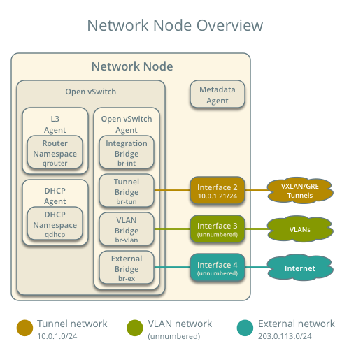
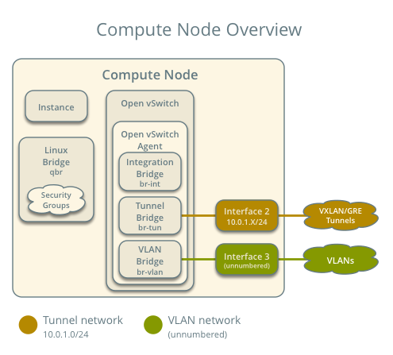
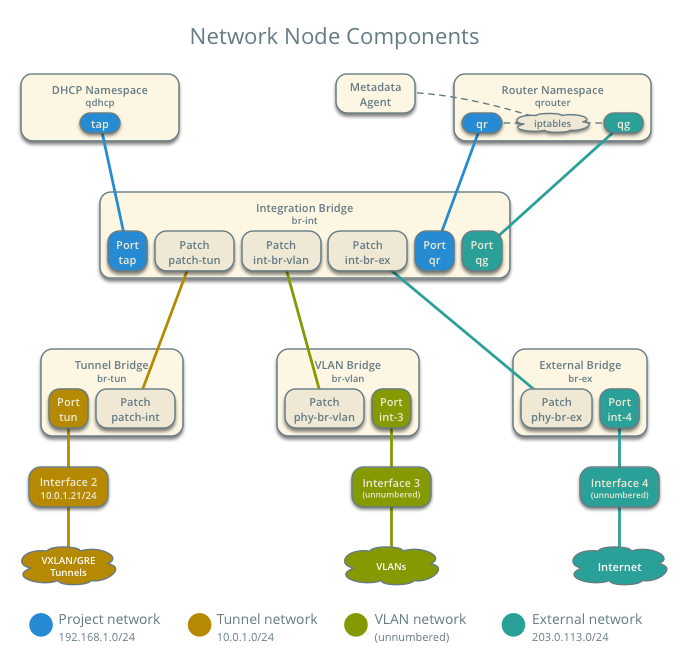
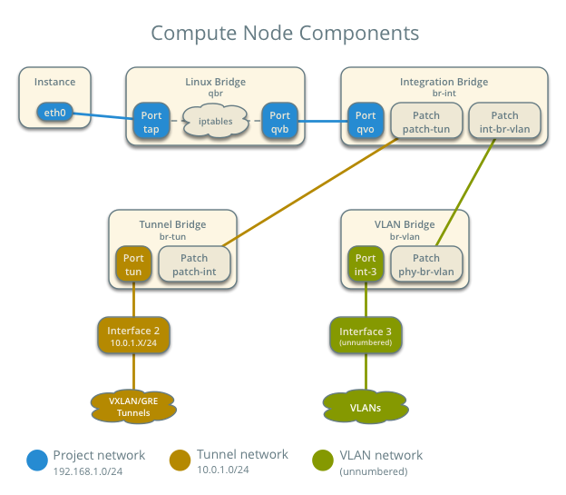
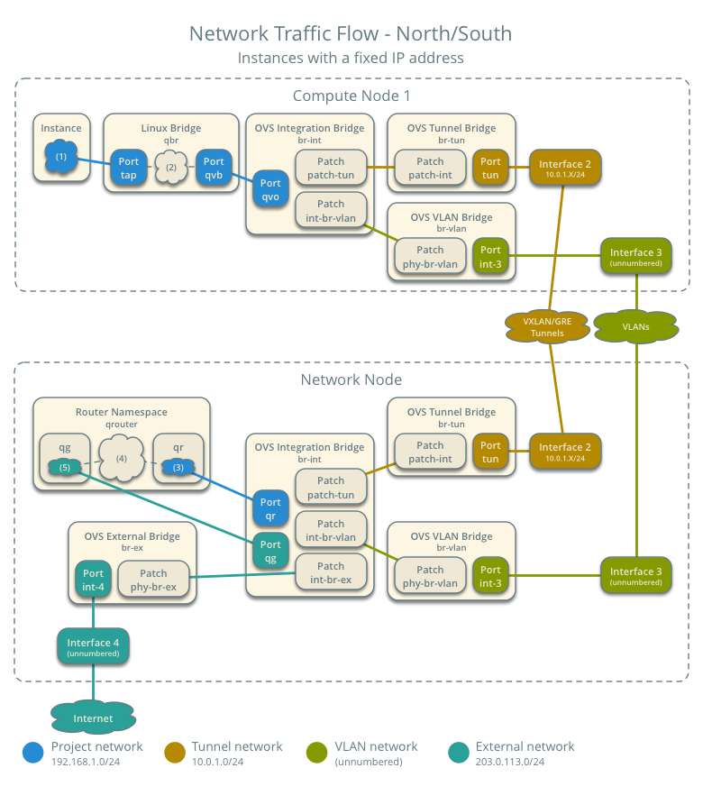
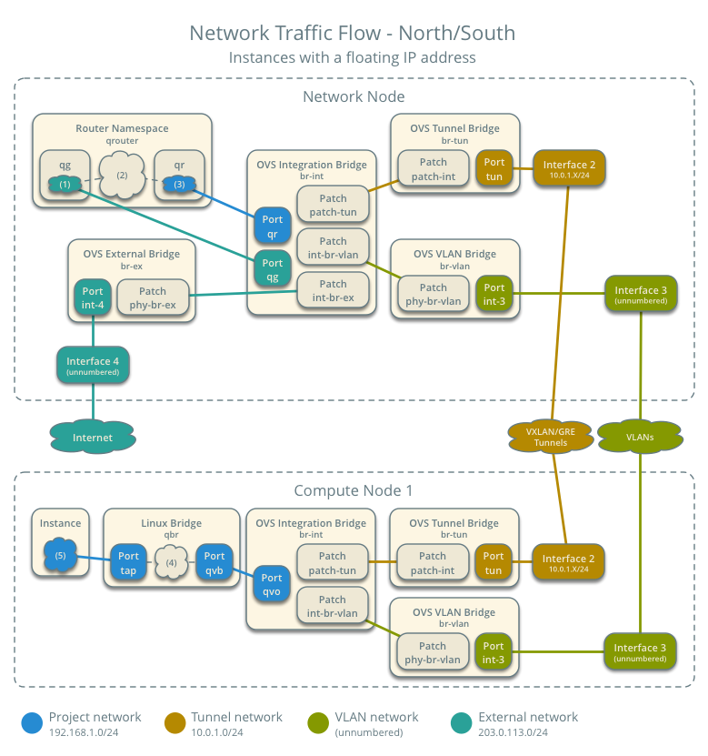
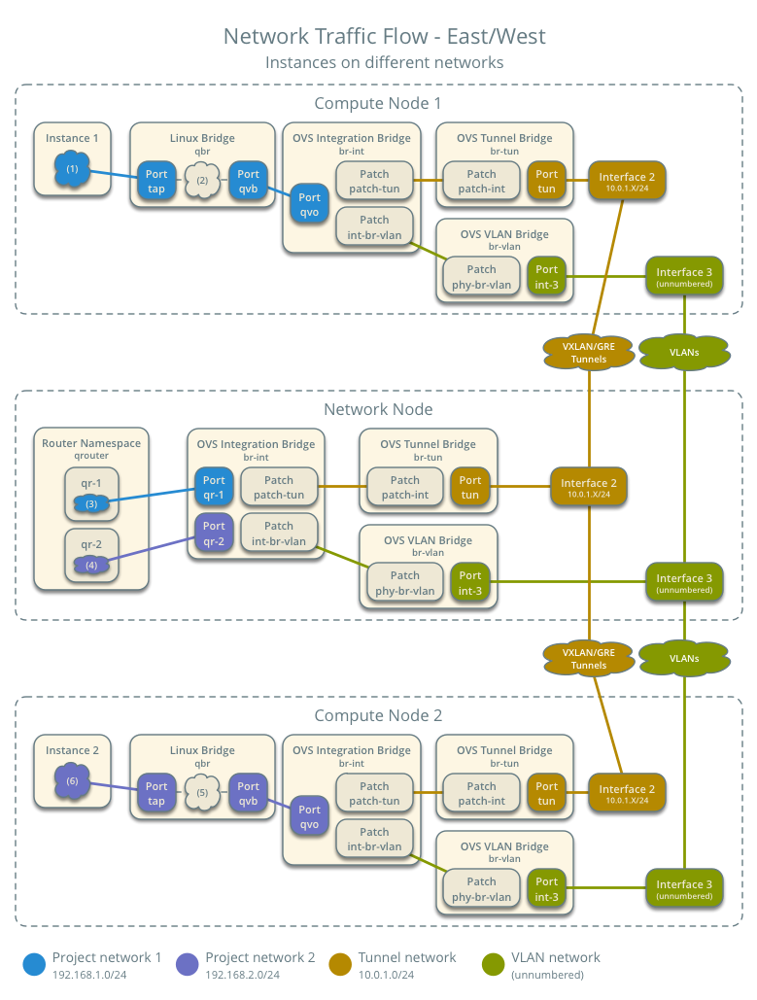

========================================================
Architecture 1a: Legacy implementation with Open vSwitch
========================================================

This architecture describes a legacy (basic) implementation of the
OpenStack Networking service using the ML2 plug-in with Open vSwitch.
The example configuration creates one flat external network and VXLAN
tenant networks. However, this configuration also supports VLAN
external networks, VLAN tenant networks, and GRE tenant networks.

To improve understanding of network traffic flow, the network and compute
nodes contain a separate network interface for tenant VLAN networks. In
production environments, tenant VLAN networks can use any Open vSwitch
bridge with access to a network interface. For example, the ``br-tun``
bridge.

Requirements
~~~~~~~~~~~~

#. One controller node with one network interface: management.

#. One network node with four network interfaces: management, tenant tunnel
   networks, tenant VLAN networks, and external (typically the Internet).
   The Open vSwitch bridge ``br-vlan`` must contain a port on the VLAN
   interface and Open vSwitch bridge ``br-ex`` must contain a port on the
   external interface.

#. At least one compute node with three network interfaces: management,
   tenant tunnel networks, and tenant VLAN networks. The Open vSwitch
   bridge ``br-vlan`` must contain a port on the VLAN interface.

.. image:: figures/scenario-legacy-hw.png
   :alt: Legacy Open vSwitch scenario - hardware requirements

.. image:: figures/scenario-legacy-networks.png
   :alt: Legacy Open vSwitch scenario - network layout

.. note::
    For VLAN external and tenant networks, the network infrastructure
    must support VLAN tagging. For best performance with VXLAN and GRE
    tenant networks, the network infrastructure should support jumbo frames.

.. warning::
    Proper operation of VXLAN requires kernel 3.13 or newer. In
    general, only Ubuntu 14.04, Fedora 20, and Fedora 21 meet or exceed this
    minimum version requirement when using packages rather than source.

Prerequisites
~~~~~~~~~~~~~

#. Controller node

   #. Operational SQL server with ``neutron`` database and appropriate
      configuration in the :file:`neutron-server.conf` file.

   #. Operational message queue service with appropriate configuration
      in the :file:`neutron-server.conf` file.

   #. Operational OpenStack Identity service with appropriate configuration
      in the :file:`neutron-server.conf` file.

   #. Operational OpenStack Compute controller/management service with
      appropriate configuration to use neutron in the
      :file:`nova.conf` file.

   #. Neutron server service, ML2 plug-in, and any dependencies.

#. Network node

   #. Operational OpenStack Identity service with appropriate configuration
      in the :file:`neutron-server.conf` file.

   #. Open vSwitch service, ML2 plug-in, Open vSwitch agent, L3 agent,
      DHCP agent, metadata agent, and any dependencies including the
      ``ipset`` utility.

#. Compute nodes

   #. Operational OpenStack Identity service with appropriate configuration
      in the :file:`neutron-server.conf` file.

   #. Operational OpenStack Compute controller/management service with
      appropriate configuration to use neutron in the :file:`nova.conf` file.

   #. Open vSwitch service, ML2 plug-in, Open vSwitch agent, and any
      dependencies including the ``ipset`` utility.

.. image:: figures/scenario-legacy-ovs-services.png
   :alt: Legacy Open vSwitch scenario - service layout

Architecture
~~~~~~~~~~~~

General
-------

The legacy architecture provides basic virtual networking components in
your environment. Routing among tenant and external networks resides
completely on the network node. Although more simple to deploy than
other architectures, performing all functions on the network node
creates a single point of failure and potential performance issues.
Consider deploying DVR or L3 HA architectures in production environments
to provide redundancy and increase performance.

.. image:: figures/scenario-legacy-general.png
   :alt: Legacy Open vSwitch scenario - architecture overview

The network node runs the Open vSwitch agent, L3 agent, DHCP agent, and
metadata agent.

The compute nodes run the Open vSwitch agent.

Components
----------

The network node contains the following components:

#. Open vSwitch agent managing virtual switches, connectivity among
   them, and interaction via virtual ports with other network components
   such as namespaces, Linux bridges, and underlying interfaces.

#. DHCP agent managing the ``qdhcp`` namespaces. The ``qdhcp`` namespaces
   provide DHCP services for instances using tenant networks.

#. L3 agent managing the ``qrouter`` namespaces. The ``qrouter`` namespaces
   provide routing between tenant and external networks and among tenant
   networks. They also route metadata traffic between instances and the
   metadata agent.

#. Metadata agent handling metadata operations. The metadata agent
   handles metadata operations for instances.

The compute nodes contain the following components:

#. Open vSwitch agent managing virtual switches, connectivity among
   them, and interaction via virtual ports with other network components
   such as namespaces, Linux bridges, and underlying interfaces.

#. Linux bridges handling security groups. Due to limitations with Open
   vSwitch and *iptables*, the Networking service uses a Linux bridge
   to manage security groups for instances.

Packet flow
~~~~~~~~~~~

Case 1: North-south for instances without a floating IP address
---------------------------------------------------------------

For instances without a floating IP address, the network node routes
*north-south* network traffic between tenant and external networks.

.. note::
    The term *north-south* generally defines network traffic that
    travels between tenant and external networks (typically the Internet).

Example environment configuration
^^^^^^^^^^^^^^^^^^^^^^^^^^^^^^^^^

Instance 1 resides on compute node 1 and uses tenant network 1.
The instance sends a packet to a host on the external network.

* External network 1

  * Network 203.0.113.0/24

  * Gateway 203.0.113.1 with MAC address *EG1*

  * Floating IP range 203.0.113.101 to 203.0.113.200

  * Tenant network 1 router interface 203.0.113.101 *TR1*

* Tenant network 1

  * Network 192.168.1.0/24

  * Gateway 192.168.1.1 with MAC address *TG1*

* Compute node 1

  * Instance 1 192.168.1.11 with MAC address *I1*

Packet flow
^^^^^^^^^^^

The following steps involve compute node 1.

#. The instance 1 ``tap`` interface (1) forwards the packet to the Linux
   bridge ``qbr``. The packet contains destination MAC address *TG1*
   because the destination resides on another network.

#. Security group rules (2) on the Linux bridge ``qbr`` handle state tracking
   for the packet.

#. The Linux bridge ``qbr`` forwards the packet to the Open vSwitch
   integration bridge ``br-int``.

#. The Open vSwitch integration bridge ``br-int`` adds the internal tag for
   tenant network 1.

#. For VLAN tenant networks:

   #. The Open vSwitch integration bridge ``br-int`` forwards the packet to
      the Open vSwitch VLAN bridge ``br-vlan``.

   #. The Open vSwitch VLAN bridge ``br-vlan`` replaces the internal tag
      with the actual VLAN tag of tenant network 1.

   #. The Open vSwitch VLAN bridge ``br-vlan`` forwards the packet to the
      network node via the VLAN interface.

#. For VXLAN and GRE tenant networks:

   #. The Open vSwitch integration bridge ``br-int`` forwards the packet to
      the Open vSwitch tunnel bridge ``br-tun``.

   #. The Open vSwitch tunnel bridge ``br-tun`` wraps the packet in a VXLAN
      or GRE tunnel and adds a tag to identify the tenant network 1.

   #. The Open vSwitch tunnel bridge ``br-tun`` forwards the packet to the
      network node via the tunnel interface.

The following steps involve the network node.

#. For VLAN tenant networks:

   #. The VLAN interface forwards the packet to the Open vSwitch VLAN
      bridge ``br-vlan``.

   #. The Open vSwitch VLAN bridge ``br-vlan`` forwards the packet to the
      Open vSwitch integration bridge ``br-int``.

   #. The Open vSwitch integration bridge ``br-int`` replaces the actual
      VLAN tag of tenant network 1 with the internal tag.

#. For VXLAN and GRE tenant networks:

   #. The tunnel interface forwards the packet to the Open vSwitch tunnel
      bridge ``br-tun``.

   #. The Open vSwitch tunnel bridge ``br-tun`` unwraps the packet and adds
      the internal tag for tenant network 1.

   #. The Open vSwitch tunnel bridge ``br-tun`` forwards the packet to the
      Open vSwitch integration bridge ``br-int``.

#. The Open vSwitch integration bridge ``br-int`` forwards the packet to
   the ``qr`` interface (3) in the router namespace ``qrouter``. The ``qr``
   interface contains the tenant network 1 gateway IP address *TG1*.

#. The *iptables* service (4) performs SNAT on the packet using the ``qg``
   interface (5) as the source IP address. The ``qg`` interface contains
   the tenant network 1 router interface IP address *TR1*.

#. For VLAN tenant networks:

   #. The router namespace ``qrouter`` forwards the packet to the Open vSwitch
      integration bridge ``br-int`` via the ``qg`` interface.

   #. The Open vSwitch integration bridge ``br-int`` forwards the packet to
      the Open vSwitch external bridge ``br-ex``.

#. For VXLAN and GRE tenant networks:

   #. The router namespace ``qrouter`` forwards the packet to the Open vSwitch
      external bridge ``br-ex`` via the ``qg`` interface.

#. The Open vSwitch external bridge ``br-ex`` forwards the packet to the
   external network via the external interface.

.. note::
    Return traffic follows similar steps in reverse.

Case 2: North-south for instances with a floating IP address
------------------------------------------------------------

For instances with a floating IP address, the network node routes
*north-south* network traffic between tenant and external networks.

Example environment configuration
^^^^^^^^^^^^^^^^^^^^^^^^^^^^^^^^^

Instance 1 resides on compute node 1 and uses tenant network 1.
The instance receives a packet from a host on the external network.

* External network 1

  * Network 203.0.113.0/24

  * Gateway 203.0.113.1 with MAC address *EG1*

  * Floating IP range 203.0.113.101 to 203.0.113.200

  * Tenant network 1 router interface 203.0.113.101 *TR1*

* Tenant network 1

  * Network 192.168.1.0/24

  * Gateway 192.168.1.1 with MAC address *TG1*

* Compute node 1

  * Instance 1 192.168.1.11 with MAC address *I1* and floating
    IP address 203.0.113.102 *F1*

Packet flow
^^^^^^^^^^^

The following steps involve the network node.

#. The external interface forwards the packet to the Open vSwitch external
   bridge ``br-ex``.

#. For VLAN tenant networks:

   #. The Open vSwitch external bridge ``br-ex`` forwards the packet to the
      Open vSwitch integration bridge ``br-int``.

   #. The Open vSwitch integration bridge forwards the packet to the ``qg``
      interface (1) in the router namespace ``qrouter``. The ``qg`` interface
      contains the instance 1 floating IP address *F1*.

#. For VXLAN and GRE tenant networks:

   #. The Open vSwitch external bridge ``br-ex`` forwards the packet to the
      ``qg`` interface (1) in the router namespace ``qrouter``.

#. The *iptables* service (2) performs DNAT on the packet using the ``qr``
   interface (3) as the source IP address. The ``qr`` interface contains
   the tenant network 1 router interface IP address *TR1*.

#. The router namespace ``qrouter`` forwards the packet to the Open vSwitch
   integration bridge ``br-int``.

#. The Open vSwitch integration bridge ``br-int`` adds the internal tag for
   tenant network 1.

#. For VLAN tenant networks:

   #. The Open vSwitch integration bridge ``br-int`` forwards the packet to
      the Open vSwitch VLAN bridge ``br-vlan``.

   #. The Open vSwitch VLAN bridge ``br-vlan`` replaces the internal tag
      with the actual VLAN tag of tenant network 1.

   #. The Open vSwitch VLAN bridge ``br-vlan`` forwards the packet to the
      compute node via the VLAN interface.

#. For VXLAN and GRE networks:

   #. The Open vSwitch integration bridge ``br-int`` forwards the packet to
      the Open vSwitch tunnel bridge ``br-tun``.

   #. The Open vSwitch tunnel bridge ``br-tun`` wraps the packet in a VXLAN
      or GRE tunnel and adds a tag to identify tenant network 1.

   #. The Open vSwitch tunnel bridge ``br-tun`` forwards the packet to the
      compute node via the tunnel interface.

The following steps involve compute node 1.

#. For VLAN tenant networks:

   #. The VLAN interface forwards the packet to the Open vSwitch VLAN
      bridge ``br-vlan``.

   #. The Open vSwitch VLAN bridge ``br-vlan`` forwards the packet to the
      Open vSwitch integration bridge ``br-int``.

   #. The Open vSwitch integration bridge ``br-int`` replaces the actual
      VLAN tag tenant network 1 with the internal tag.

#. For VXLAN and GRE tenant networks:

   #. The tunnel interface forwards the packet to the Open vSwitch tunnel
      bridge ``br-tun``.

   #. The Open vSwitch tunnel bridge ``br-tun`` unwraps the packet and adds
      the internal tag for tenant network 1.

   #. The Open vSwitch tunnel bridge ``br-tun`` forwards the packet to the
      Open vSwitch integration bridge ``br-int``.

#. The Open vSwitch integration bridge ``br-int`` forwards the packet to
   the Linux bridge ``qbr``.

#. Security group rules (4) on the Linux bridge ``qbr`` handle firewalling
   and state tracking for the packet.

#. The Linux bridge ``qbr`` forwards the packet to the ``tap`` interface (5)
   on instance 1.

.. note::
    Return traffic follows similar steps in reverse.

Case 3: East-west for instances with or without a floating IP address
---------------------------------------------------------------------

For instances with or without a floating IP address, the network node
routes *east-west* network traffic among tenant networks using the
same router.

.. note::
    The term *east-west* generally defines network traffic that
    travels within a tenant network or between tenant networks.

Example environment configuration
^^^^^^^^^^^^^^^^^^^^^^^^^^^^^^^^^

Instance 1 resides on compute node 1 and uses tenant network 1. Instance
2 resides on compute node 2 and uses tenant network 2. Both tenant networks
reside on the same router. Instance 1 sends a packet to instance 2.

* Tenant network 1

  * Network: 192.168.1.0/24

  * Gateway: 192.168.1.1 with MAC address *TG1*

* Tenant network 2

  * Network: 192.168.2.0/24

  * Gateway: 192.168.2.1 with MAC address *TG2*

* Compute node 1

  * Instance 1: 192.168.1.11 with MAC address *I1*

* Compute node 2

  * Instance 2: 192.168.2.11 with MAC address *I2*

Packet flow
^^^^^^^^^^^

The following steps involve compute node 1:

#. The instance 1 ``tap`` interface (1) forwards the packet to the Linux
   bridge ``qbr``. The packet contains destination MAC address *TG1*
   because the destination resides on another network.

#. Security group rules (2) on the Linux bridge ``qbr`` handle state tracking
   for the packet.

#. The Linux bridge ``qbr`` forwards the packet to the Open vSwitch
   integration bridge ``br-int``.

#. The Open vSwitch integration bridge ``br-int`` adds the internal tag for
   tenant network 1.

#. For VLAN tenant networks:

   #. The Open vSwitch integration bridge ``br-int`` forwards the packet to
      the Open vSwitch VLAN bridge ``br-vlan``.

   #. The Open vSwitch VLAN bridge ``br-vlan`` replaces the internal tag
      with the actual VLAN tag of tenant network 1.

   #. The Open vSwitch VLAN bridge ``br-vlan`` forwards the packet to the
      network node via the VLAN interface.

#. For VXLAN and GRE tenant networks:

   #. The Open vSwitch integration bridge ``br-int`` forwards the packet to
      the Open vSwitch tunnel bridge ``br-tun``.

   #. The Open vSwitch tunnel bridge ``br-tun`` wraps the packet in a VXLAN
      or GRE tunnel and adds a tag to identify tenant network 1.

   #. The Open vSwitch tunnel bridge ``br-tun`` forwards the packet to the
      network node via the tunnel interface.

The following steps involve the network node.

#. For VLAN tenant networks:

   #. The VLAN interface forwards the packet to the Open vSwitch VLAN
      bridge ``br-vlan``.

   #. The Open vSwitch VLAN bridge ``br-vlan`` forwards the packet to the
      Open vSwitch integration bridge ``br-int``.

   #. The Open vSwitch integration bridge ``br-int`` replaces the actual
      VLAN tag of tenant network 1 with the internal tag.

#. For VXLAN and GRE tenant networks:

   #. The tunnel interface forwards the packet to the Open vSwitch tunnel
      bridge ``br-tun``.

   #. The Open vSwitch tunnel bridge ``br-tun`` unwraps the packet and adds
      the internal tag for tenant network 1.

   #. The Open vSwitch tunnel bridge ``br-tun`` forwards the packet to the
      Open vSwitch integration bridge ``br-int``.

#. The Open vSwitch integration bridge ``br-int`` forwards the packet to
   the ``qr-1`` interface (3) in the router namespace ``qrouter``. The ``qr-1``
   interface contains the tenant network 1 gateway IP address *TG1*.

#. The router namespace ``qrouter`` routes the packet to the ``qr-2`` interface
   (4). The ``qr-2`` interface contains the tenant network 2 gateway IP
   address *TG2*.

#. The router namespace ``qrouter`` forwards the packet to the Open vSwitch
   integration bridge ``br-int``.

#. The Open vSwitch integration bridge ``br-int`` adds the internal tag for
   tenant network 2.

#. For VLAN tenant networks:

   #. The Open vSwitch integration bridge ``br-int`` forwards the packet to
      the Open vSwitch VLAN bridge ``br-vlan``.

   #. The Open vSwitch VLAN bridge ``br-vlan`` replaces the internal tag
      with the actual VLAN tag of tenant network 2.

   #. The Open vSwitch VLAN bridge ``br-vlan`` forwards the packet to compute
      node 2 via the VLAN interface.

#. For VXLAN and GRE networks:

   #. The Open vSwitch integration bridge ``br-int`` forwards the packet to
      the Open vSwitch tunnel bridge ``br-tun``.

   #. The Open vSwitch tunnel bridge ``br-tun`` wraps the packet in a VXLAN
      or GRE tunnel and adds a tag to identify tenant network 2.

   #. The Open vSwitch tunnel bridge ``br-tun`` forwards the packet to
      compute node 2 via the tunnel interface.

The following steps involve compute node 2:

#. For VLAN tenant networks:

   #. The VLAN interface forwards the packet to the Open vSwitch VLAN
      bridge ``br-vlan``.

   #. The Open vSwitch VLAN bridge ``br-vlan`` forwards the packet to the
      Open vSwitch integration bridge ``br-int``.

   #. The Open vSwitch integration bridge ``br-int`` replaces the actual
      VLAN tag of tenant network 2 with the internal tag.

#. For VXLAN and GRE tenant networks:

   #. The tunnel interface forwards the packet to the Open vSwitch tunnel
      bridge ``br-tun``.

   #. The Open vSwitch tunnel bridge ``br-tun`` unwraps the packet and adds
      the internal tag for tenant network 2.

   #. The Open vSwitch tunnel bridge ``br-tun`` forwards the packet to the
      Open vSwitch integration bridge ``br-int``.

#. The Open vSwitch integration bridge ``br-int`` forwards the packet to
   the Linux bridge ``qbr``.

#. Security group rules (5) on the Linux bridge ``qbr`` handle firewalling
   and state tracking for the packet.

#. The Linux bridge ``qbr`` forwards the packet to the ``tap`` interface (6)
   on instance 2.

.. note::
    Return traffic follows similar steps in reverse.

Configuration
~~~~~~~~~~~~~

Controller node (controller)
----------------------------

The controller node provides the neutron API and manages services on the
other nodes.

#. Configure base options.

   Edit the :file:`/etc/neutron/neutron.conf` file.

   ::

      [DEFAULT]
      verbose = True
      core_plugin = ml2
      service_plugins = router
      allow_overlapping_ips = True

      notify_nova_on_port_status_changes = True
      notify_nova_on_port_data_changes = True
      nova_url = http://controller:8774/v2
      nova_region_name = regionOne
      nova_admin_username = NOVA_ADMIN_USERNAME
      nova_admin_tenant_id = NOVA_ADMIN_TENANT_ID
      nova_admin_password =  NOVA_ADMIN_PASSWORD
      nova_admin_auth_url = http://controller:35357/v2.0

   .. note::
      Replace NOVA_ADMIN_USERNAME, NOVA_ADMIN_TENANT_ID, and
      NOVA_ADMIN_PASSWORD with suitable values for your environment.

#. Configure the ML2 plug-in.

   Edit the :file:`/etc/neutron/plugins/ml2/ml2_conf.ini` file.

   ::

      [ml2]
      type_drivers = flat,vlan,gre,vxlan
      tenant_network_types = vlan,vxlan,gre
      mechanism_drivers = openvswitch,l2population

      [ml2_type_vlan]
      network_vlan_ranges = vlan:1:1000

      [ml2_type_gre]
      tunnel_id_ranges = 1:1000

      [ml2_type_vxlan]
      vni_ranges = 1:1000
      vxlan_group = 239.1.1.1

      [securitygroup]
      enable_security_group = True
      enable_ipset = True
      firewall_driver = neutron.agent.linux.iptables_firewall.OVSHybridIptablesFirewallDriver

   .. note::
      The first value in the ``tenant_network_types`` option becomes the
      default tenant network type when a non-privileged user creates a network.

   .. note::
      Adjust the VLAN tag, GRE tunnel ID, and VXLAN tunnel ID ranges for
      your environment.

#. Start the following services:

   * Server

Network node (network1)
-----------------------

The network node provides DHCP and NAT services to all instances.

#. Configure base options.

   Edit the :file:`/etc/neutron/neutron.conf` file.

   ::

      [DEFAULT]
      verbose = True
      core_plugin = ml2
      service_plugins = router
      allow_overlapping_ips = True

#. Configure the ML2 plug-in.

   Edit the :file:`/etc/neutron/plugins/ml2/ml2_conf.ini` file.

   ::

      [ml2]
      type_drivers = flat,vlan,gre,vxlan
      tenant_network_types = vlan,vxlan,gre
      mechanism_drivers = openvswitch,l2population

      [ml2_type_flat]
      flat_networks = external

      [ml2_type_vlan]
      network_vlan_ranges = vlan:1:1000

      [ml2_type_gre]
      tunnel_id_ranges = 1:1000

      [ml2_type_vxlan]
      vni_ranges = 1:1000
      vxlan_group = 239.1.1.1

      [securitygroup]
      enable_security_group = True
      enable_ipset = True
      firewall_driver = neutron.agent.linux.iptables_firewall.OVSHybridIptablesFirewallDriver

      [ovs]
      local_ip = TENANT_TUNNEL_INTERFACE_IP_ADDRESS
      enable_tunneling = True
      bridge_mappings = vlan:br-vlan,external:br-ex

      [agent]
      l2population = True
      tunnel_types = gre,vxlan

   .. note::
      The first value in the ``tenant_network_types`` option becomes the
      default tenant network type when a non-privileged user creates a network.

   .. note::
      Adjust the VLAN tag, GRE tunnel ID, and VXLAN tunnel ID ranges for
      your environment.

   .. note::
      Replace TENANT_TUNNEL_INTERFACE_IP_ADDRESS with the IP address
      of the tenant tunnel network interface.

#. Configure the L3 agent.

   Edit the :file:`/etc/neutron/l3_agent.ini` file.

   ::

      [DEFAULT]
      verbose = True
      interface_driver = neutron.agent.linux.interface.OVSInterfaceDriver
      use_namespaces = True
      external_network_bridge =
      router_delete_namespaces = True

   .. note::
        The ``external_network_bridge`` option intentionally contains
        no value.

#. Configure the DHCP agent.

   #. Edit the :file:`/etc/neutron/dhcp_agent.ini` file.

      ::

         [DEFAULT]
         verbose = True
         interface_driver = neutron.agent.linux.interface.OVSInterfaceDriver
         dhcp_driver = neutron.agent.linux.dhcp.Dnsmasq
         use_namespaces = True
         dhcp_delete_namespaces = True

   #. (Optional) Reduce MTU for VXLAN/GRE tenant networks.

      #. Edit the :file:`/etc/neutron/dhcp_agent.ini` file.

         ::

            [DEFAULT]
            dnsmasq_config_file = /etc/neutron/dnsmasq-neutron.conf

      #. Edit the :file:`/etc/neutron/dnsmasq-neutron.conf` file.

         ::

            dhcp-option-force=26,1450

#. Configure the metadata agent.

   Edit the :file:`/etc/neutron/metadata_agent.ini` file.

   ::

      [DEFAULT]
      verbose = True
      auth_url = http://controller:5000/v2.0
      auth_region = regionOne
      admin_tenant_name = ADMIN_TENANT_NAME
      admin_user = ADMIN_USER
      admin_password = ADMIN_PASSWORD
      nova_metadata_ip = controller
      metadata_proxy_shared_secret = METADATA_SECRET

   .. note::
      Replace ADMIN_TENANT_NAME, ADMIN_USER, ADMIN_PASSWORD, and
      METADATA_SECRET with suitable values for your environment.

#. Start the following services:

   * Open vSwitch
   * Open vSwitch agent
   * L3 agent
   * DHCP agent
   * Metadata agent

Compute nodes (compute1 and compute2)
-------------------------------------

The compute nodes provide switching services and handle security groups
for instances.

#. Configure base options.

   Edit the :file:`/etc/neutron/neutron.conf` file.

   ::

      [DEFAULT]
      verbose = True
      core_plugin = ml2
      service_plugins = router
      allow_overlapping_ips = True

#. Configure the ML2 plug-in.

   Edit the :file:`/etc/neutron/plugins/ml2/ml2_conf.ini` file.

   ::

      [ml2]
      type_drivers = flat,vlan,gre,vxlan
      tenant_network_types = vlan,gre,vxlan
      mechanism_drivers = openvswitch,l2population

      [ml2_type_vlan]
      network_vlan_ranges = vlan:1:1000

      [ml2_type_gre]
      tunnel_id_ranges = 1:1000

      [ml2_type_vxlan]
      vni_ranges = 1:1000
      vxlan_group = 239.1.1.1

      [securitygroup]
      enable_security_group = True
      enable_ipset = True
      firewall_driver = neutron.agent.linux.iptables_firewall.OVSHybridIptablesFirewallDriver

      [ovs]
      local_ip = TENANT_TUNNEL_INTERFACE_IP_ADDRESS
      enable_tunneling = True
      bridge_mappings = vlan:br-vlan

      [agent]
      l2population = True
      tunnel_types = gre,vxlan

   .. note::
      The first value in the ``tenant_network_types`` option becomes the
      default tenant network type when a non-privileged user creates a network.

   .. note::
      Adjust the VLAN tag, GRE tunnel ID, and VXLAN tunnel ID ranges for
      your environment.

   .. note::
      Replace TENANT_TUNNEL_INTERFACE_IP_ADDRESS with the IP address
      of the tenant tunnel network interface.

#. Start the following services:

   * Open vSwitch
   * Open vSwitch agent

Verify service operation
------------------------

#. Source the administrative tenant credentials.

#. Verify presence and operation of the agents.

   ::

      $ neutron agent-list
      +--------------------------------------+--------------------+----------+-------+----------------+---------------------------+
      | id                                   | agent_type         | host     | alive | admin_state_up | binary                    |
      +--------------------------------------+--------------------+----------+-------+----------------+---------------------------+
      | 1eaf6079-41c8-4b5b-876f-73b02753ff57 | Open vSwitch agent | compute1 | :-)   | True           | neutron-openvswitch-agent |
      | 511c27b3-8317-4e27-8a0f-b158e4fb8368 | Metadata agent     | network1 | :-)   | True           | neutron-metadata-agent    |
      | 7eae11ef-8157-4fd4-a352-bc841cf709f6 | Open vSwitch agent | network1 | :-)   | True           | neutron-openvswitch-agent |
      | a9110ce6-22cc-4f78-9b2e-57f83aac68a3 | Open vSwitch agent | compute2 | :-)   | True           | neutron-openvswitch-agent |
      | c41f3200-8eda-43ab-8135-573e826776d9 | DHCP agent         | network1 | :-)   | True           | neutron-dhcp-agent        |
      | f897648e-7623-486c-8043-1b219eb2895a | L3 agent           | network1 | :-)   | True           | neutron-l3-agent          |
      +--------------------------------------+--------------------+----------+-------+----------------+---------------------------+

Create initial networks
~~~~~~~~~~~~~~~~~~~~~~~

External (flat) network
-----------------------

#. Source the administrative tenant credentials.

#. Create the external network.

   ::

      $ neutron net-create ext-net --router:external True \
      --provider:physical_network external --provider:network_type flat
      Created a new network:
      +---------------------------+--------------------------------------+
      | Field                     | Value                                |
      +---------------------------+--------------------------------------+
      | admin_state_up            | True                                 |
      | id                        | e5f9be2f-3332-4f2d-9f4d-7f87a5a7692e |
      | name                      | ext-net                              |
      | provider:network_type     | flat                                 |
      | provider:physical_network | external                             |
      | provider:segmentation_id  |                                      |
      | router:external           | True                                 |
      | shared                    | False                                |
      | status                    | ACTIVE                               |
      | subnets                   |                                      |
      | tenant_id                 | 96393622940e47728b6dcdb2ef405f50     |
      +---------------------------+--------------------------------------+

#. Create a subnet on the external network.

   ::

      $ neutron subnet-create ext-net --name ext-subnet --allocation-pool \
      start=203.0.113.101,end=203.0.113.200 --disable-dhcp \
      --gateway 203.0.113.1 203.0.113.0/24
      Created a new subnet:
      +-------------------+----------------------------------------------------+
      | Field             | Value                                              |
      +-------------------+----------------------------------------------------+
      | allocation_pools  | {"start": "203.0.113.101", "end": "203.0.113.200"} |
      | cidr              | 203.0.113.0/24                                     |
      | dns_nameservers   |                                                    |
      | enable_dhcp       | False                                              |
      | gateway_ip        | 203.0.113.1                                        |
      | host_routes       |                                                    |
      | id                | cd9c15a1-0a66-4bbe-b1b4-4b7edd936f7a               |
      | ip_version        | 4                                                  |
      | ipv6_address_mode |                                                    |
      | ipv6_ra_mode      |                                                    |
      | name              | ext-subnet                                         |
      | network_id        | e5f9be2f-3332-4f2d-9f4d-7f87a5a7692e               |
      | tenant_id         | 96393622940e47728b6dcdb2ef405f50                   |
      +-------------------+----------------------------------------------------+

Tenant (VXLAN) network
----------------------

.. note::
    The example configuration contains ``vlan`` as the first tenant network
    type. Only a privileged user can create other types of networks such as
    VXLAN or GRE. The following commands use the ``admin`` tenant credentials to
    create a VXLAN tenant network.

#. Obtain the ``demo`` tenant ID.

   ::

      $ keystone tenant-get demo
      +-------------+----------------------------------+
      |   Property  |              Value               |
      +-------------+----------------------------------+
      | description |           Demo Tenant            |
      |   enabled   |               True               |
      |      id     | 443cd1596b2e46d49965750771ebbfe1 |
      |     name    |               demo               |
      +-------------+----------------------------------+

#. Create the tenant network.

   ::

      $ neutron net-create demo-net --tenant-id 443cd1596b2e46d49965750771ebbfe1 --provider:network_type vxlan
      Created a new network:
      +---------------------------+--------------------------------------+
      | Field                     | Value                                |
      +---------------------------+--------------------------------------+
      | admin_state_up            | True                                 |
      | id                        | 6e9c5324-68d1-47a8-98d5-8268db955475 |
      | name                      | demo-net                             |
      | provider:network_type     | vxlan                                |
      | provider:physical_network |                                      |
      | provider:segmentation_id  | 1                                    |
      | router:external           | False                                |
      | shared                    | False                                |
      | status                    | ACTIVE                               |
      | subnets                   |                                      |
      | tenant_id                 | 443cd1596b2e46d49965750771ebbfe1     |
      +---------------------------+--------------------------------------+

   .. note::
      The example configuration contains ``vlan`` as the first tenant network
      type. Only a privileged user can create a VXLAN or GRE networks, so this
      command uses the ``admin`` tenant credentials to create the tenant network.

#. Source the regular tenant credentials.

#. Create a subnet on the tenant network.

   ::

      $ neutron subnet-create demo-net --name demo-subnet --gateway 192.168.1.1 192.168.1.0/24
      Created a new subnet:
      +-------------------+--------------------------------------------------+
      | Field             | Value                                            |
      +-------------------+--------------------------------------------------+
      | allocation_pools  | {"start": "192.168.1.2", "end": "192.168.1.254"} |
      | cidr              | 192.168.1.0/24                                   |
      | dns_nameservers   |                                                  |
      | enable_dhcp       | True                                             |
      | gateway_ip        | 192.168.1.1                                      |
      | host_routes       |                                                  |
      | id                | c7b42e58-a2f4-4d63-b199-d266504c03c9             |
      | ip_version        | 4                                                |
      | ipv6_address_mode |                                                  |
      | ipv6_ra_mode      |                                                  |
      | name              | demo-subnet                                      |
      | network_id        | 6e9c5324-68d1-47a8-98d5-8268db955475             |
      | tenant_id         | 443cd1596b2e46d49965750771ebbfe1                 |
      +-------------------+--------------------------------------------------+

#. Create a tenant network router.

   ::

      $ neutron router-create demo-router
      Created a new router:
      +-----------------------+--------------------------------------+
      | Field                 | Value                                |
      +-----------------------+--------------------------------------+
      | admin_state_up        | True                                 |
      | external_gateway_info |                                      |
      | id                    | 474a5b1f-d64c-4db9-b3b2-8ae9bb1b5970 |
      | name                  | demo-router                          |
      | routes                |                                      |
      | status                | ACTIVE                               |
      | tenant_id             | 443cd1596b2e46d49965750771ebbfe1     |
      +-----------------------+--------------------------------------+

#. Add a tenant subnet interface on the router.

   ::

      $ neutron router-interface-add demo-router demo-subnet
      Added interface 0fa57069-29fd-4795-87b7-c123829137e9 to router demo-router.

#. Add a gateway to the external network on the router.

   ::

      $ neutron router-gateway-set demo-router ext-net
      Set gateway for router demo-router

Verify operation
~~~~~~~~~~~~~~~~

#. On the network node, verify creation of the ``qrouter`` and ``qdhcp``
   namespaces. The ``qdhcp`` namespace might not exist until launching
   an instance.

   ::

      # ip netns
      qrouter-4d7928a0-4a3c-4b99-b01b-97da2f97e279
      qdhcp-353f5937-a2d3-41ba-8225-fa1af2538141

#. On the controller node, ping the tenant router gateway IP address,
   typically the lowest IP address in the external network subnet
   allocation range.

   ::

      # ping -c 4 203.0.113.101
      PING 203.0.113.101 (203.0.113.101) 56(84) bytes of data.
      64 bytes from 203.0.113.101: icmp_req=1 ttl=64 time=0.619 ms
      64 bytes from 203.0.113.101: icmp_req=2 ttl=64 time=0.189 ms
      64 bytes from 203.0.113.101: icmp_req=3 ttl=64 time=0.165 ms
      64 bytes from 203.0.113.101: icmp_req=4 ttl=64 time=0.216 ms

      --- 203.0.113.101 ping statistics ---
      4 packets transmitted, 4 received, 0% packet loss, time 2999ms
      rtt min/avg/max/mdev = 0.165/0.297/0.619/0.187 ms

#. Source the regular tenant credentials.

#. Launch an instance with an interface on the tenant network.

#. Obtain console access to the instance.

   #. Test connectivity to the tenant network router.

      ::

         $ ping -c 4 192.168.1.1
         PING 192.168.1.1 (192.168.1.1) 56(84) bytes of data.
         64 bytes from 192.168.1.1: icmp_req=1 ttl=64 time=0.357 ms
         64 bytes from 192.168.1.1: icmp_req=2 ttl=64 time=0.473 ms
         64 bytes from 192.168.1.1: icmp_req=3 ttl=64 time=0.504 ms
         64 bytes from 192.168.1.1: icmp_req=4 ttl=64 time=0.470 ms

         --- 192.168.1.1 ping statistics ---
         4 packets transmitted, 4 received, 0% packet loss, time 2998ms
        rtt min/avg/max/mdev = 0.357/0.451/0.504/0.055 ms

   #. Test connectivity to the Internet.

      ::

         $ ping -c 4 openstack.org
         PING openstack.org (174.143.194.225) 56(84) bytes of data.
         64 bytes from 174.143.194.225: icmp_req=1 ttl=53 time=17.4 ms
         64 bytes from 174.143.194.225: icmp_req=2 ttl=53 time=17.5 ms
         64 bytes from 174.143.194.225: icmp_req=3 ttl=53 time=17.7 ms
         64 bytes from 174.143.194.225: icmp_req=4 ttl=53 time=17.5 ms

         --- openstack.org ping statistics ---
         4 packets transmitted, 4 received, 0% packet loss, time 3003ms
         rtt min/avg/max/mdev = 17.431/17.575/17.734/0.143 ms

#. Create the appropriate security group rules to allow ping and SSH access
   to the instance.

#. Create a floating IP address.

   ::

      $ neutron floatingip-create ext-net
      +---------------------+--------------------------------------+
      | Field               | Value                                |
      +---------------------+--------------------------------------+
      | fixed_ip_address    |                                      |
      | floating_ip_address | 203.0.113.102                        |
      | floating_network_id | e5f9be2f-3332-4f2d-9f4d-7f87a5a7692e |
      | id                  | 77cf2a36-6c90-4941-8e62-d48a585de050 |
      | port_id             |                                      |
      | router_id           |                                      |
      | status              | DOWN                                 |
      | tenant_id           | 443cd1596b2e46d49965750771ebbfe1     |
      +---------------------+--------------------------------------+

#. Associate the floating IP address with the instance.

   ::

      $ nova floating-ip-associate demo-instance1 203.0.113.102

#. On the controller node, ping the floating IP address associated with
   the instance.

   ::

      $ ping -c 4 203.0.113.102
      PING 203.0.113.102 (203.0.113.112) 56(84) bytes of data.
      64 bytes from 203.0.113.102: icmp_req=1 ttl=63 time=3.18 ms
      64 bytes from 203.0.113.102: icmp_req=2 ttl=63 time=0.981 ms
      64 bytes from 203.0.113.102: icmp_req=3 ttl=63 time=1.06 ms
      64 bytes from 203.0.113.102: icmp_req=4 ttl=63 time=0.929 ms

      --- 203.0.113.102 ping statistics ---
      4 packets transmitted, 4 received, 0% packet loss, time 3002ms
      rtt min/avg/max/mdev = 0.929/1.539/3.183/0.951 ms

