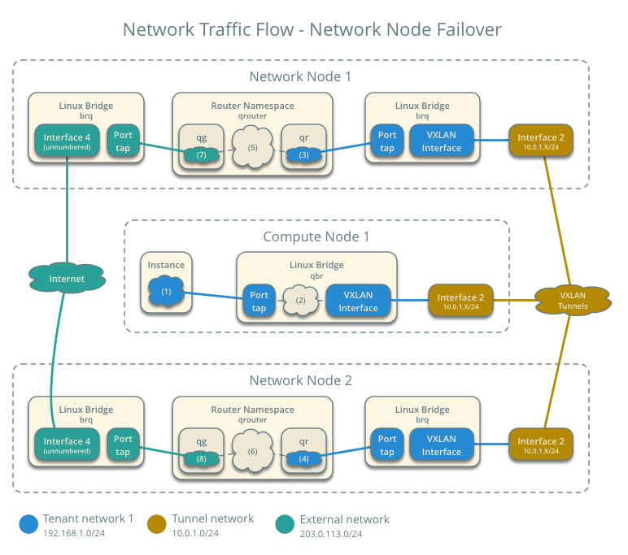

===========================================================
Scenario 3b: High Availability using L3HA with Linux bridge
===========================================================

This scenario describes a high-availability (HA) implementation of the
OpenStack Networking service using the ML2 plug-in with HA routers
(L3HA) and Linux bridge.

The L3HA architecture augments the legacy architecture by providing
quick migration of virtual routers among network nodes using virtual
router redundancy protocol (VRRP) with state tracking. However, instances
still rely on network nodes for routing and DNAT/SNAT services.

In the Juno (initial) and Kilo releases, L3HA with Linux bridge supports VLAN
and VXLAN project networks. However, due to a bug, VXLAN project networks
must use multicast instead of the layer-2 population mechanism. Also, you
cannot combine L3HA with distributed virtual routing (DVR).

Prerequisites
~~~~~~~~~~~~~

These prerequisites define the minimum physical infrastructure and OpenStack
service dependencies that you need to deploy this scenario. For example, the
Networking service immediately depends on the Identity service and the Compute
service immediately depends on the Networking service. These dependencies lack
services such as the Image service because the Networking service does not
immediately depend on it. However, the Compute service depends on the Image
service to launch an instance.

Infrastructure
--------------

#. One controller node with one network interface: management.

#. At least two network nodes with four network interfaces: management,
   project tunnel networks, project VLAN networks, and external (typically
   the Internet).

#. At least two compute nodes with three network interfaces: management,
   project tunnel networks, and project VLAN networks.

.. image:: figures/scenario-l3ha-hw.png
   :alt: Hardware layout

.. image:: figures/scenario-l3ha-networks.png
   :alt: Network layout

.. image:: figures/scenario-l3ha-lb-services.png
   :alt: Service layout

.. warning::
   Proper operation of VXLAN requires kernel 3.13 or newer.

OpenStack services - controller node
------------------------------------

#. Operational SQL server with ``neutron`` database and appropriate
   configuration in the :file:`neutron-server.conf` file.

#. Operational message queue service with appropriate configuration
   in the :file:`neutron-server.conf` file.

#. Operational OpenStack Identity service with appropriate configuration
   in the :file:`neutron-server.conf` file.

#. Operational OpenStack Compute controller/management service with
   appropriate configuration to use neutron in the :file:`nova.conf` file.

#. Neutron server service, ML2 plug-in, and any dependencies.

OpenStack services - network node
---------------------------------

#. Operational OpenStack Identity service with appropriate configuration
   in the :file:`neutron-server.conf` file.

#. ML2 plug-in, Linux bridge agent, L3 agent, DHCP agent, metadata agent,
   and any dependencies.

OpenStack services - compute nodes
----------------------------------

#. Operational OpenStack Identity service with appropriate configuration
   in the :file:`neutron-server.conf` file.

#. Operational OpenStack Compute hypervisor service with appropriate
   configuration to use neutron in the :file:`nova.conf` file.

#. ML2 plug-in, Linux bridge agent, and any dependencies.

Architecture
~~~~~~~~~~~~

The general HA architecture augments the legacy architecture by
creating additional 'qrouter' namespaces for each router created.
An "HA" network is created which connects each qrouter namespace.
A keepalived process is created within each namespace. The keepalived
process communicates with one namespace router selected as the master
and uses the gateway IP as a VIP in the master namespace.

If the service detects a failure, it elects a new master and moves the VIPs
into the new master namespace.

.. image:: figures/scenario-l3ha-general.png
   :alt: Architecture overview

The network nodes contain the following components:

#. Linux bridge agent managing virtual switches, connectivity among
   them, and interaction via virtual ports with other network components
   such as namespaces and underlying interfaces.

#. DHCP agent managing the ``qdhcp`` namespaces.

   #. The ``qdhcp`` namespaces provide DHCP services for instances using
      project networks.

#. L3 agent managing the ``qrouter`` namespaces.

   #. The ``qrouter`` namespaces provide routing between project and external
      networks and among project networks. They also route metadata traffic
      between instances and the metadata agent. For HA routers, they also
      handle VRRP, state tracking, and failover.

#. Metadata agent handling metadata operations.

   #. The metadata agent handles metadata operations for instances.

.. image:: figures/scenario-l3ha-lb-network1.png
   :alt: Network node components - overview

.. image:: figures/scenario-l3ha-lb-network2.png
   :alt: Network node components - connectivity

The compute nodes contain the following network components:

#. Linux bridge agent managing virtual switches, connectivity among
   them, and interaction via virtual ports with other network components
   such as namespaces, security groups, and underlying interfaces.

.. image:: figures/scenario-l3ha-lb-compute1.png
   :alt: Compute node components - overview

.. image:: figures/scenario-l3ha-lb-compute2.png
   :alt: Compute node components - connectivity

Packet flow
~~~~~~~~~~~

During normal operation, packet flow with HA routers mirrors the
legacy scenario with Linux bridge.

Case 1: HA failover operation
-----------------------------

.. todo:
   Describe failover operation similar to other scenarios.

Upon creation of a network, router namespaces are built, with the number of
routers namespaces built per network determined by the settings for
``max_l3_agents_per_router`` and ``min_l3_agents_per_router``. Each project
is limited to a total of 255 HA routers so the max L3 routers variable should
not be a large number. These namespaces are created on different network
nodes running an L3 agent with a L3 router within each namespace. The neutron
scheduler, running on the controller node, will determine which network nodes
will be selected to receive the router namespaces. As shown in the
illustration, a keepalived and a conntrackd process will be created to control
which router namespace has the router IPs, as these can exist on only one of
the routers.

The keepalived processes for each router communicate with each other through
an HA network which is also created at this time. The HA network name will
use take the form ha- ``projectUUID`` and can be seen by running
``neutron net-list``. An HA port is generated for each router namespace along
with a veth pair on the network nodes hosting the router namespace, where one
veth member, with the name ha- ``left most 11 characters of the port UUID``,
placed into the router namespace and the other veth pair member, with the name
tap ``<left most 11 characters of the port UUID>``, placed into a Linux bridge,
named brq ``<Left most 11 chars of the HA network UUID>``. A VXLAN interface
using the HA network segmentation ID is added to the Linux bridge to complete
the communication path. The interface within the router namespace is assigned
the IP range of 169.254.???.???/24, where the third octet of the IP is unique
to each project and the forth octet unique to each ha interface. The keepalived
processes within each router namespace will communicate with each other using
VRRP and elect a master router. The master router then adds all of the router
VIPs (gateway IPs and external IP) to its interfaces and all other routers are
placed into backup mode.

The keepalived processes for a set of HA routers then monitor each other using
VRRP multicasts. If the master router fails, it is detected due to a loss of
its VRRP multicasts, a new master router will be elected and the VIPs are moved
onto the new master router. When a failure occurs the conntrackd processes
ensure that any existing TCP connection states exist on all of the backup
routers so that the connections migrate smoothly over to the new master router
preventing connection loss.

Example configuration
~~~~~~~~~~~~~~~~~~~~~

Use the following example configuration as a template to deploy this
scenario in your environment.

Controller node
---------------

#. Configure base options. Edit the :file:`/etc/neutron/neutron.conf` file::

      [DEFAULT]
      verbose = True
      core_plugin = ml2
      service_plugins = router
      allow_overlapping_ips = True
      dhcp_agents_per_network = 2
      router_distributed = False
      l3_ha = True
      max_l3_agents_per_router = 3
      min_l3_agents_per_router = 2

#. Configure the ML2 plug-in. Edit the
   :file:`/etc/neutron/plugins/ml2/ml2_conf.ini` file::

      [ml2]
      type_drivers = flat,vlan,vxlan
      tenant_network_types = vxlan,vlan
      mechanism_drivers = linuxbridge

      [ml2_type_flat]
      flat_networks = external

      [ml2_type_vlan]
      network_vlan_ranges = vlan:1001:2000

      [ml2_type_vxlan]
      vni_ranges = 1001:2000
      vxlan_group = 239.1.1.1

      [securitygroup]
      enable_security_group = True
      enable_ipset = True
      firewall_driver = neutron.agent.linux.iptables_firewall.IptablesFirewallDriver

   Adjust the VLAN tag and VXLAN tunnel ID ranges for your environment.

   .. note::
      The first value in the ``tenant_network_types`` option becomes the
      default project network type when a non-privileged user creates a network.

#. Start the following services:

   - Server

Network nodes
-------------

#. Configure the kernel to enable packet forwarding and disable reverse path
   filtering. Edit the :file:`/etc/sysctl.conf` file::

      net.ipv4.ip_forward=1
      net.ipv4.conf.default.rp_filter=0
      net.ipv4.conf.all.rp_filter=0

#. Load the new kernel configuration::

      $ sysctl -p

#. Configure base options. Edit the :file:`/etc/neutron/neutron.conf` file::

      [DEFAULT]
      verbose = True
      allow_overlapping_ips = True

#. Configure the Linux Bridge agent. Edit the
   :file:`/etc/neutron/plugins/ml2/ml2_conf.ini` file::

      [securitygroup]
      enable_security_group = True
      enable_ipset = True
      firewall_driver = neutron.agent.linux.iptables_firewall.IptablesFirewallDriver

      [linux_bridge]
      physical_interface_mappings = vxlan:PROJECT_TUNNEL_NETWORK_INTERFACE,vlan:PROJECT_VLAN_NETWORK_INTERFACE,external:EXTERNAL_NETWORK_INTERFACE

      [vxlan]
      enable_vxlan = True
      local_ip = PROJECT_NETWORK_TUNNELS_INTERFACE_IP_ADDRESS

   Replace ``PROJECT_TUNNEL_NETWORK_INTERFACE``,
   ``PROJECT_VLAN_NETWORK_INTERFACE``, and ``EXTERNAL_NETWORK_INTERFACE``
   with the respective underlying network interface names. For example,
   ``eth1``, ``eth2``, and ``eth3``.

   Replace ``PROJECT_NETWORK_TUNNELS_INTERFACE_IP_ADDRESS`` with the IP
   address of the project network tunnels interface.

#. Configure the L3 agent. Edit the :file:`/etc/neutron/l3_agent.ini` file::

      [DEFAULT]
      verbose = True
      interface_driver = neutron.agent.linux.interface.BridgeInterfaceDriver
      use_namespaces = True
      external_network_bridge =
      router_delete_namespaces = True
      agent_mode = legacy

   .. note::
      The ``external_network_bridge`` option intentionally contains
      no value.

#. Configure the DHCP agent. Edit the :file:`/etc/neutron/dhcp_agent.ini`
   file::

      [DEFAULT]
      verbose = True
      interface_driver = neutron.agent.linux.interface.BridgeInterfaceDriver
      dhcp_driver = neutron.agent.linux.dhcp.Dnsmasq
      use_namespaces = True
      dhcp_delete_namespaces = True

#. (Optional) Reduce MTU for VXLAN project networks.

   #. Edit the :file:`/etc/neutron/dhcp_agent.ini` file::

         [DEFAULT]
         dnsmasq_config_file = /etc/neutron/dnsmasq-neutron.conf

   #. Edit the :file:`/etc/neutron/dnsmasq-neutron.conf` file::

         dhcp-option-force=26,1450

#. Configure the metadata agent. Edit the
   :file:`/etc/neutron/metadata_agent.ini` file::

      [DEFAULT]
      verbose = True
      nova_metadata_ip = controller
      metadata_proxy_shared_secret = METADATA_SECRET

   Replace ``METADATA_SECRET`` with a suitable value for your environment.

   .. note::
      The metadata agent also requires authentication options. See the
      configuration reference guide for your OpenStack release for more
      information.

#. Start the following services:

   * Linux bridge agent
   * L3 agent
   * DHCP agent
   * Metadata agent

Compute nodes
-------------

#. Configure the kernel to disable reverse path filtering. Edit the
   :file:`/etc/sysctl.conf` file::

      net.ipv4.conf.default.rp_filter=0
      net.ipv4.conf.all.rp_filter=0

#. Load the new kernel configuration::

      $ sysctl -p

#. Configure base options. Edit the :file:`/etc/neutron/neutron.conf` file::

      [DEFAULT]
      verbose = True

#. Configure the Linux Bridge agent. Edit the
   :file:`/etc/neutron/plugins/ml2/ml2_conf.ini` file::

      [securitygroup]
      enable_security_group = True
      enable_ipset = True
      firewall_driver = neutron.agent.linux.iptables_firewall.IptablesFirewallDriver

      [linux_bridge]
      physical_interface_mappings = vxlan:PROJECT_TUNNEL_NETWORK_INTERFACE,vlan:PROJECT_VLAN_NETWORK_INTERFACE

      [vxlan]
      enable_vxlan = True
      local_ip = PROJECT_NETWORK_TUNNELS_INTERFACE_IP_ADDRESS

   Replace ``PROJECT_TUNNEL_NETWORK_INTERFACE`` and
   ``PROJECT_VLAN_NETWORK_INTERFACE`` with the respective underlying network
   interface names. For example, ``eth1``, ``eth2``, and ``eth3``.

   Replace ``PROJECT_NETWORK_TUNNELS_INTERFACE_IP_ADDRESS`` with the IP
   address of the project network tunnels interface.

#. Start the following services:

   * Linux bridge agent

Verify service operation
------------------------

#. Source the administrative project credentials.

#. Verify presence and operation of the agents::

      $ neutron agent-list
      +--------------------------------------+--------------------+----------+-------+----------------+---------------------------+
      | id                                   | agent_type         | host     | alive | admin_state_up | binary                    |
      +--------------------------------------+--------------------+----------+-------+----------------+---------------------------+
      | 7856ba29-5447-4392-b2e1-2c236bd5f479 | Metadata agent     | network1 | :-)   | True           | neutron-metadata-agent    |
      | 85d5c715-08f6-425d-9efc-73633736bf06 | Linux bridge agent | network2 | :-)   | True           | neutron-linuxbridge-agent |
      | 98d32a4d-1257-4b42-aea4-ad9bd7deea62 | Metadata agent     | network2 | :-)   | True           | neutron-metadata-agent    |
      | b45096a1-7bfa-4816-8b3c-900b752a9c08 | DHCP agent         | network1 | :-)   | True           | neutron-dhcp-agent        |
      | d4c45b8e-3b34-4192-80b1-bbdefb110c3f | Linux bridge agent | compute2 | :-)   | True           | neutron-linuxbridge-agent |
      | e5a4e06b-dd9d-4b97-a09a-c8ba07706753 | Linux bridge agent | network1 | :-)   | True           | neutron-linuxbridge-agent |
      | e8f8b228-5c3e-4378-b8f5-36b5c41cb3fe | L3 agent           | network2 | :-)   | True           | neutron-l3-agent          |
      | f2d10c26-2136-4e6a-86e5-d22f67ab22d7 | Linux bridge agent | compute1 | :-)   | True           | neutron-linuxbridge-agent |
      | f9f94732-08af-4f82-8908-fdcd69ab12e8 | L3 agent           | network1 | :-)   | True           | neutron-l3-agent          |
      | fbeebad9-6590-4f78-bb29-7d58ea867878 | DHCP agent         | network2 | :-)   | True           | neutron-dhcp-agent        |
      +--------------------------------------+--------------------+----------+-------+----------------+---------------------------+

Create initial networks
-----------------------

This example creates a flat external network and a VXLAN project network.

1. Source the administrative project credentials.

#. Create the external network::

      $ neutron net-create ext-net --router:external \
      --provider:physical_network external --provider:network_type flat
      Created a new network:
      +---------------------------+--------------------------------------+
      | Field                     | Value                                |
      +---------------------------+--------------------------------------+
      | admin_state_up            | True                                 |
      | id                        | 5266fcbc-d429-4b21-8544-6170d1691826 |
      | name                      | ext-net                              |
      | provider:network_type     | flat                                 |
      | provider:physical_network | external                             |
      | provider:segmentation_id  |                                      |
      | router:external           | True                                 |
      | shared                    | False                                |
      | status                    | ACTIVE                               |
      | subnets                   |                                      |
      | tenant_id                 | 96393622940e47728b6dcdb2ef405f50     |
      +---------------------------+--------------------------------------+

#. Create a subnet on the external network::

      $ neutron subnet-create ext-net 203.0.113.0/24 --name ext-subnet \
      --allocation-pool start=203.0.113.101,end=203.0.113.200 --disable-dhcp \
      --gateway 203.0.113.1
      Created a new subnet:
      +-------------------+----------------------------------------------------+
      | Field             | Value                                              |
      +-------------------+----------------------------------------------------+
      | allocation_pools  | {"start": "203.0.113.101", "end": "203.0.113.200"} |
      | cidr              | 203.0.113.0/24                                     |
      | dns_nameservers   |                                                    |
      | enable_dhcp       | False                                              |
      | gateway_ip        | 203.0.113.1                                        |
      | host_routes       |                                                    |
      | id                | b32e0efc-8cc3-43ff-9899-873b94df0db1               |
      | ip_version        | 4                                                  |
      | ipv6_address_mode |                                                    |
      | ipv6_ra_mode      |                                                    |
      | name              | ext-subnet                                         |
      | network_id        | 5266fcbc-d429-4b21-8544-6170d1691826               |
      | tenant_id         | 96393622940e47728b6dcdb2ef405f50                   |
      +-------------------+----------------------------------------------------+

#. Source the credentials for a non-privileged project. The following
   steps use the ``demo`` project.

#. Create a project network::

      $ neutron net-create demo-net
      Created a new network:
      +---------------------------+--------------------------------------+
      | Field                     | Value                                |
      +---------------------------+--------------------------------------+
      | admin_state_up            | True                                 |
      | id                        | d990778b-49ea-4beb-9336-6ea2248edf7d |
      | name                      | demo-net                             |
      | provider:network_type     | vxlan                                |
      | provider:physical_network |                                      |
      | provider:segmentation_id  | 100                                  |
      | router:external           | False                                |
      | shared                    | False                                |
      | status                    | ACTIVE                               |
      | subnets                   |                                      |
      | tenant_id                 | f8207c03fd1e4b4aaf123efea4662819     |
      +---------------------------+--------------------------------------+

#. Create a subnet on the project network::

      $ neutron subnet-create demo-net 192.168.1.0/24 --name demo-subnet \
        --gateway 192.168.1.1
      Created a new subnet:
      +-------------------+--------------------------------------------------+
      | Field             | Value                                            |
      +-------------------+--------------------------------------------------+
      | allocation_pools  | {"start": "192.168.1.2", "end": "192.168.1.254"} |
      | cidr              | 192.168.1.0/24                                   |
      | dns_nameservers   |                                                  |
      | enable_dhcp       | True                                             |
      | gateway_ip        | 192.168.1.1                                      |
      | host_routes       |                                                  |
      | id                | b7fe4e86-65d5-4e88-8266-88795ae4ac53             |
      | ip_version        | 4                                                |
      | ipv6_address_mode |                                                  |
      | ipv6_ra_mode      |                                                  |
      | name              | demo-subnet                                      |
      | network_id        | d990778b-49ea-4beb-9336-6ea2248edf7d             |
      | tenant_id         | f8207c03fd1e4b4aaf123efea4662819                 |
     +-------------------+--------------------------------------------------+

#. Create a HA router::

      $ neutron router-create demo-router --ha True
      Created a new router:
      +-----------------------+--------------------------------------+
      | Field                 | Value                                |
      +-----------------------+--------------------------------------+
      | admin_state_up        | True                                 |
      | distributed           | False                                |
      | external_gateway_info |                                      |
      | ha                    | True                                 |
      | id                    | 557bf478-6afe-48af-872f-63513f7e9b92 |
      | name                  | MyRouter                             |
      | routes                |                                      |
      | status                | ACTIVE                               |
      | tenant_id             | f8207c03fd1e4b4aaf123efea4662819     |
      +-----------------------+--------------------------------------+

   .. note::
      Default policy might prevent the ``distributed`` flag from
      appearing in the command output.

#. Attach the project network to the router::

      neutron router-interface-add demo-router private-subnet
      Added interface 4cb8f7ea-28f2-4fe1-91f7-1c2823994fc4 to router demo-router.

#. Add a gateway to the external network for the project network on the
   router::

      $ neutron router-gateway-set demo-router ext-net
      Set gateway for router demo-router

Verify operation
----------------

#. Source the administrative project credentials.

#. On the controller node, verify creation of the HA network::

      $ neutron net-list
      +--------------------------------------+----------------------------------------------------+-------------------------------------------------------+
      | id                                   | name                                               | subnets                                               |
      +--------------------------------------+----------------------------------------------------+-------------------------------------------------------+
      | b304e495-b80d-4dd7-9345-5455302397a7 | HA network tenant f8207c03fd1e4b4aaf123efea4662819 | bbb53715-f4e9-4ce3-bf2b-44b2aed2f4ef 169.254.192.0/18 |
      | d990778b-49ea-4beb-9336-6ea2248edf7d | demo-net                                           | b7fe4e86-65d5-4e88-8266-88795ae4ac53 192.168.1.0/24   |
      | fde31a29-3e23-470d-bc9d-6218375dca4f | ext-net                                            | 2e1d865a-ef56-41e9-aa31-63fb8a591003 203.0.113.0/24   |
      +--------------------------------------+----------------------------------------------------+-------------------------------------------------------+

#. On the network nodes, verify creation of the ``qrouter`` and ``qdhcp``
   namespaces.

   Network node 1::

      $ ip netns
      qrouter-7a46dba8-8846-498c-9e10-588664558473

   Network node 2::

      $ ip netns
      qrouter-7a46dba8-8846-498c-9e10-588664558473

   Both ``qrouter`` namespaces should use the same UUID.

   .. note::

      The ``qdhcp`` namespace might not appear until launching an instance.

#. On the network nodes, verify HA router operation.

   Network node 1::

      $ ip netns exec qrouter-7a46dba8-8846-498c-9e10-588664558473 ip addr show
      11: ha-255d2e4b-33: <BROADCAST,MULTICAST,UP,LOWER_UP> mtu 1500 qdisc noqueue state UNKNOWN group default
          link/ether fa:16:3e:25:05:d7 brd ff:ff:ff:ff:ff:ff
          inet 169.254.192.1/18 brd 169.254.255.255 scope global ha-255d2e4b-33
             valid_lft forever preferred_lft forever
          inet6 fe80::f816:3eff:fe25:5d7/64 scope link
             valid_lft forever preferred_lft forever
      12: qr-8de3e172-53: <BROADCAST,MULTICAST,UP,LOWER_UP> mtu 1500 qdisc noqueue state UNKNOWN group default
          link/ether fa:16:3e:10:9f:f6 brd ff:ff:ff:ff:ff:ff
          inet 192.168.1.1/24 scope global qr-8de3e172-53
             valid_lft forever preferred_lft forever
          inet6 fe80::f816:3eff:fe10:9ff6/64 scope link
             valid_lft forever preferred_lft forever
      13: qg-374587d7-2a: <BROADCAST,MULTICAST,UP,LOWER_UP> mtu 1500 qdisc noqueue state UNKNOWN group default
          link/ether fa:16:3e:82:a0:59 brd ff:ff:ff:ff:ff:ff
          inet 203.0.113.101/24 scope global qg-374587d7-2a
             valid_lft forever preferred_lft forever
          inet6 fe80::f816:3eff:fe82:a059/64 scope link
             valid_lft forever preferred_lft forever

   Network node 2::

      $ ip netns exec qrouter-7a46dba8-8846-498c-9e10-588664558473 ip addr show
      11: ha-90d1a59f-b1: <BROADCAST,MULTICAST,UP,LOWER_UP> mtu 1500 qdisc noqueue state UNKNOWN group default
          link/ether fa:16:3e:ae:3b:22 brd ff:ff:ff:ff:ff:ff
          inet 169.254.192.2/18 brd 169.254.255.255 scope global ha-90d1a59f-b1
             valid_lft forever preferred_lft forever
          inet6 fe80::f816:3eff:feae:3b22/64 scope link
             valid_lft forever preferred_lft forever
      12: qr-8de3e172-53: <BROADCAST,MULTICAST,UP,LOWER_UP> mtu 1500 qdisc noqueue state UNKNOWN group default
          link/ether fa:16:3e:10:9f:f6 brd ff:ff:ff:ff:ff:ff
          inet6 fe80::f816:3eff:fe10:9ff6/64 scope link
             valid_lft forever preferred_lft forever
      13: qg-374587d7-2a: <BROADCAST,MULTICAST,UP,LOWER_UP> mtu 1500 qdisc noqueue state UNKNOWN group default
          link/ether fa:16:3e:82:a0:59 brd ff:ff:ff:ff:ff:ff
          inet6 fe80::f816:3eff:fe82:a059/64 scope link
             valid_lft forever preferred_lft forever

   On each network node, the ``qrouter`` namespace should include the ``ha``,
   ``qr``, and ``qg`` interfaces. On the active node, the ``qr`` interface
   contains the project network gateway IP address and the ``qg`` interface
   contains the project network router IP address on the external network.
   On the passive node, the ``qr`` and ``qg`` interfaces should not contain
   an IP address. On both nodes, the ``ha`` interface should contain a
   unique IP address in the 169.254.192/18 range.

#. On the network nodes, verify VRRP advertisements from the master node
   HA interface IP address on the external network interface.

   Network node 1::

      $ tcpdump -lnpi eth2
      16:50:16.857294 IP 169.254.192.1 > 224.0.0.18: VRRPv2, Advertisement, vrid 1, prio 50, authtype none, intvl 2s, length 20
      16:50:18.858436 IP 169.254.192.1 > 224.0.0.18: VRRPv2, Advertisement, vrid 1, prio 50, authtype none, intvl 2s, length 20
      16:50:20.859677 IP 169.254.192.3 > 224.0.0.18: VRRPv2, Advertisement, vrid 1, prio 50, authtype none, intvl 2s, length 20

   Network node 2::

      $ tcpdump -lnpi eth2
      16:51:44.911640 IP 169.254.192.3 > 224.0.0.18: VRRPv2, Advertisement, vrid 1, prio 50, authtype none, intvl 2s, length 20
      16:51:46.912591 IP 169.254.192.3 > 224.0.0.18: VRRPv2, Advertisement, vrid 1, prio 50, authtype none, intvl 2s, length 20
      16:51:48.913900 IP 169.254.192.3 > 224.0.0.18: VRRPv2, Advertisement, vrid 1, prio 50, authtype none, intvl 2s, length 20

   .. note::

      The example output uses network interface ``eth2``.

#. Determine the external network gateway IP address for the project network
   on the router, typically the lowest IP address in the external subnet IP
   allocation range::

      $ neutron router-port-list demo-router
      +--------------------------------------+------+-------------------+--------------------------------------------------------------------------------------+
      | id                                   | name | mac_address       | fixed_ips                                                                            |
      +--------------------------------------+------+-------------------+--------------------------------------------------------------------------------------+
      | b1a894fd-aee8-475c-9262-4342afdc1b58 |      | fa:16:3e:c1:20:55 | {"subnet_id": "69d38773-794a-4e49-b887-6de6734e792d", "ip_address": "192.168.1.1"}   |
      | ff5f93c6-3760-4902-a401-af78ff61ce99 |      | fa:16:3e:54:d7:8c | {"subnet_id": "9159f0dc-2b63-41cf-bd7a-289309da1391", "ip_address": "203.0.113.101"} |
      +--------------------------------------+------+-------------------+--------------------------------------------------------------------------------------+

#. Test connectivity to external network gateway IP address on the router::

      $ ping -c 4 203.0.113.101
      PING 203.0.113.101 (203.0.113.101) 56(84) bytes of data.
      64 bytes from 203.0.113.101: icmp_req=1 ttl=64 time=0.619 ms
      64 bytes from 203.0.113.101: icmp_req=2 ttl=64 time=0.189 ms
      64 bytes from 203.0.113.101: icmp_req=3 ttl=64 time=0.165 ms
      64 bytes from 203.0.113.101: icmp_req=4 ttl=64 time=0.216 ms

      --- 203.0.113.101 ping statistics ---
      4 packets transmitted, 4 received, 0% packet loss, time 2999ms
      rtt min/avg/max/mdev = 0.165/0.297/0.619/0.187 ms

#. Source the credentials for a non-privileged project. The following
   steps use the ``demo`` project.

#. Create the appropriate security group rules to allow ping and SSH
   access to instances.

#. Launch an instance with an interface on the project network.

#. Test connectivity to the internal network gateway IP address on the router::

      $ ping -c 4 192.168.1.1
      PING 192.168.1.1 (192.168.1.1) 56(84) bytes of data.
      64 bytes from 192.168.1.1: icmp_req=1 ttl=64 time=0.357 ms
      64 bytes from 192.168.1.1: icmp_req=2 ttl=64 time=0.473 ms
      64 bytes from 192.168.1.1: icmp_req=3 ttl=64 time=0.504 ms
      64 bytes from 192.168.1.1: icmp_req=4 ttl=64 time=0.470 ms

      --- 192.168.1.1 ping statistics ---
      4 packets transmitted, 4 received, 0% packet loss, time 2998ms
      rtt min/avg/max/mdev = 0.357/0.451/0.504/0.055 ms

#. Test connectivity to the Internet::

      $ ping -c 4 openstack.org
      PING openstack.org (174.143.194.225) 56(84) bytes of data.
      64 bytes from 174.143.194.225: icmp_req=1 ttl=53 time=17.4 ms
      64 bytes from 174.143.194.225: icmp_req=2 ttl=53 time=17.5 ms
      64 bytes from 174.143.194.225: icmp_req=3 ttl=53 time=17.7 ms
      64 bytes from 174.143.194.225: icmp_req=4 ttl=53 time=17.5 ms

      --- openstack.org ping statistics ---
      4 packets transmitted, 4 received, 0% packet loss, time 3003ms
      rtt min/avg/max/mdev = 17.431/17.575/17.734/0.143 ms

#. Create a floating IP address::

      $ neutron floatingip-create ext-net
      Created a new floatingip:
      +---------------------+--------------------------------------+
      | Field               | Value                                |
      +---------------------+--------------------------------------+
      | fixed_ip_address    |                                      |
      | floating_ip_address | 203.0.113.102                        |
      | floating_network_id | 9bce64a3-a963-4c05-bfcd-161f708042d1 |
      | id                  | 05e36754-e7f3-46bb-9eaa-3521623b3722 |
      | port_id             |                                      |
      | router_id           |                                      |
      | status              | DOWN                                 |
      | tenant_id           | 7cf50047f8df4824bc76c2fdf66d11ec     |
      +---------------------+--------------------------------------+

#. Associate the floating IP address with the instance::

      $ nova floating-ip-associate demo-instance1 203.0.113.102

#. Test connectivity to the floating IP address on the instance::

      $ ping -c 4 203.0.113.102
      PING 203.0.113.102 (203.0.113.112) 56(84) bytes of data.
      64 bytes from 203.0.113.102: icmp_req=1 ttl=63 time=3.18 ms
      64 bytes from 203.0.113.102: icmp_req=2 ttl=63 time=0.981 ms
      64 bytes from 203.0.113.102: icmp_req=3 ttl=63 time=1.06 ms
      64 bytes from 203.0.113.102: icmp_req=4 ttl=63 time=0.929 ms

      --- 203.0.113.102 ping statistics ---
      4 packets transmitted, 4 received, 0% packet loss, time 3002ms
      rtt min/avg/max/mdev = 0.929/1.539/3.183/0.951 ms
