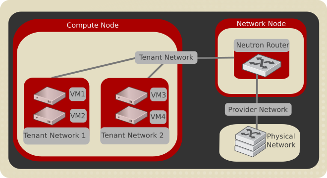

.. _intro-os-networking:

====================
OpenStack Networking
====================

OpenStack Networking allows you to create and manage network objects,
such as networks, subnets, and ports, which other OpenStack services
can use. Plug-ins can be implemented to accommodate different
networking equipment and software, providing flexibility to OpenStack
architecture and deployment.

The Networking service, code-named neutron, provides an API that lets you
define network connectivity and addressing in the cloud. The Networking
service enables operators to leverage different networking technologies
to power their cloud networking. The Networking service also provides an
API to configure and manage a variety of network services ranging from L3
forwarding and :term:`NAT` to load balancing, perimeter firewalls, and
virtual private networks.

It includes the following components:

API server
  The OpenStack Networking API includes support for Layer 2 networking
  and :term:`IP address management (IPAM) <IP Address Management (IPAM)>`, as
  well as an extension for a Layer 3 router construct that enables routing
  between Layer 2 networks and gateways to external networks. OpenStack
  Networking includes a growing list of plug-ins that enable interoperability
  with various commercial and open source network technologies,
  including routers, switches, virtual switches and software-defined
  networking (SDN) controllers.

OpenStack Networking plug-in and agents
  Plugs and unplugs ports, creates networks or subnets, and provides
  IP addressing. The chosen plug-in and agents differ depending on the
  vendor and technologies used in the particular cloud. It is
  important to mention that only one plug-in can be used at a time.

Messaging queue
  Accepts and routes RPC requests between agents to complete API operations.
  Message queue is used in the ML2 plug-in for RPC between the neutron
  server and neutron agents that run on each hypervisor, in the ML2
  mechanism drivers for :term:`Open vSwitch` and :term:`Linux bridge`.

Concepts
~~~~~~~~

To configure rich network topologies, you can create and configure networks
and subnets and instruct other OpenStack services like Compute to attach
virtual devices to ports on these networks.
OpenStack Compute is a prominent consumer of OpenStack Networking to provide
connectivity for its instances.
In particular, OpenStack Networking supports each tenant having multiple
private networks and enables tenants to choose their own IP addressing scheme,
even if those IP addresses overlap with those that other tenants use. There are
two types of network, tenant and provider networks. It is possible to share any
of these types of networks among tenants as part of the network creation
process.

Tenant networks
---------------

Users create tenant networks for connectivity within projects. By default, they
are fully isolated and are not shared with other projects. OpenStack Networking
supports the following types of network isolation and overlay technologies.

Flat
  All instances reside on the same network, which can also be shared
  with the hosts. No VLAN tagging or other network segregation takes place.

VLAN
    Networking allows users to create multiple provider or tenant networks
    using VLAN IDs (802.1Q tagged) that correspond to VLANs present in the
    physical network. This allows instances to communicate with each other
    across the environment. They can also communicate with dedicated servers,
    firewalls, load balancers, and other networking infrastructure on the
    same layer 2 VLAN.

GRE and VXLAN
    VXLAN and GRE are encapsulation protocols that create overlay networks
    to activate and control communication between compute instances. A
    Networking router is required to allow traffic to flow outside of the
    GRE or VXLAN tenant network. A router is also required to connect
    directly-connected tenant networks with external networks, including the
    Internet. The router provides the ability to connect to instances directly
    from an external network using floating IP addresses.

Provider networks
-----------------

The OpenStack administrator creates provider networks. These networks map to
existing physical networks in the data center. Useful network types in this
category are flat (untagged) and VLAN (802.1Q tagged).

Subnets
-------

A block of IP addresses and associated configuration state. This
is also known as the native IPAM (IP Address Management) provided by the
networking service for both tenant and provider networks.
Subnets are used to allocate IP addresses when new ports are created on a
network.

Subnet Pools
------------

End users normally can create subnets with any valid IP addresses without other
restrictions. However, in some cases, it is nice for the admin or the tenant
to pre-define a pool of addresses from which to create subnets with automatic
allocation.

Using subnet pools constrains what addresses can be used by requiring that
every subnet be within the defined pool. It also prevents address reuse or
overlap by two subnets from the same pool.

See :ref:`config-subnet-pools` for more information.

Ports
-----

A port is a connection point for attaching a single device, such as the NIC
of a virtual server, to a virtual network. The port also describes the
associated network configuration, such as the MAC and IP addresses to be
used on that port.

Routers
-------

This is a logical component that forwards data packets between
networks. It also provides L3 and NAT forwarding to provide external
network access for VMs on tenant networks. Required by certain
plug-ins only.

Security groups
---------------

A security group acts as a virtual firewall for your compute instances to
control inbound and outbound traffic. Security groups act at the port level,
not the subnet level. Therefore, each port in a subnet could be
assigned to a different set of security groups. If you do not specify a
particular group at launch time, the instance is automatically assigned
to the default security group for that project.

Security groups and security group rules give administrators and tenants the
ability to specify the type of traffic and direction (ingress/egress) that is
allowed to pass through a port. A security group is a container for security
group rules. When a port is created, it is associated with a security group. If
a security group is not specified, the port is associated with a 'default'
security group. By default, this group drops all ingress traffic and allows all
egress. Rules can be added to this group in order to change the behavior.

Extensions
----------

The OpenStack Networking service is extensible. Extensions serve two
purposes: they allow the introduction of new features in the API
without requiring a version change and they allow the introduction of
vendor specific niche functionality. Applications can programmatically
list available extensions by performing a GET on the
:code:`/extensions` URI. Note that this is a versioned request; that
is, an extension available in one API version might not be available
in another.

Service and component hierarchy
~~~~~~~~~~~~~~~~~~~~~~~~~~~~~~~

Server
------

* Provides API, manages database, etc.

Plug-ins
--------

* Manages agents

Agents
------

* Provides layer 2/3 connectivity to instances

* Handles physical-virtual network transition

* Handles metadata, etc.

Layer 2 (Ethernet and Switching)
^^^^^^^^^^^^^^^^^^^^^^^^^^^^^^^^

* Linux Bridge

* OVS

Layer 3 (IP and Routing)
^^^^^^^^^^^^^^^^^^^^^^^^

* L3

* DHCP

Miscellaneous
^^^^^^^^^^^^^

* Metadata

Services
--------

Routing services
^^^^^^^^^^^^^^^^

VPNaaS
^^^^^^

The Virtual Private Network-as-a-Service (VPNaaS) is a neutron
extension that introduces the VPN feature set.

LBaaS
^^^^^

The Load-Balancer-as-a-Service (LBaaS) API provisions and configures
load balancers. The reference implementation is based on the HAProxy
software load balancer.

FWaaS
^^^^^

The Firewall-as-a-Service (FWaaS) API is an experimental API that
enables early adopters and vendors to test their networking
implementations.
