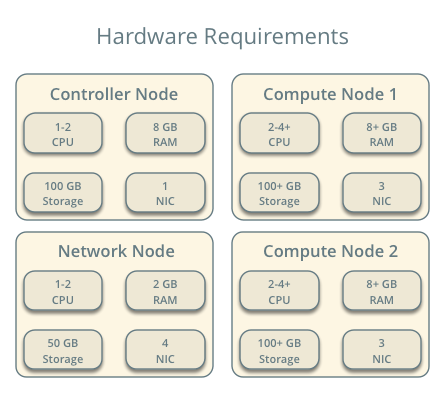

.. _scenario-classic-mt:

==============================
Scenario: Classic with Macvtap
==============================

This scenario describes a classic implementation of the OpenStack
Networking service using the ML2 plug-in with Macvtap.

The classic implementation contributes the networking portion of self-service
virtual data center infrastructure by providing a method for regular
(non-privileged) users to manage virtual networks within a project and
includes the following components:

* Project (tenant) networks

  Project networks provide connectivity to instances for a particular
  project. Regular (non-privileged) users can manage project networks
  within the allocation that an administrator or operator defines for
  them. Project networks can use VLAN transport methods. Project
  networks generally use private IP address ranges (RFC1918) and lack
  connectivity to external networks such as the Internet. Networking
  refers to IP addresses on project networks as *fixed* IP addresses.

* Provider networks

  Provider networks provide connectivity like project networks.
  But only administrative (privileged) users can manage those
  networks because they interface with the physical network infrastructure.
  Provider networks can use flat or VLAN transport methods depending on the
  physical network infrastructure. Like project networks, provider networks
  typically use private IP address ranges.

  .. note::

     A flat network essentially uses the untagged or native VLAN. Similar to
     layer-2 properties of physical networks, only one flat network can exist
     per external bridge. In most cases, production deployments should use
     VLAN transport for provider networks.

The example configuration creates one flat external network and one VLAN
project network. However, this configuration also supports VLAN external
networks. The Macvtap agent does not support VXLAN and GRE project networks.

Known limitations
~~~~~~~~~~~~~~~~~

* Security Group is not supported. You must configure the NoopFirewallDriver as
  described below.

* Address Resolution Protocol (ARP) spoofing filtering is not supported.

* Only compute resources can be attached via macvtap. Attaching other
  resources like DHCP, Routers and others is not supported. Therefore run
  either OVS or linux bridge in VLAN or flat mode on the controller node.

* Migration requires the same ``physical_interface_mapping`` configuration on
  each host. It is not recommended to use different mappings, like
  node1 uses ``physnet1:eth1`` but node2 uses ``physnet1:eth2``. Having
  different mappings could

  * cause migration to fail, if the interface configured on the source node
    does not exist on the target node

  * result in an instance placed on the wrong physical network, if the
    interface used on the source node exists on the target node, but is used
    by another physical network or not used at all by OpenStack. Such an
    instance does not have access to its configured networks anymore.
    It then has layer 2 connectivity to either another OpenStack network, or
    one of the hosts networks.

  .. note::

     To get around those problems, make sure that your
     ``physical_interface_mapping`` is in sync between all nodes using the
     macvtap agent. This `bug
     <https://bugs.launchpad.net/neutron/+bug/1550400>`_ tracks the progress
     on overcoming this limitation.

* Only centralized routing on the network node is supported (using either
  the Open vSwitch or the Linux bridge agent). DVR is NOT supported.

* GRE (Generic Routing Encapsulation) and VXLAN (Virtual Extensible LAN) are
  not supported.

Prerequisites
~~~~~~~~~~~~~

These prerequisites define the minimal physical infrastructure and immediate
OpenStack service dependencies necessary to deploy this scenario. For example,
the Networking service immediately depends on the Identity service and the
Compute service immediately depends on the Networking service. These
dependencies lack services such as the Image service because the Networking
service does not immediately depend on it. However, the Compute service
depends on the Image service to launch an instance. The example configuration
in this scenario assumes basic configuration knowledge of Networking service
components.

Infrastructure
--------------

#. One controller node with one network interface: management.
#. One network node with three network interfaces: management, VLAN project
   networks, and external (typically the Internet).
#. At least one compute node with two network interfaces: management,
   and VLAN project networks.

To improve understanding of network traffic flow, the network and compute
nodes contain a separate network interface for VLAN project networks. In
production environments, you can use any network interface for VLAN project
networks.

In the example configuration, the management network uses 10.0.0.0/24,
and the external network uses 203.0.113.0/24. The VLAN network does not
require an IP address range because it only handles layer-2 connectivity.

.. image:: figures/scenario-classic-mt-networks.png
   :alt: Network layout

.. image:: figures/scenario-classic-mt-services.png
   :alt: Service layout

OpenStack services - controller node
------------------------------------

#. Operational SQL server with ``neutron`` database and appropriate
   configuration in the ``/etc/neutron/neutron.conf`` file
#. Operational message queue service with appropriate configuration
   in the ``/etc/neutron/neutron.conf`` file
#. Operational OpenStack Identity service with appropriate configuration
   in the ``/etc/neutron/neutron.conf`` file
#. Operational OpenStack Compute controller/management service with
   appropriate configuration to use neutron in the ``/etc/nova/nova.conf`` file
#. Neutron server service, ML2 plug-in, and any dependencies

OpenStack services - network node
---------------------------------

#. Operational OpenStack Identity service with appropriate configuration
   in the ``/etc/neutron/neutron.conf`` file
#. Linux bridge or Open vSwitch agent, L3 agent, DHCP agent, metadata agent,
   and any dependencies

OpenStack services - compute nodes
----------------------------------

#. Operational OpenStack Identity service with appropriate configuration
   in the ``/etc/neutron/neutron.conf`` file
#. Operational OpenStack Compute controller/management service with
   appropriate configuration to use neutron in the ``/etc/nova/nova.conf`` file
#. Macvtap agent and any dependencies

Architecture
~~~~~~~~~~~~

The classic architecture provides basic virtual networking components in
your environment. Routing among project and external networks resides
completely on the network node. Although more simple to deploy than
other architectures, performing all functions on the network node
creates a single point of failure and potential performance issues.
Consider deploying DVR or L3 HA architectures in production environments
to provide redundancy and increase performance. Note that the DVR architecture
requires Open vSwitch.

.. image:: figures/scenario-classic-mt.png
   :alt: Architecture overview

The network node contains the following network components:

#. See :ref:`scenario-classic-ovs` or :ref:`scenario-classic-lb`

The compute nodes contain the following network components:

#. Macvtap agent managing the virtual server attachments and interaction
   with underlying interfaces.

.. image:: figures/scenario-classic-mt-compute1.png
   :alt: Compute node components - overview

.. image:: figures/scenario-classic-mt-compute2.png
   :alt: Compute node components - connectivity

Packet flow
~~~~~~~~~~~

.. note::

   *North-south* network traffic travels between an instance and
   external network, typically the Internet. *East-west* network
   traffic travels between instances.

Case 1: North-south for instances with a fixed IP address
---------------------------------------------------------

For instances with a fixed IP address, the network node routes *north-south*
network traffic between project and external networks.

* External network

  * Network 203.0.113.0/24
  * IP address allocation from 203.0.113.101 to 203.0.113.200
  * Project network router interface 203.0.113.101 *TR*

* Project network

  * Network 192.168.1.0/24
  * Gateway 192.168.1.1 with MAC address *TG*

* Compute node 1

  * Instance 1 192.168.1.11 with MAC address *I1*

* Instance 1 resides on compute node 1 and uses a project network.
* The instance sends a packet to a host on the external network.

The following steps involve compute node 1:

#. For VLAN project networks:

   #. The instance 1 ``macvtap`` interface forwards the packet to the logical
      VLAN interface ``device.sid`` where *device* references the underlying
      physical VLAN interface and *sid* contains the project network
      segmentation ID. The packet contains destination MAC address *TG*
      because the destination resides on another network.
   #. The logical VLAN interface ``device.sid`` forwards the packet to the
      network node via the physical VLAN interface.

The following steps involve the network node:

#. For VLAN project networks:

   As the network node runs either the linuxbridge or the OVS agent, it is
   like a black box for macvtap. For more information on network node scenario
   see :ref:`scenario-classic-ovs` or :ref:`scenario-classic-lb`

.. note::

   Return traffic follows similar steps in reverse.

.. image:: figures/scenario-classic-mt-flowns1.png
   :alt: Network traffic flow - north/south with fixed IP address

Case 2: North-south for instances with a floating IP address
------------------------------------------------------------

For instances with a floating IP address, the network node routes
*north-south* network traffic between project and external networks.

The network node runs either linuxbridge agent or OVS agent. Therefore, for
macvtap, floating IP behaves like in the fixed IP address scenario (Case 1).

Case 3: East-west for instances on different networks
-----------------------------------------------------

For instances with a fixed or floating IP address, the network node
routes *east-west* network traffic among project networks using the
same project router.

* Project network 1

  * Network: 192.168.1.0/24
  * Gateway: 192.168.1.1 with MAC address *TG1*

* Project network 2

  * Network: 192.168.2.0/24
  * Gateway: 192.168.2.1 with MAC address *TG2*

* Compute node 1

  * Instance 1: 192.168.1.11 with MAC address *I1*

* Compute node 2

  * Instance 2: 192.168.2.11 with MAC address *I2*

* Instance 1 resides on compute node 1 and uses VLAN project network 1.
* Instance 2 resides on compute node 2 and uses VLAN project network 2.
* Both project networks reside on the same router.
* Instance 1 sends a packet to instance 2.

The following steps involve compute node 1:

#. The instance 1 ``macvtap`` interface forwards the packet to the logical
   VLAN interface ``device.sid`` where *device* references the underlying
   physical VLAN interface and *sid* contains the project network
   segmentation ID. The packet contains destination MAC address *TG*
   because the destination resides on another network.
#. The logical VLAN interface ``device.sid`` forwards the packet to the
   network node via the physical VLAN interface.

The following steps involve the network node:

#. As the network node runs either the linuxbridge or the OVS agent, it is
   like a black box for macvtap. For more information on network node scenario
   see :ref:`scenario-classic-ovs` or :ref:`scenario-classic-lb`

The following steps involve compute node 2:

#. The physical VLAN interface forwards the packet to the logical VLAN
   interface ``vlan.sid`` where *sid* contains the project network
   segmentation ID.
#. The logical VLAN interface ``vlan.sid`` forwards the packet to the
   ``macvtap`` interface on instance 2.

.. note::

   Return traffic follows similar steps in reverse.

.. image:: figures/scenario-classic-mt-flowew1.png
   :alt: Network traffic flow - east/west for instances on different networks

Case 4: East-west for instances on the same network
---------------------------------------------------

For instances with a fixed or floating IP address, the project network
switches *east-west* network traffic among instances without using a
project router on the network node.

* Project network

  * Network: 192.168.1.0/24

* Compute node 1

  * Instance 1: 192.168.1.11 with MAC address *I1*

* Compute node 2

  * Instance 2: 192.168.1.12 with MAC address *I2*

* Instance 1 resides on compute node 1.
* Instance 2 resides on compute node 2.
* Both instances use the same VLAN project network.
* Instance 1 sends a packet to instance 2.
* The Macvtap agent handles switching within the project network.

The following steps involve compute node 1:

#. The instance 1 ``macvtap`` interface forwards the packet to the logical
   VLAN interface ``device.sid`` where *device* references the underlying
   physical VLAN interface and *sid* contains the project network
   segmentation ID. The packet contains destination MAC address *I2*
   because the destination resides on the same network.
#. The logical VLAN interface ``device.sid`` forwards the packet to the
   compute node 2 via the physical VLAN interface.

The following steps involve compute node 2:

#. The physical VLAN interface forwards the packet to the logical VLAN
   interface ``vlan.sid`` where *sid* contains the project network
   segmentation ID.
#. The logical VLAN interface ``vlan.sid`` forwards the packet to the
   ``macvtap`` interface on instance 2.

.. note::

   Return traffic follows similar steps in reverse.

.. image:: figures/scenario-classic-mt-flowew2.png
   :alt: Network traffic flow - east/west for instances on the same network

Example configuration
~~~~~~~~~~~~~~~~~~~~~

Use the following example configuration as a template to deploy this
scenario in your environment.

Controller node
---------------

#. In the ``neutron.conf`` file:

   * Configure common options:

     .. code-block:: ini

        [DEFAULT]
        core_plugin = ml2
        service_plugins = router
        allow_overlapping_ips = True

   * If necessary, :ref:`configure MTU <config-mtu>`.

#. In the ``ml2_conf.ini`` file:

   * Configure drivers and network types:

     .. code-block:: ini

        [ml2]
        type_drivers = flat,vlan
        tenant_network_types = vlan
        mechanism_drivers = linuxbridge,macvtap
        extension_drivers = port_security

   * Configure network mappings and ID ranges:

     .. code-block:: ini

        [ml2_type_flat]
        flat_networks = external

        [ml2_type_vlan]
        network_vlan_ranges = external,vlan:MIN_VLAN_ID:MAX_VLAN_ID

     Replace ``MIN_VLAN_ID`` and ``MAX_VLAN_ID`` with VLAN ID minimum and
     maximum values suitable for your environment.

     .. note::

        The ``external`` value in the ``network_vlan_ranges`` option lacks VLAN
        ID ranges to support use of arbitrary VLAN IDs by administrative users.

   * Configure the security group driver:

     .. code-block:: ini

        [securitygroup]
        firewall_driver = iptables

   * If necessary, :ref:`configure MTU <config-mtu>`.

#. Start the following services:

   * Server

Network node
------------

#. The controller node runs either the linuxbridge or the OVS agent. For more
   information see :ref:`scenario-classic-ovs` or :ref:`scenario-classic-lb`

Compute nodes
-------------

#. Edit the ``macvtap_agent.ini`` file:

   .. code-block:: ini

      [macvtap]
      physical_interface_mappings = vlan:PROJECT_VLAN_INTERFACE

      [securitygroup]
      firewall_driver = noop

   Replace ``PROJECT_VLAN_INTERFACE`` with the name of the underlying
   interface that handles VLAN project networks and external networks,
   respectively.

#. Start the following services:

   * Macvtap agent

Verify service operation
------------------------

#. Source the administrative project credentials.
#. Verify presence and operation of the agents:

   .. code-block:: console

      $ neutron agent-list

      +--------------------------------------+--------------------+-------------+-------+----------------+---------------------------+
      | id                                   | agent_type         | host        | alive | admin_state_up | binary                    |
      +--------------------------------------+--------------------+-------------+-------+----------------+---------------------------+
      | 0146e482-f94a-4996-9e2a-f0cafe2575c5 | L3 agent           | network1    | :-)   | True           | neutron-l3-agent          |
      | 0dd4af0d-aafd-4036-b240-db12cf2a1aa9 | Macvtap agent      | compute2    | :-)   | True           | neutron-macvtap-agent     |
      | 2f9e5434-575e-4079-bcca-5e559c0a5ba7 | Linux bridge agent | network1    | :-)   | True           | neutron-linuxbridge-agent |
      | 4105fd85-7a8f-4956-b104-26a600670530 | Macvtap agent      | compute1    | :-)   | True           | neutron-macvtap-agent     |
      | 8c15992a-3abc-4b14-aebc-60065e5090e6 | Metadata agent     | network1    | :-)   | True           | neutron-metadata-agent    |
      | aa2e8f3e-b53e-4fb9-8381-67dcad74e940 | DHCP agent         | network1    | :-)   | True           | neutron-dhcp-agent        |
      +--------------------------------------+--------------------+-------------+-------+----------------+---------------------------+

Create initial networks
-----------------------

This example creates a flat external network and a VLAN project network.

#. Source the administrative project credentials.
#. Create the external network:

   .. code-block:: console

      $ neutron net-create ext-net --router:external True \
        --provider:physical_network external --provider:network_type flat

      Created a new network:
      +---------------------------+--------------------------------------+
      | Field                     | Value                                |
      +---------------------------+--------------------------------------+
      | admin_state_up            | True                                 |
      | id                        | d57703fd-5571-404c-abca-f59a13f3c507 |
      | name                      | ext-net                              |
      | provider:network_type     | flat                                 |
      | provider:physical_network | external                             |
      | provider:segmentation_id  |                                      |
      | router:external           | True                                 |
      | shared                    | False                                |
      | status                    | ACTIVE                               |
      | subnets                   |                                      |
      | tenant_id                 | 897d7360ac3441209d00fbab5f0b5c8b     |
      +---------------------------+--------------------------------------+

#. Create a subnet on the external network:

   .. code-block:: console

      $ neutron subnet-create ext-net --name ext-subnet --allocation-pool \
        start=203.0.113.101,end=203.0.113.200 --disable-dhcp \
        --gateway 203.0.113.1 203.0.113.0/24

      Created a new subnet:
      +-------------------+----------------------------------------------------+
      | Field             | Value                                              |
      +-------------------+----------------------------------------------------+
      | allocation_pools  | {"start": "203.1.113.101", "end": "203.0.113.200"} |
      | cidr              | 201.0.113.0/24                                     |
      | dns_nameservers   |                                                    |
      | enable_dhcp       | False                                              |
      | gateway_ip        | 203.0.113.1                                        |
      | host_routes       |                                                    |
      | id                | 020bb28d-0631-4af2-aa97-7374d1d33557               |
      | ip_version        | 4                                                  |
      | ipv6_address_mode |                                                    |
      | ipv6_ra_mode      |                                                    |
      | name              | ext-subnet                                         |
      | network_id        | d57703fd-5571-404c-abca-f59a13f3c507               |
      | tenant_id         | 897d7360ac3441209d00fbab5f0b5c8b                   |
      +-------------------+----------------------------------------------------+

#. Create the project network:

#. Source the regular project credentials. The following steps use the
   ``demo`` project.

   .. code-block:: console

      $ neutron net-create demo-net

      Created a new network:
      +---------------------------+--------------------------------------+
      | Field                     | Value                                |
      +---------------------------+--------------------------------------+
      | admin_state_up            | True                                 |
      | id                        | 3a0663f6-9d5d-415e-91f2-0f1bfefbe5ed |
      | name                      | demo-net                             |
      | provider:network_type     | vlan                                 |
      | provider:physical_network |                                      |
      | provider:segmentation_id  | 1                                    |
      | router:external           | False                                |
      | shared                    | False                                |
      | status                    | ACTIVE                               |
      | subnets                   |                                      |
      | tenant_id                 | 8dbcb34c59a741b18e71c19073a47ed5     |
      +---------------------------+--------------------------------------+

#. Create a subnet on the project network:

   .. code-block:: console

      $ neutron subnet-create demo-net --name demo-subnet --gateway 192.168.1.1 \
        192.168.1.0/24

      Created a new subnet:
      +-------------------+--------------------------------------------------+
      | Field             | Value                                            |
      +-------------------+--------------------------------------------------+
      | allocation_pools  | {"start": "192.168.1.2", "end": "192.168.1.254"} |
      | cidr              | 192.168.1.0/24                                   |
      | dns_nameservers   |                                                  |
      | enable_dhcp       | True                                             |
      | gateway_ip        | 192.168.1.1                                      |
      | host_routes       |                                                  |
      | id                | 1d5ab804-8925-46b0-a7b4-e520dc247284             |
      | ip_version        | 4                                                |
      | ipv6_address_mode |                                                  |
      | ipv6_ra_mode      |                                                  |
      | name              | demo-subnet                                      |
      | network_id        | 3a0663f6-9d5d-415e-91f2-0f1bfefbe5ed             |
      | tenant_id         | 8dbcb34c59a741b18e71c19073a47ed5                 |
      +-------------------+--------------------------------------------------+

#. Create a project router:

   .. code-block:: console

      $ neutron router-create demo-router

      +-----------------------+--------------------------------------+
      | Field                 | Value                                |
      +-----------------------+--------------------------------------+
      | admin_state_up        | True                                 |
      | external_gateway_info |                                      |
      | id                    | 299b2363-d656-401d-a3a5-55b4378e7fbb |
      | name                  | demo-router                          |
      | routes                |                                      |
      | status                | ACTIVE                               |
      | tenant_id             | 8dbcb34c59a741b18e71c19073a47ed5     |
      +-----------------------+--------------------------------------+

#. Add the project subnet as an interface on the router:

   .. code-block:: console

      $ neutron router-interface-add demo-router demo-subnet
      Added interface 4f819fd4-be4d-42ab-bd47-ba1b2cb39006 to router demo-router.

#. Add a gateway to the external network on the router:

   .. code-block:: console

      $ neutron router-gateway-set demo-router ext-net
      Set gateway for router demo-router

Verify network operation
------------------------

#. On the network node, verify creation of the ``qrouter`` and ``qdhcp``
   namespaces:

   .. code-block:: console

      $ ip netns
      qdhcp-3a0663f6-9d5d-415e-91f2-0f1bfefbe5ed
      qrouter-299b2363-d656-401d-a3a5-55b4378e7fbb

   .. note::

      The ``qdhcp`` namespace might not exist until launching an instance.

#. Determine the external network gateway IP address for the project network
   on the router, typically the lowest IP address in the external subnet IP
   allocation range:

   .. code-block:: console

      $ neutron router-port-list demo-router

      +--------------------------------------+------+-------------------+--------------------------------------------------------------------------------------+
      | id                                   | name | mac_address       | fixed_ips                                                                            |
      +--------------------------------------+------+-------------------+--------------------------------------------------------------------------------------+
      | b1a894fd-aee8-475c-9262-4342afdc1b58 |      | fa:16:3e:c1:20:55 | {"subnet_id": "1d5ab804-8925-46b0-a7b4-e520dc247284", "ip_address": "192.168.1.1"}   |
      | ff5f93c6-3760-4902-a401-af78ff61ce99 |      | fa:16:3e:54:d7:8c | {"subnet_id": "020bb28d-0631-4af2-aa97-7374d1d33557", "ip_address": "203.0.113.101"} |
      +--------------------------------------+------+-------------------+--------------------------------------------------------------------------------------+

#. On the controller node or any host with access to the external network,
   ping the external network gateway IP address on the project router:

   .. code-block:: console

      $ ping -c 4 203.0.113.101
      PING 203.0.113.101 (203.0.113.101) 56(84) bytes of data.
      64 bytes from 203.0.113.101: icmp_req=1 ttl=64 time=0.619 ms
      64 bytes from 203.0.113.101: icmp_req=2 ttl=64 time=0.189 ms
      64 bytes from 203.0.113.101: icmp_req=3 ttl=64 time=0.165 ms
      64 bytes from 203.0.113.101: icmp_req=4 ttl=64 time=0.216 ms

      --- 203.0.113.101 ping statistics ---
      4 packets transmitted, 4 received, 0% packet loss, time 2999ms
      rtt min/avg/max/mdev = 0.165/0.297/0.619/0.187 ms

#. Source the regular project credentials. The following steps use the
   ``demo`` project.
#. Launch an instance with an interface on the project network.
#. Obtain console access to the instance.

   #. Test connectivity to the project router:

      .. code-block:: console

         $ ping -c 4 192.168.1.1
         PING 192.168.1.1 (192.168.1.1) 56(84) bytes of data.
         64 bytes from 192.168.1.1: icmp_req=1 ttl=64 time=0.357 ms
         64 bytes from 192.168.1.1: icmp_req=2 ttl=64 time=0.473 ms
         64 bytes from 192.168.1.1: icmp_req=3 ttl=64 time=0.504 ms
         64 bytes from 192.168.1.1: icmp_req=4 ttl=64 time=0.470 ms

         --- 192.168.1.1 ping statistics ---
         4 packets transmitted, 4 received, 0% packet loss, time 2998ms
         rtt min/avg/max/mdev = 0.357/0.451/0.504/0.055 ms

   #. Test connectivity to the Internet:

      .. code-block:: console

         $ ping -c 4 openstack.org
         PING openstack.org (174.143.194.225) 56(84) bytes of data.
         64 bytes from 174.143.194.225: icmp_req=1 ttl=53 time=17.4 ms
         64 bytes from 174.143.194.225: icmp_req=2 ttl=53 time=17.5 ms
         64 bytes from 174.143.194.225: icmp_req=3 ttl=53 time=17.7 ms
         64 bytes from 174.143.194.225: icmp_req=4 ttl=53 time=17.5 ms

         --- openstack.org ping statistics ---
         4 packets transmitted, 4 received, 0% packet loss, time 3003ms
         rtt min/avg/max/mdev = 17.431/17.575/17.734/0.143 ms

#. Create a floating IP address on the external network:

   .. code-block:: console

      $ neutron floatingip-create ext-net

      +---------------------+--------------------------------------+
      | Field               | Value                                |
      +---------------------+--------------------------------------+
      | fixed_ip_address    |                                      |
      | floating_ip_address | 203.0.113.102                        |
      | floating_network_id | e5f9be2f-3332-4f2d-9f4d-7f87a5a7692e |
      | id                  | 77cf2a36-6c90-4941-8e62-d48a585de050 |
      | port_id             |                                      |
      | router_id           |                                      |
      | status              | DOWN                                 |
      | tenant_id           | 443cd1596b2e46d49965750771ebbfe1     |
      +---------------------+--------------------------------------+

#. Associate the floating IP address with the instance:

   .. code-block:: console

      $ nova floating-ip-associate demo-instance1 203.0.113.102

#. Verify addition of the floating IP address to the instance:

   .. code-block:: console

      $ nova list

      +--------------------------------------+----------------+--------+------------+-------------+-----------------------------------------+
      | ID                                   | Name           | Status | Task State | Power State | Networks                                |
      +--------------------------------------+----------------+--------+------------+-------------+-----------------------------------------+
      | 05682b91-81a1-464c-8f40-8b3da7ee92c5 | demo-instance1 | ACTIVE | -          | Running     | demo-net=192.168.1.3, 203.0.113.102     |
      +--------------------------------------+----------------+--------+------------+-------------+-----------------------------------------+

#. On the controller node or any host with access to the external network,
   ping the floating IP address associated with the instance:

   .. code-block:: console

      $ ping -c 4 203.0.113.102
      PING 203.0.113.102 (203.0.113.112) 56(84) bytes of data.
      64 bytes from 203.0.113.102: icmp_req=1 ttl=63 time=3.18 ms
      64 bytes from 203.0.113.102: icmp_req=2 ttl=63 time=0.981 ms
      64 bytes from 203.0.113.102: icmp_req=3 ttl=63 time=1.06 ms
      64 bytes from 203.0.113.102: icmp_req=4 ttl=63 time=0.929 ms

      --- 203.0.113.102 ping statistics ---
      4 packets transmitted, 4 received, 0% packet loss, time 3002ms
      rtt min/avg/max/mdev = 0.929/1.539/3.183/0.951 ms
