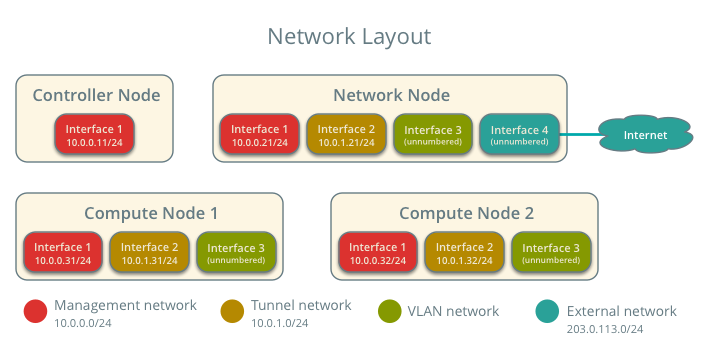
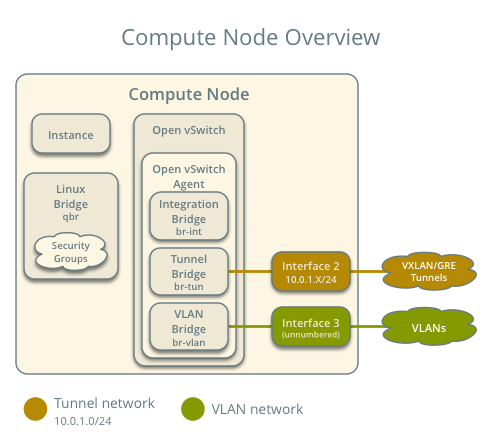

.. _scenario-classic-ovs:

===================================
Scenario: Classic with Open vSwitch
===================================

This scenario describes a classic implementation of the OpenStack
Networking service using the ML2 plug-in with Open vSwitch (OVS).

The classic implementation contributes the networking portion of self-service
virtual data center infrastructure by providing a method for regular
(non-privileged) users to manage virtual networks within a project and
includes the following components:

* Project (tenant) networks

  Project networks provide connectivity to instances for a particular
  project. Regular (non-privileged) users can manage project networks
  within the allocation that an administrator or operator defines for
  them. Project networks can use VLAN, GRE, or VXLAN transport methods
  depending on the allocation. Project networks generally use private
  IP address ranges (RFC1918) and lack connectivity to external networks
  such as the Internet. Networking refers to IP addresses on project
  networks as *fixed* IP addresses.

* External networks

  External networks provide connectivity to external networks such as
  the Internet. Only administrative (privileged) users can manage external
  networks because they interface with the physical network infrastructure.
  External networks can use flat or VLAN transport methods depending on the
  physical network infrastructure and generally use public IP address
  ranges.

  .. note::

     A flat network essentially uses the untagged or native VLAN. Similar to
     layer-2 properties of physical networks, only one flat network can exist
     per external bridge. In most cases, production deployments should use
     VLAN transport for external networks.

* Routers

  Routers typically connect project and external networks. By default, they
  implement SNAT to provide outbound external connectivity for instances on
  project networks. Each router uses an IP address in the external network
  allocation for SNAT. Routers also use DNAT to provide inbound external
  connectivity for instances on project networks. Networking refers to IP
  addresses on routers that provide inbound external connectivity for
  instances on project networks as *floating* IP addresses. Routers can also
  connect project networks that belong to the same project.

* Supporting services

  Other supporting services include DHCP and metadata. The DHCP service
  manages IP addresses for instances on project networks. The metadata
  service provides an API for instances on project networks to obtain
  metadata such as SSH keys.

The example configuration creates one flat external network and one VXLAN
project (tenant) network. However, this configuration also supports VLAN
external networks, VLAN project networks, and GRE project networks.

Prerequisites
~~~~~~~~~~~~~

These prerequisites define the minimal physical infrastructure and immediate
OpenStack service dependencies necessary to deploy this scenario. For example,
the Networking service immediately depends on the Identity service and the
Compute service immediately depends on the Networking service. These
dependencies lack services such as the Image service because the Networking
service does not immediately depend on it. However, the Compute service
depends on the Image service to launch an instance. The example configuration
in this scenario assumes basic configuration knowledge of Networking service
components.

Infrastructure
--------------

#. One controller node with one network interface: management.
#. One network node with four network interfaces: management, project tunnel
   networks, VLAN project networks, and external (typically the Internet).
   The Open vSwitch bridge ``br-vlan`` must contain a port on the VLAN
   interface and Open vSwitch bridge ``br-ex`` must contain a port on the
   external interface.
#. At least one compute node with three network interfaces: management,
   project tunnel networks, and VLAN project networks. The Open vSwitch
   bridge ``br-vlan`` must contain a port on the VLAN interface.

To improve understanding of network traffic flow, the network and compute
nodes contain a separate network interface for VLAN project networks. In
production environments, VLAN project networks can use any Open vSwitch
bridge with access to a network interface. For example, the ``br-tun``
bridge.

In the example configuration, the management network uses 10.0.0.0/24,
the tunnel network uses 10.0.1.0/24, and the external network uses
203.0.113.0/24. The VLAN network does not require an IP address range
because it only handles layer-2 connectivity.

.. image:: figures/scenario-classic-hw.png
   :alt: Hardware layout

.. image:: figures/scenario-classic-ovs-services.png
   :alt: Service layout

.. note::

   For VLAN external and project networks, the physical network infrastructure
   must support VLAN tagging. For best performance, 10+ Gbps networks should
   support jumbo frames.

.. warning::

   Linux distributions often package older releases of Open vSwitch that can
   introduce issues during operation with the Networking service. We recommend
   using at least the latest long-term stable (LTS) release of Open vSwitch
   for the best experience and support from Open vSwitch. See
   `<http://www.openvswitch.org>`__ for available releases and the
   `installation instructions
   <https://github.com/openvswitch/ovs/blob/master/INSTALL.md>`__ for
   building newer releases from source on various distributions.

   Implementing VXLAN networks requires Linux kernel 3.13 or newer.

OpenStack services - controller node
------------------------------------

#. Operational SQL server with ``neutron`` database and appropriate
   configuration in the ``neutron.conf`` file.
#. Operational message queue service with appropriate configuration
   in the ``neutron.conf`` file.
#. Operational OpenStack Identity service with appropriate configuration
   in the ``neutron.conf`` file.
#. Operational OpenStack Compute controller/management service with
   appropriate configuration to use neutron in the
   ``nova.conf`` file.
#. Neutron server service, ML2 plug-in, and any dependencies.

OpenStack services - network node
---------------------------------

#. Operational OpenStack Identity service with appropriate configuration
   in the ``neutron.conf`` file.
#. Open vSwitch service, Open vSwitch agent, L3 agent, DHCP agent, metadata
   agent, and any dependencies.

OpenStack services - compute nodes
----------------------------------

#. Operational OpenStack Identity service with appropriate configuration
   in the ``neutron.conf`` file.
#. Operational OpenStack Compute controller/management service with
   appropriate configuration to use neutron in the ``nova.conf`` file.
#. Open vSwitch service, Open vSwitch agent, and any dependencies.

Architecture
~~~~~~~~~~~~

The classic architecture provides basic virtual networking components in
your environment. Routing among project and external networks resides
completely on the network node. Although more simple to deploy than
other architectures, performing all functions on the network node
creates a single point of failure and potential performance issues.
Consider deploying DVR or L3 HA architectures in production environments
to provide redundancy and increase performance.

.. image:: figures/scenario-classic-general.png
   :alt: Architecture overview

The network node contains the following network components:

#. Open vSwitch agent managing virtual switches, connectivity among
   them, and interaction via virtual ports with other network components
   such as namespaces, Linux bridges, and underlying interfaces.
#. DHCP agent managing the ``qdhcp`` namespaces. The ``qdhcp`` namespaces
   provide DHCP services for instances using project networks.
#. L3 agent managing the ``qrouter`` namespaces. The ``qrouter`` namespaces
   provide routing between project and external networks and among project
   networks. They also route metadata traffic between instances and the
   metadata agent.
#. Metadata agent handling metadata operations for instances.

.. image:: figures/scenario-classic-ovs-network1.png
   :alt: Network node components - overview

.. image:: figures/scenario-classic-ovs-network2.png
   :alt: Network node components - connectivity

The compute nodes contain the following network components:

#. Open vSwitch agent managing virtual switches, connectivity among
   them, and interaction via virtual ports with other network components
   such as namespaces, Linux bridges, and underlying interfaces.
#. Conventional Linux bridges handling security groups. Optionally, a native
   OVS implementation can handle security groups. However, due to kernel and
   OVS version requirements for it, this scenario uses conventional Linux
   bridges. See :ref:`config-ovsfwdriver` for more information.

.. image:: figures/scenario-classic-ovs-compute2.png
   :alt: Compute node components - connectivity

Packet flow
~~~~~~~~~~~

.. note::

   *North-south* network traffic travels between an instance and
   external network, typically the Internet. *East-west* network
   traffic travels between instances.

Case 1: North-south for instances with a fixed IP address
---------------------------------------------------------

For instances with a fixed IP address, the network node routes
*north-south* network traffic between project and external networks.

* External network

  * Network 203.0.113.0/24
  * IP address allocation from 203.0.113.101 to 203.0.113.200
  * Project network router interface 203.0.113.101 *TR*

* Project network

  * Network 192.168.1.0/24
  * Gateway 192.168.1.1 with MAC address *TG*

* Compute node 1

  * Instance 1 192.168.1.11 with MAC address *I1*

* Instance 1 resides on compute node 1 and uses a project network.
* The instance sends a packet to a host on the external network.

The following steps involve compute node 1:

#. The instance 1 ``tap`` interface (1) forwards the packet to the Linux
   bridge ``qbr``. The packet contains destination MAC address *TG*
   because the destination resides on another network.
#. Security group rules (2) on the Linux bridge ``qbr`` handle state tracking
   for the packet.
#. The Linux bridge ``qbr`` forwards the packet to the Open vSwitch
   integration bridge ``br-int``.
#. The Open vSwitch integration bridge ``br-int`` adds the internal tag for
   the project network.
#. For VLAN project networks:

   #. The Open vSwitch integration bridge ``br-int`` forwards the packet to
      the Open vSwitch VLAN bridge ``br-vlan``.
   #. The Open vSwitch VLAN bridge ``br-vlan`` replaces the internal tag
      with the actual VLAN tag of the project network.
   #. The Open vSwitch VLAN bridge ``br-vlan`` forwards the packet to the
      network node via the VLAN interface.

#. For VXLAN and GRE project networks:

   #. The Open vSwitch integration bridge ``br-int`` forwards the packet to
      the Open vSwitch tunnel bridge ``br-tun``.
   #. The Open vSwitch tunnel bridge ``br-tun`` wraps the packet in a VXLAN
      or GRE tunnel and adds a tag to identify the project network.
   #. The Open vSwitch tunnel bridge ``br-tun`` forwards the packet to the
      network node via the tunnel interface.

The following steps involve the network node:

#. For VLAN project networks:

   #. The VLAN interface forwards the packet to the Open vSwitch VLAN
      bridge ``br-vlan``.
   #. The Open vSwitch VLAN bridge ``br-vlan`` forwards the packet to the
      Open vSwitch integration bridge ``br-int``.
   #. The Open vSwitch integration bridge ``br-int`` replaces the actual
      VLAN tag of the project network with the internal tag.

#. For VXLAN and GRE project networks:

   #. The tunnel interface forwards the packet to the Open vSwitch tunnel
      bridge ``br-tun``.
   #. The Open vSwitch tunnel bridge ``br-tun`` unwraps the packet and adds
      the internal tag for the project network.
   #. The Open vSwitch tunnel bridge ``br-tun`` forwards the packet to the
      Open vSwitch integration bridge ``br-int``.

#. The Open vSwitch integration bridge ``br-int`` forwards the packet to
   the ``qr`` interface (3) in the router namespace ``qrouter``. The ``qr``
   interface contains the project network gateway IP address *TG*.
#. The *iptables* service (4) performs SNAT on the packet using the ``qg``
   interface (5) as the source IP address. The ``qg`` interface contains
   the project network router interface IP address *TR*.
#. The router namespace ``qrouter`` forwards the packet to the Open vSwitch
   integration bridge ``br-int`` via the ``qg`` interface.
#. The Open vSwitch integration bridge ``br-int`` forwards the packet to
   the Open vSwitch external bridge ``br-ex``.
#. The Open vSwitch external bridge ``br-ex`` forwards the packet to the
   external network via the external interface.

.. note::

   Return traffic follows similar steps in reverse.

.. image:: figures/scenario-classic-ovs-flowns1.png
   :alt: Network traffic flow - north/south with fixed IP address

Case 2: North-south for instances with a floating IP address
------------------------------------------------------------

For instances with a floating IP address, the network node routes
*north-south* network traffic between project and external networks.

* External network

  * Network 203.0.113.0/24
  * IP address allocation from 203.0.113.101 to 203.0.113.200
  * Project network router interface 203.0.113.101 *TR*

* Project network

  * Network 192.168.1.0/24
  * Gateway 192.168.1.1 with MAC address *TG*

* Compute node 1

  * Instance 1 192.168.1.11 with MAC address *I1* and floating
    IP address 203.0.113.102 *F1*

* Instance 1 resides on compute node 1 and uses a project network.
* The instance receives a packet from a host on the external network.

The following steps involve the network node:

#. The external interface forwards the packet to the Open vSwitch external
   bridge ``br-ex``.
#. The Open vSwitch external bridge ``br-ex`` forwards the packet to the
   Open vSwitch integration bridge ``br-int``.
#. The Open vSwitch integration bridge forwards the packet to the ``qg``
   interface (1) in the router namespace ``qrouter``. The ``qg`` interface
   contains the instance 1 floating IP address *F1*.
#. The *iptables* service (2) performs DNAT on the packet using the ``qr``
   interface (3) as the source IP address. The ``qr`` interface contains
   the project network router interface IP address *TR1*.
#. The router namespace ``qrouter`` forwards the packet to the Open vSwitch
   integration bridge ``br-int``.
#. The Open vSwitch integration bridge ``br-int`` adds the internal tag for
   the project network.
#. For VLAN project networks:

   #. The Open vSwitch integration bridge ``br-int`` forwards the packet to
      the Open vSwitch VLAN bridge ``br-vlan``.
   #. The Open vSwitch VLAN bridge ``br-vlan`` replaces the internal tag
      with the actual VLAN tag of the project network.
   #. The Open vSwitch VLAN bridge ``br-vlan`` forwards the packet to the
      compute node via the VLAN interface.

#. For VXLAN and GRE project networks:

   #. The Open vSwitch integration bridge ``br-int`` forwards the packet to
      the Open vSwitch tunnel bridge ``br-tun``.
   #. The Open vSwitch tunnel bridge ``br-tun`` wraps the packet in a VXLAN
      or GRE tunnel and adds a tag to identify the project network.
   #. The Open vSwitch tunnel bridge ``br-tun`` forwards the packet to the
      compute node via the tunnel interface.

The following steps involve compute node 1:

#. For VLAN project networks:

   #. The VLAN interface forwards the packet to the Open vSwitch VLAN
      bridge ``br-vlan``.
   #. The Open vSwitch VLAN bridge ``br-vlan`` forwards the packet to the
      Open vSwitch integration bridge ``br-int``.
   #. The Open vSwitch integration bridge ``br-int`` replaces the actual
      VLAN tag the project network with the internal tag.

#. For VXLAN and GRE project networks:

   #. The tunnel interface forwards the packet to the Open vSwitch tunnel
      bridge ``br-tun``.
   #. The Open vSwitch tunnel bridge ``br-tun`` unwraps the packet and adds
      the internal tag for the project network.
   #. The Open vSwitch tunnel bridge ``br-tun`` forwards the packet to the
      Open vSwitch integration bridge ``br-int``.

#. The Open vSwitch integration bridge ``br-int`` forwards the packet to
   the Linux bridge ``qbr``.
#. Security group rules (4) on the Linux bridge ``qbr`` handle firewalling
   and state tracking for the packet.
#. The Linux bridge ``qbr`` forwards the packet to the ``tap`` interface (5)
   on instance 1.

.. note::

   Return traffic follows similar steps in reverse.

.. image:: figures/scenario-classic-ovs-flowns2.png
   :alt: Network traffic flow - north/south with floating IP address

Case 3: East-west for instances on different networks
-----------------------------------------------------

For instances with a fixed or floating IP address, the network node
routes *east-west* network traffic among project networks using the
same project router.

* Project network 1

  * Network: 192.168.1.0/24
  * Gateway: 192.168.1.1 with MAC address *TG1*

* Project network 2

  * Network: 192.168.2.0/24
  * Gateway: 192.168.2.1 with MAC address *TG2*

* Compute node 1

  * Instance 1: 192.168.1.11 with MAC address *I1*

* Compute node 2

  * Instance 2: 192.168.2.11 with MAC address *I2*

* Instance 1 resides on compute node 1 and uses project network 1.
* Instance 2 resides on compute node 2 and uses project network 2.
* Both project networks reside on the same router.
* Instance 1 sends a packet to instance 2.

The following steps involve compute node 1:

#. The instance 1 ``tap`` interface (1) forwards the packet to the Linux
   bridge ``qbr``. The packet contains destination MAC address *TG1*
   because the destination resides on another network.
#. Security group rules (2) on the Linux bridge ``qbr`` handle state tracking
   for the packet.
#. The Linux bridge ``qbr`` forwards the packet to the Open vSwitch
   integration bridge ``br-int``.
#. The Open vSwitch integration bridge ``br-int`` adds the internal tag for
   project network 1.
#. For VLAN project networks:

   #. The Open vSwitch integration bridge ``br-int`` forwards the packet to
      the Open vSwitch VLAN bridge ``br-vlan``.
   #. The Open vSwitch VLAN bridge ``br-vlan`` replaces the internal tag
      with the actual VLAN tag of project network 1.
   #. The Open vSwitch VLAN bridge ``br-vlan`` forwards the packet to the
      network node via the VLAN interface.

#. For VXLAN and GRE project networks:

   #. The Open vSwitch integration bridge ``br-int`` forwards the packet to
      the Open vSwitch tunnel bridge ``br-tun``.
   #. The Open vSwitch tunnel bridge ``br-tun`` wraps the packet in a VXLAN
      or GRE tunnel and adds a tag to identify project network 1.
   #. The Open vSwitch tunnel bridge ``br-tun`` forwards the packet to the
      network node via the tunnel interface.

The following steps involve the network node:

#. For VLAN project networks:

   #. The VLAN interface forwards the packet to the Open vSwitch VLAN
      bridge ``br-vlan``.
   #. The Open vSwitch VLAN bridge ``br-vlan`` forwards the packet to the
      Open vSwitch integration bridge ``br-int``.
   #. The Open vSwitch integration bridge ``br-int`` replaces the actual
      VLAN tag of project network 1 with the internal tag.

#. For VXLAN and GRE project networks:

   #. The tunnel interface forwards the packet to the Open vSwitch tunnel
      bridge ``br-tun``.
   #. The Open vSwitch tunnel bridge ``br-tun`` unwraps the packet and adds
      the internal tag for project network 1.
   #. The Open vSwitch tunnel bridge ``br-tun`` forwards the packet to the
      Open vSwitch integration bridge ``br-int``.

#. The Open vSwitch integration bridge ``br-int`` forwards the packet to
   the ``qr-1`` interface (3) in the router namespace ``qrouter``. The ``qr-1``
   interface contains the project network 1 gateway IP address *TG1*.
#. The router namespace ``qrouter`` routes the packet to the ``qr-2`` interface
   (4). The ``qr-2`` interface contains the project network 2 gateway IP
   address *TG2*.
#. The router namespace ``qrouter`` forwards the packet to the Open vSwitch
   integration bridge ``br-int``.
#. The Open vSwitch integration bridge ``br-int`` adds the internal tag for
   project network 2.
#. For VLAN project networks:

   #. The Open vSwitch integration bridge ``br-int`` forwards the packet to
      the Open vSwitch VLAN bridge ``br-vlan``.
   #. The Open vSwitch VLAN bridge ``br-vlan`` replaces the internal tag
      with the actual VLAN tag of project network 2.
   #. The Open vSwitch VLAN bridge ``br-vlan`` forwards the packet to compute
      node 2 via the VLAN interface.

#. For VXLAN and GRE project networks:

   #. The Open vSwitch integration bridge ``br-int`` forwards the packet to
      the Open vSwitch tunnel bridge ``br-tun``.
   #. The Open vSwitch tunnel bridge ``br-tun`` wraps the packet in a VXLAN
      or GRE tunnel and adds a tag to identify project network 2.
   #. The Open vSwitch tunnel bridge ``br-tun`` forwards the packet to
      compute node 2 via the tunnel interface.

The following steps involve compute node 2:

#. For VLAN project networks:

   #. The VLAN interface forwards the packet to the Open vSwitch VLAN
      bridge ``br-vlan``.
   #. The Open vSwitch VLAN bridge ``br-vlan`` forwards the packet to the
      Open vSwitch integration bridge ``br-int``.
   #. The Open vSwitch integration bridge ``br-int`` replaces the actual
      VLAN tag of project network 2 with the internal tag.

#. For VXLAN and GRE project networks:

   #. The tunnel interface forwards the packet to the Open vSwitch tunnel
      bridge ``br-tun``.
   #. The Open vSwitch tunnel bridge ``br-tun`` unwraps the packet and adds
      the internal tag for project network 2.
   #. The Open vSwitch tunnel bridge ``br-tun`` forwards the packet to the
      Open vSwitch integration bridge ``br-int``.

#. The Open vSwitch integration bridge ``br-int`` forwards the packet to
   the Linux bridge ``qbr``.
#. Security group rules (5) on the Linux bridge ``qbr`` handle firewalling
   and state tracking for the packet.
#. The Linux bridge ``qbr`` forwards the packet to the ``tap`` interface (6)
   on instance 2.

.. note::

   Return traffic follows similar steps in reverse.

.. image:: figures/scenario-classic-ovs-flowew1.png
   :alt: Network traffic flow - east/west for instances on different networks

Case 4: East-west for instances on the same network
---------------------------------------------------

For instances with a fixed or floating IP address, the project network
switches *east-west* network traffic among instances without using a
project router on the network node.

* Project network

  * Network: 192.168.1.0/24

* Compute node 1

  * Instance 1: 192.168.1.11 with MAC address *I1*

* Compute node 2

  * Instance 2: 192.168.1.12 with MAC address *I2*

* Instance 1 resides on compute node 1.
* Instance 2 resides on compute node 2.
* Both instances use the same project network.
* Instance 1 sends a packet to instance 2.
* The Open vSwitch agent handles switching within the project network.

The following steps involve compute node 1:

#. The instance 1 ``tap`` interface (1) forwards the packet to the Linux
   bridge ``qbr``. The packet contains destination MAC address *I2*
   because the destination resides on the same network.
#. Security group rules (2) on the Linux bridge ``qbr`` handle
   state tracking for the packet.
#. The Linux bridge ``qbr`` forwards the packet to the Open vSwitch
   integration bridge ``br-int``.
#. The Open vSwitch integration bridge ``br-int`` adds the internal tag for
   provider network 1.
#. For VLAN project networks:

   #. The Open vSwitch integration bridge ``br-int`` forwards the packet to
      the Open vSwitch VLAN bridge ``br-vlan``.
   #. The Open vSwitch VLAN bridge ``br-vlan`` replaces the internal tag
      with the actual VLAN tag of project network 1.
   #. The Open vSwitch VLAN bridge ``br-vlan`` forwards the packet to the
      compute node 2 via the VLAN interface.

#. For VXLAN and GRE project networks:

   #. The Open vSwitch integration bridge ``br-int`` forwards the packet to
      the Open vSwitch tunnel bridge ``br-tun``.
   #. The Open vSwitch tunnel bridge ``br-tun`` wraps the packet in a VXLAN
      or GRE tunnel and adds a tag to identify project network 1.
   #. The Open vSwitch tunnel bridge ``br-tun`` forwards the packet to the
      compute node 2 via the tunnel interface.

The following steps involve compute node 2:

#. For VLAN project networks:

   #. The VLAN interface forwards the packet to the Open vSwitch VLAN
      bridge ``br-vlan``.
   #. The Open vSwitch VLAN bridge ``br-vlan`` forwards the packet to the
      Open vSwitch integration bridge ``br-int``.
   #. The Open vSwitch integration bridge ``br-int`` replaces the actual
      VLAN tag of project network 2 with the internal tag.

#. For VXLAN and GRE project networks:

   #. The tunnel interface forwards the packet to the Open vSwitch tunnel
      bridge ``br-tun``.
   #. The Open vSwitch tunnel bridge ``br-tun`` unwraps the packet and adds
      the internal tag for project network 2.
   #. The Open vSwitch tunnel bridge ``br-tun`` forwards the packet to the
      Open vSwitch integration bridge ``br-int``.

#. The Open vSwitch integration bridge ``br-int`` forwards the packet to
   the Linux bridge ``qbr``.
#. Security group rules (3) on the Linux bridge ``qbr`` handle firewalling
   and state tracking for the packet.
#. The Linux bridge ``qbr`` forwards the packet to the ``tap`` interface (4)
   on instance 2.

.. note::

   Return traffic follows similar steps in reverse.

.. image:: figures/scenario-classic-ovs-flowew2.png
   :alt: Network traffic flow - east/west for instances on the same network

Example configuration
~~~~~~~~~~~~~~~~~~~~~

Use the following example configuration as a template to deploy this
scenario in your environment.

Controller node
---------------

#. In the ``neutron.conf`` file:

   * Configure common options:

     .. code-block:: ini

        [DEFAULT]
        core_plugin = ml2
        service_plugins = router
        allow_overlapping_ips = True

   * If necessary, :ref:`configure MTU <config-mtu>`.

#. In the ``ml2_conf.ini`` file:

   * Configure drivers and network types:

     .. code-block:: ini

        [ml2]
        type_drivers = flat,vlan,gre,vxlan
        tenant_network_types = vlan,gre,vxlan
        mechanism_drivers = openvswitch,l2population
        extension_drivers = port_security

   * Configure network mappings and ID ranges:

     .. code-block:: ini

        [ml2_type_flat]
        flat_networks = external

        [ml2_type_vlan]
        network_vlan_ranges = external,vlan:MIN_VLAN_ID:MAX_VLAN_ID

        [ml2_type_gre]
        tunnel_id_ranges = MIN_GRE_ID:MAX_GRE_ID

        [ml2_type_vxlan]
        vni_ranges = MIN_VXLAN_ID:MAX_VXLAN_ID

     Replace ``MIN_VLAN_ID``, ``MAX_VLAN_ID``, ``MIN_GRE_ID``, ``MAX_GRE_ID``,
     ``MIN_VXLAN_ID``, and ``MAX_VXLAN_ID`` with VLAN, GRE, and VXLAN ID minimum
     and maximum values suitable for your environment.

     .. note::

        The first value in the ``tenant_network_types`` option becomes the
        default project network type when a regular user creates a network.

     .. note::

        The ``external`` value in the ``network_vlan_ranges`` option lacks VLAN
        ID ranges to support use of arbitrary VLAN IDs by administrative users.

   * Configure the security group driver:

     .. code-block:: ini

        [securitygroup]
        firewall_driver = iptables_hybrid

   * If necessary, :ref:`configure MTU <config-mtu>`.

#. Start the following services:

   * Server

Network node
------------

#. In the ``openvswitch_agent.ini`` file, configure the Open vSwitch agent:

   .. code-block:: ini

      [ovs]
      local_ip = TUNNEL_INTERFACE_IP_ADDRESS
      bridge_mappings = vlan:br-vlan,external:br-ex

      [agent]
      tunnel_types = gre,vxlan
      l2_population = True

      [securitygroup]
      firewall_driver = iptables_hybrid

   Replace ``TUNNEL_INTERFACE_IP_ADDRESS`` with the IP address of the interface
   that handles GRE/VXLAN project networks.

#. In the ``l3_agent.ini`` file, configure the L3 agent:

   .. code-block:: ini

      [DEFAULT]
      interface_driver = neutron.agent.linux.interface.OVSInterfaceDriver
      external_network_bridge =

   .. note::

      The ``external_network_bridge`` option intentionally contains
      no value.

#. In the ``dhcp_agent.ini`` file, configure the DHCP agent:

   .. code-block:: ini

      [DEFAULT]
      interface_driver = neutron.agent.linux.interface.OVSInterfaceDriver
      enable_isolated_metadata = True

#. In the ``metadata_agent.ini`` file, configure the metadata agent:

   .. code-block:: ini

      [DEFAULT]
      nova_metadata_ip = controller
      metadata_proxy_shared_secret = METADATA_SECRET

   Replace ``METADATA_SECRET`` with a suitable value for your environment.

#. Start the following services:

   * Open vSwitch
   * Open vSwitch agent
   * L3 agent
   * DHCP agent
   * Metadata agent

Compute nodes
-------------

#. In the ``openvswitch_agent.ini`` file, configure the Open vSwitch agent:

   .. code-block:: ini

      [ovs]
      local_ip = TUNNEL_INTERFACE_IP_ADDRESS
      bridge_mappings = vlan:br-vlan

      [agent]
      tunnel_types = gre,vxlan
      l2_population = True

      [securitygroup]
      firewall_driver = iptables_hybrid

   Replace ``TUNNEL_INTERFACE_IP_ADDRESS`` with the IP address of the interface
   that handles GRE/VXLAN project networks.

#. Start the following services:

   * Open vSwitch
   * Open vSwitch agent

Verify service operation
------------------------

#. Source the administrative project credentials.
#. Verify presence and operation of the agents:

   .. code-block:: console

      $ neutron agent-list
      +--------------------------------------+--------------------+----------+-------+----------------+---------------------------+
      | id                                   | agent_type         | host     | alive | admin_state_up | binary                    |
      +--------------------------------------+--------------------+----------+-------+----------------+---------------------------+
      | 1eaf6079-41c8-4b5b-876f-73b02753ff57 | Open vSwitch agent | compute1 | :-)   | True           | neutron-openvswitch-agent |
      | 511c27b3-8317-4e27-8a0f-b158e4fb8368 | Metadata agent     | network1 | :-)   | True           | neutron-metadata-agent    |
      | 7eae11ef-8157-4fd4-a352-bc841cf709f6 | Open vSwitch agent | network1 | :-)   | True           | neutron-openvswitch-agent |
      | a9110ce6-22cc-4f78-9b2e-57f83aac68a3 | Open vSwitch agent | compute2 | :-)   | True           | neutron-openvswitch-agent |
      | c41f3200-8eda-43ab-8135-573e826776d9 | DHCP agent         | network1 | :-)   | True           | neutron-dhcp-agent        |
      | f897648e-7623-486c-8043-1b219eb2895a | L3 agent           | network1 | :-)   | True           | neutron-l3-agent          |
      +--------------------------------------+--------------------+----------+-------+----------------+---------------------------+

Create initial networks
-----------------------

This example creates a flat external network and a VXLAN project network.

#. Source the administrative project credentials.
#. Create the external network:

   .. code-block:: console

      $ neutron net-create ext-net --router:external True \
        --provider:physical_network external --provider:network_type flat
        Created a new network:
      +---------------------------+--------------------------------------+
      | Field                     | Value                                |
      +---------------------------+--------------------------------------+
      | admin_state_up            | True                                 |
      | id                        | e5f9be2f-3332-4f2d-9f4d-7f87a5a7692e |
      | name                      | ext-net                              |
      | provider:network_type     | flat                                 |
      | provider:physical_network | external                             |
      | provider:segmentation_id  |                                      |
      | router:external           | True                                 |
      | shared                    | False                                |
      | status                    | ACTIVE                               |
      | subnets                   |                                      |
      | tenant_id                 | 96393622940e47728b6dcdb2ef405f50     |
      +---------------------------+--------------------------------------+

#. Create a subnet on the external network:

   .. code-block:: console

      $ neutron subnet-create ext-net --name ext-subnet --allocation-pool \
        start=203.0.113.101,end=203.0.113.200 --disable-dhcp \
        --gateway 203.0.113.1 203.0.113.0/24
      Created a new subnet:
      +-------------------+----------------------------------------------------+
      | Field             | Value                                              |
      +-------------------+----------------------------------------------------+
      | allocation_pools  | {"start": "203.0.113.101", "end": "203.0.113.200"} |
      | cidr              | 203.0.113.0/24                                     |
      | dns_nameservers   |                                                    |
      | enable_dhcp       | False                                              |
      | gateway_ip        | 203.0.113.1                                        |
      | host_routes       |                                                    |
      | id                | cd9c15a1-0a66-4bbe-b1b4-4b7edd936f7a               |
      | ip_version        | 4                                                  |
      | ipv6_address_mode |                                                    |
      | ipv6_ra_mode      |                                                    |
      | name              | ext-subnet                                         |
      | network_id        | e5f9be2f-3332-4f2d-9f4d-7f87a5a7692e               |
      | tenant_id         | 96393622940e47728b6dcdb2ef405f50                   |
      +-------------------+----------------------------------------------------+

.. note::

   The example configuration contains ``vlan`` as the first project network
   type. Only an administrative user can create other types of networks such as
   GRE or VXLAN. The following commands use the ``admin`` project credentials
   to create a VXLAN project network.

#. Obtain the ID of a regular project. For example, using the ``demo`` project:

   .. code-block:: console

      $ openstack project show demo
      +-------------+----------------------------------+
      | Field       | Value                            |
      +-------------+----------------------------------+
      | description | Demo Project                     |
      | enabled     | True                             |
      | id          | 443cd1596b2e46d49965750771ebbfe1 |
      | name        | demo                             |
      +-------------+----------------------------------+

#. Create the project network:

   .. code-block:: console

      $ neutron net-create demo-net --tenant-id 443cd1596b2e46d49965750771ebbfe1 \
        --provider:network_type vxlan
      Created a new network:
      +---------------------------+--------------------------------------+
      | Field                     | Value                                |
      +---------------------------+--------------------------------------+
      | admin_state_up            | True                                 |
      | id                        | 6e9c5324-68d1-47a8-98d5-8268db955475 |
      | name                      | demo-net                             |
      | provider:network_type     | vxlan                                |
      | provider:physical_network |                                      |
      | provider:segmentation_id  | 1                                    |
      | router:external           | False                                |
      | shared                    | False                                |
      | status                    | ACTIVE                               |
      | subnets                   |                                      |
      | tenant_id                 | 443cd1596b2e46d49965750771ebbfe1     |
      +---------------------------+--------------------------------------+

#. Source the regular project credentials. The following steps use the
   ``demo`` project.
#. Create a subnet on the project network:

   .. code-block:: console

      $ neutron subnet-create demo-net --name demo-subnet --gateway 192.168.1.1 \
        192.168.1.0/24
      Created a new subnet:
      +-------------------+--------------------------------------------------+
      | Field             | Value                                            |
      +-------------------+--------------------------------------------------+
      | allocation_pools  | {"start": "192.168.1.2", "end": "192.168.1.254"} |
      | cidr              | 192.168.1.0/24                                   |
      | dns_nameservers   |                                                  |
      | enable_dhcp       | True                                             |
      | gateway_ip        | 192.168.1.1                                      |
      | host_routes       |                                                  |
      | id                | c7b42e58-a2f4-4d63-b199-d266504c03c9             |
      | ip_version        | 4                                                |
      | ipv6_address_mode |                                                  |
      | ipv6_ra_mode      |                                                  |
      | name              | demo-subnet                                      |
      | network_id        | 6e9c5324-68d1-47a8-98d5-8268db955475             |
      | tenant_id         | 443cd1596b2e46d49965750771ebbfe1                 |
      +-------------------+--------------------------------------------------+

#. Create a project router:

   .. code-block:: console

      $ neutron router-create demo-router
      Created a new router:
      +-----------------------+--------------------------------------+
      | Field                 | Value                                |
      +-----------------------+--------------------------------------+
      | admin_state_up        | True                                 |
      | external_gateway_info |                                      |
      | id                    | 474a5b1f-d64c-4db9-b3b2-8ae9bb1b5970 |
      | name                  | demo-router                          |
      | routes                |                                      |
      | status                | ACTIVE                               |
      | tenant_id             | 443cd1596b2e46d49965750771ebbfe1     |
      +-----------------------+--------------------------------------+

#. Add the project subnet as an interface on the router:

   .. code-block:: console

      $ neutron router-interface-add demo-router demo-subnet
      Added interface 0fa57069-29fd-4795-87b7-c123829137e9 to router demo-router.

#. Add a gateway to the external network on the router:

   .. code-block:: console

      $ neutron router-gateway-set demo-router ext-net
      Set gateway for router demo-router

Verify network operation
------------------------

#. On the network node, verify creation of the ``qrouter`` and ``qdhcp``
   namespaces:

   .. code-block:: console

      $ ip netns
      qrouter-4d7928a0-4a3c-4b99-b01b-97da2f97e279
      qdhcp-353f5937-a2d3-41ba-8225-fa1af2538141

   .. note::
      The ``qdhcp`` namespace might not exist until launching an instance.

#. Determine the external network gateway IP address for the project network
   on the router, typically the lowest IP address in the external subnet IP
   allocation range:

   .. code-block:: console

      $ neutron router-port-list demo-router
      +--------------------------------------+------+-------------------+--------------------------------------------------------------------------------------+
      | id                                   | name | mac_address       | fixed_ips                                                                            |
      +--------------------------------------+------+-------------------+--------------------------------------------------------------------------------------+
      | b1a894fd-aee8-475c-9262-4342afdc1b58 |      | fa:16:3e:c1:20:55 | {"subnet_id": "c7b42e58-a2f4-4d63-b199-d266504c03c9", "ip_address": "192.168.1.1"}   |
      | ff5f93c6-3760-4902-a401-af78ff61ce99 |      | fa:16:3e:54:d7:8c | {"subnet_id": "cd9c15a1-0a66-4bbe-b1b4-4b7edd936f7a", "ip_address": "203.0.113.101"} |
      +--------------------------------------+------+-------------------+--------------------------------------------------------------------------------------+

#. On the controller node or any host with access to the external network,
   ping the external network gateway IP address on the project router:

   .. code-block:: console

      $ ping -c 4 203.0.113.101
      PING 203.0.113.101 (203.0.113.101) 56(84) bytes of data.
      64 bytes from 203.0.113.101: icmp_req=1 ttl=64 time=0.619 ms
      64 bytes from 203.0.113.101: icmp_req=2 ttl=64 time=0.189 ms
      64 bytes from 203.0.113.101: icmp_req=3 ttl=64 time=0.165 ms
      64 bytes from 203.0.113.101: icmp_req=4 ttl=64 time=0.216 ms

      --- 203.0.113.101 ping statistics ---
      4 packets transmitted, 4 received, 0% packet loss, time 2999ms
      rtt min/avg/max/mdev = 0.165/0.297/0.619/0.187 ms

#. Source the regular project credentials. The following steps use the
   ``demo`` project.
#. Launch an instance with an interface on the project network.
#. Obtain console access to the instance.

   #. Test connectivity to the project router:

      .. code-block:: console

         $ ping -c 4 192.168.1.1
         PING 192.168.1.1 (192.168.1.1) 56(84) bytes of data.
         64 bytes from 192.168.1.1: icmp_req=1 ttl=64 time=0.357 ms
         64 bytes from 192.168.1.1: icmp_req=2 ttl=64 time=0.473 ms
         64 bytes from 192.168.1.1: icmp_req=3 ttl=64 time=0.504 ms
         64 bytes from 192.168.1.1: icmp_req=4 ttl=64 time=0.470 ms

         --- 192.168.1.1 ping statistics ---
         4 packets transmitted, 4 received, 0% packet loss, time 2998ms
         rtt min/avg/max/mdev = 0.357/0.451/0.504/0.055 ms

   #. Test connectivity to the Internet:

      .. code-block:: console

         $ ping -c 4 openstack.org
         PING openstack.org (174.143.194.225) 56(84) bytes of data.
         64 bytes from 174.143.194.225: icmp_req=1 ttl=53 time=17.4 ms
         64 bytes from 174.143.194.225: icmp_req=2 ttl=53 time=17.5 ms
         64 bytes from 174.143.194.225: icmp_req=3 ttl=53 time=17.7 ms
         64 bytes from 174.143.194.225: icmp_req=4 ttl=53 time=17.5 ms

         --- openstack.org ping statistics ---
         4 packets transmitted, 4 received, 0% packet loss, time 3003ms
         rtt min/avg/max/mdev = 17.431/17.575/17.734/0.143 ms

#. Create the appropriate security group rules to allow ping and SSH access
   to the instance. For example:

   .. code-block:: console

      $ openstack security group rule create default --proto icmp
      +-----------------------+--------------------------------------+
      | Field                 | Value                                |
      +-----------------------+--------------------------------------+
      | id                    | 5a61ab14-c1b7-4520-a7a7-e32f2e575983 |
      | ip_protocol           | icmp                                 |
      | ip_range              | 0.0.0.0/0                            |
      | parent_group_id       | cd15a4d3-d1c1-4702-a855-5d35027dd04c |
      | port_range            |                                      |
      | remote_security_group |                                      |
      +-----------------------+--------------------------------------+

      $ openstack security group rule create default --proto tcp --dst-port 22
      +-----------------------+--------------------------------------+
      | Field                 | Value                                |
      +-----------------------+--------------------------------------+
      | id                    | de7aad57-9df2-492f-bdaf-54da18b56dc8 |
      | ip_protocol           | tcp                                  |
      | ip_range              | 0.0.0.0/0                            |
      | parent_group_id       | cd15a4d3-d1c1-4702-a855-5d35027dd04c |
      | port_range            | 22:22                                |
      | remote_security_group |                                      |
      +-----------------------+--------------------------------------+

#. Create a floating IP address on the external network:

   .. code-block:: console

      $ openstack ip floating create ext-net
      +-------------+--------------------------------------+
      | Field       | Value                                |
      +-------------+--------------------------------------+
      | fixed_ip    | None                                 |
      | id          | dad7a1f1-128c-4ed4-8bfa-1ed84b741a56 |
      | instance_id | None                                 |
      | ip          | 203.0.113.102                        |
      | pool        | ext-net                              |
      +-------------+--------------------------------------+

#. Associate the floating IP address with the instance:

   .. code-block:: console

      $ openstack ip floating add 203.0.113.102 demo-instance1

   .. note::

      This command provides no output.

#. Verify addition of the floating IP address to the instance:

   .. code-block:: console

      $ openstack server list
      +--------------------------------------+----------------+--------+------------------------------------+
      | ID                                   | Name           | Status | Networks                           |
      +--------------------------------------+----------------+--------+------------------------------------+
      | 05682b91-81a1-464c-8f40-8b3da7ee92c5 | demo-instance1 | ACTIVE | private=192.168.1.3, 203.0.113.102 |
      +--------------------------------------+----------------+--------+------------------------------------+

#. On the controller node or any host with access to the external network,
   ping the floating IP address associated with the instance:

   .. code-block:: console

      $ ping -c 4 203.0.113.102
      PING 203.0.113.102 (203.0.113.112) 56(84) bytes of data.
      64 bytes from 203.0.113.102: icmp_req=1 ttl=63 time=3.18 ms
      64 bytes from 203.0.113.102: icmp_req=2 ttl=63 time=0.981 ms
      64 bytes from 203.0.113.102: icmp_req=3 ttl=63 time=1.06 ms
      64 bytes from 203.0.113.102: icmp_req=4 ttl=63 time=0.929 ms

      --- 203.0.113.102 ping statistics ---
      4 packets transmitted, 4 received, 0% packet loss, time 3002ms
      rtt min/avg/max/mdev = 0.929/1.539/3.183/0.951 ms
