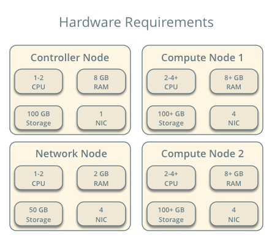
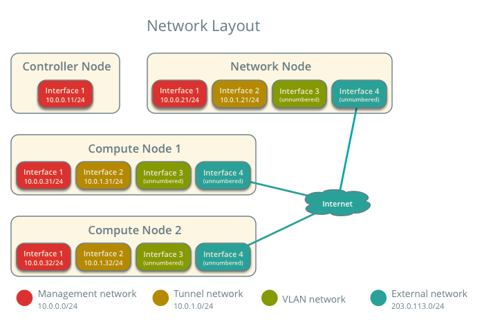
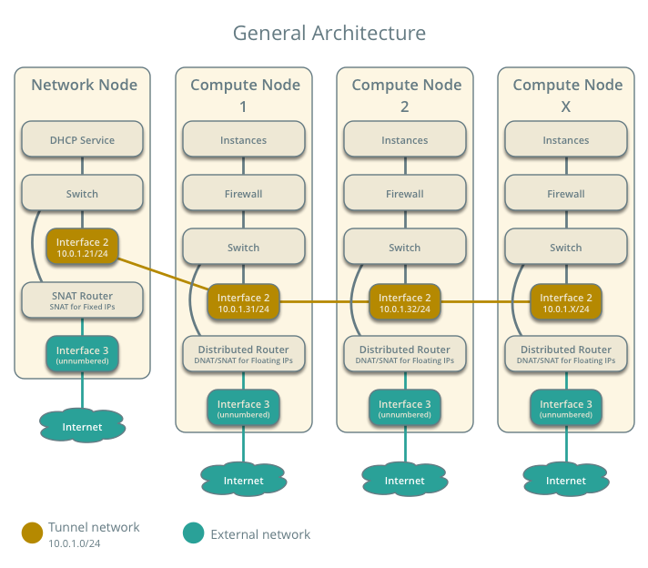
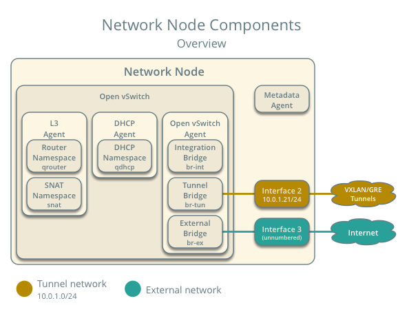
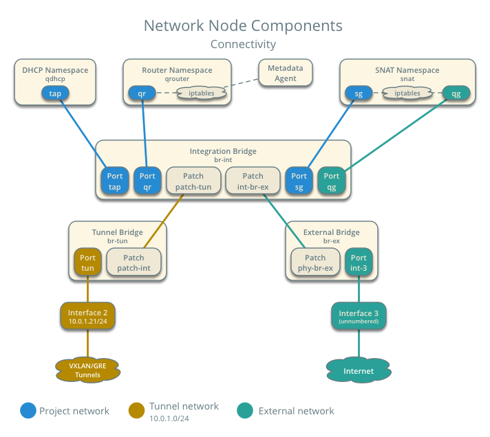
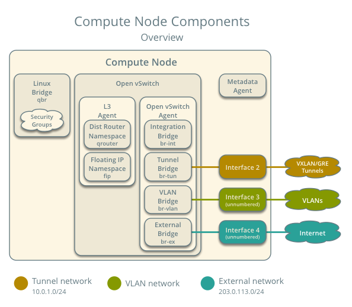
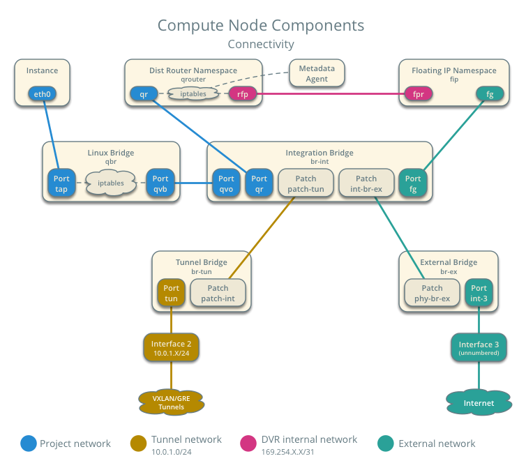
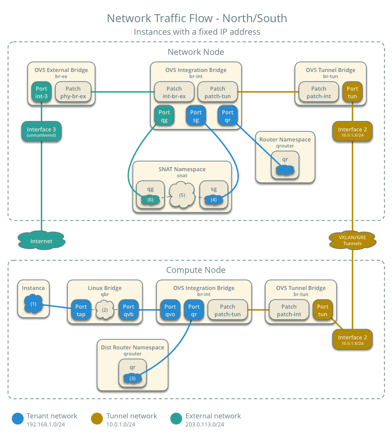
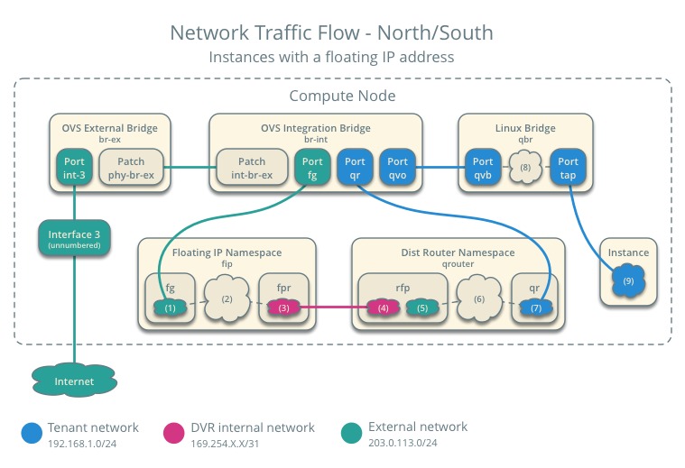
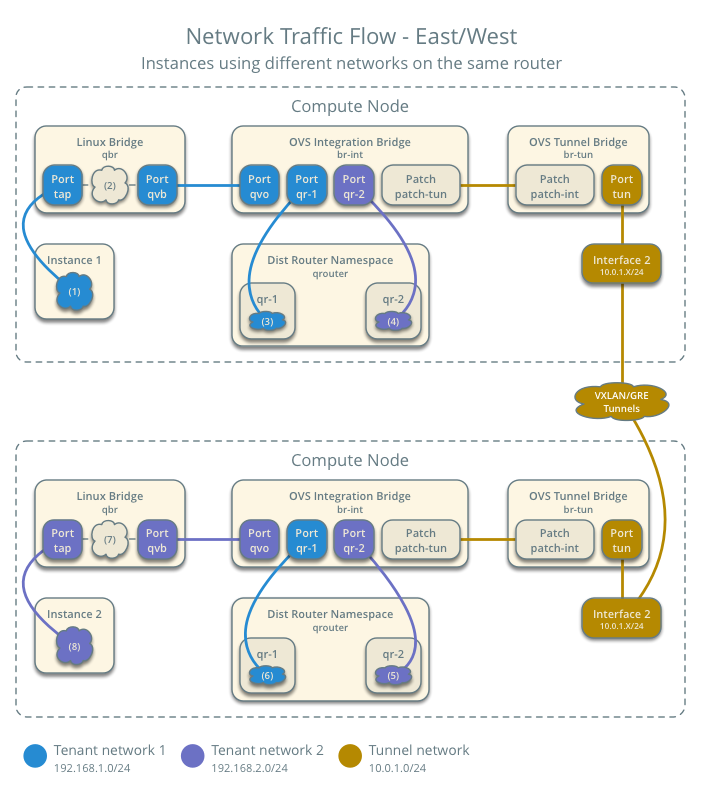

.. _scenario-dvr-ovs:

===================================================================
Scenario: High Availability using Distributed Virtual Routing (DVR)
===================================================================

This scenario describes the high-availability Distributed Virtual Routing
(DVR) implementation of the OpenStack Networking service using the ML2
plug-in and Open vSwitch. The example configuration creates one flat
external network and one VXLAN project (tenant) network. However, this
configuration also supports VLAN external networks, VLAN project networks,
and GRE project networks.

The DVR architecture augments the classic architecture by providing direct
connectivity to external networks on compute nodes. For instances with a
floating IP address, routing between project and external networks resides
completely on the compute nodes to eliminate single point of failure and
performance issues with classic network nodes. Routing also resides
completely on the compute nodes for instances with a fixed or floating IP
address using project networks on the same distributed virtual router.
However, instances with a fixed IP address still rely on the network node for
routing and SNAT services between project and external networks.

Prerequisites
~~~~~~~~~~~~~

These prerequisites define the minimal physical infrastructure and immediate
OpenStack service dependencies necessary to deploy this scenario. For example,
the Networking service immediately depends on the Identity service and the
Compute service immediately depends on the Networking service. These
dependencies lack services such as the Image service because the Networking
service does not immediately depend on it. However, the Compute service
depends on the Image service to launch an instance. The example configuration
in this scenario assumes basic configuration knowledge of Networking service
components.

Infrastructure
--------------

#. One controller node with one network interface: management.
#. One network node with four network interfaces: management, project tunnel
   networks, VLAN project networks, and external (typically the Internet).
   The Open vSwitch bridge ``br-vlan`` must contain a port on the VLAN
   interface and the Open vSwitch bridge ``br-ex`` must contain a port on the
   external interface.
#. At least two compute nodes with four network interfaces: management,
   project tunnel networks, project VLAN networks, and external (typically
   the Internet). The Open vSwitch bridge ``br-vlan`` must contain a port
   on the VLAN interface and the Open vSwitch bridge ``br-ex`` must contain
   a port on the external interface.

In the example configuration, the management network uses 10.0.0.0/24,
the tunnel network uses 10.0.1.0/24, and the external network uses
203.0.113.0/24. The VLAN network does not require an IP address range
because it only handles layer 2 connectivity.

.. image:: figures/scenario-dvr-services.png
   :alt: Service layout

.. note::

   For VLAN external and project networks, the network infrastructure must
   support VLAN tagging. For best performance, 10+ Gbps networks should support
   jumbo frames.

.. warning::

   Linux distributions often package older releases of Open vSwitch that can
   introduce issues during operation with the Networking service. We recommend
   using at least the latest long-term stable (LTS) release of Open vSwitch
   for the best experience and support from Open vSwitch. See
   `<http://www.openvswitch.org>`__ for available releases and the
   `installation instructions
   <https://github.com/openvswitch/ovs/blob/master/INSTALL.md>`__ for
   building newer releases from source on various distributions.

   Implementing VXLAN networks requires Linux kernel 3.13 or newer.

OpenStack services - controller node
------------------------------------

#. Operational SQL server with ``neutron`` database and appropriate
   configuration in the ``neutron.conf`` file.
#. Operational message queue service with appropriate configuration
   in the ``neutron.conf`` file.
#. Operational OpenStack Identity service with appropriate configuration
   in the ``neutron.conf`` file.
#. Operational OpenStack Compute controller/management service with
   appropriate configuration to use neutron in the ``nova.conf`` file.
#. Neutron server service, ML2 plug-in, and any dependencies.

OpenStack services - network node
---------------------------------

#. Operational OpenStack Identity service with appropriate configuration
   in the ``neutron.conf`` file.
#. Open vSwitch service, Open vSwitch agent, L3 agent, DHCP agent, metadata
   agent, and any dependencies.

OpenStack services - compute nodes
----------------------------------

#. Operational OpenStack Identity service with appropriate configuration
   in the ``neutron.conf`` file.
#. Operational OpenStack Compute hypervisor service with appropriate
   configuration to use neutron in the ``nova.conf`` file.
#. Open vSwitch service, Open vSwitch agent, L3 agent, metadata agent, and
   any dependencies.

Architecture
~~~~~~~~~~~~

.. note::

   The term *north-south* generally defines network traffic that
   travels between an instance and external network (typically the
   Internet) and the term *east-west* generally defines network traffic
   that travels between instances.

The network node contains the following network components:

#. Open vSwitch agent managing virtual switches, connectivity among
   them, and interaction via virtual ports with other network components
   such as namespaces, Linux bridges, and underlying interfaces.
#. DHCP agent managing the ``qdhcp`` namespaces. The ``dhcp`` namespaces
   provide DHCP services for instances using project networks.
#. L3 agent managing the ``qrouter`` and ``snat`` namespaces.

   #. For instances using project networks on classic routers, the ``qrouter``
      namespaces route *north-south* and *east-west* network traffic and
      perform DNAT/SNAT similar to the classic scenarios. They also route
      metadata traffic between instances and the metadata agent.
   #. For instances with a fixed IP address using project networks on
      distributed routers, the ``snat`` namespaces perform SNAT for
      *north-south* network traffic.

#. Metadata agent handling metadata operations for instances using project
   networks on classic routers.

The compute nodes contain the following network components:

#. Open vSwitch agent managing virtual switches, connectivity among
   them, and interaction via virtual ports with other network components
   such as namespaces, Linux bridges, and underlying interfaces.

#. L3 agent managing the ``qrouter`` and ``fip`` namespaces.

   #. For instances with a floating IP address using project networks on
      distributed routers, the ``fip`` namespaces route *north-south* network
      traffic and perform DNAT/SNAT.
   #. For instances with a fixed or floating IP address using project
      networks on distributed routers, the ``qrouter`` namespaces route
      *east-west* traffic.

#. Metadata agent handling metadata operations for instances using project
   networks on distributed routers.
#. Conventional Linux bridges handling security groups. Optionally, a native
   OVS implementation can handle security groups. However, due to kernel and
   OVS version requirements for it, this scenario uses conventional Linux
   bridges. See :ref:`config-ovsfwdriver` for more information.

Packet flow
~~~~~~~~~~~

Case 1: North/south for instances with a fixed IP address
---------------------------------------------------------

For instances with a fixed IP address using project networks on distributed
routers, the network node routes *north-south* network traffic between
project and external networks.

* External network

  * Network 203.0.113.0/24
  * Gateway 203.0.113.1 with MAC address *EG*
  * Floating IP range 203.0.113.101 to 203.0.113.200
  * Project network router interface 203.0.113.101 *TR*
  * Project network SNAT interface 192.168.1.2 with MAC address *TN*

* Project network

  * Network 192.168.1.0/24
  * Gateway 192.168.1.1 with MAC address *TG*

* Compute node 1

  * Instance 1 192.168.1.11 with MAC address *I1*
  * DVR MAC address *D1*

* Instance 1 resides on compute node 1 and uses a project network.
* The instance sends a packet to a host on the external network.

.. note::

   This scenario supports both VLAN and GRE/VXLAN project networks.
   However, the packet flow only considers one instance using a VXLAN project
   network for simplicity.

The following steps involve compute node 1:

#. The instance 1 ``tap`` interface (1) forwards the packet to the Linux
   bridge ``qbr``. The packet contains destination MAC address *TG*
   because the destination resides on another network.
#. Security group rules (2) on the Linux bridge ``qbr`` handle state tracking
   for the packet.
#. The Linux bridge ``qbr`` forwards the packet to the Open vSwitch
   integration bridge ``br-int``.
#. The Open vSwitch integration bridge ``br-int`` modifies the packet to
   contain the internal tag for project network 1.
#. The Open vSwitch integration bridge ``br-int`` forwards the packet (3)
   to the project network 1 gateway *TG* interface ``qr`` in the distributed
   router namespace ``qrouter``.
#. The distributed router ``qrouter`` namespace resolves the project network 1
   SNAT interface MAC address *TN* on the ``sg`` interface (4) in the SNAT
   namespace ``snat`` and forwards the packet to the Open vSwitch integration
   bridge ``br-int``.
#. The Open vSwitch integration bridge ``br-int`` forwards the packet to the
   Open vSwitch tunnel bridge ``br-tun``.
#. The Open vSwitch tunnel bridge ``br-tun`` replaces the packet source
   MAC address *I1* with *D1*.
#. The Open vSwitch tunnel bridge ``br-tun`` wraps the packet in a VXLAN
   tunnel that contains a tag for project network 1.
#. The Open vSwitch tunnel bridge ``br-tun`` forwards the packet to the
   network node via the tunnel interface.

The following steps involve the network node:

#. The tunnel interface forwards the packet to the Open vSwitch tunnel
   bridge ``br-tun``.
#. The Open vSwitch tunnel bridge ``br-tun`` unwraps the packet and adds
   the internal tag for project network 1.
#. The Open vSwitch tunnel bridge ``br-tun`` forwards the packet to the
   Open vSwitch integration bridge ``br-int``.
#. The Open vSwitch integration bridge ``br-int`` replaces the packet
   source MAC address *D1* with *TG*.
#. The Open vSwitch integration bridge ``br-int`` forwards the packet to
   the ``sg`` interface (4) in the SNAT namespace ``snat``.
#. The *iptables* service (5) performs SNAT on the packet using the project
   network 1 router interface IP address *TR* on the ``qg`` interface (6).
#. The ``qg`` interface forwards the packet to the Open vSwitch external
   bridge ``br-ex``.
#. The Open vSwitch external bridge ``br-ex`` forwards the packet to the
   external network via the external interface.

.. note::

   Return traffic follows similar steps in reverse.

Case 2: North/south for instances with a floating IP address
------------------------------------------------------------

For instances with a floating IP address using project networks on
distributed routers, the compute node containing the instance routes
*north-south* network traffic between project and external networks,
avoiding the network node. Given the complexity of this case, the
following case covers both the flow of network traffic from the external
network to an instance and from an instance to the external network.

* External network

  * Network 203.0.113.0/24
  * Gateway 203.0.113.1 with MAC address *EG*
  * Floating IP range 203.0.113.101 to 203.0.113.200
  * Project network router interface 203.0.113.101 *TR*

* Project network

  * Network 192.168.1.0/24
  * Gateway 192.168.1.1 with MAC address *TG*

* Compute node

  * Instance 1 192.168.1.11 with MAC address *I1* and floating
    IP address 203.0.113.102 *F1*
  * DVR MAC address *D1*
  * DVR internal IP addresses *DA1* and *DA2*

* Instance 1 resides on compute node 1 and uses a project network.
* Instance 1 sends a packet to a host on the external network.

.. note::

   This scenario supports both VLAN and GRE/VXLAN project networks.
   However, the packet flow only considers one instance using a VXLAN project
   network for simplicity.

The following steps involve a packet inbound from the external network
to an instance on compute node 1:

#. The external interface forwards the packet to the Open vSwitch
   external bridge ``br-ex``. The packet contains destination IP
   address *F1*.
#. The Open vSwitch external bridge ``br-ex`` forwards the packet to the
   ``fg`` interface (1) in the floating IP namespace ``fip``. The ``fg``
   interface responds to any ARP requests for the instance floating IP
   address *F1*.
#. The floating IP namespace ``fip`` routes the packet (2) to the
   distributed router namespace ``qrouter`` using DVR internal IP
   addresses *DA1* and *DA2*. The ``fpr`` interface (3) contains DVR
   internal IP address *DA1* and the ``rfp`` interface (4) contains DVR
   internal IP address *DA2*.
#. The floating IP namespace ``fip`` forwards the packet to the ``rfp``
   interface (5) in the distributed router namespace ``qrouter``. The ``rfp``
   interface also contains the instance floating IP address *F1*.
#. The *iptables* service (6) in the distributed router namespace ``qrouter``
   performs DNAT on the packet using the destination IP address. The ``qr``
   interface (7) contains the project network gateway IP address *TG*.
#. The distributed router namespace ``qrouter`` forwards the packet to the
   Open vSwitch integration bridge ``br-int``.
#. The Open vSwitch integration bridge ``br-int`` forwards the packet to
   the Linux bridge ``qbr``.
#. Security group rules (8) on the Linux bridge ``qbr`` handle firewalling
   and state tracking for the packet.
#. The Linux bridge ``qbr`` forwards the packet to the instance ``tap``
   interface (9).

The following steps involve a packet outbound from an instance on
compute node 1 to the external network:

#. The instance 1 ``tap`` interface (9) forwards the packet to the Linux
   bridge ``qbr``. The packet contains destination MAC address *TG1*
   because the destination resides on another network.
#. Security group rules (8) on the Linux bridge ``qbr`` handle state tracking
   for the packet.
#. The Linux bridge ``qbr`` forwards the packet to the Open vSwitch
   integration bridge ``br-int``.
#. The Open vSwitch integration bridge ``br-int`` forwards the packet to
   the ``qr`` interface (7) in the distributed router namespace ``qrouter``.
   The ``qr`` interface contains the project network gateway IP address
   *TG*.
#. The *iptables* service (6) performs SNAT on the packet using the ``rfp``
   interface (5) as the source IP address. The ``rfp`` interface contains
   the instance floating IP address *F1*.
#. The distributed router namespace ``qrouter`` (2) routes the packet
   to the floating IP namespace ``fip`` using DVR internal IP addresses
   *DA1* and *DA2*. The ``rfp`` interface (4) contains DVR internal
   IP address *DA2* and the ``fpr`` interface (3) contains DVR internal
   IP address *DA1*.
#. The ``fg`` interface (1) in the floating IP namespace ``fip`` forwards the
   packet to the Open vSwitch external bridge ``br-ex``. The ``fg`` interface
   contains the project router external IP address *TE*.
#. The Open vSwitch external bridge ``br-ex`` forwards the packet to the
   external network via the external interface.

Case 3: East/west for instances using different networks on the same router
---------------------------------------------------------------------------

For instances with fixed or floating IP addresses using project networks on
distributed routers, the compute nodes route *east-west* network traffic
among the project networks that reside on the same distributed virtual
router, avoiding the network node.

* Project network 1

  * Network 192.168.1.0/24
  * Gateway 192.168.1.1 with MAC address *TG1*

* Project network 2

  * Network 192.168.2.0/24
  * Gateway 192.168.2.1 with MAC address *TG2*

* Compute node 1

  * Instance 1 192.168.1.11 with MAC address *I1*
  * DVR MAC address *D1*

* Compute node 2

  * Instance 2 192.168.2.11 with MAC address *I2*
  * DVR MAC address *D2*

* Instance 1 resides on compute node 1 and uses project network 1.
* Instance 2 resides on compute node 2 and uses project network 2.
* Both project networks reside on the same distributed virtual router.
* Instance 1 sends a packet to instance 2.

.. note::

   This scenario supports both VLAN and GRE/VXLAN project networks.
   However, the packet flow only considers one instance using a VXLAN project
   network for simplicity.

The following steps involve compute node 1:

#. The instance 1 ``tap`` interface (1) forwards the packet to the Linux
   bridge ``qbr``. The packet contains destination MAC address *TG1*
   because the destination resides on another network.
#. Security group rules (2) on the Linux bridge ``qbr`` handle state tracking
   for the packet.
#. The Linux bridge ``qbr`` forwards the packet to the Open vSwitch
   integration bridge ``br-int``.
#. The Open vSwitch integration bridge ``br-int`` forwards the packet to
   the project network 1 interface (3) in the distributed router namespace
   ``qrouter``.
#. The distributed router namespace ``qrouter`` routes the packet to
   project network 2.
#. The project network 2 interface (4) in the distributed router namespace
   ``qrouter`` namespace forwards the packet to the Open vSwitch
   integration bridge ``br-int``.
#. The Open vSwitch integration bridge ``br-int`` modifies the packet
   to contain the internal tag for project network 2.
#. The Open vSwitch integration bridge ``br-int`` forwards the packet to
   the Open vSwitch tunnel bridge ``br-tun``.
#. The Open vSwitch tunnel bridge ``br-tun`` replaces the packet source
   MAC address *TG2* with *D1*.
#. The Open vSwitch tunnel bridge ``br-tun`` wraps the packet in a VXLAN
   tunnel that contains a tag for project network 2.
#. The Open vSwitch tunnel bridge ``br-tun`` forwards the packet to
   compute node 2 via the tunnel interface.

The following steps involve compute node 2:

#. The tunnel interface forwards the packet to the Open vSwitch tunnel
   bridge ``br-tun``.
#. The Open vSwitch tunnel bridge ``br-tun`` unwraps the packet.
#. The Open vSwitch tunnel bridge ``br-tun`` forwards the packet to the
   Open vSwitch integration bridge ``br-int``.
#. The Open vSwitch integration bridge ``br-int`` replaces the packet
   source MAC address *D1* with *TG2*.
#. The Open vSwitch integration bridge ``br-int`` forwards the packet to
   the Linux bridge ``qbr``.
#. Security group rules (7) on the Linux bridge ``qbr`` handle firewalling
   and state tracking for the packet.
#. The Linux bridge ``qbr`` forwards the packet to the instance 2 ``tap``
   interface (8).

.. note::

   Packets arriving from compute node 1 do not traverse the project
   network interfaces (5,6) in the ``qrouter`` namespace on compute node 2.
   However, return traffic traverses them.

.. todo:
   Case 4: East/west for instances using different networks on different
   routers
   Case 5: East/west for instances using the same network on the same router

Example configuration
~~~~~~~~~~~~~~~~~~~~~

Use the following example configuration as a template to deploy this
scenario in your environment.

.. note::

   This configuration primarily supports the Kilo release.

Controller node
---------------

#. In the ``neutron.conf`` file:

   * Configure common options and enable distributed routers by default:

     .. code-block:: ini

        [DEFAULT]
        core_plugin = ml2
        service_plugins = router
        allow_overlapping_ips = True
        router_distributed = True

     .. note::

        Configuring the ``router_distributed = True`` option creates distributed
        routers by default for all users. Without it, only privileged users can
        create distributed routers using the ``--distributed True`` option
        during router creation.

   * If necessary, :ref:`configure MTU <config-mtu>`.

#. In the ``ml2_conf.ini`` file:

   * Configure drivers and network types:

     .. code-block:: ini

        [ml2]
        type_drivers = flat,vlan,gre,vxlan
        tenant_network_types = vlan,gre,vxlan
        mechanism_drivers = openvswitch,l2population
        extension_drivers = port_security

   * Configure network mappings and ID ranges:

     .. code-block:: ini

      [ml2_type_flat]
      flat_networks = external

      [ml2_type_vlan]
      network_vlan_ranges = external,vlan:MIN_VLAN_ID:MAX_VLAN_ID

      [ml2_type_gre]
      tunnel_id_ranges = MIN_GRE_ID:MAX_GRE_ID

      [ml2_type_vxlan]
      vni_ranges = MIN_VXLAN_ID:MAX_VXLAN_ID

     Replace ``MIN_VLAN_ID``, ``MAX_VLAN_ID``, ``MIN_GRE_ID``, ``MAX_GRE_ID``,
     ``MIN_VXLAN_ID``, and ``MAX_VXLAN_ID`` with VLAN, GRE, and VXLAN ID minimum
     and maximum values suitable for your environment.

     .. note::

        The first value in the ``tenant_network_types`` option becomes the
        default project network type when a non-privileged user creates a
        network.

     .. note::

        The ``external`` value in the ``network_vlan_ranges`` option lacks VLAN
        ID ranges to support use of arbitrary VLAN IDs by privileged users.

   * Configure the security group driver:

     .. code-block:: ini

        [securitygroup]
        firewall_driver = iptables_hybrid

   * If necessary, :ref:`configure MTU <config-mtu>`.

#. Start the following services:

   * Server

Network node
------------

#. In the ``openvswitch_agent.ini`` file, configure the Open vSwitch agent:

   .. code-block:: ini

      [ovs]
      local_ip = TUNNEL_INTERFACE_IP_ADDRESS
      bridge_mappings = vlan:br-vlan,external:br-ex

      [agent]
      tunnel_types = gre,vxlan
      enable_distributed_routing = True
      l2_population = True
      arp_responder = True

      [securitygroup]
      firewall_driver = iptables_hybrid

   Replace ``TUNNEL_INTERFACE_IP_ADDRESS`` with the IP address of the interface
   that handles GRE/VXLAN project networks.

#. In the ``l3_agent.ini`` file, configure the L3 agent:

   .. code-block:: ini

      [DEFAULT]
      interface_driver = neutron.agent.linux.interface.OVSInterfaceDriver
      external_network_bridge =
      agent_mode = dvr_snat

   .. note::

      The ``external_network_bridge`` option intentionally contains
      no value.

#. In the ``dhcp_agent.ini`` file, configure the DHCP agent:

   .. code-block:: ini

      [DEFAULT]
      interface_driver = neutron.agent.linux.interface.OVSInterfaceDriver
      enable_isolated_metadata = True

#. In the ``metadata_agent.ini`` file, configure the metadata agent:

   .. code-block:: ini

      [DEFAULT]
      nova_metadata_ip = controller
      metadata_proxy_shared_secret = METADATA_SECRET

   Replace ``METADATA_SECRET`` with a suitable value for your environment.

#. Start the following services:

   * Open vSwitch
   * Open vSwitch agent
   * L3 agent
   * DHCP agent
   * Metadata agent

Compute nodes
-------------

#. In the ``openvswitch_agent.ini`` file, configure the Open vSwitch agent:

   .. code-block:: ini

      [ovs]
      local_ip = TUNNEL_INTERFACE_IP_ADDRESS
      bridge_mappings = vlan:br-vlan,external:br-ex

      [agent]
      tunnel_types = gre,vxlan
      enable_distributed_routing = True
      l2_population = True
      arp_responder = True

      [securitygroup]
      firewall_driver = iptables_hybrid

   Replace ``TUNNEL_INTERFACE_IP_ADDRESS`` with the IP address of the interface
   that handles GRE/VXLAN project networks.

#. In the ``l3_agent.ini`` file, configure the L3 agent:

   .. code-block:: ini

      [DEFAULT]
      interface_driver = neutron.agent.linux.interface.OVSInterfaceDriver
      external_network_bridge =
      agent_mode = dvr

   .. note::

      The ``external_network_bridge`` option intentionally contains
      no value.

#. In the ``metadata_agent.ini`` file, configure the metadata agent:

   .. code-block:: ini

      [DEFAULT]
      nova_metadata_ip = controller
      metadata_proxy_shared_secret = METADATA_SECRET

   Replace ``METADATA_SECRET`` with a suitable value for your environment.

#. Start the following services:

   * Open vSwitch
   * Open vSwitch agent
   * L3 agent
   * Metadata agent

Verify service operation
------------------------

#. Source the administrative project credentials.
#. Verify presence and operation of the agents:

   .. code-block:: console

      $ neutron agent-list

      +--------------------------------------+--------------------+----------+-------+----------------+---------------------------+
      | id                                   | agent_type         | host     | alive | admin_state_up | binary                    |
      +--------------------------------------+--------------------+----------+-------+----------------+---------------------------+
      | 10b084e5-4ab8-43d6-9b04-6d56f27f9cd4 | Metadata agent     | network1 | :-)   | True           | neutron-metadata-agent    |
      | 2f90ef81-3eed-4ecf-b6b9-2d2c21dda85c | Open vSwitch agent | compute2 | :-)   | True           | neutron-openvswitch-agent |
      | 319563ac-88f9-4352-b63e-e55beb673372 | DHCP agent         | network1 | :-)   | True           | neutron-dhcp-agent        |
      | 3345723e-16e8-4b74-9d15-d7f1f977a3bd | Open vSwitch agent | compute1 | :-)   | True           | neutron-openvswitch-agent |
      | 4643c811-a54a-41da-91a8-c2328bcaeea3 | Open vSwitch agent | network1 | :-)   | True           | neutron-openvswitch-agent |
      | 5ad81671-efc3-4acc-9d5d-030a1c4f6a25 | L3 agent           | compute1 | :-)   | True           | neutron-l3-agent          |
      | 641337fa-99c2-468d-8d7e-89277d6ba144 | Metadata agent     | compute1 | :-)   | True           | neutron-metadata-agent    |
      | 9372e008-bd29-4436-8e01-8ddfd50d2b74 | L3 agent           | network1 | :-)   | True           | neutron-l3-agent          |
      | af9d1169-1012-4440-9de2-778c8fce21b9 | L3 agent           | compute2 | :-)   | True           | neutron-l3-agent          |
      | ee59e3ba-ee3c-4621-b3d5-c9d8123b6cc5 | Metadata agent     | compute2 | :-)   | True           | neutron-metadata-agent    |
      +--------------------------------------+--------------------+----------+-------+----------------+---------------------------+

Create initial networks
-----------------------

This example creates a flat external network and a VXLAN project network.

#. Source the administrative project credentials.
#. Create the external network:

   .. code-block:: console

      $ neutron net-create ext-net --router:external \
        --provider:physical_network external --provider:network_type flat

      Created a new network:
      +---------------------------+--------------------------------------+
      | Field                     | Value                                |
      +---------------------------+--------------------------------------+
      | admin_state_up            | True                                 |
      | id                        | 893aebb9-1c1e-48be-8908-6b947f3237b3 |
      | name                      | ext-net                              |
      | provider:network_type     | flat                                 |
      | provider:physical_network | external                             |
      | provider:segmentation_id  |                                      |
      | router:external           | True                                 |
      | shared                    | False                                |
      | status                    | ACTIVE                               |
      | subnets                   |                                      |
      | tenant_id                 | 54cd044c64d5408b83f843d63624e0d8     |
      +---------------------------+--------------------------------------+

#. Create a subnet on the external network:

   .. code-block:: console

      $ neutron subnet-create ext-net 203.0.113.0/24 --allocation-pool \
        start=203.0.113.101,end=203.0.113.200 --disable-dhcp \
        --gateway 203.0.113.1

      Created a new subnet:
      +-------------------+------------------------------------------------------+
      | Field             | Value                                                |
      +-------------------+------------------------------------------------------+
      | allocation_pools  | {"start": "203.0.113.101", "end": "203.0.113.200"}   |
      | cidr              | 203.0.113.0/24                                       |
      | dns_nameservers   |                                                      |
      | enable_dhcp       | False                                                |
      | gateway_ip        | 203.0.113.1                                          |
      | host_routes       |                                                      |
      | id                | 9159f0dc-2b63-41cf-bd7a-289309da1391                 |
      | ip_version        | 4                                                    |
      | ipv6_address_mode |                                                      |
      | ipv6_ra_mode      |                                                      |
      | name              | ext-subnet                                           |
      | network_id        | 893aebb9-1c1e-48be-8908-6b947f3237b3                 |
      | tenant_id         | 54cd044c64d5408b83f843d63624e0d8                     |
      +-------------------+------------------------------------------------------+

.. note::

   The example configuration contains ``vlan`` as the first project network
   type. Only a privileged user can create other types of networks such as
   GRE or VXLAN. The following commands use the ``admin`` project credentials
   to create a VXLAN project network.

#. Obtain the ID of a regular project. For example, using the ``demo`` project:

   .. code-block:: console

      $ openstack project show demo
      +-------------+----------------------------------+
      | Field       | Value                            |
      +-------------+----------------------------------+
      | description | Demo Project                     |
      | enabled     | True                             |
      | id          | cdef0071a0194d19ac6bb63802dc9bae |
      | name        | demo                             |
      +-------------+----------------------------------+

#. Create the project network:

   .. code-block:: console

      $ neutron net-create demo-net --tenant-id cdef0071a0194d19ac6bb63802dc9bae \
        --provider:network_type vxlan

      Created a new network:
      +---------------------------+--------------------------------------+
      | Field                     | Value                                |
      +---------------------------+--------------------------------------+
      | admin_state_up            | True                                 |
      | id                        | ac108952-6096-4243-adf4-bb6615b3de28 |
      | name                      | demo-net                             |
      | provider:network_type     | vxlan                                |
      | provider:physical_network |                                      |
      | provider:segmentation_id  | 1                                    |
      | router:external           | False                                |
      | shared                    | False                                |
      | status                    | ACTIVE                               |
      | subnets                   |                                      |
      | tenant_id                 | cdef0071a0194d19ac6bb63802dc9bae     |
      +---------------------------+--------------------------------------+

#. Source the regular project credentials.
#. Create a subnet on the project network:

   .. code-block:: console

      $ neutron subnet-create demo-net --name demo-subnet --gateway 192.168.1.1 \
        192.168.1.0/24

      Created a new subnet:
      +-------------------+------------------------------------------------------+
      | Field             | Value                                                |
      +-------------------+------------------------------------------------------+
      | allocation_pools  | {"start": "192.168.1.2", "end": "192.168.1.254"}     |
      | cidr              | 192.168.1.0/24                                       |
      | dns_nameservers   |                                                      |
      | enable_dhcp       | True                                                 |
      | gateway_ip        | 192.168.1.1                                          |
      | host_routes       |                                                      |
      | id                | 69d38773-794a-4e49-b887-6de6734e792d                 |
      | ip_version        | 4                                                    |
      | ipv6_address_mode |                                                      |
      | ipv6_ra_mode      |                                                      |
      | name              | demo-subnet                                          |
      | network_id        | ac108952-6096-4243-adf4-bb6615b3de28                 |
      | tenant_id         | cdef0071a0194d19ac6bb63802dc9bae                     |
      +-------------------+------------------------------------------------------+

#. Create a distributed project router:

   .. code-block:: console

      $ neutron router-create demo-router

      Created a new router:
      +-----------------------+--------------------------------------+
      | Field                 | Value                                |
      +-----------------------+--------------------------------------+
      | admin_state_up        | True                                 |
      | distributed           | True                                 |
      | external_gateway_info |                                      |
      | ha                    | False                                |
      | id                    | 635660ae-a254-4feb-8993-295aa9ec6418 |
      | name                  | demo-router                          |
      | routes                |                                      |
      | status                | ACTIVE                               |
      | tenant_id             | cdef0071a0194d19ac6bb63802dc9bae     |
      +-----------------------+--------------------------------------+

   .. note::

      Default policy might prevent the '`distributed`` flag from
      appearing in the command output for non-privileged users.

#. Attach the project network to the router:

   .. code-block:: console

      $ neutron router-interface-add demo-router demo-subnet
      Added interface b1a894fd-aee8-475c-9262-4342afdc1b58 to router demo-router.

#. Add a gateway to the external network for the project network on the
   router:

   .. code-block:: console

      $ neutron router-gateway-set demo-router ext-net
      Set gateway for router demo-router

Verify network operation
------------------------

#. On the network node, verify creation of the `snat`, `qrouter`, and `qdhcp`
   namespaces:

   .. code-block:: console

      $ ip netns
      snat-4d7928a0-4a3c-4b99-b01b-97da2f97e279
      qrouter-4d7928a0-4a3c-4b99-b01b-97da2f97e279
      qdhcp-353f5937-a2d3-41ba-8225-fa1af2538141

   .. note::

      One or more namespaces might not exist until launching an instance.

#. Source the administrative project credentials.
#. Determine the external network gateway IP address for the project network
   on the router, typically the lowest IP address in the external subnet IP
   allocation range:

   .. code-block:: console

      $ neutron router-port-list demo-router
      +--------------------------------------+------+-------------------+--------------------------------------------------------------------------------------+
      | id                                   | name | mac_address       | fixed_ips                                                                            |
      +--------------------------------------+------+-------------------+--------------------------------------------------------------------------------------+
      | b1a894fd-aee8-475c-9262-4342afdc1b58 |      | fa:16:3e:c1:20:55 | {"subnet_id": "69d38773-794a-4e49-b887-6de6734e792d", "ip_address": "192.168.1.1"}   |
      | ff5f93c6-3760-4902-a401-af78ff61ce99 |      | fa:16:3e:54:d7:8c | {"subnet_id": "9159f0dc-2b63-41cf-bd7a-289309da1391", "ip_address": "203.0.113.101"} |
      +--------------------------------------+------+-------------------+--------------------------------------------------------------------------------------+

#. On the controller node or any host with access to the external network,
   ping the external network gateway IP address on the project router:

   .. code-block:: console

      $ ping -c 4 203.0.113.101
      PING 203.0.113.101 (203.0.113.101) 56(84) bytes of data.
      64 bytes from 203.0.113.101: icmp_req=1 ttl=64 time=0.619 ms
      64 bytes from 203.0.113.101: icmp_req=2 ttl=64 time=0.189 ms
      64 bytes from 203.0.113.101: icmp_req=3 ttl=64 time=0.165 ms
      64 bytes from 203.0.113.101: icmp_req=4 ttl=64 time=0.216 ms

      --- 203.0.113.101 ping statistics ---
      4 packets transmitted, 4 received, 0% packet loss, time 2999ms
      rtt min/avg/max/mdev = 0.165/0.297/0.619/0.187 ms

#. Source the regular project credentials.
#. Launch an instance with an interface on the project network.
#. On the compute node with the instance, verify creation of the ``qrouter``
   namespace:

   .. code-block:: console

      $ ip netns
      qrouter-4d7928a0-4a3c-4b99-b01b-97da2f97e279

#. Obtain console access to the instance.

   #. Test connectivity to the project router:

      .. code-block:: console

         $ ping -c 4 192.168.1.1
         PING 192.168.1.1 (192.168.1.1) 56(84) bytes of data.
         64 bytes from 192.168.1.1: icmp_req=1 ttl=64 time=0.357 ms
         64 bytes from 192.168.1.1: icmp_req=2 ttl=64 time=0.473 ms
         64 bytes from 192.168.1.1: icmp_req=3 ttl=64 time=0.504 ms
         64 bytes from 192.168.1.1: icmp_req=4 ttl=64 time=0.470 ms

         --- 192.168.1.1 ping statistics ---
         4 packets transmitted, 4 received, 0% packet loss, time 2998ms
         rtt min/avg/max/mdev = 0.357/0.451/0.504/0.055 ms

   #. Test connectivity to the Internet:

      .. code-block:: console

         $ ping -c 4 openstack.org
         PING openstack.org (174.143.194.225) 56(84) bytes of data.
         64 bytes from 174.143.194.225: icmp_req=1 ttl=53 time=17.4 ms
         64 bytes from 174.143.194.225: icmp_req=2 ttl=53 time=17.5 ms
         64 bytes from 174.143.194.225: icmp_req=3 ttl=53 time=17.7 ms
         64 bytes from 174.143.194.225: icmp_req=4 ttl=53 time=17.5 ms

         --- openstack.org ping statistics ---
         4 packets transmitted, 4 received, 0% packet loss, time 3003ms
         rtt min/avg/max/mdev = 17.431/17.575/17.734/0.143 ms

#. Create the appropriate security group rules to allow ping and SSH access
   to the instance. For example:

   .. code-block:: console

     $ nova secgroup-add-rule default icmp -1 -1 0.0.0.0/0

      +-------------+-----------+---------+-----------+--------------+
      | IP Protocol | From Port | To Port | IP Range  | Source Group |
      +-------------+-----------+---------+-----------+--------------+
      | icmp        | -1        | -1      | 0.0.0.0/0 |              |
      +-------------+-----------+---------+-----------+--------------+

      $ nova secgroup-add-rule default tcp 22 22 0.0.0.0/0

      +-------------+-----------+---------+-----------+--------------+
      | IP Protocol | From Port | To Port | IP Range  | Source Group |
      +-------------+-----------+---------+-----------+--------------+
      | tcp         | 22        | 22      | 0.0.0.0/0 |              |
      +-------------+-----------+---------+-----------+--------------+

#. Create a floating IP address on the external network:

   .. code-block:: console

      $ neutron floatingip-create ext-net

      Created a new floatingip:
      +---------------------+--------------------------------------+
      | Field               | Value                                |
      +---------------------+--------------------------------------+
      | fixed_ip_address    |                                      |
      | floating_ip_address | 203.0.113.102                        |
      | floating_network_id | 9bce64a3-a963-4c05-bfcd-161f708042d1 |
      | id                  | 05e36754-e7f3-46bb-9eaa-3521623b3722 |
      | port_id             |                                      |
      | router_id           |                                      |
      | status              | DOWN                                 |
      | tenant_id           | 7cf50047f8df4824bc76c2fdf66d11ec     |
      +---------------------+--------------------------------------+

#. Associate the floating IP address with the instance:

   .. code-block:: console

      $ nova floating-ip-associate demo-instance1 203.0.113.102

#. Verify addition of the floating IP address to the instance:

   .. code-block:: console

      $ nova list

      +--------------------------------------+----------------+--------+------------+-------------+-----------------------------------------+
      | ID                                   | Name           | Status | Task State | Power State | Networks                                |
      +--------------------------------------+----------------+--------+------------+-------------+-----------------------------------------+
      | 05682b91-81a1-464c-8f40-8b3da7ee92c5 | demo-instance1 | ACTIVE | -          | Running     | demo-net=192.168.1.3, 203.0.113.102     |
      +--------------------------------------+----------------+--------+------------+-------------+-----------------------------------------+

#. On the compute node with the instance, verify creation of the ``fip``
   namespace:

   .. code-block:: console

      $ ip netns
      fip-2c7bd9c2-8ab0-46ef-b7c1-023ce0452c24

#. On the controller node or any host with access to the external network,
   ping the floating IP address associated with the instance:

   .. code-block:: console

      $ ping -c 4 203.0.113.102
      PING 203.0.113.102 (203.0.113.112) 56(84) bytes of data.
      64 bytes from 203.0.113.102: icmp_req=1 ttl=63 time=3.18 ms
      64 bytes from 203.0.113.102: icmp_req=2 ttl=63 time=0.981 ms
      64 bytes from 203.0.113.102: icmp_req=3 ttl=63 time=1.06 ms
      64 bytes from 203.0.113.102: icmp_req=4 ttl=63 time=0.929 ms

      --- 203.0.113.102 ping statistics ---
      4 packets transmitted, 4 received, 0% packet loss, time 3002ms
      rtt min/avg/max/mdev = 0.929/1.539/3.183/0.951 ms
