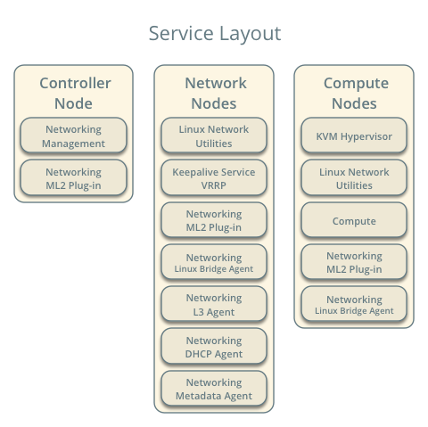
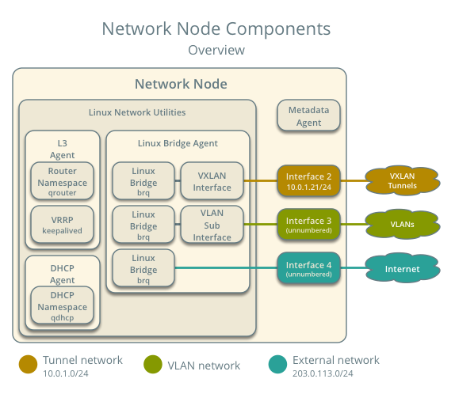
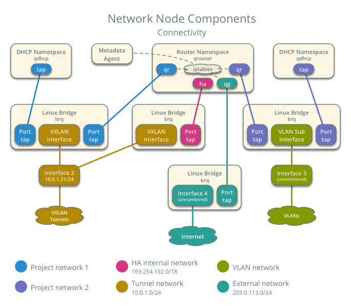
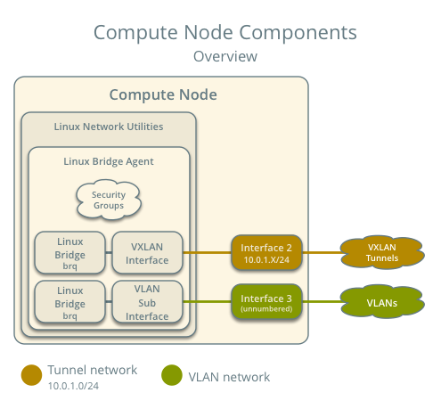
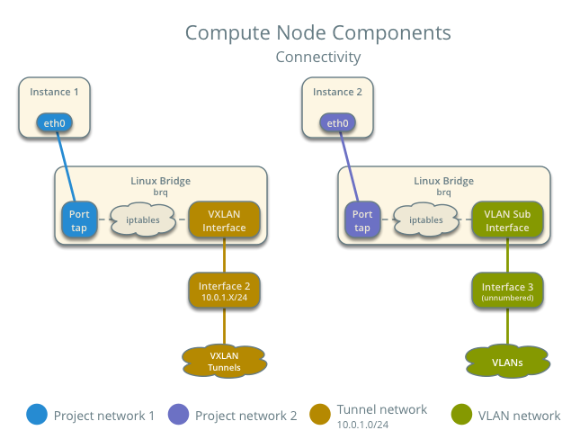

.. _scenario-l3ha-lb:

===============================================================
Scenario: High availability using VRRP (L3HA) with Linux Bridge
===============================================================

This scenario describes a high-availability implementation of the OpenStack
Networking service using the ML2 plug-in and Linux bridge.

This high availability implementation augments the :ref:`scenario-classic-lb`
architecture with Virtual Router Redundancy Protocol (VRRP) using
``keepalived`` to provide quick failover of layer-3 services. See
:ref:`scenario_l3ha_lb-packet_flow` for VRRP operation. Similar to the classic
scenario, all network traffic on a project network that requires routing
actively traverses only one network node regardless of the quantity of network
nodes providing HA for the router. Therefore, this high availability
implementation primarily addresses failure situations instead of bandwidth
constraints that limit performance. However, it supports random distribution
of routers on different network nodes to reduce the chances of bandwidth
constraints and to improve scaling. Also, this implementation does not address
situations where one or more layer-3 agents fail and the underlying virtual
networks continue to operate normally. Consider deploying
:ref:`scenario-dvr-ovs` to increase performance in addition to redundancy. As
of the Liberty release, you cannot combine the DVR and L3HA mechanisms.

.. note::

   The failover process only retains the state of network connections for
   instances with a floating IP address.

The example configuration creates one flat external network and one VXLAN
project (tenant) network. However, this configuration also supports VLAN
external and project networks.

.. note::

   Due to a bug, we recommend disabling the layer-2 population mechanism
   for deployments using VXLAN project networks. For more information, see
   `<https://bugs.launchpad.net/neutron/+bug/1523031>`__.

Prerequisites
~~~~~~~~~~~~~

These prerequisites define the minimal physical infrastructure and immediate
OpenStack service dependencies necessary to deploy this scenario. For example,
the Networking service immediately depends on the Identity service and the
Compute service immediately depends on the Networking service. These
dependencies lack services such as the Image service because the Networking
service does not immediately depend on it. However, the Compute service
depends on the Image service to launch an instance. The example configuration
in this scenario assumes basic configuration knowledge of Networking service
components. For assistance with basic configuration of the Networking service,
see the Installation Guide.

Infrastructure
--------------

#. One controller node with one network interface: management.
#. At least two network nodes with four network interfaces: management,
   project tunnel networks, project VLAN networks, and external (typically
   the Internet).
#. At least two compute nodes with three network interfaces: management,
   project tunnel networks, and project VLAN networks.

To improve understanding of network traffic flow, the network and compute
nodes contain a separate network interface for project VLAN networks. In
production environments, you can use any network interface for VLAN project
networks.

In the example configuration, the management network uses 10.0.0.0/24,
the tunnel network uses 10.0.1.0/24, the VRRP network uses 169.254.192.0/18,
and the external network uses 203.0.113.0/24. The VLAN network does not
require an IP address range because it only handles layer-2 connectivity.

.. image:: figures/scenario-l3ha-hw.png
   :alt: Hardware layout

.. image:: figures/scenario-l3ha-networks.png
   :alt: Network layout

.. note::

   For VLAN external and project networks, the network infrastructure must
   support VLAN tagging. For best performance, 10+ Gbps networks should support
   jumbo frames.

.. warning::

   Using VXLAN project networks requires kernel 3.13 or newer.

OpenStack services - controller node
------------------------------------

#. Operational SQL server with ``neutron`` database and appropriate
   configuration in the ``neutron.conf`` file.
#. Operational message queue service with appropriate configuration
   in the ``neutron.conf`` file.
#. Operational OpenStack Identity service with appropriate configuration
   in the ``neutron.conf`` file.
#. Operational OpenStack Compute controller/management service with
   appropriate configuration to use neutron in the ``nova.conf`` file.
#. Neutron server service, ML2 plug-in, and any dependencies.

OpenStack services - network nodes
----------------------------------

#. Operational OpenStack Identity service with appropriate configuration
   in the ``neutron.conf`` file.
#. Linux bridge agent, L3 agent, DHCP agent, metadata agent, and any
   dependencies.

OpenStack services - compute nodes
----------------------------------

#. Operational OpenStack Identity service with appropriate configuration
   in the ``neutron.conf`` file.
#. Operational OpenStack Compute hypervisor service with appropriate
   configuration to use neutron in the ``nova.conf`` file.
#. Linux bridge agent and any dependencies.

Architecture
~~~~~~~~~~~~

.. image:: figures/scenario-l3ha-general.png
   :alt: Architecture overview

The network nodes contain the following components:

#. Linux bridge agent managing virtual switches, connectivity among
   them, and interaction via virtual ports with other network components
   such as namespaces and underlying interfaces.
#. DHCP agent managing the ``qdhcp`` namespaces. The ``qdhcp`` namespaces
   provide DHCP services for instances using project networks.
#. L3 agent managing the ``qrouter`` namespaces and VRRP using ``keepalived``.
   The ``qrouter`` namespaces provide routing between project and external
   networks and among project networks. They also route metadata traffic
   between instances and the metadata agent.
#. Metadata agent handling metadata operations for instances.

.. note::

   For simplicity, the hidden project network that connects all HA routers for
   a particular project uses the VXLAN network type.

The compute nodes contain the following network components:

#. Linux bridge agent managing virtual switches, connectivity among
   them, and interaction via virtual ports with other network components
   such as namespaces, security groups, and underlying interfaces.

.. _scenario_l3ha_lb-packet_flow:

Packet flow
~~~~~~~~~~~

The L3HA mechanism simply augments :ref:`scenario-classic-lb` with quick
failover of layer-3 services to another router if the master router
fails.

During normal operation, the master router periodically transmits *heartbeat*
packets over a hidden project network that connects all HA routers for a
particular project. By default, this network uses the type indicated by the
first value in the ``tenant_network_types`` option in the
``ml2_conf.ini`` file.

If the backup router stops receiving these packets, it assumes failure
of the master router and promotes itself to the master router by configuring
IP addresses on the interfaces in the ``qrouter`` namespace. In environments
with more than one backup router, the router with the next highest priority
becomes the master router.

.. note::

   The L3HA mechanism uses the same priority for all routers. Therefore, VRRP
   promotes the backup router with the highest IP address to the master
   router.

Example configuration
~~~~~~~~~~~~~~~~~~~~~

Use the following example configuration as a template to deploy this
scenario in your environment.

Controller node
---------------

#. In the ``neutron.conf`` file:

   * Configure common options, enable VRRP, and enable DHCP agent
     redundancy:

     .. code-block:: ini

        [DEFAULT]
        core_plugin = ml2
        service_plugins = router
        allow_overlapping_ips = True
        l3_ha = True
        dhcp_agents_per_network = 2

     .. note::

        You can increase the ``dhcp_agents_per_network`` value up to the
        number of nodes running the DHCP agent.

   * If necessary, :ref:`configure MTU <config-mtu>`.

#. In the ``ml2_conf.ini`` file:

   * Configure drivers and network types:

     .. code-block:: ini

        [ml2]
        type_drivers = flat,vlan,vxlan
        tenant_network_types = vlan,vxlan
        mechanism_drivers = linuxbridge
        extension_drivers = port_security

   * Configure network mappings and ID ranges:

     .. code-block:: ini

        [ml2_type_flat]
        flat_networks = external

        [ml2_type_vlan]
        network_vlan_ranges = external,vlan:MIN_VLAN_ID:MAX_VLAN_ID

        [ml2_type_vxlan]
        vni_ranges = MIN_VXLAN_ID:MAX_VXLAN_ID

     Replace ``MIN_VLAN_ID``, ``MAX_VLAN_ID``, ``MIN_VXLAN_ID``, and
     ``MAX_VXLAN_ID`` with VLAN and VXLAN ID minimum and maximum values suitable
     for your environment.

     .. note::

        The first value in the ``tenant_network_types`` option becomes the
        default project network type when a regular user creates a network.

     .. note::

        The ``external`` value in the ``network_vlan_ranges`` option lacks VLAN
        ID ranges to support use of arbitrary VLAN IDs by administrative users.

   * Configure the security group driver:

     .. code-block:: ini

        [securitygroup]
        firewall_driver = iptables

   * If necessary, :ref:`configure MTU <config-mtu>`.

#. Start the following services:

   * Server

Network nodes
-------------

#. In the ``linuxbridge_agent.ini`` file, configure the Linux bridge agent:

   .. code-block:: ini

      [linux_bridge]
      physical_interface_mappings = vlan:PROJECT_VLAN_INTERFACE,external:EXTERNAL_INTERFACE

      [vxlan]
      local_ip = TUNNEL_INTERFACE_IP_ADDRESS
      l2_population = False

      [securitygroup]
      firewall_driver = iptables

   Replace ``PROJECT_VLAN_INTERFACE`` and ``EXTERNAL_INTERFACE`` with the name
   of the underlying interface that handles VLAN project networks and external
   networks, respectively. Replace ``TUNNEL_INTERFACE_IP_ADDRESS`` with the IP
   address of the interface that handles project tunnel networks.

#. In the ``l3_agent.ini`` file, configure the L3 agent:

   .. code-block:: ini

      [DEFAULT]
      interface_driver = neutron.agent.linux.interface.BridgeInterfaceDriver
      external_network_bridge =

   .. note::

      The ``external_network_bridge`` option intentionally contains
      no value.

#. In the ``dhcp_agent.ini`` file, configure the DHCP agent:

   .. code-block:: ini

      [DEFAULT]
      interface_driver = neutron.agent.linux.interface.BridgeInterfaceDriver
      enable_isolated_metadata = True

#. In the ``metadata_agent.ini`` file, configure the metadata agent:

   .. code-block:: ini

      [DEFAULT]
      nova_metadata_ip = controller
      metadata_proxy_shared_secret = METADATA_SECRET

   Replace ``METADATA_SECRET`` with a suitable value for your environment.

#. Start the following services:

   * Linux bridge agent
   * L3 agent
   * DHCP agent
   * Metadata agent

Compute nodes
-------------

#. In the ``linuxbridge_agent.ini`` file, configure the Linux bridge agent:

   .. code-block:: ini

      [linux_bridge]
      physical_interface_mappings = vlan:PROJECT_VLAN_INTERFACE

      [vxlan]
      local_ip = TUNNEL_INTERFACE_IP_ADDRESS
      l2_population = False

      [securitygroup]
      firewall_driver = iptables

   Replace ``PROJECT_VLAN_INTERFACE`` and ``EXTERNAL_INTERFACE`` with the name
   of the underlying interface that handles VLAN project networks and external
   networks, respectively. Replace ``TUNNEL_INTERFACE_IP_ADDRESS`` with the IP
   address of the interface that handles project tunnel networks.

#. Start the following services:

   * Linux bridge agent

Verify service operation
------------------------

#. Source the administrative project credentials.
#. Verify presence and operation of the agents:

   .. code-block:: console

      $ neutron agent-list

      +--------------------------------------+--------------------+----------+-------+----------------+---------------------------+
      | id                                   | agent_type         | host     | alive | admin_state_up | binary                    |
      +--------------------------------------+--------------------+----------+-------+----------------+---------------------------+
      | 7856ba29-5447-4392-b2e1-2c236bd5f479 | Metadata agent     | network1 | :-)   | True           | neutron-metadata-agent    |
      | 85d5c715-08f6-425d-9efc-73633736bf06 | Linux bridge agent | network2 | :-)   | True           | neutron-linuxbridge-agent |
      | 98d32a4d-1257-4b42-aea4-ad9bd7deea62 | Metadata agent     | network2 | :-)   | True           | neutron-metadata-agent    |
      | b45096a1-7bfa-4816-8b3c-900b752a9c08 | DHCP agent         | network1 | :-)   | True           | neutron-dhcp-agent        |
      | d4c45b8e-3b34-4192-80b1-bbdefb110c3f | Linux bridge agent | compute2 | :-)   | True           | neutron-linuxbridge-agent |
      | e5a4e06b-dd9d-4b97-a09a-c8ba07706753 | Linux bridge agent | network1 | :-)   | True           | neutron-linuxbridge-agent |
      | e8f8b228-5c3e-4378-b8f5-36b5c41cb3fe | L3 agent           | network2 | :-)   | True           | neutron-l3-agent          |
      | f2d10c26-2136-4e6a-86e5-d22f67ab22d7 | Linux bridge agent | compute1 | :-)   | True           | neutron-linuxbridge-agent |
      | f9f94732-08af-4f82-8908-fdcd69ab12e8 | L3 agent           | network1 | :-)   | True           | neutron-l3-agent          |
      | fbeebad9-6590-4f78-bb29-7d58ea867878 | DHCP agent         | network2 | :-)   | True           | neutron-dhcp-agent        |
      +--------------------------------------+--------------------+----------+-------+----------------+---------------------------+

Create initial networks
-----------------------

This example creates a flat external network and a VXLAN project network.

#. Source the administrative project credentials.
#. Create the external network:

   .. code-block:: console

      $ neutron net-create ext-net --router:external \
        --provider:physical_network external --provider:network_type flat

      Created a new network:
      +---------------------------+--------------------------------------+
      | Field                     | Value                                |
      +---------------------------+--------------------------------------+
      | admin_state_up            | True                                 |
      | id                        | 5266fcbc-d429-4b21-8544-6170d1691826 |
      | name                      | ext-net                              |
      | provider:network_type     | flat                                 |
      | provider:physical_network | external                             |
      | provider:segmentation_id  |                                      |
      | router:external           | True                                 |
      | shared                    | False                                |
      | status                    | ACTIVE                               |
      | subnets                   |                                      |
      | tenant_id                 | 96393622940e47728b6dcdb2ef405f50     |
      +---------------------------+--------------------------------------+

#. Create a subnet on the external network:

   .. code-block:: console

      $ neutron subnet-create ext-net 203.0.113.0/24 --name ext-subnet \
        --allocation-pool start=203.0.113.101,end=203.0.113.200 \
        --disable-dhcp --gateway 203.0.113.1

      Created a new subnet:
      +-------------------+----------------------------------------------------+
      | Field             | Value                                              |
      +-------------------+----------------------------------------------------+
      | allocation_pools  | {"start": "203.0.113.101", "end": "203.0.113.200"} |
      | cidr              | 203.0.113.0/24                                     |
      | dns_nameservers   |                                                    |
      | enable_dhcp       | False                                              |
      | gateway_ip        | 203.0.113.1                                        |
      | host_routes       |                                                    |
      | id                | b32e0efc-8cc3-43ff-9899-873b94df0db1               |
      | ip_version        | 4                                                  |
      | ipv6_address_mode |                                                    |
      | ipv6_ra_mode      |                                                    |
      | name              | ext-subnet                                         |
      | network_id        | 5266fcbc-d429-4b21-8544-6170d1691826               |
      | tenant_id         | 96393622940e47728b6dcdb2ef405f50                   |
      +-------------------+----------------------------------------------------+

.. note::

   The example configuration contains ``vlan`` as the first project network
   type. Only an administrative user can create other types of networks such as
   VXLAN. The following commands use the ``admin`` project credentials to
   create a VXLAN project network.

#. Obtain the ID of a regular project. For example, using the ``demo`` project:

   .. code-block:: console

      $ openstack project show demo

      +-------------+----------------------------------+
      |   Field     |              Value               |
      +-------------+----------------------------------+
      | description |           Demo Tenant            |
      |   enabled   |               True               |
      |      id     | f8207c03fd1e4b4aaf123efea4662819 |
      |     name    |               demo               |
      +-------------+----------------------------------+

#. Create a project network:

   .. code-block:: console

      $ neutron net-create demo-net \
        --tenant-id f8207c03fd1e4b4aaf123efea4662819 \
        --provider:network_type vxlan

      Created a new network:
      +---------------------------+--------------------------------------+
      | Field                     | Value                                |
      +---------------------------+--------------------------------------+
      | admin_state_up            | True                                 |
      | id                        | d990778b-49ea-4beb-9336-6ea2248edf7d |
      | name                      | demo-net                             |
      | provider:network_type     | vxlan                                |
      | provider:physical_network |                                      |
      | provider:segmentation_id  | 1                                    |
      | router:external           | False                                |
      | shared                    | False                                |
      | status                    | ACTIVE                               |
      | subnets                   |                                      |
      | tenant_id                 | f8207c03fd1e4b4aaf123efea4662819     |
      +---------------------------+--------------------------------------+

#. Source the regular project credentials. The following steps use the
   ``demo`` project.
#. Create a subnet on the project network:

   .. code-block:: console

      $ neutron subnet-create demo-net 192.168.1.0/24 --name demo-subnet \
        --gateway 192.168.1.1

      Created a new subnet:
      +-------------------+--------------------------------------------------+
      | Field             | Value                                            |
      +-------------------+--------------------------------------------------+
      | allocation_pools  | {"start": "192.168.1.2", "end": "192.168.1.254"} |
      | cidr              | 192.168.1.0/24                                   |
      | dns_nameservers   |                                                  |
      | enable_dhcp       | True                                             |
      | gateway_ip        | 192.168.1.1                                      |
      | host_routes       |                                                  |
      | id                | b7fe4e86-65d5-4e88-8266-88795ae4ac53             |
      | ip_version        | 4                                                |
      | ipv6_address_mode |                                                  |
      | ipv6_ra_mode      |                                                  |
      | name              | demo-subnet                                      |
      | network_id        | d990778b-49ea-4beb-9336-6ea2248edf7d             |
      | tenant_id         | f8207c03fd1e4b4aaf123efea4662819                 |
      +-------------------+--------------------------------------------------+

#. Create a project router:

   .. code-block:: console

      $ neutron router-create demo-router

      Created a new router:
      +-----------------------+--------------------------------------+
      | Field                 | Value                                |
      +-----------------------+--------------------------------------+
      | admin_state_up        | True                                 |
      | distributed           | False                                |
      | external_gateway_info |                                      |
      | ha                    | True                                 |
      | id                    | 557bf478-6afe-48af-872f-63513f7e9b92 |
      | name                  | demo-router                          |
      | routes                |                                      |
      | status                | ACTIVE                               |
      | tenant_id             | f8207c03fd1e4b4aaf123efea4662819     |
      +-----------------------+--------------------------------------+

   .. note::

      The default ``policy.json`` file allows only administrative projects
      to enable/disable HA during router creation and view the ``ha`` flag
      for a router.

#. Attach the project subnet as an interface on the router:

   .. code-block:: console

      $ neutron router-interface-add demo-router demo-subnet
      Added interface 4cb8f7ea-28f2-4fe1-91f7-1c2823994fc4 to router demo-router.

#. Add a gateway to the external network on the router:

   .. code-block:: console

      $ neutron router-gateway-set demo-router ext-net
      Set gateway for router demo-router

Verify network operation
------------------------

#. Source the administrative project credentials.
#. On the controller node, verify creation of the HA network:

   .. code-block:: console

      $ neutron net-list

      +--------------------------------------+----------------------------------------------------+-------------------------------------------------------+
      | id                                   | name                                               | subnets                                               |
      +--------------------------------------+----------------------------------------------------+-------------------------------------------------------+
      | b304e495-b80d-4dd7-9345-5455302397a7 | HA network tenant f8207c03fd1e4b4aaf123efea4662819 | bbb53715-f4e9-4ce3-bf2b-44b2aed2f4ef 169.254.192.0/18 |
      | d990778b-49ea-4beb-9336-6ea2248edf7d | demo-net                                           | b7fe4e86-65d5-4e88-8266-88795ae4ac53 192.168.1.0/24   |
      | fde31a29-3e23-470d-bc9d-6218375dca4f | ext-net                                            | 2e1d865a-ef56-41e9-aa31-63fb8a591003 203.0.113.0/24   |
      +--------------------------------------+----------------------------------------------------+-------------------------------------------------------+

#. On the controller node, verify creation of the router on more than one
   network node:

   .. code-block:: console

      $ neutron l3-agent-list-hosting-router demo-router

      +--------------------------------------+----------+----------------+-------+----------+
      | id                                   | host     | admin_state_up | alive | ha_state |
      +--------------------------------------+----------+----------------+-------+----------+
      | e5a4e06b-dd9d-4b97-a09a-c8ba07706753 | network1 | True           | :-)   | active   |
      | 85d5c715-08f6-425d-9efc-73633736bf06 | network2 | True           | :-)   | standby  |
      +--------------------------------------+----------+----------------+-------+----------+

   .. note::

      Older versions of *python-neutronclient* do not support the ``ha_state`` field.

#. On the controller node, verify creation of the HA ports on the
   ``demo-router`` router:

   .. code-block:: console

      $ neutron router-port-list demo-router

      +--------------------------------------+-------------------------------------------------+-------------------+----------------------------------------------------------------------------------------+
      | id                                   | name                                            | mac_address       | fixed_ips                                                                              |
      +--------------------------------------+-------------------------------------------------+-------------------+----------------------------------------------------------------------------------------+
      | 255d2e4b-33ba-4166-a13f-6531122641fe | HA port tenant f8207c03fd1e4b4aaf123efea4662819 | fa:16:3e:25:05:d7 | {"subnet_id": "bbb53715-f4e9-4ce3-bf2b-44b2aed2f4ef", "ip_address": "169.254.192.1"}   |
      | 374587d7-2acd-4156-8993-4294f788b55e |                                                 | fa:16:3e:82:a0:59 | {"subnet_id": "2e1d865a-ef56-41e9-aa31-63fb8a591003", "ip_address": "203.0.113.101"}   |
      | 8de3e172-5317-4c87-bdc1-f69e359de92e |                                                 | fa:16:3e:10:9f:f6 | {"subnet_id": "b7fe4e86-65d5-4e88-8266-88795ae4ac53", "ip_address": "192.168.1.1"}     |
      | 90d1a59f-b122-459d-a94a-162a104de629 | HA port tenant f8207c03fd1e4b4aaf123efea4662819 | fa:16:3e:ae:3b:22 | {"subnet_id": "bbb53715-f4e9-4ce3-bf2b-44b2aed2f4ef", "ip_address": "169.254.192.2"}   |
      +--------------------------------------+-------------------------------------------------+-------------------+----------------------------------------------------------------------------------------+

#. On the network nodes, verify creation of the ``qrouter`` and ``qdhcp``
   namespaces.

   Network node 1:

   .. code-block:: console

      $ ip netns
      qrouter-7a46dba8-8846-498c-9e10-588664558473

   Network node 2:

   .. code-block:: console

      $ ip netns
      qrouter-7a46dba8-8846-498c-9e10-588664558473

   Both ``qrouter`` namespaces should use the same UUID.

   .. note::

      The ``qdhcp`` namespaces might not appear until launching an instance.

#. On the network nodes, verify HA operation:

   Network node 1:

   .. code-block:: console

      $ ip netns exec qrouter-7a46dba8-8846-498c-9e10-588664558473 ip addr show
      11: ha-255d2e4b-33: <BROADCAST,MULTICAST,UP,LOWER_UP> mtu 1450 qdisc noqueue state UNKNOWN group default
          link/ether fa:16:3e:25:05:d7 brd ff:ff:ff:ff:ff:ff
          inet 169.254.192.1/18 brd 169.254.255.255 scope global ha-255d2e4b-33
             valid_lft forever preferred_lft forever
          inet6 fe80::f816:3eff:fe25:5d7/64 scope link
             valid_lft forever preferred_lft forever
      12: qr-8de3e172-53: <BROADCAST,MULTICAST,UP,LOWER_UP> mtu 1450 qdisc noqueue state UNKNOWN group default
          link/ether fa:16:3e:10:9f:f6 brd ff:ff:ff:ff:ff:ff
          inet 192.168.1.1/24 scope global qr-8de3e172-53
             valid_lft forever preferred_lft forever
          inet6 fe80::f816:3eff:fe10:9ff6/64 scope link
             valid_lft forever preferred_lft forever
      13: qg-374587d7-2a: <BROADCAST,MULTICAST,UP,LOWER_UP> mtu 1500 qdisc noqueue state UNKNOWN group default
          link/ether fa:16:3e:82:a0:59 brd ff:ff:ff:ff:ff:ff
          inet 203.0.113.101/24 scope global qg-374587d7-2a
             valid_lft forever preferred_lft forever
          inet6 fe80::f816:3eff:fe82:a059/64 scope link
             valid_lft forever preferred_lft forever

   Network node 2:

   .. code-block:: console

      $ ip netns exec qrouter-7a46dba8-8846-498c-9e10-588664558473 ip addr show
      11: ha-90d1a59f-b1: <BROADCAST,MULTICAST,UP,LOWER_UP> mtu 1450 qdisc noqueue state UNKNOWN group default
          link/ether fa:16:3e:ae:3b:22 brd ff:ff:ff:ff:ff:ff
          inet 169.254.192.2/18 brd 169.254.255.255 scope global ha-90d1a59f-b1
             valid_lft forever preferred_lft forever
          inet6 fe80::f816:3eff:feae:3b22/64 scope link
             valid_lft forever preferred_lft forever
      12: qr-8de3e172-53: <BROADCAST,MULTICAST,UP,LOWER_UP> mtu 1450 qdisc noqueue state UNKNOWN group default
          link/ether fa:16:3e:10:9f:f6 brd ff:ff:ff:ff:ff:ff
          inet6 fe80::f816:3eff:fe10:9ff6/64 scope link
             valid_lft forever preferred_lft forever
      13: qg-374587d7-2a: <BROADCAST,MULTICAST,UP,LOWER_UP> mtu 1500 qdisc noqueue state UNKNOWN group default
          link/ether fa:16:3e:82:a0:59 brd ff:ff:ff:ff:ff:ff
          inet6 fe80::f816:3eff:fe82:a059/64 scope link
             valid_lft forever preferred_lft forever

   On each network node, the ``qrouter`` namespace should include the ``ha``,
   ``qr``, and ``qg`` interfaces. On the master node, the ``qr`` interface
   contains the project network gateway IP address and the ``qg`` interface
   contains the project network router IP address on the external network.
   On the backup node, the ``qr`` and ``qg`` interfaces should not contain
   an IP address. On both nodes, the ``ha`` interface should contain a
   unique IP address in the 169.254.192.0/18 range.

#. On the network nodes, verify VRRP advertisements from the master node
   HA interface IP address on the appropriate network interface.

   Network node 1:

   .. code-block:: console

      $ tcpdump -lnpi eth1
      16:50:16.857294 IP 169.254.192.1 > 224.0.0.18: VRRPv2, Advertisement, vrid 1, prio 50, authtype none, intvl 2s, length 20
      16:50:18.858436 IP 169.254.192.1 > 224.0.0.18: VRRPv2, Advertisement, vrid 1, prio 50, authtype none, intvl 2s, length 20
      16:50:20.859677 IP 169.254.192.1 > 224.0.0.18: VRRPv2, Advertisement, vrid 1, prio 50, authtype none, intvl 2s, length 20

   Network node 2:

   .. code-block:: console

      $ tcpdump -lnpi eth1
      16:51:44.911640 IP 169.254.192.1 > 224.0.0.18: VRRPv2, Advertisement, vrid 1, prio 50, authtype none, intvl 2s, length 20
      16:51:46.912591 IP 169.254.192.1 > 224.0.0.18: VRRPv2, Advertisement, vrid 1, prio 50, authtype none, intvl 2s, length 20
      16:51:48.913900 IP 169.254.192.1 > 224.0.0.18: VRRPv2, Advertisement, vrid 1, prio 50, authtype none, intvl 2s, length 20

   .. note::

      The example output uses network interface ``eth1``.

#. Determine the external network gateway IP address for the project network
   on the router, typically the lowest IP address in the external subnet IP
   allocation range:

   .. code-block:: console

      $ neutron router-port-list demo-router

      +--------------------------------------+-------------------------------------------------+-------------------+----------------------------------------------------------------------------------------+
      | id                                   | name                                            | mac_address       | fixed_ips                                                                              |
      +--------------------------------------+-------------------------------------------------+-------------------+----------------------------------------------------------------------------------------+
      | 255d2e4b-33ba-4166-a13f-6531122641fe | HA port tenant f8207c03fd1e4b4aaf123efea4662819 | fa:16:3e:25:05:d7 | {"subnet_id": "bbb53715-f4e9-4ce3-bf2b-44b2aed2f4ef", "ip_address": "169.254.192.1"}   |
      | 374587d7-2acd-4156-8993-4294f788b55e |                                                 | fa:16:3e:82:a0:59 | {"subnet_id": "2e1d865a-ef56-41e9-aa31-63fb8a591003", "ip_address": "203.0.113.101"}   |
      | 8de3e172-5317-4c87-bdc1-f69e359de92e |                                                 | fa:16:3e:10:9f:f6 | {"subnet_id": "b7fe4e86-65d5-4e88-8266-88795ae4ac53", "ip_address": "192.168.1.1"}     |
      | 90d1a59f-b122-459d-a94a-162a104de629 | HA port tenant f8207c03fd1e4b4aaf123efea4662819 | fa:16:3e:ae:3b:22 | {"subnet_id": "bbb53715-f4e9-4ce3-bf2b-44b2aed2f4ef", "ip_address": "169.254.192.2"}   |
      +--------------------------------------+-------------------------------------------------+-------------------+----------------------------------------------------------------------------------------+

#. On the controller node or any host with access to the external network,
   ping the external network gateway IP address on the project router:

   .. code-block:: console

      $ ping -c 4 203.0.113.101
      PING 203.0.113.101 (203.0.113.101) 56(84) bytes of data.
      64 bytes from 203.0.113.101: icmp_req=1 ttl=64 time=0.619 ms
      64 bytes from 203.0.113.101: icmp_req=2 ttl=64 time=0.189 ms
      64 bytes from 203.0.113.101: icmp_req=3 ttl=64 time=0.165 ms
      64 bytes from 203.0.113.101: icmp_req=4 ttl=64 time=0.216 ms

      --- 203.0.113.101 ping statistics ---
      4 packets transmitted, 4 received, 0% packet loss, time 2999ms
      rtt min/avg/max/mdev = 0.165/0.297/0.619/0.187 ms

#. Source the credentials for a non-privileged project. The following
   steps use the ``demo`` project.
#. Create the appropriate security group rules to allow ping and SSH access
   to the instance. For example:

   .. code-block:: console

      $ nova secgroup-add-rule default icmp -1 -1 0.0.0.0/0

      +-------------+-----------+---------+-----------+--------------+
      | IP Protocol | From Port | To Port | IP Range  | Source Group |
      +-------------+-----------+---------+-----------+--------------+
      | icmp        | -1        | -1      | 0.0.0.0/0 |              |
      +-------------+-----------+---------+-----------+--------------+

      $ nova secgroup-add-rule default tcp 22 22 0.0.0.0/0

      +-------------+-----------+---------+-----------+--------------+
      | IP Protocol | From Port | To Port | IP Range  | Source Group |
      +-------------+-----------+---------+-----------+--------------+
      | tcp         | 22        | 22      | 0.0.0.0/0 |              |
      +-------------+-----------+---------+-----------+--------------+

#. Launch an instance with an interface on the project network. For example,
   using an existing *CirrOS* image:

   .. code-block:: console

      $ nova boot --flavor m1.tiny --image cirros \
        --nic net-id=d990778b-49ea-4beb-9336-6ea2248edf7d demo-instance1

      +--------------------------------------+-----------------------------------------------+
      | Property                             | Value                                         |
      +--------------------------------------+-----------------------------------------------+
      | OS-DCF:diskConfig                    | MANUAL                                        |
      | OS-EXT-AZ:availability_zone          | nova                                          |
      | OS-EXT-STS:power_state               | 0                                             |
      | OS-EXT-STS:task_state                | scheduling                                    |
      | OS-EXT-STS:vm_state                  | building                                      |
      | OS-SRV-USG:launched_at               | -                                             |
      | OS-SRV-USG:terminated_at             | -                                             |
      | accessIPv4                           |                                               |
      | accessIPv6                           |                                               |
      | adminPass                            | Z3uAd2utPUNu                                  |
      | config_drive                         |                                               |
      | created                              | 2015-08-10T15:06:24Z                          |
      | flavor                               | m1.tiny (1)                                   |
      | hostId                               |                                               |
      | id                                   | 77149598-c839-400f-b948-db6993f0b40b          |
      | image                                | cirros (125733d9-8d37-4d70-9a64-1c989cfa8e9c) |
      | key_name                             |                                               |
      | metadata                             | {}                                            |
      | name                                 | demo-instance1                                |
      | os-extended-volumes:volumes_attached | []                                            |
      | progress                             | 0                                             |
      | security_groups                      | default                                       |
      | status                               | BUILD                                         |
      | tenant_id                            | f8207c03fd1e4b4aaf123efea4662819              |
      | updated                              | 2015-08-10T15:06:25Z                          |
      | user_id                              | bdd4e165bdf94b258ddd4856340ed01c              |
      +--------------------------------------+-----------------------------------------------+

#. Obtain console access to the instance.

   #. Test connectivity to the project router:

      .. code-block:: console

         $ ping -c 4 192.168.1.1
         PING 192.168.1.1 (192.168.1.1) 56(84) bytes of data.
         64 bytes from 192.168.1.1: icmp_req=1 ttl=64 time=0.357 ms
         64 bytes from 192.168.1.1: icmp_req=2 ttl=64 time=0.473 ms
         64 bytes from 192.168.1.1: icmp_req=3 ttl=64 time=0.504 ms
         64 bytes from 192.168.1.1: icmp_req=4 ttl=64 time=0.470 ms

         --- 192.168.1.1 ping statistics ---
         4 packets transmitted, 4 received, 0% packet loss, time 2998ms
         rtt min/avg/max/mdev = 0.357/0.451/0.504/0.055 ms

   #. Test connectivity to the Internet:

      .. code-block:: console

         $ ping -c 4 openstack.org
         PING openstack.org (174.143.194.225) 56(84) bytes of data.
         64 bytes from 174.143.194.225: icmp_req=1 ttl=53 time=17.4 ms
         64 bytes from 174.143.194.225: icmp_req=2 ttl=53 time=17.5 ms
         64 bytes from 174.143.194.225: icmp_req=3 ttl=53 time=17.7 ms
         64 bytes from 174.143.194.225: icmp_req=4 ttl=53 time=17.5 ms

         --- openstack.org ping statistics ---
         4 packets transmitted, 4 received, 0% packet loss, time 3003ms
         rtt min/avg/max/mdev = 17.431/17.575/17.734/0.143 ms

#. Create a floating IP address on the external network:

   .. code-block:: console

      $ neutron floatingip-create ext-net

      Created a new floatingip:
      +---------------------+--------------------------------------+
      | Field               | Value                                |
      +---------------------+--------------------------------------+
      | fixed_ip_address    |                                      |
      | floating_ip_address | 203.0.113.102                        |
      | floating_network_id | fde31a29-3e23-470d-bc9d-6218375dca4f |
      | id                  | 05e36754-e7f3-46bb-9eaa-3521623b3722 |
      | port_id             |                                      |
      | router_id           |                                      |
      | status              | DOWN                                 |
      | tenant_id           | f8207c03fd1e4b4aaf123efea4662819     |
      +---------------------+--------------------------------------+

#. Associate the floating IP address with the instance:

   .. code-block:: console

      $ nova floating-ip-associate demo-instance1 203.0.113.102

#. Verify addition of the floating IP address to the instance:

   .. code-block:: console

      $ nova list

      +--------------------------------------+----------------+--------+------------+-------------+-----------------------------------------+
      | ID                                   | Name           | Status | Task State | Power State | Networks                                |
      +--------------------------------------+----------------+--------+------------+-------------+-----------------------------------------+
      | 77149598-c839-400f-b948-db6993f0b40b | demo-instance1 | ACTIVE | -          | Running     | demo-net=192.168.1.3, 203.0.113.102     |
      +--------------------------------------+----------------+--------+------------+-------------+-----------------------------------------+

#. On the controller node or any host with access to the external network,
   ping the floating IP address associated with the instance:

   .. code-block:: console

      $ ping -c 4 203.0.113.102
      PING 203.0.113.102 (203.0.113.112) 56(84) bytes of data.
      64 bytes from 203.0.113.102: icmp_req=1 ttl=63 time=3.18 ms
      64 bytes from 203.0.113.102: icmp_req=2 ttl=63 time=0.981 ms
      64 bytes from 203.0.113.102: icmp_req=3 ttl=63 time=1.06 ms
      64 bytes from 203.0.113.102: icmp_req=4 ttl=63 time=0.929 ms

      --- 203.0.113.102 ping statistics ---
      4 packets transmitted, 4 received, 0% packet loss, time 3002ms
      rtt min/avg/max/mdev = 0.929/1.539/3.183/0.951 ms
