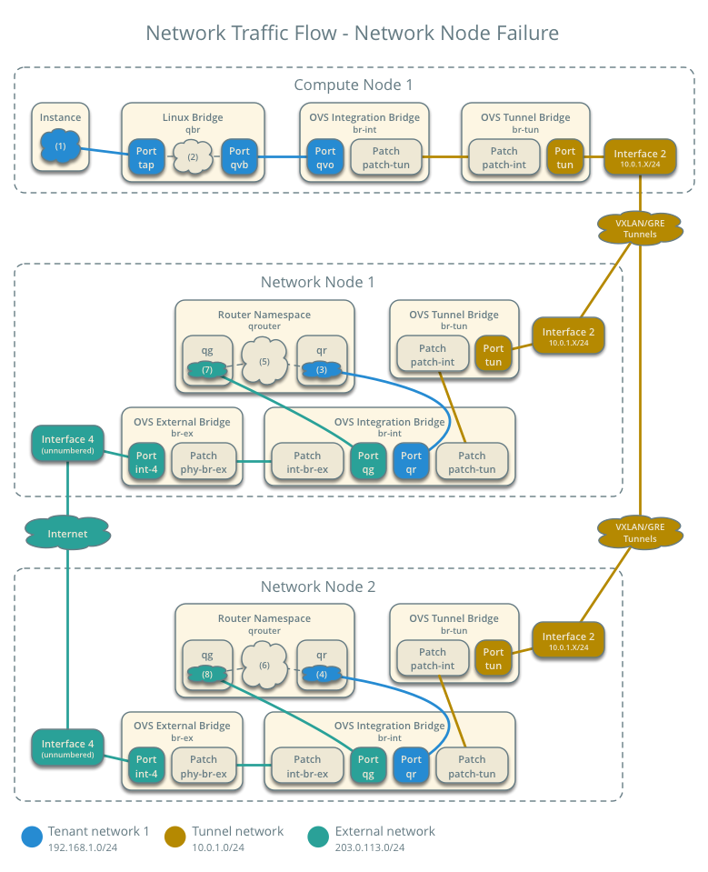

.. highlight: ini
   :linenothreshold: 5

=============================================================================
Scenario: Basic implementation of Layer 3 High-Availability with Open vSwitch
=============================================================================

This scenario describes a basic implementation of the OpenStack
Networking Layer 3 High-Availabilty (L3 HA) feature using the modular layer
2 (ML2) plug-in with Open vSwitch (OVS). The example configuration creates
one flat external network and VXLAN tenant networks. However, L3 HA
also supports VLAN external networks, VLAN tenant networks, and GRE
tenant networks.

To improve understanding of network traffic flow, the network and compute
nodes contain a separate network interface for tenant VLAN networks. In
production environments, tenant VLAN networks can use any Open vSwitch
bridge with access to a network interface. For example, the ``br-tun``
bridge.

Server hardware requirements
~~~~~~~~~~~~~~~~~~~~~~~~~~~~

1. One controller node with one network interface: management.

#. Two network nodes with four network interfaces: management, tenant tunnel
   networks, tenant VLAN networks, and external (typically the Internet).
   The Open vSwitch bridge ``br-vlan`` must contain a port on the VLAN
   interface and Open vSwitch bridge ``br-ex`` must contain a port on the
   external interface.

#. At least one compute node with three network interfaces: management,
   tenant tunnel networks, and tenant VLAN networks. The Open vSwitch
   bridge ``br-vlan`` must contain a port on the VLAN interface.

#. One administrative-level or privileged account. For example, the
   ``admin`` tenant and user.

#. One user-level or non-privileged account. For example, the ``demo``
   tenant and user.

.. note::

   To reduce the chance of "split-brain" issues, we recommend that you
   deploy an odd quantity of network nodes with a minimum of three nodes.

.. figure:: ./figures/scenario-l3ha-hw.png
   :alt: L3 HA OVS Scenario - Hardware Requirements

   L3 HA OVS Scenario - Hardware Requirements

.. figure:: ./figures/scenario-l3ha-networks.png
   :alt: L3 HA OVS Scenario - Network Layout

   L3 HA OVS Scenario - Network Layout

.. note::

   For VLAN external and tenant networks, the network infrastructure
   must support VLAN tagging. For best performance with VXLAN and GRE
   tenant networks, the network infrastructure should support jumbo frames.

.. warning::

   Proper operation of VXLAN requires kernel 3.13 or newer. In general,
   only Ubuntu 14.04, Fedora 20, and Fedora 21 meet or exceed this minimum
   version requirement when using packages rather than source. Also, the
   Juno release (2014.2) of OpenStack Networking does not support the L2
   population mechanism with L3 HA.

Node requirements
~~~~~~~~~~~~~~~~~

Controller node

* Operational SQL server with ``neutron`` database and appropriate
  configuration in the :file:`neutron.conf` file.

* Operational message queue service with appropriate configuration
  in the :file:`neutron.conf` file.

* Operational OpenStack Identity service with appropriate configuration
  in the :file:`neutron.conf` file.

* Operational OpenStack Compute controller/management service with
  appropriate configuration to use OpenStack Networking in the
  :file:`nova.conf` file.

* Neutron server service, ML2 plug-in, and any dependencies.

Network nodes

* Operational OpenStack Identity service with appropriate configuration
  in the :file:`neutron.conf` file.

* Open vSwitch service, ML2 plug-in, Open vSwitch agent, L3 agent,
  DHCP agent, metadata agent, and any dependencies including the
  ``ipset``, ``conntrack``, and ``keepalived`` utilities.

Compute nodes

* Operational OpenStack Identity service with appropriate configuration
  in the :file:`neutron.conf` file.

* Operational OpenStack Compute controller/management service with
  appropriate configuration to use OpenStack Networking in the
  :file:`neutron.conf` file.

* Open vSwitch service, ML2 plug-in, Open vSwitch agent, and any
  dependencies including the ``ipset`` utility.

.. figure:: ./figures/scenario-l3ha-ovs-services.png
   :alt: L3 HA OVS Scenario - Service Layout

   L3 HA OVS Scenario - Service Layout

OpenVSwitch Layer 3 architecture for high availability
~~~~~~~~~~~~~~~~~~~~~~~~~~~~~~~~~~~~~~~~~~~~~~~~~~~~~~

The general L3 HA architecture augments the legacy networking architecture by
providing failover for virtual routers under the L3 agent. The failover
mechanism implements Virtual Router Redundancy Protocol (VRRP) using the
``keepalived`` service and handles network connection tracking using the
``conntrack`` utilities. If the L3 agent on a network node fails or a network
node loses connectivity, HA processes automatically migrate routing services
and active connections to another L3 agent. Similar to legacy architectures,
L3 HA performs all functions on the network nodes and does not address
bandwidth constraints that limit performance. Consider deploying DVR to
increase performance.

.. figure:: ./figures/scenario-l3ha-general.png
   :alt: L3 HA OVS Scenario - Architecture Overview

   L3 HA OVS Scenario - Architecture Overview

The network nodes run the Open vSwitch agent, L3 agent, DHCP agent, and
metadata agent.

.. figure:: ./figures/scenario-l3ha-ovs-network1.png
   :alt: L3 HA OVS Scenario - Network Node Overview

   L3 HA OVS Scenario - Network Node Overview

The compute nodes run the Open vSwitch agent.

.. figure:: ./figures/scenario-l3ha-ovs-compute1.png
   :alt: L3 HA OVS Scenario - Compute Node Overview

   L3 HA OVS Scenario - Compute Node Overview

Node components
---------------

The network node contains the following components:

* Open vSwitch agent managing virtual switches, connectivity among
  them, and interaction via virtual ports with other network components
  such as namespaces, Linux bridges, and underlying interfaces.

* DHCP agent managing the ``qdhcp`` namespaces. The ``qdhcp`` namespaces
  provide DHCP services for instances using tenant networks.

* L3 agent managing the ``qrouter`` namespaces and VRRP using ``keepalived``
  and ``conntrack``. The ``qrouter`` namespaces provide routing between
  tenant and external networks and among tenant networks. They also route
  metadata traffic between instances and the metadata agent.

* Metadata agent handling metadata operations.

.. figure:: ./figures/scenario-l3ha-ovs-network2.png
   :alt: L3 HA OVS Scenario - Network Node Components

   L3 HA OVS Scenario - Network Node Components

The compute nodes contain the following components:

* Open vSwitch agent managing virtual switches, connectivity among
  them, and interaction via virtual ports with other network components
  such as namespaces, Linux bridges, and underlying interfaces.

* Linux bridges handling security groups. Due to limitations with Open
  vSwitch and iptables, the Networking service uses a Linux bridge
  to manage security groups for instances.

.. figure:: ./figures/scenario-l3ha-ovs-compute2.png
   :alt: L3 HA OVS Scenario - Compute Node Components

   L3 HA OVS Scenario - Compute Node Components

Packet flow
~~~~~~~~~~~

For normal operations, L3 HA traffic flows match the OpenStack Networking
legacy scenario with Open vSwitch.

Failover operations
~~~~~~~~~~~~~~~~~~~

.. todo: Placeholder for failover operations discussion.

   L3 HA OVS Scenario - Failover Operations

Example configuration template
~~~~~~~~~~~~~~~~~~~~~~~~~~~~~~

Use the following example configuration as a template to deploy this
scenario in your environment.

Configuring the controller node (controller)
--------------------------------------------

The controller node provides the Networking API and manages services on the
other nodes.

1. Configure base options. Edit the :file:`/etc/neutron/neutron.conf` file:

   ::

     [DEFAULT]
     verbose = True
     core_plugin = ml2
     service_plugins = router
     allow_overlapping_ips = True

     dhcp_agents_per_network = 2

     l3_ha = True
     max_l3_agents_per_router = 3
     min_l3_agents_per_router = 2
     l3_ha_net_cidr = 169.254.192.0/18

     notify_nova_on_port_status_changes = True
     notify_nova_on_port_data_changes = True
     nova_url = http://controller:8774/v2
     nova_region_name = NOVA_REGION_NAME
     nova_admin_username = NOVA_ADMIN_USERNAME
     nova_admin_tenant_id = NOVA_ADMIN_TENANT_ID
     nova_admin_password =  NOVA_ADMIN_PASSWORD
     nova_admin_auth_url = http://controller:35357/v2.0

   Replace ``NOVA_REGION_NAME``, ``NOVA_ADMIN_USERNAME``,
   ``NOVA_ADMIN_TENANT_ID``, and ``NOVA_ADMIN_PASSWORD`` with suitable
   values for your environment.

#. Configure the ML2 plug-in. Edit the
   :file:`/etc/neutron/plugins/ml2/ml2_conf.ini` file:

   ::

     [ml2]
     type_drivers = flat,vlan,gre,vxlan
     tenant_network_types = vlan,gre,vxlan
     mechanism_drivers = openvswitch

     [ml2_type_vlan]
     network_vlan_ranges = vlan:MIN_VLAN_ID:MAX_VLAN_ID

     [ml2_type_gre]
     tunnel_id_ranges = MIN_GRE_SESSION:MAX_GRE_SESSION

     [ml2_type_vxlan]
     vni_ranges = MIN_VNI:MAX_VNI
     vxlan_group = 239.1.1.1

     [securitygroup]
     enable_security_group = True
     enable_ipset = True
     firewall_driver = neutron.agent.linux.iptables_firewall.OVSHybridIptablesFirewallDriver

   Replace ``TENANT_TUNNEL_INTERFACE_IP_ADDRESS`` with the IP address
   of the tenant tunnel network interface. Replace ``MIN_VLAN_ID`` and
   ``MAX_VLAN_ID`` with the VLAN ID range available for tenant networks.
   Replace ``MIN_GRE_SESSION`` and ``MAX_GRE_SESSION`` with a suitable GRE
   tunnel session range. Replace ``MIN_VNI`` and ``MAX_VNI`` with a suitable
   VXLAN ID range.

   .. note::

      The first value in the 'tenant_network_types' option becomes the
      default tenant network type when a non-privileged user creates a
      network.

#. Start the following services: Server

Configuring the network nodes (network1 and network2)
-----------------------------------------------------

The network nodes provide redundant routing, NAT, and DHCP services to all
instances.

1. Configure base options. Edit the :file:`/etc/neutron/neutron.conf` file:

   ::

     [DEFAULT]
     verbose = True
     core_plugin = ml2
     service_plugins = router
     allow_overlapping_ips = True

     dhcp_agents_per_network = 2

     l3_ha = True
     max_l3_agents_per_router = 3
     min_l3_agents_per_router = 2
     l3_ha_net_cidr = 169.254.192.0/18

#. Configure the ML2 plug-in. Edit the
   :file:`/etc/neutron/plugins/ml2/ml2_conf.ini` file:

   ::

     [ml2]
     type_drivers = flat,vlan,gre,vxlan
     tenant_network_types = vlan,gre,vxlan
     mechanism_drivers = openvswitch

     [ml2_type_flat]
     flat_networks = external

     [ml2_type_vlan]
     network_vlan_ranges = vlan:MIN_VLAN_ID:MAX_VLAN_ID

     [ml2_type_gre]
     tunnel_id_ranges = MIN_GRE_SESSION:MAX_GRE_SESSION

     [ml2_type_vxlan]
     vni_ranges = MIN_VNI:MAX_VNI
     vxlan_group = 239.1.1.1

     [securitygroup]
     enable_security_group = True
     enable_ipset = True
     firewall_driver = neutron.agent.linux.iptables_firewall.OVSHybridIptablesFirewallDriver

     [ovs]
     local_ip = TENANT_TUNNEL_INTERFACE_IP_ADDRESS
     bridge_mappings = vlan:br-vlan,external:br-ex

     [agent]
     tunnel_types = gre,vxlan

   Replace ``TENANT_TUNNEL_INTERFACE_IP_ADDRESS`` with the IP address
   of the tenant tunnel network interface. Replace ``MIN_VLAN_ID`` and
   ``MAX_VLAN_ID`` with the VLAN ID range available for tenant networks.
   Replace ``MIN_GRE_SESSION`` and ``MAX_GRE_SESSION`` with a suitable GRE
   tunnel session range. Replace ``MIN_VNI`` and ``MAX_VNI`` with a suitable
   VXLAN network ID range.

   .. note::

      The first value in the 'tenant_network_types' option becomes the
      default tenant network type when a non-privileged user creates a
      network.

#. Configure the L3 agent. Edit the :file:`/etc/neutron/l3_agent.ini` file:

   ::

     [DEFAULT]
     verbose = True
     interface_driver = neutron.agent.linux.interface.OVSInterfaceDriver
     use_namespaces = True
     external_network_bridge =
     router_delete_namespaces = True

   .. note::

      The 'external_network_bridge' option intentionally contains
      no value.

#. Configure the DHCP agent. Edit the :file:`/etc/neutron/dhcp_agent.ini` file:

   ::

     [DEFAULT]
     verbose = True
     interface_driver = neutron.agent.linux.interface.OVSInterfaceDriver
     dhcp_driver = neutron.agent.linux.dhcp.Dnsmasq
     use_namespaces = True
     dhcp_delete_namespaces = True

#. (Optional) Reduce MTU for VXLAN/GRE tenant networks by enabling custom
   *Dnsmasq* configuration and configuring it to include the MTU option
   (26) in DHCP offers for instances.

   Edit the :file:`/etc/neutron/dhcp_agent.ini` file:

   ::

     [DEFAULT]
     dnsmasq_config_file = /etc/neutron/dnsmasq-neutron.conf

   Edit the :file:`/etc/neutron/dnsmasq-neutron.conf` file:

   ::

     dhcp-option-force=26,1450

#. Configure the metadata agent. Edit the
   :file:`/etc/neutron/metadata_agent.ini` file:

   ::

     [DEFAULT]
     verbose = True
     auth_url = http://controller:5000/v2.0
     auth_region = AUTH_REGION
     admin_tenant_name = ADMIN_TENANT_NAME
     admin_user = ADMIN_USER
     admin_password = ADMIN_PASSWORD
     nova_metadata_ip = controller
     metadata_proxy_shared_secret = METADATA_SECRET

   .. note::

      Replace ``AUTH_REGION``, ``ADMIN_TENANT_NAME``, ``ADMIN_USER``,
      ``ADMIN_PASSWORD``, and ``METADATA_SECRET`` with suitable values
      for your environment.

#. Start the following services:

   * Open vSwitch
   * Open vSwitch agent
   * L3 agent
   * DHCP agent
   * Metadata agent

Compute nodes (compute1 and compute2)
-------------------------------------

The compute nodes provide switching services and handle security groups
for instances.

1. Configure base options. Edit the :file:`/etc/neutron/neutron.conf` file:

   ::

     [DEFAULT]
     verbose = True
     core_plugin = ml2
     service_plugins = router
     allow_overlapping_ips = True

#. Configure the ML2 plug-in. Edit the
   :file:`/etc/neutron/plugins/ml2/ml2_conf.ini` file:

   ::

     [ml2]
     type_drivers = flat,vlan,gre,vxlan
     tenant_network_types = vlan,gre,vxlan
     mechanism_drivers = openvswitch

     [ml2_type_vlan]
     network_vlan_ranges = vlan:MIN_VLAN_ID:MAX_VLAN_ID

     [ml2_type_gre]
     tunnel_id_ranges = MIN_GRE_SESSION:MAX_GRE_SESSION

     [ml2_type_vxlan]
     vni_ranges = MIN_VNI:MAX_VNI
     vxlan_group = 239.1.1.1

     [securitygroup]
     enable_security_group = True
     enable_ipset = True
     firewall_driver = neutron.agent.linux.iptables_firewall.OVSHybridIptablesFirewallDriver

     [ovs]
     local_ip = TENANT_TUNNEL_INTERFACE_IP_ADDRESS
     bridge_mappings = vlan:br-vlan

     [agent]
     tunnel_types = gre,vxlan

   Replace ``TENANT_TUNNEL_INTERFACE_IP_ADDRESS`` with the IP address
   of the tenant tunnel network interface. Replace ``MIN_VLAN_ID`` and
   ``MAX_VLAN_ID`` with the VLAN ID range available for tenant networks.
   Replace ``MIN_GRE_SESSION`` and ``MAX_GRE_SESSION`` with a suitable GRE
   tunnel session range. Replace ``MIN_VNI`` and ``MAX_VNI`` with a suitable
   VXLAN network ID range.

   .. note::

      The first value in the 'tenant_network_types' option becomes the
      default tenant network type when a non-privileged user creates a
      network.

#. Start the following services:

   * Open vSwitch
   * Open vSwitch agent

Verify service operation
------------------------

1. Source the administrative tenant credentials.

#. Verify presence and operation of the agents:

   ::

     $ neutron agent-list
     +--------------------------------------+--------------------+----------+-------+----------------+---------------------------+
     | id                                   | agent_type         | host        | alive | admin_state_up | binary                    |
     +--------------------------------------+--------------------+----------+-------+----------------+---------------------------+
     | 0bfe5b5d-0b82-434e-b8a0-524cc18da3a4 | DHCP agent         | network1 | :-)   | True           | neutron-dhcp-agent        |
     | 25224bd5-0905-4ec9-9f2d-3b17cdaf5650 | Open vSwitch agent | compute2 | :-)   | True           | neutron-openvswitch-agent |
     | 29afe014-273d-42f3-ad71-8a226e40dea6 | L3 agent           | network1 | :-)   | True           | neutron-l3-agent          |
     | 3bed5093-e46c-4b0f-9460-3309c62254a3 | DHCP agent         | network2 | :-)   | True           | neutron-dhcp-agent        |
     | 54aefb1c-35f7-4ebf-a848-3bb4fe81dcf7 | Open vSwitch agent | network1 | :-)   | True           | neutron-openvswitch-agent |
     | 91c9cc03-1678-4d7a-b0a7-fa1ac24e5516 | Open vSwitch agent | compute1 | :-)   | True           | neutron-openvswitch-agent |
     | ac7b3f77-7e4d-47a6-9dbd-3358cfb67b61 | Open vSwitch agent | network2 | :-)   | True           | neutron-openvswitch-agent |
     | ceef5c49-3148-4c39-9e15-4985fc995113 | Metadata agent     | network1 | :-)   | True           | neutron-metadata-agent    |
     | d27ac19b-fb4d-4fec-b81d-e8c65557b6ec | L3 agent           | network2 | :-)   | True           | neutron-l3-agent          |
     | f072a1ec-f842-4223-a6b6-ec725419be85 | Metadata agent     | network2 | :-)   | True           | neutron-metadata-agent    |
     +--------------------------------------+--------------------+----------+-------+----------------+---------------------------+

Create initial networks
~~~~~~~~~~~~~~~~~~~~~~~

Use the following example commands as a template to create initial networks
in your environment.

External (flat) network
-----------------------

1. Source the administrative tenant credentials.

#. Create the external network:

   ::

     $ neutron net-create ext-net --router:external True \
       --provider:physical_network external --provider:network_type flat
     Created a new network:
     +---------------------------+--------------------------------------+
     | Field                     | Value                                |
     +---------------------------+--------------------------------------+
     | admin_state_up            | True                                 |
     | id                        | 5266fcbc-d429-4b21-8544-6170d1691826 |
     | name                      | ext-net                              |
     | provider:network_type     | flat                                 |
     | provider:physical_network | external                             |
     | provider:segmentation_id  |                                      |
     | router:external           | True                                 |
     | shared                    | False                                |
     | status                    | ACTIVE                               |
     | subnets                   |                                      |
     | tenant_id                 | 96393622940e47728b6dcdb2ef405f50     |
     +---------------------------+--------------------------------------+

#. Create a subnet on the external network:

   ::

     $ neutron subnet-create ext-net --name ext-subnet \
       --allocation-pool start=203.0.113.101,end=203.0.113.200 \
       --disable-dhcp --gateway 203.0.113.1 203.0.113.0/24
     Created a new subnet:
     +-------------------+----------------------------------------------------+
     | Field             | Value                                              |
     +-------------------+----------------------------------------------------+
     | allocation_pools  | {"start": "203.0.113.101", "end": "203.0.113.200"} |
     | cidr              | 203.0.113.0/24                                     |
     | dns_nameservers   |                                                    |
     | enable_dhcp       | False                                              |
     | gateway_ip        | 203.0.113.1                                        |
     | host_routes       |                                                    |
     | id                | b32e0efc-8cc3-43ff-9899-873b94df0db1               |
     | ip_version        | 4                                                  |
     | ipv6_address_mode |                                                    |
     | ipv6_ra_mode      |                                                    |
     | name              | ext-subnet                                         |
     | network_id        | 5266fcbc-d429-4b21-8544-6170d1691826               |
     | tenant_id         | 96393622940e47728b6dcdb2ef405f50                   |
     +-------------------+----------------------------------------------------+

Tenant (VXLAN) network
----------------------

.. note::

   The example configuration contains ``vlan`` as the first tenant network
   type. Only a privileged OpenStack user can create other types of networks
   such as VXLAN or GRE. The following commands use the ``admin`` tenant
   credentials to create a VXLAN tenant network and the ``demo`` tenant
   to create the additional components.

1. Obtain the ``demo`` tenant ID:

   ::

     $ keystone tenant-get demo
     +-------------+----------------------------------+
     |   Property  |              Value               |
     +-------------+----------------------------------+
     | description |           Demo Tenant            |
     |   enabled   |               True               |
     |      id     | 443cd1596b2e46d49965750771ebbfe1 |
     |     name    |               demo               |
     +-------------+----------------------------------+

#. Create the tenant network:

   ::

     $ neutron net-create demo-net \
       --tenant-id 443cd1596b2e46d49965750771ebbfe1 \
       --provider:network_type vxlan
     Created a new network:
     +---------------------------+--------------------------------------+
     | Field                     | Value                                |
     +---------------------------+--------------------------------------+
     | admin_state_up            | True                                 |
     | id                        | 7ac9a268-1ddd-453f-857b-0fd9552b645f |
     | name                      | demo-net                             |
     | provider:network_type     | vxlan                                |
     | provider:physical_network |                                      |
     | provider:segmentation_id  | 1                                    |
     | router:external           | False                                |
     | shared                    | False                                |
     | status                    | ACTIVE                               |
     | subnets                   |                                      |
     | tenant_id                 | 443cd1596b2e46d49965750771ebbfe1     |
     +---------------------------+--------------------------------------+

   .. note::

      The example configuration contains 'vlan' as the first tenant network
      type. Only a privileged OpenStack tenant and user can create a VXLAN
      or GRE networks, so this command uses the ``admin`` tenant credentials
      to create the tenant network.

#. Source the ``demo`` tenant credentials.

#. Create a subnet on the tenant network:

   ::

     $ neutron subnet-create demo-net --name demo-subnet \
       --gateway 192.168.1.1 192.168.1.0/24
     Created a new subnet:
     +-------------------+--------------------------------------------------+
     | Field             | Value                                            |
     +-------------------+--------------------------------------------------+
     | allocation_pools  | {"start": "192.168.1.2", "end": "192.168.1.254"} |
     | cidr              | 192.168.1.0/24                                   |
     | dns_nameservers   |                                                  |
     | enable_dhcp       | True                                             |
     | gateway_ip        | 192.168.1.1                                      |
     | host_routes       |                                                  |
     | id                | 2945790c-5999-4693-b8e7-50a9fc7f46f5             |
     | ip_version        | 4                                                |
     | ipv6_address_mode |                                                  |
     | ipv6_ra_mode      |                                                  |
     | name              | demo-subnet                                      |
     | network_id        | 7ac9a268-1ddd-453f-857b-0fd9552b645f             |
     | tenant_id         | 443cd1596b2e46d49965750771ebbfe1                 |
     +-------------------+--------------------------------------------------+

#. Create a tenant network router:

   ::

     $ neutron router-create demo-router
     Created a new router:
     +-----------------------+--------------------------------------+
     | Field                 | Value                                |
     +-----------------------+--------------------------------------+
     | admin_state_up        | True                                 |
     | distributed           | False                                |
     | external_gateway_info |                                      |
     | ha                    | True                                 |
     | id                    | 7a46dba8-8846-498c-9e10-588664558473 |
     | name                  | demo-router                          |
     | routes                |                                      |
     | status                | ACTIVE                               |
     | tenant_id             | 443cd1596b2e46d49965750771ebbfe1     |
     +-----------------------+--------------------------------------+

   .. note::

      Default policy might prevent the 'ha' flag from appearing in the
      command output. Using the ``admin`` tenant credentials, run the
      ``neutron router-show demo-router`` command to see all fields.

#. Add a tenant subnet interface on the router:

   ::

     $ neutron router-interface-add demo-router demo-subnet
     Added interface 8de3e172-5317-4c87-bdc1-f69e359de92e to router demo-router.

#. Add a gateway to the external network on the router:

   ::

     $ neutron router-gateway-set demo-router ext-net
     Set gateway for router demo-router

Verify operation
----------------

1. On the controller node, verify creation of the HA ports on the
   ``demo-router`` router:

   ::

     $ neutron router-port-list demo-router
     +--------------------------------------+-------------------------------------------------+-------------------+----------------------------------------------------------------------------------------+
     | id                                   | name                                            | mac_address       | fixed_ips                                                                              |
     +--------------------------------------+-------------------------------------------------+-------------------+----------------------------------------------------------------------------------------+
     | 255d2e4b-33ba-4166-a13f-6531122641fe | HA port tenant 443cd1596b2e46d49965750771ebbfe1 | fa:16:3e:25:05:d7 | {"subnet_id": "8e8e4c7d-fa38-417d-a4e3-03ee5ab5493c", "ip_address": "169.254.192.1"}   |
     | 374587d7-2acd-4156-8993-4294f788b55e |                                                 | fa:16:3e:82:a0:59 | {"subnet_id": "b32e0efc-8cc3-43ff-9899-873b94df0db1", "ip_address": "203.0.113.101"}   |
     | 8de3e172-5317-4c87-bdc1-f69e359de92e |                                                 | fa:16:3e:10:9f:f6 | {"subnet_id": "2945790c-5999-4693-b8e7-50a9fc7f46f5", "ip_address": "192.168.1.1"}     |
     | 90d1a59f-b122-459d-a94a-162a104de629 | HA port tenant 443cd1596b2e46d49965750771ebbfe1 | fa:16:3e:ae:3b:22 | {"subnet_id": "8e8e4c7d-fa38-417d-a4e3-03ee5ab5493c", "ip_address": "169.254.192.2"}   |
     +--------------------------------------+-------------------------------------------------+-------------------+----------------------------------------------------------------------------------------+

#. On the network nodes, verify creation of the ``qrouter`` and ``qdhcp``
   namespaces:

   Network node 1:

   ::

     $ ip netns
     qrouter-7a46dba8-8846-498c-9e10-588664558473

   Network node 2:

   ::

     $ ip netns
     qrouter-7a46dba8-8846-498c-9e10-588664558473

   Both ``qrouter`` namespaces should use the same UUID.

   .. note::

      The ``qdhcp`` namespace might not appear until launching an instance.

#. On the network nodes, verify HA operation:

   Network node 1:

   ::

     $ ip netns exec qrouter-7a46dba8-8846-498c-9e10-588664558473 ip addr show
     11: ha-255d2e4b-33: <BROADCAST,MULTICAST,UP,LOWER_UP> mtu 1500 qdisc noqueue state UNKNOWN group default
         link/ether fa:16:3e:25:05:d7 brd ff:ff:ff:ff:ff:ff
         inet 169.254.192.1/18 brd 169.254.255.255 scope global ha-255d2e4b-33
            valid_lft forever preferred_lft forever
         inet6 fe80::f816:3eff:fe25:5d7/64 scope link
            valid_lft forever preferred_lft forever
     12: qr-8de3e172-53: <BROADCAST,MULTICAST,UP,LOWER_UP> mtu 1500 qdisc noqueue state UNKNOWN group default
         link/ether fa:16:3e:10:9f:f6 brd ff:ff:ff:ff:ff:ff
         inet 192.168.1.1/24 scope global qr-8de3e172-53
            valid_lft forever preferred_lft forever
         inet6 fe80::f816:3eff:fe10:9ff6/64 scope link
            valid_lft forever preferred_lft forever
     13: qg-374587d7-2a: <BROADCAST,MULTICAST,UP,LOWER_UP> mtu 1500 qdisc noqueue state UNKNOWN group default
         link/ether fa:16:3e:82:a0:59 brd ff:ff:ff:ff:ff:ff
         inet 203.0.113.101/24 scope global qg-374587d7-2a
            valid_lft forever preferred_lft forever
         inet6 fe80::f816:3eff:fe82:a059/64 scope link
            valid_lft forever preferred_lft forever

   Network node 2:

   ::

     $ ip netns exec qrouter-7a46dba8-8846-498c-9e10-588664558473 ip addr show
     11: ha-90d1a59f-b1: <BROADCAST,MULTICAST,UP,LOWER_UP> mtu 1500 qdisc noqueue state UNKNOWN group default
         link/ether fa:16:3e:ae:3b:22 brd ff:ff:ff:ff:ff:ff
         inet 169.254.192.2/18 brd 169.254.255.255 scope global ha-90d1a59f-b1
            valid_lft forever preferred_lft forever
         inet6 fe80::f816:3eff:feae:3b22/64 scope link
            valid_lft forever preferred_lft forever
     12: qr-8de3e172-53: <BROADCAST,MULTICAST,UP,LOWER_UP> mtu 1500 qdisc noqueue state UNKNOWN group default
         link/ether fa:16:3e:10:9f:f6 brd ff:ff:ff:ff:ff:ff
         inet6 fe80::f816:3eff:fe10:9ff6/64 scope link
            valid_lft forever preferred_lft forever
     13: qg-374587d7-2a: <BROADCAST,MULTICAST,UP,LOWER_UP> mtu 1500 qdisc noqueue state UNKNOWN group default
         link/ether fa:16:3e:82:a0:59 brd ff:ff:ff:ff:ff:ff
         inet6 fe80::f816:3eff:fe82:a059/64 scope link
            valid_lft forever preferred_lft forever

   On each network node, the ``qrouter`` namespace should include the ``ha``,
   ``qr``, and ``qg`` interfaces. On the active node, the ``qr`` interface
   contains the tenant network gateway IP address and the ``qg`` interface
   contains the tenant network router IP address on the external network.
   On the passive node, the ``qr`` and ``qg`` interfaces should not contain
   an IP addresse. On both nodes, the ``ha`` interface should contain a
   unique IP address in the 169.254.192/18 range.

#. On the network nodes, verify VRRP advertisements from the master node
   HA interface IP address on the external network interface:

   Network node 1:

   ::

     $ tcpdump -lnpi eth2
     16:50:16.857294 IP 169.254.192.1 > 224.0.0.18: VRRPv2, Advertisement, vrid 1, prio 50, authtype none, intvl 2s, length 20
     16:50:18.858436 IP 169.254.192.1 > 224.0.0.18: VRRPv2, Advertisement, vrid 1, prio 50, authtype none, intvl 2s, length 20
     16:50:20.859677 IP 169.254.192.3 > 224.0.0.18: VRRPv2, Advertisement, vrid 1, prio 50, authtype none, intvl 2s, length 20

   Network node 2:

   ::

     $ tcpdump -lnpi eth2
     16:51:44.911640 IP 169.254.192.3 > 224.0.0.18: VRRPv2, Advertisement, vrid 1, prio 50, authtype none, intvl 2s, length 20
     16:51:46.912591 IP 169.254.192.3 > 224.0.0.18: VRRPv2, Advertisement, vrid 1, prio 50, authtype none, intvl 2s, length 20
     16:51:48.913900 IP 169.254.192.3 > 224.0.0.18: VRRPv2, Advertisement, vrid 1, prio 50, authtype none, intvl 2s, length 20

   .. note::

      The example output uses network interface ``eth2``.

#. On the controller node, ping the tenant router external network interface
   IP address, typically the lowest IP address in the external network
   subnet allocation range:

   ::

     # ping -c 4 203.0.113.101
     PING 203.0.113.101 (203.0.113.101) 56(84) bytes of data.
     64 bytes from 203.0.113.101: icmp_req=1 ttl=64 time=0.619 ms
     64 bytes from 203.0.113.101: icmp_req=2 ttl=64 time=0.189 ms
     64 bytes from 203.0.113.101: icmp_req=3 ttl=64 time=0.165 ms
     64 bytes from 203.0.113.101: icmp_req=4 ttl=64 time=0.216 ms

     --- 203.0.113.101 ping statistics ---
     4 packets transmitted, 4 received, 0% packet loss, time 2999ms
     rtt min/avg/max/mdev = 0.165/0.297/0.619/0.187 ms

#. Source the regular tenant credentials.

#. Launch an instance with an interface on the tenant network.

#. Obtain console access to the instance.

   a. Test connectivity to the tenant network router:

      ::

        $ ping -c 4 192.168.1.1
        PING 192.168.1.1 (192.168.1.1) 56(84) bytes of data.
        64 bytes from 192.168.1.1: icmp_req=1 ttl=64 time=0.357 ms
        64 bytes from 192.168.1.1: icmp_req=2 ttl=64 time=0.473 ms
        64 bytes from 192.168.1.1: icmp_req=3 ttl=64 time=0.504 ms
        64 bytes from 192.168.1.1: icmp_req=4 ttl=64 time=0.470 ms

        --- 192.168.1.1 ping statistics ---
        4 packets transmitted, 4 received, 0% packet loss, time 2998ms
        rtt min/avg/max/mdev = 0.357/0.451/0.504/0.055 ms

   #. Test connectivity to the Internet:

      ::

        $ ping -c 4 openstack.org
        PING openstack.org (174.143.194.225) 56(84) bytes of data.
        64 bytes from 174.143.194.225: icmp_req=1 ttl=53 time=17.4 ms
        64 bytes from 174.143.194.225: icmp_req=2 ttl=53 time=17.5 ms
        64 bytes from 174.143.194.225: icmp_req=3 ttl=53 time=17.7 ms
        64 bytes from 174.143.194.225: icmp_req=4 ttl=53 time=17.5 ms

        --- openstack.org ping statistics ---
        4 packets transmitted, 4 received, 0% packet loss, time 3003ms
        rtt min/avg/max/mdev = 17.431/17.575/17.734/0.143 ms

#. Create the appropriate security group rules to allow ping and SSH access
   to the instance.

#. Create a floating IP address:

   ::

     $ neutron floatingip-create ext-net
     Created a new floatingip:
     +---------------------+--------------------------------------+
     | Field               | Value                                |
     +---------------------+--------------------------------------+
     | fixed_ip_address    |                                      |
     | floating_ip_address | 203.0.113.102                        |
     | floating_network_id | 5266fcbc-d429-4b21-8544-6170d1691826 |
     | id                  | 20a6b5dd-1c5c-460e-8a81-8b5cf1739307 |
     | port_id             |                                      |
     | router_id           |                                      |
     | status              | DOWN                                 |
     | tenant_id           | 443cd1596b2e46d49965750771ebbfe1     |
     +---------------------+--------------------------------------+

#. Associate the floating IP address with the instance:

   ::

     $ nova floating-ip-associate demo-instance1 203.0.113.102

#. On the controller node, ping the floating IP address associated with
   the instance:

   ::

     $ ping -c 4 203.0.113.102
     PING 203.0.113.102 (203.0.113.112) 56(84) bytes of data.
     64 bytes from 203.0.113.102: icmp_req=1 ttl=63 time=3.18 ms
     64 bytes from 203.0.113.102: icmp_req=2 ttl=63 time=0.981 ms
     64 bytes from 203.0.113.102: icmp_req=3 ttl=63 time=1.06 ms
     64 bytes from 203.0.113.102: icmp_req=4 ttl=63 time=0.929 ms

     --- 203.0.113.102 ping statistics ---
     4 packets transmitted, 4 received, 0% packet loss, time 3002ms
     rtt min/avg/max/mdev = 0.929/1.539/3.183/0.951 ms
