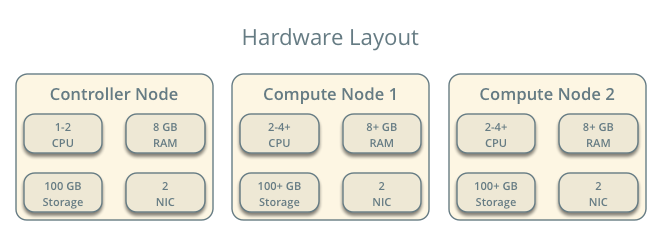
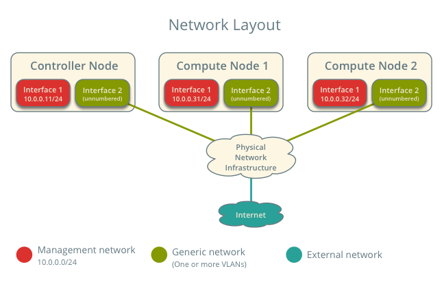
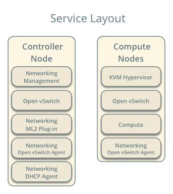
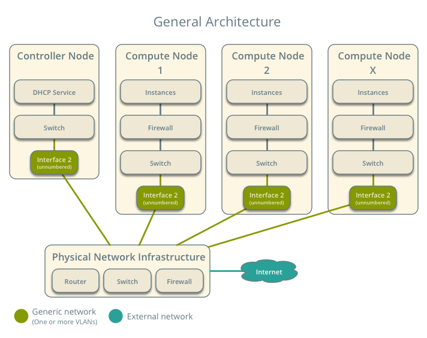
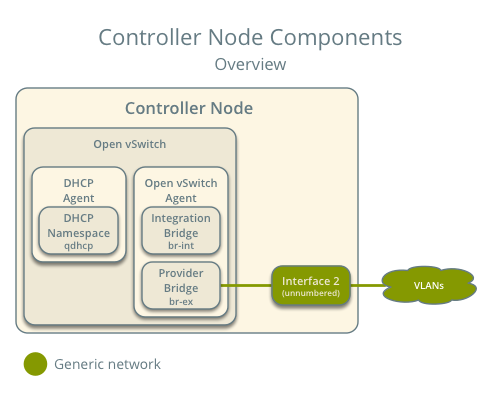
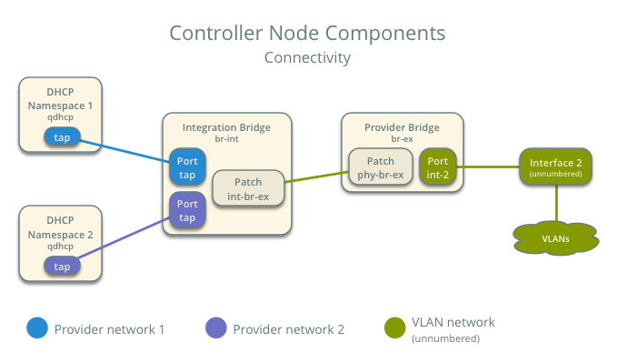
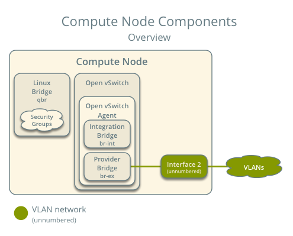
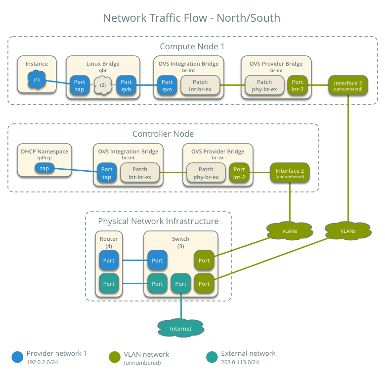
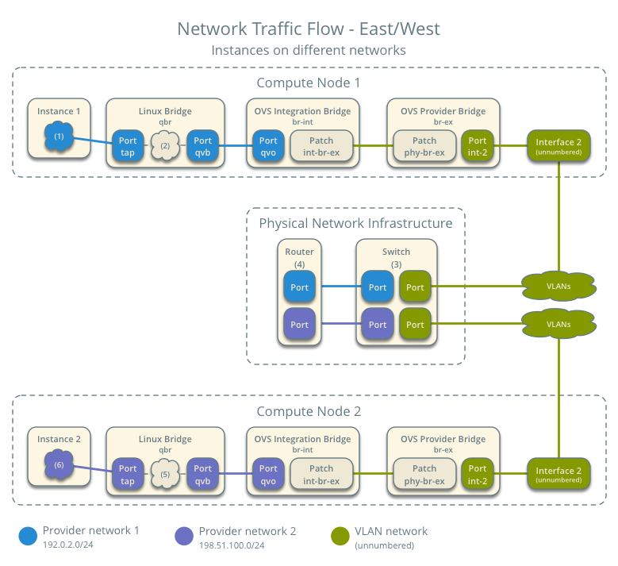
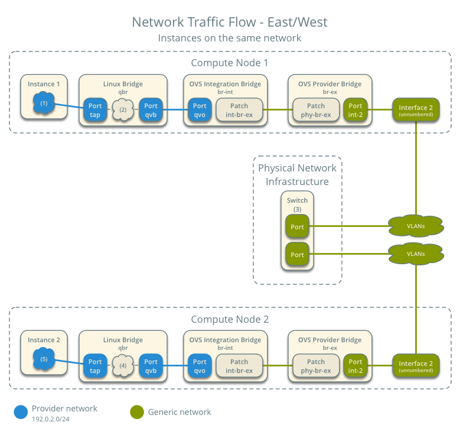

.. _scenario_provider_ovs:

=============================================
Scenario: Provider networks with Open vSwitch
=============================================

This scenario describes a provider networks implementation of the
OpenStack Networking service using the ML2 plug-in with Open vSwitch (OVS).

Provider networks generally offer simplicity, performance, and reliability at
the cost of flexibility. Unlike other scenarios, only administrators can
manage provider networks because they require configuration of physical
network infrastructure. Also, provider networks lack the concept of fixed
and floating IP addresses because they only handle layer-2 connectivity for
instances.

In many cases, operators who are already familiar with network architectures
that rely on the physical network infrastructure can easily deploy OpenStack
Networking on it. Over time, operators can test and implement cloud
networking features in their environment.

Before OpenStack Networking introduced Distributed Virtual Routers (DVR), all
network traffic traversed one or more dedicated network nodes, which limited
performance and reliability. Physical network infrastructures typically offer
better performance and reliability than general-purpose hosts that handle
various network operations in software.

In general, the OpenStack Networking software components that handle layer-3
operations impact performance and reliability the most. To improve performance
and reliability, provider networks move layer-3 operations to the physical
network infrastructure.

In one particular use case, the OpenStack deployment resides in a mixed
environment with conventional virtualization and bare-metal hosts that use a
sizable physical network infrastructure. Applications that run inside the
OpenStack deployment might require direct layer-2 access, typically using
VLANs, to applications outside of the deployment.

The example configuration creates a VLAN provider network. However, it also
supports flat (untagged or native) provider networks.

Prerequisites
~~~~~~~~~~~~~

These prerequisites define the minimum physical infrastructure and OpenStack
service dependencies that you need to deploy this scenario. For example, the
Networking service immediately depends on the Identity service and the Compute
service immediately depends on the Networking service. These dependencies lack
services such as the Image service because the Networking service does not
immediately depend on it. However, the Compute service depends on the Image
service to launch an instance. The example configuration in this scenario
assumes basic configuration knowledge of Networking service components.

For illustration purposes, the management network uses 10.0.0.0/24 and
provider networks use 192.0.2.0/24, 198.51.100.0/24, and 203.0.113.0/24.

Infrastructure
--------------

#. One controller node with two network interfaces: management and
   provider. The provider interface connects to a generic network that
   physical network infrastructure switches/routes to external networks
   (typically the Internet). The Open vSwitch bridge ``br-provider``
   must contain a port on the provider network interface.
#. At least two compute nodes with two network interfaces: management
   and provider. The provider interface connects to a generic network that
   the physical network infrastructure switches/routes to external networks
   (typically the Internet). The Open vSwitch bridge ``br-provider``
   must contain a port on the provider network interface.

.. warning::

   Linux distributions often package older releases of Open vSwitch that can
   introduce issues during operation with the Networking service. We recommend
   using at least the latest long-term stable (LTS) release of Open vSwitch
   for the best experience and support from Open vSwitch. See
   `<http://www.openvswitch.org>`__ for available releases and the
   `installation instructions
   <https://github.com/openvswitch/ovs/blob/master/INSTALL.md>`__ for
   building newer releases from source on various distributions.

OpenStack services - controller node
------------------------------------

#.  Operational SQL server with ``neutron`` database and appropriate
    configuration in the ``neutron.conf`` file.
#.  Operational message queue service with appropriate configuration in
    the ``neutron.conf`` file.
#.  Operational OpenStack Identity service with appropriate
    configuration in the ``neutron.conf`` file.
#.  Operational OpenStack Compute controller/management service with
    appropriate configuration to use neutron in the ``nova.conf`` file.
#.  Neutron server service, Open vSwitch service, ML2 plug-in, Open
    vSwitch agent, DHCP agent, and any dependencies.

OpenStack services - compute nodes
----------------------------------

#.  Operational OpenStack Identity service with appropriate
    configuration in the ``neutron.conf`` file.
#.  Operational OpenStack Compute controller/management service with
    appropriate configuration to use neutron in the ``nova.conf`` file.
#.  Open vSwitch service, Open vSwitch agent, and any dependencies.

Architecture
~~~~~~~~~~~~

The general provider network architecture uses physical network
infrastructure to handle switching and routing of network traffic.

The controller node contains the following network components:

#. Open vSwitch agent managing virtual switches, connectivity among
   them, and interaction via virtual ports with other network components
   such as namespaces and underlying interfaces.
#. DHCP agent managing the ``qdhcp`` namespaces. The ``qdhcp`` namespaces
   provide DHCP services for instances using provider networks.

.. note::

   For illustration purposes, the diagram contains two different provider
   networks.

The compute nodes contain the following network components:

#. Open vSwitch agent managing virtual switches, connectivity among
   them, and interaction via virtual ports with other network components
   such as Linux bridges and underlying interfaces.
#. Conventional Linux bridges handling security groups. Optionally, a native
   OVS implementation can handle security groups. However, due to kernel and
   OVS version requirements for it, this scenario uses conventional Linux
   bridges. See :ref:`config-ovsfwdriver` for more information.

.. figure:: figures/scenario-provider-ovs-compute2.png
   :alt: Compute node components - connectivity

.. note::

   For illustration purposes, the diagram contains two different provider
   networks.

Packet flow
~~~~~~~~~~~

.. note::

   *North-south* network traffic travels between an instance and
   external network, typically the Internet. *East-west* network
   traffic travels between instances.

.. note::

   Open vSwitch uses VLANs internally to segregate networks that traverse
   bridges. The VLAN ID usually differs from the segmentation ID of the
   virtual network.

Case 1: North-south
-------------------

The physical network infrastructure handles routing and potentially other
services between the provider and external network. In this case, *provider*
and *external* simply differentiate between a network available to instances
and a network only accessible via router, respectively, to illustrate that
the physical network infrastructure handles routing. However, provider
networks support direct connection to *external* networks such as the
Internet.

* External network

  * Network 203.0.113.0/24

* Provider network (VLAN)

  * Network 192.0.2.0/24
  * Gateway 192.0.2.1 with MAC address *TG*

* Compute node 1

  * Instance 1 192.0.2.11 with MAC address *I1*

* Instance 1 resides on compute node 1 and uses a provider network.
* The instance sends a packet to a host on the external network.

The following steps involve compute node 1.

#. The instance 1 ``tap`` interface (1) forwards the packet to the Linux
   bridge ``qbr``. The packet contains destination MAC address *TG*
   because the destination resides on another network.
#. Security group rules (2) on the Linux bridge ``qbr`` handle firewalling
   and state tracking for the packet.
#. The Linux bridge ``qbr`` forwards the packet to the Open vSwitch integration
   bridge ``br-int``.
#. The Open vSwitch integration bridge ``br-int`` adds the internal tag for
   the provider network.
#. The Open vSwitch integration bridge ``br-int`` forwards the packet to the
   Open vSwitch provider bridge ``br-provider``.
#. The Open vSwitch provider bridge ``br-provider`` replaces the internal tag
   with the actual VLAN tag (segmentation ID) of the provider network.
#. The Open vSwitch provider bridge ``br-provider`` forwards the packet to the
   physical network via the provider network interface.

The following steps involve the physical network infrastructure:

#. A switch (3) handles any VLAN tag operations between provider network 1
   and the router (4).
#. A router (4) routes the packet from provider network 1 to the external
   network.
#. A switch (3) handles any VLAN tag operations between the router (4) and
   the external network.
#. A switch (3) forwards the packet to the external network.

.. note::

   Return traffic follows similar steps in reverse.

Case 2: East-west for instances on different networks
-----------------------------------------------------

The physical network infrastructure handles routing between the provider
networks.

* Provider network 1

  * Network: 192.0.2.0/24
  * Gateway: 192.0.2.1 with MAC address *TG1*

* Provider network 2

  * Network: 198.51.100.0/24
  * Gateway: 198.51.100.1 with MAC address *TG2*

* Compute node 1

  * Instance 1: 192.0.2.11 with MAC address *I1*

* Compute node 2

  * Instance 2: 198.51.100.11 with MAC address *I2*

* Instance 1 resides on compute node 1 and uses provider network 1.
* Instance 2 resides on compute node 2 and uses provider network 2.
* Instance 1 sends a packet to instance 2.

The following steps involve compute node 1:

#. The instance 1 ``tap`` interface (1) forwards the packet to the Linux
   bridge ``qbr``. The packet contains destination MAC address *TG1*
   because the destination resides on another network.
#. Security group rules (2) on the Linux bridge ``qbr`` handle firewalling
   and state tracking for the packet.
#. The Linux bridge ``qbr`` forwards the packet to the Open vSwitch
   integration bridge ``br-int``.
#. The Open vSwitch integration bridge ``br-int`` adds the internal tag for
   provider network 1.
#. The Open vSwitch integration bridge ``br-int`` forwards the packet to
   the Open vSwitch provider bridge ``br-provider``.
#. The Open vSwitch provider bridge ``br-provider`` replaces the internal tag
   with the actual VLAN tag (segmentation ID) of provider network 1.
#. The Open vSwitch VLAN bridge ``br-provider`` forwards the packet to the
   physical network infrastructure via the provider network interface.

The following steps involve the physical network infrastructure:

#. A switch (3) handles any VLAN tag operations between provider network 1
   and the router (4).
#. A router (4) routes the packet from provider network 1 to provider
   network 2.
#. A switch (3) handles any VLAN tag operations between the router (4) and
   provider network 2.
#. A switch (3) forwards the packet to compute node 2.

The following steps involve compute node 2:

#. The provider network interface forwards the packet to the Open vSwitch
   provider bridge ``br-provider``.
#. The Open vSwitch provider bridge ``br-provider`` forwards the packet to the
   Open vSwitch integration bridge ``br-int``.
#. The Open vSwitch integration bridge ``br-int`` replaces the actual
   VLAN tag (segmentation ID) of provider network 2 with the internal tag.
#. The Open vSwitch integration bridge ``br-int`` forwards the packet to
   the Linux bridge ``qbr``.
#. Security group rules (5) on the Linux bridge ``qbr`` handle firewalling
   and state tracking for the packet.
#. The Linux bridge ``qbr`` forwards the packet to the ``tap`` interface (6)
   on instance 2.

.. note::

   Return traffic follows similar steps in reverse.

Case 3: East-west for instances on the same network
---------------------------------------------------

The physical network infrastructure handles switching within the provider
network.

* Provider network

  * Network: 192.0.2.0/24

* Compute node 1

  * Instance 1: 192.0.2.11 with MAC address *I1*

* Compute node 2

  * Instance 2: 192.0.2.12 with MAC address *I2*

* Instance 1 resides on compute node 1.
* Instance 2 resides on compute node 2.
* Both instances use the same provider network.
* Instance 1 sends a packet to instance 2.

The following steps involve compute node 1:

#. The instance 1 ``tap`` interface (1) forwards the packet to the Linux
   bridge ``qbr``. The packet contains destination MAC address *I2*
   because the destination resides on the same network.
#. Security group rules (2) on the Linux bridge ``qbr`` handle firewalling
   and state tracking for the packet.
#. The Linux bridge ``qbr`` forwards the packet to the Open vSwitch
   integration bridge ``br-int``.
#. The Open vSwitch integration bridge ``br-int`` adds the internal tag for
   the provider network.
#. The Open vSwitch integration bridge ``br-int`` forwards the packet to
   the Open vSwitch provider bridge ``br-provider``.
#. The Open vSwitch provider bridge ``br-provider`` replaces the internal tag
   with the actual VLAN tag (segmentation ID) of the provider network.
#. The Open vSwitch VLAN bridge ``br-provider`` forwards the packet to the
   physical network infrastructure via the provider network interface.

The following steps involve the physical network infrastructure:

#. A switch (3) forwards the packet from compute node 1 to compute node 2.

The following steps involve compute node 2:

#. The provider network interface forwards the packet to the Open vSwitch
   provider bridge ``br-provider``.
#. The Open vSwitch provider bridge ``br-provider`` forwards the packet to the
   Open vSwitch integration bridge ``br-int``.
#. The Open vSwitch integration bridge ``br-int`` replaces the actual
   VLAN tag (segmentation ID) of provider network 1 with the internal tag.
#. The Open vSwitch integration bridge ``br-int`` forwards the packet to
   the Linux bridge ``qbr``.
#. Security group rules (4) on the Linux bridge ``qbr`` handle firewalling
   and state tracking for the packet.
#. The Linux bridge ``qbr`` forwards the packet to the ``tap`` interface (5)
   on instance 2.

.. note::

   Return traffic follows similar steps in reverse.

Example configuration
~~~~~~~~~~~~~~~~~~~~~

Use the following example configuration as a template to deploy this
scenario in your environment.

.. note::

   To further simplify this scenario, we recommend using a configuration drive
   rather than the conventional metadata agent to provide instance metadata.

Controller node
---------------

#. In the ``neutron.conf`` file:

   * Configure common options:

     .. code-block:: ini

        [DEFAULT]
        core_plugin = ml2
        service_plugins =

     .. note::

        The ``service_plugins`` option contains no value because the
        Networking service does not provide layer-3 services such as
        routing. However, this breaks portions of the dashboard that
        manage the Networking service. See the
        `Installation Guide <http://docs.openstack.org/mitaka/install-guide-ubuntu/horizon-install.html>`__
        for more information.

   * If necessary, :ref:`configure MTU <config-mtu>`.

#. In the ``ml2_conf.ini`` file:

   * Configure drivers and network types:

     .. code-block:: ini

        [ml2]
        type_drivers = flat,vlan
        tenant_network_types =
        mechanism_drivers = openvswitch
        extension_drivers = port_security

   * Configure network mappings:

     .. code-block:: ini

        [ml2_type_flat]
        flat_networks = provider

        [ml2_type_vlan]
        network_vlan_ranges = provider

     .. note::

        The ``tenant_network_types`` option contains no value because the
        architecture does not support project (private) networks.

     .. note::

        The ``provider`` value in the ``network_vlan_ranges`` option lacks VLAN
        ID ranges to support use of arbitrary VLAN IDs.

   * Configure the security group driver:

     .. code-block:: ini

        [securitygroup]
        firewall_driver = iptables_hybrid

#. In the ``openvswitch_agent.ini`` file, configure the Open vSwitch agent:

   .. code-block:: ini

      [ovs]
      bridge_mappings = provider:br-provider

      [securitygroup]
      firewall_driver = iptables_hybrid

#. In the ``dhcp_agent.ini`` file, configure the DHCP agent:

   .. code-block:: ini

      [DEFAULT]
      interface_driver = neutron.agent.linux.interface.OVSInterfaceDriver
      enable_isolated_metadata = True

#. Start the following service:

   * Open vSwitch

#. Create the Open vSwitch provider bridge ``br-provider``:

   .. code-block:: console

      $ ovs-vsctl add-br br-provider

#. Add the provider network interface as a port on the Open vSwitch provider
   bridge ``br-provider``:

   .. code-block:: console

      $ ovs-vsctl add-port br-provider PROVIDER_INTERFACE

   Replace ``PROVIDER_INTERFACE`` with the name of the underlying interface
   that handles provider networks. For example, ``eth1``.

#. Start the following services:

   *  Server
   *  Open vSwitch agent
   *  DHCP agent

Compute nodes
-------------

#. In the ``openvswitch_agent.ini`` file, configure the Open vSwitch agent:

   .. code-block:: ini

      [ovs]
      bridge_mappings = provider:br-provider

      [securitygroup]
      firewall_driver = iptables_hybrid

#. Start the following service:

   * Open vSwitch

#. Create the Open vSwitch provider bridge ``br-provider``:

   .. code-block:: console

      $ ovs-vsctl add-br br-provider

#. Add the provider network interface as a port on the Open vSwitch provider
   bridge ``br-provider``:

   .. code-block:: console

      $ ovs-vsctl add-port br-provider PROVIDER_INTERFACE

   Replace ``PROVIDER_INTERFACE`` with the name of the underlying interface
   that handles provider networks. For example, ``eth1``.

#. Start the following services:

   *  Open vSwitch agent

Verify service operation
------------------------

#. Source the administrative project credentials.
#. Verify presence and operation of the agents:

   .. code-block:: console

      $ neutron agent-list

      +--------------------------------------+--------------------+------------+-------+----------------+---------------------------+
      | id                                   | agent_type         | host       | alive | admin_state_up | binary                    |
      +--------------------------------------+--------------------+------------+-------+----------------+---------------------------+
      | 09de6af6-c5f1-4548-8b09-18801f068c57 | Open vSwitch agent | controller | :-)   | True           | neutron-openvswitch-agent |
      | 1c5eca1c-3672-40ae-93f1-6bde214fa303 | DHCP agent         | controller | :-)   | True           | neutron-dhcp-agent        |
      | 6129b1ec-9946-4ec5-a4bd-460ca83a40cb | Open vSwitch agent | compute1   | :-)   | True           | neutron-openvswitch-agent |
      | 8a3fc26a-9268-416d-9d29-6d44f0e4a24f | Open vSwitch agent | compute2   | :-)   | True           | neutron-openvswitch-agent |
      +--------------------------------------+--------------------+------------+-------+----------------+---------------------------+

Create initial networks
-----------------------

This example creates a VLAN provider network. Change the VLAN ID and IP
address range to values suitable for your environment.

#. Source the administrative project credentials.
#. Create a provider network:

   .. code-block:: console

      $ neutron net-create provider-101 --shared \
        --provider:physical_network provider --provider:network_type vlan \
        --provider:segmentation_id 101

      Created a new network:
      +---------------------------+--------------------------------------+
      | Field                     | Value                                |
      +---------------------------+--------------------------------------+
      | admin_state_up            | True                                 |
      | id                        | 8b868082-e312-4110-8627-298109d4401c |
      | name                      | provider-101                         |
      | provider:network_type     | vlan                                 |
      | provider:physical_network | provider                             |
      | provider:segmentation_id  | 101                                  |
      | router:external           | False                                |
      | shared                    | True                                 |
      | status                    | ACTIVE                               |
      | subnets                   |                                      |
      | tenant_id                 | e0bddbc9210d409795887175341b7098     |
      +---------------------------+--------------------------------------+

   .. note::

      The ``shared`` option allows any project to use this network.

#. Create a subnet on the provider network:

   .. code-block:: console

      $ neutron subnet-create provider-101 203.0.113.0/24 \
        --name provider-101-subnet --gateway 203.0.113.1

      Created a new subnet:
      +-------------------+--------------------------------------------------+
      | Field             | Value                                            |
      +-------------------+--------------------------------------------------+
      | allocation_pools  | {"start": "203.0.113.2", "end": "203.0.113.254"} |
      | cidr              | 203.0.113.0/24                                   |
      | dns_nameservers   |                                                  |
      | enable_dhcp       | True                                             |
      | gateway_ip        | 203.0.113.1                                      |
      | host_routes       |                                                  |
      | id                | 0443aeb0-1c6b-4d95-a464-c551c47a0a80             |
      | ip_version        | 4                                                |
      | ipv6_address_mode |                                                  |
      | ipv6_ra_mode      |                                                  |
      | name              | provider-101-subnet                              |
      | network_id        | 8b868082-e312-4110-8627-298109d4401c             |
      | tenant_id         | e0bddbc9210d409795887175341b7098                 |
      +-------------------+--------------------------------------------------+

Verify network operation
------------------------

#. On the controller node, verify creation of the ``qdhcp`` namespace:

   .. code-block:: console

      $ ip netns
      qdhcp-8b868082-e312-4110-8627-298109d4401c

   .. note::

      The ``qdhcp`` namespace might not exist until launching an instance.

#. Source the regular project credentials. The following steps use the
   ``demo`` project.
#. Create the appropriate security group rules to allow ping and SSH
   access to the instance. For example:

   .. code-block:: console

      $ nova secgroup-add-rule default icmp -1 -1 0.0.0.0/0

      +-------------+-----------+---------+-----------+--------------+
      | IP Protocol | From Port | To Port | IP Range  | Source Group |
      +-------------+-----------+---------+-----------+--------------+
      | icmp        | -1        | -1      | 0.0.0.0/0 |              |
      +-------------+-----------+---------+-----------+--------------+

      $ nova secgroup-add-rule default tcp 22 22 0.0.0.0/0

      +-------------+-----------+---------+-----------+--------------+
      | IP Protocol | From Port | To Port | IP Range  | Source Group |
      +-------------+-----------+---------+-----------+--------------+
      | tcp         | 22        | 22      | 0.0.0.0/0 |              |
      +-------------+-----------+---------+-----------+--------------+

#. Launch an instance with an interface on the provider network.

   .. note::

      This example uses a CirrOS image that was manually uploaded into the Image service

   .. code-block:: console

      $ nova boot --flavor m1.tiny --image cirros-0.3.3-x86_64-disk test_server

      +--------------------------------------+-----------------------------------------------------------------+
      | Property                             | Value                                                           |
      +--------------------------------------+-----------------------------------------------------------------+
      | OS-DCF:diskConfig                    | MANUAL                                                          |
      | OS-EXT-AZ:availability_zone          | nova                                                            |
      | OS-EXT-SRV-ATTR:host                 | -                                                               |
      | OS-EXT-SRV-ATTR:hypervisor_hostname  | -                                                               |
      | OS-EXT-SRV-ATTR:instance_name        | instance-00000001                                               |
      | OS-EXT-STS:power_state               | 0                                                               |
      | OS-EXT-STS:task_state                | scheduling                                                      |
      | OS-EXT-STS:vm_state                  | building                                                        |
      | OS-SRV-USG:launched_at               | -                                                               |
      | OS-SRV-USG:terminated_at             | -                                                               |
      | accessIPv4                           |                                                                 |
      | accessIPv6                           |                                                                 |
      | adminPass                            | h7CkMdkRXuuh                                                    |
      | config_drive                         |                                                                 |
      | created                              | 2015-07-22T20:40:16Z                                            |
      | flavor                               | m1.tiny (1)                                                     |
      | hostId                               |                                                                 |
      | id                                   | dee2a9f4-e24c-444d-8c94-386f11f74af5                            |
      | image                                | cirros-0.3.3-x86_64-disk (2b6bb38f-f69f-493c-a1c0-264dfd4188d8) |
      | key_name                             | -                                                               |
      | metadata                             | {}                                                              |
      | name                                 | test_server                                                     |
      | os-extended-volumes:volumes_attached | []                                                              |
      | progress                             | 0                                                               |
      | security_groups                      | default                                                         |
      | status                               | BUILD                                                           |
      | tenant_id                            | 5f2db133e98e4bc2999ac2850ce2acd1                                |
      | updated                              | 2015-07-22T20:40:16Z                                            |
      | user_id                              | ea417ebfa86741af86f84a5dbcc97cd2                                |
      +--------------------------------------+-----------------------------------------------------------------+

#. Determine the IP address of the instance. The following step uses
   203.0.113.3.

   .. code-block:: console

      $ nova list

      +--------------------------------------+-------------+--------+------------+-------------+--------------------------+
      | ID                                   | Name        | Status | Task State | Power State | Networks                 |
      +--------------------------------------+-------------+--------+------------+-------------+--------------------------+
      | dee2a9f4-e24c-444d-8c94-386f11f74af5 | test_server | ACTIVE | -          | Running     | provider-101=203.0.113.3 |
      +--------------------------------------+-------------+--------+------------+-------------+--------------------------+

#. On the controller node or any host with access to the provider network,
   ping the IP address of the instance:

   .. code-block:: console

      $ ping -c 4 203.0.113.3
      PING 203.0.113.3 (203.0.113.3) 56(84) bytes of data.
      64 bytes from 203.0.113.3: icmp_req=1 ttl=63 time=3.18 ms
      64 bytes from 203.0.113.3: icmp_req=2 ttl=63 time=0.981 ms
      64 bytes from 203.0.113.3: icmp_req=3 ttl=63 time=1.06 ms
      64 bytes from 203.0.113.3: icmp_req=4 ttl=63 time=0.929 ms

      --- 203.0.113.3 ping statistics ---
      4 packets transmitted, 4 received, 0% packet loss, time 3002ms
      rtt min/avg/max/mdev = 0.929/1.539/3.183/0.951 ms

#. Obtain access to the instance.
#. Test connectivity to the Internet:

   .. code-block:: console

      $ ping -c 4 openstack.org
      PING openstack.org (174.143.194.225) 56(84) bytes of data.
      64 bytes from 174.143.194.225: icmp_req=1 ttl=53 time=17.4 ms
      64 bytes from 174.143.194.225: icmp_req=2 ttl=53 time=17.5 ms
      64 bytes from 174.143.194.225: icmp_req=3 ttl=53 time=17.7 ms
      64 bytes from 174.143.194.225: icmp_req=4 ttl=53 time=17.5 ms

      --- openstack.org ping statistics ---
      4 packets transmitted, 4 received, 0% packet loss, time 3003ms
      rtt min/avg/max/mdev = 17.431/17.575/17.734/0.143 ms
