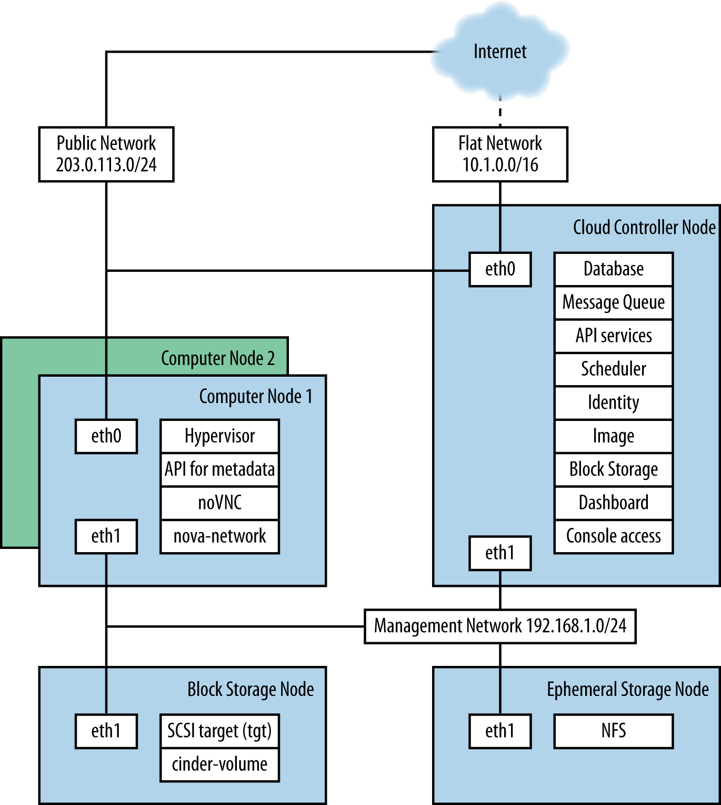
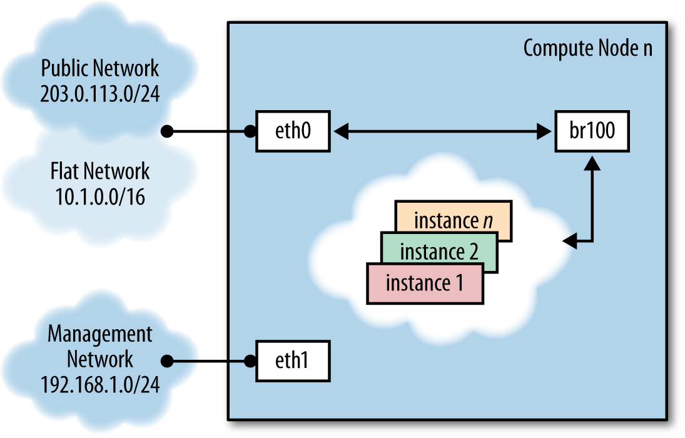

===============================================
Example Architecture — Legacy Networking (nova)
===============================================

This particular example architecture has been upgraded from :term:`Grizzly` to
:term:`Havana` and tested in production environments where many public IP
addresses are available for assignment to multiple instances. You can
find a second example architecture that uses OpenStack Networking
(neutron) after this section. Each example offers high availability,
meaning that if a particular node goes down, another node with the same
configuration can take over the tasks so that the services continue to
be available.

Overview
~~~~~~~~

The simplest architecture you can build upon for Compute has a single
cloud controller and multiple compute nodes. The simplest architecture
for Object Storage has five nodes: one for identifying users and
proxying requests to the API, then four for storage itself to provide
enough replication for eventual consistency. This example architecture
does not dictate a particular number of nodes, but shows the thinking
and considerations that went into choosing this architecture including
the features offered.

Components
~~~~~~~~~~

.. list-table::
   :widths: 50 50
   :header-rows: 1

   * - Component
     - Details
   * - OpenStack release
     - Havana
   * - Host operating system
     - Ubuntu 12.04 LTS or Red Hat Enterprise Linux 6.5,
       including derivatives such as CentOS and Scientific Linux
   * - OpenStack package repository
     - `Ubuntu Cloud Archive <https://wiki.ubuntu.com/ServerTeam/CloudArchive>`_
       or `RDO <http://openstack.redhat.com/Frequently_Asked_Questions>`_
   * - Hypervisor
     - KVM
   * - Database
     - MySQL\*
   * - Message queue
     - RabbitMQ for Ubuntu; Qpid for Red Hat Enterprise Linux and derivatives
   * - Networking service
     - ``nova-network``
   * - Network manager
     - FlatDHCP
   * - Single ``nova-network`` or multi-host?
     - multi-host\*
   * - Image service (glance) back end
     - file
   * - Identity (keystone) driver
     - SQL
   * - Block Storage (cinder) back end
     - LVM/iSCSI
   * - Live Migration back end
     - Shared storage using NFS\*
   * - Object storage
     - OpenStack Object Storage (swift)

An asterisk (\*) indicates when the example architecture deviates from
the settings of a default installation. We'll offer explanations for
those deviations next.

.. note::

    The following features of OpenStack are supported by the example
    architecture documented in this guide, but are optional:

    -  :term:`Dashboard <Dashboard (horizon)>`: You probably want to offer
       a dashboard, but your users may be more interested in API access only.

    -  :term:`Block storage <Block Storage service (cinder)>`:
       You don't have to offer users block storage if their use case only
       needs ephemeral storage on compute nodes, for example.

    -  :term:`Floating IP address <floating IP address>`:
       Floating IP addresses are public IP addresses that you allocate
       from a predefined pool to assign to virtual machines at launch.
       Floating IP address ensure that the public IP address is available
       whenever an instance is booted. Not every organization can offer
       thousands of public floating IP addresses for thousands of
       instances, so this feature is considered optional.

    -  :term:`Live migration <live migration>`: If you need to move
       running virtual machine instances from one host to another with
       little or no service interruption, you would enable live migration,
       but it is considered optional.

    -  :term:`Object storage <Object Storage service (swift)>`: You may
       choose to store machine images on a file system rather than in
       object storage if you do not have the extra hardware for the
       required replication and redundancy that OpenStack Object Storage
       offers.

Rationale
~~~~~~~~~

This example architecture has been selected based on the current default
feature set of OpenStack Havana, with an emphasis on stability. We
believe that many clouds that currently run OpenStack in production have
made similar choices.

You must first choose the operating system that runs on all of the
physical nodes. While OpenStack is supported on several distributions of
Linux, we used *Ubuntu 12.04 LTS (Long Term Support)*, which is used by
the majority of the development community, has feature completeness
compared with other distributions and has clear future support plans.

We recommend that you do not use the default Ubuntu OpenStack install
packages and instead use the `Ubuntu Cloud
Archive <https://wiki.ubuntu.com/ServerTeam/CloudArchive>`__. The Cloud
Archive is a package repository supported by Canonical that allows you
to upgrade to future OpenStack releases while remaining on Ubuntu 12.04.

*KVM* as a :term:`hypervisor` complements the choice of Ubuntu—being a
matched pair in terms of support, and also because of the significant degree
of attention it garners from the OpenStack development community (including
the authors, who mostly use KVM). It is also feature complete, free from
licensing charges and restrictions.

*MySQL* follows a similar trend. Despite its recent change of ownership,
this database is the most tested for use with OpenStack and is heavily
documented. We deviate from the default database, *SQLite*, because
SQLite is not an appropriate database for production usage.

The choice of *RabbitMQ* over other
:term:`AMQP <Advanced Message Queuing Protocol (AMQP)>` compatible options
that are gaining support in OpenStack, such as ZeroMQ and Qpid, is due to its
ease of use and significant testing in production. It also is the only
option that supports features such as Compute cells. We recommend
clustering with RabbitMQ, as it is an integral component of the system
and fairly simple to implement due to its inbuilt nature.

As discussed in previous chapters, there are several options for
networking in OpenStack Compute. We recommend *FlatDHCP* and to use
*Multi-Host* networking mode for high availability, running one
``nova-network`` daemon per OpenStack compute host. This provides a
robust mechanism for ensuring network interruptions are isolated to
individual compute hosts, and allows for the direct use of hardware
network gateways.

*Live Migration* is supported by way of shared storage, with *NFS* as
the distributed file system.

Acknowledging that many small-scale deployments see running Object
Storage just for the storage of virtual machine images as too costly, we
opted for the file back end in the OpenStack :term:`Image service (Glance)`.
If your cloud will include Object Storage, you can easily add it as a back
end.

We chose the *SQL back end for Identity* over others, such as LDAP. This
back end is simple to install and is robust. The authors acknowledge
that many installations want to bind with existing directory services
and caution careful understanding of the `array of options available
<https://docs.openstack.org/newton/config-reference/identity/options.html#keystone-ldap>`_.

Block Storage (cinder) is installed natively on external storage nodes
and uses the *LVM/iSCSI plug-in*. Most Block Storage plug-ins are tied
to particular vendor products and implementations limiting their use to
consumers of those hardware platforms, but LVM/iSCSI is robust and
stable on commodity hardware.

While the cloud can be run without the *OpenStack Dashboard*, we
consider it to be indispensable, not just for user interaction with the
cloud, but also as a tool for operators. Additionally, the dashboard's
use of Django makes it a flexible framework for extension.

Why not use OpenStack Networking?
~~~~~~~~~~~~~~~~~~~~~~~~~~~~~~~~~

This example architecture does not use OpenStack Networking, because it
does not yet support multi-host networking and our organizations
(university, government) have access to a large range of
publicly-accessible IPv4 addresses.

Why use multi-host networking?
~~~~~~~~~~~~~~~~~~~~~~~~~~~~~~

In a default OpenStack deployment, there is a single ``nova-network``
service that runs within the cloud (usually on the cloud controller)
that provides services such as
:term:`Network Address Translation (NAT)`, :term:`DHCP <Dynamic Host
Configuration Protocol (DHCP)>`, and :term:`DNS <Domain Name System (DNS)>`
to the guest instances. If the single node that runs the ``nova-network``
service goes down, you cannot access your instances, and the instances
cannot access the Internet. The single node that runs the ``nova-network``
service can become a bottleneck if excessive network traffic comes in and
goes out of the cloud.

.. tip::

   `Multi-host <https://docs.openstack.org/havana/install-guide/install/apt/content/nova-network.html>`_
   is a high-availability option for the network configuration, where
   the ``nova-network`` service is run on every compute node instead of
   running on only a single node.

Detailed Description
--------------------

The reference architecture consists of multiple compute nodes, a cloud
controller, an external NFS storage server for instance storage, and an
OpenStack Block Storage server for volume storage.
A network time service (:term:`Network Time Protocol (NTP)`)
synchronizes time on all the nodes. FlatDHCPManager in
multi-host mode is used for the networking. A logical diagram for this
example architecture shows which services are running on each node:

|

The cloud controller runs the dashboard, the API services, the database
(MySQL), a message queue server (RabbitMQ), the scheduler for choosing
compute resources (``nova-scheduler``), Identity services (keystone,
``nova-consoleauth``), Image services (``glance-api``,
``glance-registry``), services for console access of guests, and Block
Storage services, including the scheduler for storage resources
(``cinder-api`` and ``cinder-scheduler``).

Compute nodes are where the computing resources are held, and in our
example architecture, they run the hypervisor (KVM), libvirt (the driver
for the hypervisor, which enables live migration from node to node),
``nova-compute``, ``nova-api-metadata`` (generally only used when
running in multi-host mode, it retrieves instance-specific metadata),
``nova-vncproxy``, and ``nova-network``.

The network consists of two switches, one for the management or private
traffic, and one that covers public access, including floating IPs. To
support this, the cloud controller and the compute nodes have two
network cards. The OpenStack Block Storage and NFS storage servers only
need to access the private network and therefore only need one network
card, but multiple cards run in a bonded configuration are recommended
if possible. Floating IP access is direct to the Internet, whereas Flat
IP access goes through a NAT. To envision the network traffic, use this
diagram:

|

Optional Extensions
-------------------

You can extend this reference architecture as follows:

-  Add additional cloud controllers (see :doc:`ops-maintenance`).

-  Add an OpenStack Storage service (see the Object Storage chapter in
   the `Installation Tutorials and Guides
   <https://docs.openstack.org/project-install-guide/newton/>`_ for your distribution).

-  Add additional OpenStack Block Storage hosts (see
   :doc:`ops-maintenance`).
