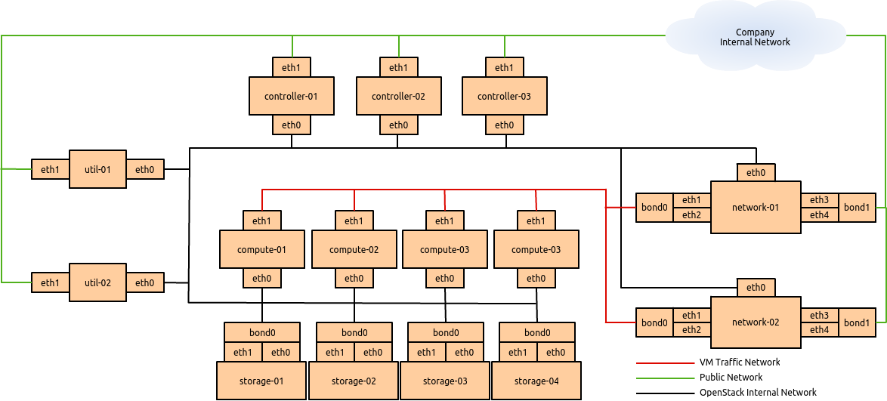
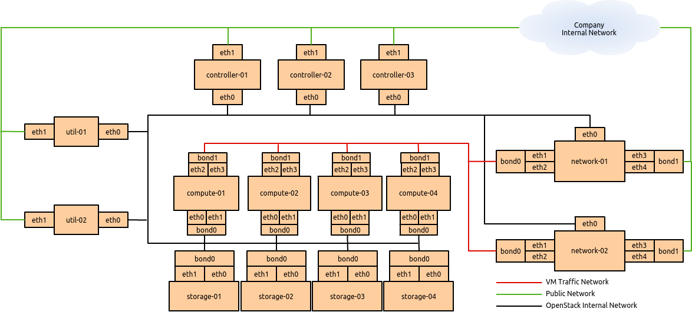
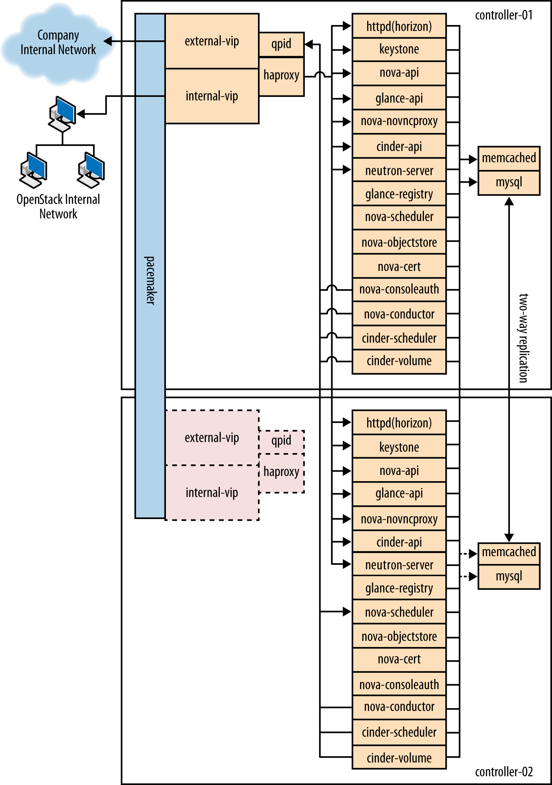
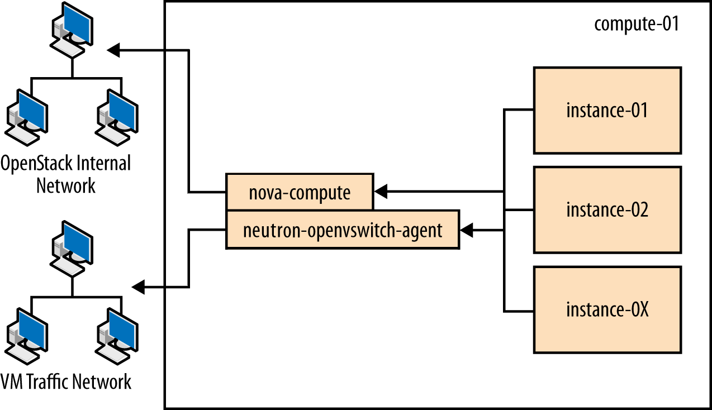
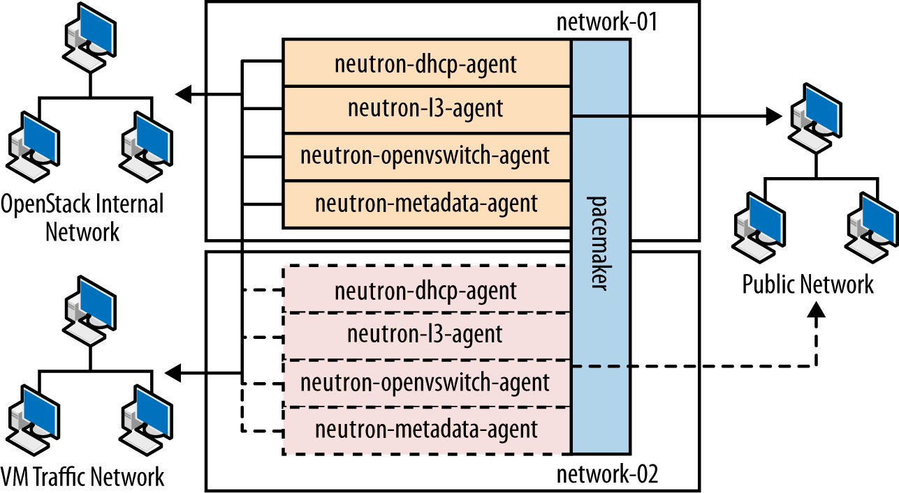
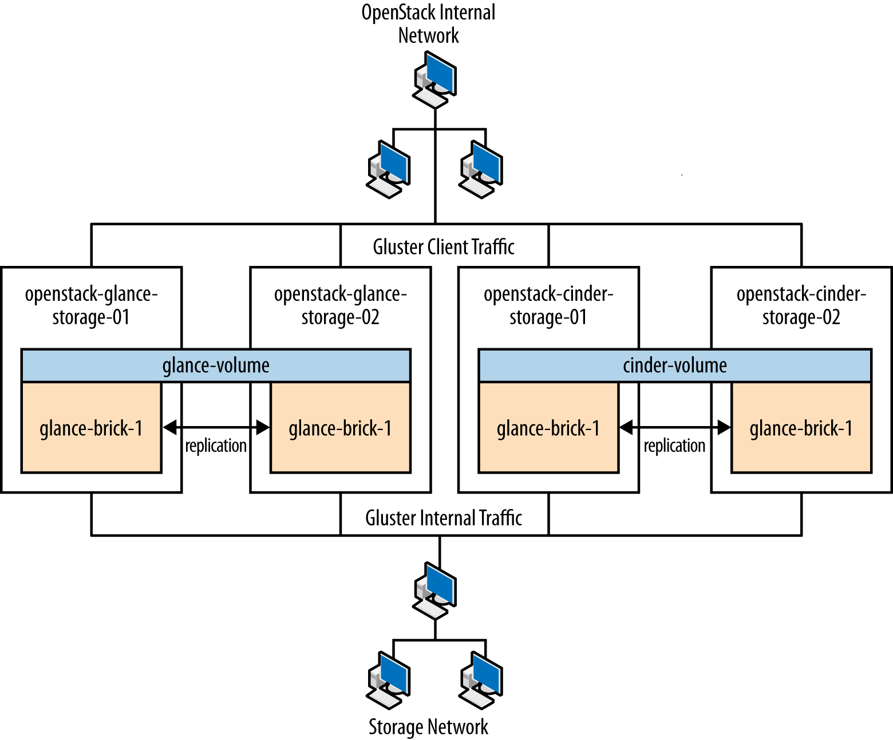

===========================================
Example Architecture — OpenStack Networking
===========================================

This chapter provides an example architecture using OpenStack
Networking, also known as the Neutron project, in a highly available
environment.

Overview
~~~~~~~~

A highly-available environment can be put into place if you require an
environment that can scale horizontally, or want your cloud to continue
to be operational in case of node failure. This example architecture has
been written based on the current default feature set of OpenStack
Havana, with an emphasis on high availability.

Components
----------

.. list-table::
   :widths: 50 50
   :header-rows: 1

   * - Component
     - Details
   * - OpenStack release
     - Havana
   * - Host operating system
     - Red Hat Enterprise Linux 6.5
   * - OpenStack package repository
     - `Red Hat Distributed OpenStack (RDO) <https://repos.fedorapeople.org/repos/openstack/>`_
   * - Hypervisor
     - KVM
   * - Database
     - MySQL
   * - Message queue
     - Qpid
   * - Networking service
     - OpenStack Networking
   * - Tenant Network Separation
     - VLAN
   * - Image service back end
     - GlusterFS
   * - Identity driver
     - SQL
   * - Block Storage back end
     - GlusterFS

Rationale
---------

This example architecture has been selected based on the current default
feature set of OpenStack Havana, with an emphasis on high availability.
This architecture is currently being deployed in an internal Red Hat
OpenStack cloud and used to run hosted and shared services, which by
their nature must be highly available.

This architecture's components have been selected for the following
reasons:

Red Hat Enterprise Linux
    You must choose an operating system that can run on all of the
    physical nodes. This example architecture is based on Red Hat
    Enterprise Linux, which offers reliability, long-term support,
    certified testing, and is hardened. Enterprise customers, now moving
    into OpenStack usage, typically require these advantages.

RDO
    The Red Hat Distributed OpenStack package offers an easy way to
    download the most current OpenStack release that is built for the
    Red Hat Enterprise Linux platform.

KVM
    KVM is the supported hypervisor of choice for Red Hat Enterprise
    Linux (and included in distribution). It is feature complete and
    free from licensing charges and restrictions.

MySQL
    MySQL is used as the database back end for all databases in the
    OpenStack environment. MySQL is the supported database of choice for
    Red Hat Enterprise Linux (and included in distribution); the
    database is open source, scalable, and handles memory well.

Qpid
    Apache Qpid offers 100 percent compatibility with the
    :term:`Advanced Message Queuing Protocol (AMQP)` Standard, and its
    broker is available for both C++ and Java.

OpenStack Networking
    OpenStack Networking offers sophisticated networking functionality,
    including Layer 2 (L2) network segregation and provider networks.

VLAN
    Using a virtual local area network offers broadcast control,
    security, and physical layer transparency. If needed, use VXLAN to
    extend your address space.

GlusterFS
    GlusterFS offers scalable storage. As your environment grows, you
    can continue to add more storage nodes (instead of being restricted,
    for example, by an expensive storage array).

Detailed Description
~~~~~~~~~~~~~~~~~~~~

Node types
----------

This section gives you a breakdown of the different nodes that make up
the OpenStack environment. A node is a physical machine that is
provisioned with an operating system, and running a defined software
stack on top of it. The table below provides node descriptions and
specifications.

.. list-table:: Node types
   :widths: 33 33 33
   :header-rows: 1

   * - Type
     - Description
     - Example hardware
   * - Controller
     - Controller nodes are responsible for running the management software
       services needed for the OpenStack environment to function.
       These nodes:

       * Provide the front door that people access as well as the API
         services that all other components in the environment talk to.
       * Run a number of services in a highly available fashion,
         utilizing Pacemaker and HAProxy to provide a virtual IP and
         load-balancing functions so all controller nodes are being used.
       * Supply highly available "infrastructure" services,
         such as MySQL and Qpid, that underpin all the services.
       * Provide what is known as "persistent storage" through services
         run on the host as well. This persistent storage is backed onto
         the storage nodes for reliability.

       See :ref:`controller_node`.
     - Model: Dell R620

       CPU: 2x Intel® Xeon® CPU E5-2620 0 @ 2.00 GHz

       Memory: 32 GB

       Disk: two 300 GB 10000 RPM SAS Disks

       Network: two 10G network ports
   * - Compute
     - Compute nodes run the virtual machine instances in OpenStack. They:

       * Run the bare minimum of services needed to facilitate these
         instances.
       * Use local storage on the node for the virtual machines so that
         no VM migration or instance recovery at node failure is possible.

       See :ref:`compute_node`.
     - Model: Dell R620

       CPU: 2x Intel® Xeon® CPU E5-2650 0 @ 2.00 GHz

       Memory: 128 GB

       Disk: two 600 GB 10000 RPM SAS Disks

       Network: four 10G network ports (For future proofing expansion)
   * - Storage
     - Storage nodes store all the data required for the environment,
       including disk images in the Image service library, and the
       persistent storage volumes created by the Block Storage service.
       Storage nodes use GlusterFS technology to keep the data highly
       available and scalable.

       See :ref:`storage_node`.
     - Model: Dell R720xd

       CPU: 2x Intel® Xeon® CPU E5-2620 0 @ 2.00 GHz

       Memory: 64 GB

       Disk: two 500 GB 7200 RPM SAS Disks and twenty-four 600 GB
       10000 RPM SAS Disks

       Raid Controller: PERC H710P Integrated RAID Controller, 1 GB NV Cache

       Network: two 10G network ports
   * - Network
     - Network nodes are responsible for doing all the virtual networking
       needed for people to create public or private networks and uplink
       their virtual machines into external networks. Network nodes:

       * Form the only ingress and egress point for instances running
         on top of OpenStack.
       * Run all of the environment's networking services, with the
         exception of the networking API service (which runs on the
         controller node).

       See :ref:`network_node`.
     - Model: Dell R620

       CPU: 1x Intel® Xeon® CPU E5-2620 0 @ 2.00 GHz

       Memory: 32 GB

       Disk: two 300 GB 10000 RPM SAS Disks

       Network: five 10G network ports
   * - Utility
     - Utility nodes are used by internal administration staff only to
       provide a number of basic system administration functions needed
       to get the environment up and running and to maintain the hardware,
       OS, and software on which it runs.

       These nodes run services such as provisioning, configuration
       management, monitoring, or GlusterFS management software.
       They are not required to scale, although these machines are
       usually backed up.
     - Model: Dell R620

       CPU: 2x Intel® Xeon® CPU E5-2620 0 @ 2.00 GHz

       Memory: 32 GB

       Disk: two 500 GB 7200 RPM SAS Disks

       Network: two 10G network ports

.. _networking_layout:

Networking layout
-----------------

The network contains all the management devices for all hardware in the
environment (for example, by including Dell iDrac7 devices for the
hardware nodes, and management interfaces for network switches). The
network is accessed by internal staff only when diagnosing or recovering
a hardware issue.

OpenStack internal network
--------------------------

This network is used for OpenStack management functions and traffic,
including services needed for the provisioning of physical nodes
(``pxe``, ``tftp``, ``kickstart``), traffic between various OpenStack
node types using OpenStack APIs and messages (for example,
``nova-compute`` talking to ``keystone`` or ``cinder-volume`` talking to
``nova-api``), and all traffic for storage data to the storage layer
underneath by the Gluster protocol. All physical nodes have at least one
network interface (typically ``eth0``) in this network. This network is
only accessible from other VLANs on port 22 (for ``ssh`` access to
manage machines).

Public Network
--------------

This network is a combination of:

-  IP addresses for public-facing interfaces on the controller nodes
   (which end users will access the OpenStack services)

-  A range of publicly routable, IPv4 network addresses to be used by
   OpenStack Networking for floating IPs. You may be restricted in your
   access to IPv4 addresses; a large range of IPv4 addresses is not
   necessary.

-  Routers for private networks created within OpenStack.

This network is connected to the controller nodes so users can access
the OpenStack interfaces, and connected to the network nodes to provide
VMs with publicly routable traffic functionality. The network is also
connected to the utility machines so that any utility services that need
to be made public (such as system monitoring) can be accessed.

VM traffic network
------------------

This is a closed network that is not publicly routable and is simply
used as a private, internal network for traffic between virtual machines
in OpenStack, and between the virtual machines and the network nodes
that provide l3 routes out to the public network (and floating IPs for
connections back in to the VMs). Because this is a closed network, we
are using a different address space to the others to clearly define the
separation. Only Compute and OpenStack Networking nodes need to be
connected to this network.

Node connectivity
~~~~~~~~~~~~~~~~~

The following section details how the nodes are connected to the
different networks (see :ref:`networking_layout`) and
what other considerations need to take place (for example, bonding) when
connecting nodes to the networks.

Initial deployment
------------------

Initially, the connection setup should revolve around keeping the
connectivity simple and straightforward in order to minimize deployment
complexity and time to deploy. The deployment shown below aims to have 1 × 10G
connectivity available to all compute nodes, while still leveraging bonding on
appropriate nodes for maximum performance.

   Basic node deployment

Connectivity for maximum performance
------------------------------------

If the networking performance of the basic layout is not enough, you can
move to the design below, which provides 2 × 10G network
links to all instances in the environment as well as providing more
network bandwidth to the storage layer.

   Performance node deployment

Node diagrams
~~~~~~~~~~~~~

The following diagrams include logical
information about the different types of nodes, indicating what services
will be running on top of them and how they interact with each other.
The diagrams also illustrate how the availability and scalability of
services are achieved.

.. _controller_node:

   Controller node

.. _compute_node:

   Compute node

.. _network_node:

   Network node

.. _storage_node:

   Storage node

Example Component Configuration
-------------------------------

The following tables include example configuration
and considerations for both third-party and OpenStack components:

.. list-table:: Table: Third-party component configuration
   :widths: 25 25 25 25
   :header-rows: 1

   * - Component
     - Tuning
     - Availability
     - Scalability
   * - MySQL
     - ``binlog-format = row``
     - Master/master replication. However, both nodes are not used at the
       same time. Replication keeps all nodes as close to being up to date
       as possible (although the asynchronous nature of the replication means
       a fully consistent state is not possible). Connections to the database
       only happen through a Pacemaker virtual IP, ensuring that most problems
       that occur with master-master replication can be avoided.
     - Not heavily considered. Once load on the MySQL server increases enough
       that scalability needs to be considered, multiple masters or a
       master/slave setup can be used.
   * - Qpid
     - ``max-connections=1000`` ``worker-threads=20`` ``connection-backlog=10``,
       sasl security enabled with SASL-BASIC authentication
     - Qpid is added as a resource to the Pacemaker software that runs on
       Controller nodes where Qpid is situated. This ensures only one Qpid
       instance is running at one time, and the node with the Pacemaker
       virtual IP will always be the node running Qpid.
     - Not heavily considered. However, Qpid can be changed to run on all
       controller nodes for scalability and availability purposes,
       and removed from Pacemaker.
   * - HAProxy
     - ``maxconn 3000``
     - HAProxy is a software layer-7 load balancer used to front door all
       clustered OpenStack API components and do SSL termination.
       HAProxy can be added as a resource to the Pacemaker software that
       runs on the Controller nodes where HAProxy is situated.
       This ensures that only one HAProxy instance is running at one time,
       and the node with the Pacemaker virtual IP will always be the node
       running HAProxy.
     - Not considered. HAProxy has small enough performance overheads that
       a single instance should scale enough for this level of workload.
       If extra scalability is needed, ``keepalived`` or other Layer-4
       load balancing can be introduced to be placed in front of multiple
       copies of HAProxy.
   * - Memcached
     - ``MAXCONN="8192" CACHESIZE="30457"``
     - Memcached is a fast in-memory key-value cache software that is used
       by OpenStack components for caching data and increasing performance.
       Memcached runs on all controller nodes, ensuring that should one go
       down, another instance of Memcached is available.
     - Not considered. A single instance of Memcached should be able to
       scale to the desired workloads. If scalability is desired, HAProxy
       can be placed in front of Memcached (in raw ``tcp`` mode) to utilize
       multiple Memcached instances for scalability. However, this might
       cause cache consistency issues.
   * - Pacemaker
     - Configured to use ``corosync`` and ``cman`` as a cluster communication
       stack/quorum manager, and as a two-node cluster.
     - Pacemaker is the clustering software used to ensure the availability
       of services running on the controller and network nodes:

       * Because Pacemaker is cluster software, the software itself handles
         its own availability, leveraging ``corosync`` and ``cman``
         underneath.
       * If you use the GlusterFS native client, no virtual IP is needed,
         since the client knows all about nodes after initial connection
         and automatically routes around failures on the client side.
       * If you use the NFS or SMB adaptor, you will need a virtual IP on
         which to mount the GlusterFS volumes.
     - If more nodes need to be made cluster aware, Pacemaker can scale to
       64 nodes.
   * - GlusterFS
     - ``glusterfs`` performance profile "virt" enabled on all volumes.
       Volumes are setup in two-node replication.
     - Glusterfs is a clustered file system that is run on the storage
       nodes to provide persistent scalable data storage in the environment.
       Because all connections to gluster use the ``gluster`` native mount
       points, the ``gluster`` instances themselves provide availability
       and failover functionality.
     - The scalability of GlusterFS storage can be achieved by adding in
       more storage volumes.

|

.. list-table:: Table: OpenStack component configuration
   :widths: 20 20 20 20 20
   :header-rows: 1

   * - Component
     - Node type
     - Tuning
     - Availability
     - Scalability
   * - Dashboard (horizon)
     - Controller
     - Configured to use Memcached as a session store, ``neutron``
       support is enabled, ``can_set_mount_point = False``
     - The dashboard is run on all controller nodes, ensuring at least one
       instance will be available in case of node failure.
       It also sits behind HAProxy, which detects when the software fails
       and routes requests around the failing instance.
     - The dashboard is run on all controller nodes, so scalability can be
       achieved with additional controller nodes. HAProxy allows scalability
       for the dashboard as more nodes are added.
   * - Identity (keystone)
     - Controller
     - Configured to use Memcached for caching and PKI for tokens.
     - Identity is run on all controller nodes, ensuring at least one
       instance will be available in case of node failure.
       Identity also sits behind HAProxy, which detects when the software
       fails and routes requests around the failing instance.
     - Identity is run on all controller nodes, so scalability can be
       achieved with additional controller nodes.
       HAProxy allows scalability for Identity as more nodes are added.
   * - Image service (glance)
     - Controller
     - ``/var/lib/glance/images`` is a GlusterFS native mount to a Gluster
       volume off the storage layer.
     - The Image service is run on all controller nodes, ensuring at least
       one instance will be available in case of node failure.
       It also sits behind HAProxy, which detects when the software fails
       and routes requests around the failing instance.
     - The Image service is run on all controller nodes, so scalability
       can be achieved with additional controller nodes. HAProxy allows
       scalability for the Image service as more nodes are added.
   * - Compute (nova)
     - Controller, Compute
     - Configured to use Qpid, ``qpid_heartbeat = `` ``10``,configured to
       use Memcached for caching, configured to use ``libvirt``, configured
       to use ``neutron``.

       Configured ``nova-consoleauth`` to use Memcached for session
       management (so that it can have multiple copies and run in a
       load balancer).
     - The nova API, scheduler, objectstore, cert, consoleauth, conductor,
       and vncproxy services are run on all controller nodes, ensuring at
       least one instance will be available in case of node failure.
       Compute is also behind HAProxy, which detects when the software
       fails and routes requests around the failing instance.

       Nova-compute and nova-conductor services, which run on the compute
       nodes, are only needed to run services on that node, so availability
       of those services is coupled tightly to the nodes that are available.
       As long as a compute node is up, it will have the needed services
       running on top of it.
     - The nova API, scheduler, objectstore, cert, consoleauth, conductor,
       and vncproxy services are run on all controller nodes, so scalability
       can be achieved with additional controller nodes. HAProxy allows
       scalability for Compute as more nodes are added. The scalability
       of services running on the compute nodes (compute, conductor) is
       achieved linearly by adding in more compute nodes.
   * - Block Storage (cinder)
     - Controller
     - Configured to use Qpid, ``qpid_heartbeat = ``\ ``10``,configured to
       use a Gluster volume from the storage layer as the back end for
       Block Storage, using the Gluster native client.
     - Block Storage API, scheduler, and volume services are run on all
       controller nodes, ensuring at least one instance will be available
       in case of node failure. Block Storage also sits behind HAProxy,
       which detects if the software fails and routes requests around the
       failing instance.
     - Block Storage API, scheduler and volume services are run on all
       controller nodes, so scalability can be achieved with additional
       controller nodes. HAProxy allows scalability for Block Storage as
       more nodes are added.
   * - OpenStack Networking (neutron)
     - Controller, Compute, Network
     - Configured to use QPID, ``qpid_heartbeat = 10``, kernel namespace
       support enabled, ``tenant_network_type = vlan``,
       ``allow_overlapping_ips = true``, ``tenant_network_type = vlan``,
       ``bridge_uplinks = br-ex:em2``, ``bridge_mappings = physnet1:br-ex``
     - The OpenStack Networking service is run on all controller nodes,
       ensuring at least one instance will be available in case of node
       failure. It also sits behind HAProxy, which detects if the software
       fails and routes requests around the failing instance.
     - The OpenStack Networking server service is run on all controller
       nodes, so scalability can be achieved with additional controller
       nodes. HAProxy allows scalability for OpenStack Networking as more
       nodes are added. Scalability of services running on the network
       nodes is not currently supported by OpenStack Networking, so they
       are not be considered. One copy of the services should be sufficient
       to handle the workload. Scalability of the ``ovs-agent`` running on
       compute nodes is achieved by adding in more compute nodes as
       necessary.
