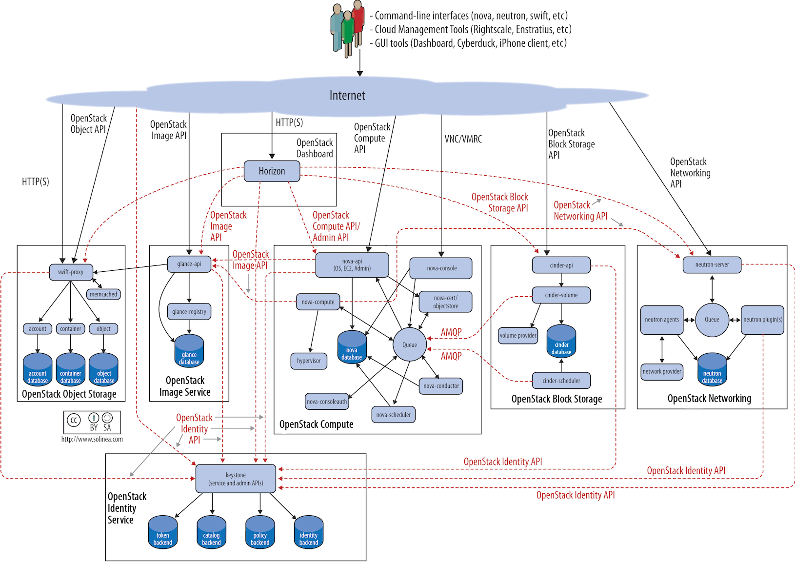

============
Architecture
============

Designing an OpenStack cloud is a great achievement. It requires a
robust understanding of the requirements and needs of the cloud's users
to determine the best possible configuration to meet them. OpenStack
provides a great deal of flexibility to achieve your needs, and this
part of the book aims to shine light on many of the decisions you need
to make during the process.

To design, deploy, and configure OpenStack, administrators must
understand the logical architecture. A diagram can help you envision all
the integrated services within OpenStack and how they interact with each
other.

OpenStack modules are one of the following types:

Daemon
 Runs as a background process. On Linux platforms, a daemon is usually
 installed as a service.

Script
 Installs a virtual environment and runs tests.

Command-line interface (CLI)
 Enables users to submit API calls to OpenStack services through commands.

As shown, end users can interact through the dashboard, CLIs, and APIs.
All services authenticate through a common Identity service, and
individual services interact with each other through public APIs, except
where privileged administrator commands are necessary.
:ref:`logical_architecture` shows the most common, but not the only logical
architecture for an OpenStack cloud.

.. _logical_architecture:

   OpenStack Logical Architecture

.. toctree::
   :maxdepth: 2

   arch-examples.rst
   arch-provision.rst
   arch-cloud-controller.rst
   arch-compute-nodes.rst
   arch-scaling.rst
   arch-storage.rst
   arch-network-design.rst
