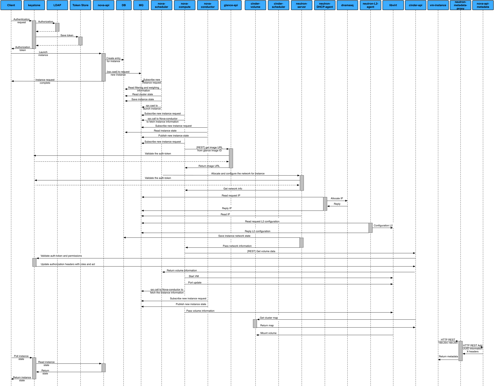

=====================
Provision an instance
=====================

To help understand how OpenStack works, this section describes the
end-to-end process and interaction of components when provisioning an instance
on OpenStack.

**Provision an instance**

