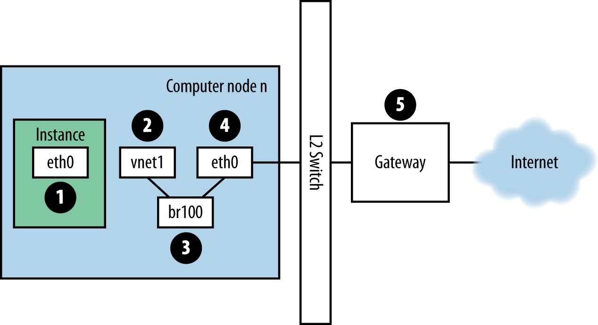

=======================
Network Troubleshooting
=======================

Network troubleshooting can be challenging. A network issue may cause
problems at any point in the cloud. Using a logical troubleshooting
procedure can help mitigate the issue and isolate where the network issue is.
This chapter aims to give you the information you need to identify any
issues for ``nova-network`` or OpenStack Networking (neutron) with Linux
Bridge or Open vSwitch.

Using ip a to Check Interface States
~~~~~~~~~~~~~~~~~~~~~~~~~~~~~~~~~~~~

On compute nodes and nodes running ``nova-network``, use the following
command to see information about interfaces, including information about
IPs, VLANs, and whether your interfaces are up:

.. code-block:: console

   # ip a

If you are encountering any sort of networking difficulty, one good initial
troubleshooting step is to make sure that your interfaces are up. For example:

.. code-block:: console

   $ ip a | grep state
   1: lo: <LOOPBACK,UP,LOWER_UP> mtu 16436 qdisc noqueue state UNKNOWN
   2: eth0: <BROADCAST,MULTICAST,UP,LOWER_UP> mtu 1500 qdisc pfifo_fast state UP
      qlen 1000
   3: eth1: <BROADCAST,MULTICAST,UP,LOWER_UP> mtu 1500 qdisc pfifo_fast
      master br100 state UP qlen 1000
   4: virbr0: <NO-CARRIER,BROADCAST,MULTICAST,UP> mtu 1500 qdisc noqueue state DOWN
   5: br100: <BROADCAST,MULTICAST,UP,LOWER_UP> mtu 1500 qdisc noqueue state UP

You can safely ignore the state of ``virbr0``, which is a default bridge
created by libvirt and not used by OpenStack.

Visualizing nova-network Traffic in the Cloud
~~~~~~~~~~~~~~~~~~~~~~~~~~~~~~~~~~~~~~~~~~~~~

If you are logged in to an instance and ping an external host, for
example, Google, the ping packet takes the route shown in
:ref:`figure_traffic_route`.

.. _figure_traffic_route:

   Figure. Traffic route for ping packet

#. The instance generates a packet and places it on the virtual Network
   Interface Card (NIC) inside the instance, such as ``eth0``.

#. The packet transfers to the virtual NIC of the compute host, such as,
   ``vnet1``. You can find out what vnet NIC is being used by looking at
   the ``/etc/libvirt/qemu/instance-xxxxxxxx.xml`` file.

#. From the vnet NIC, the packet transfers to a bridge on the compute
   node, such as ``br100``.

   If you run FlatDHCPManager, one bridge is on the compute node. If you
   run VlanManager, one bridge exists for each VLAN.

   To see which bridge the packet will use, run the command:

   .. code-block:: console

      $ brctl show

   Look for the vnet NIC. You can also reference ``nova.conf`` and look
   for the ``flat_interface_bridge`` option.

#. The packet transfers to the main NIC of the compute node. You can
   also see this NIC in the :command:`brctl` output, or you can find it by
   referencing the ``flat_interface`` option in ``nova.conf``.

#. After the packet is on this NIC, it transfers to the compute node's
   default gateway. The packet is now most likely out of your control at
   this point. The diagram depicts an external gateway. However, in the
   default configuration with multi-host, the compute host is the
   gateway.

Reverse the direction to see the path of a ping reply. From this path,
you can see that a single packet travels across four different NICs. If
a problem occurs with any of these NICs, a network issue occurs.

Visualizing OpenStack Networking Service Traffic in the Cloud
~~~~~~~~~~~~~~~~~~~~~~~~~~~~~~~~~~~~~~~~~~~~~~~~~~~~~~~~~~~~~

OpenStack Networking has many more degrees of freedom than
``nova-network`` does because of its pluggable back end. It can be
configured with open source or vendor proprietary plug-ins that control
software defined networking (SDN) hardware or plug-ins that use Linux
native facilities on your hosts, such as Open vSwitch or Linux Bridge.

The networking chapter of the `OpenStack Administrator
Guide <https://docs.openstack.org/admin-guide/networking.html>`_
shows a variety of networking scenarios and their connection paths. The
purpose of this section is to give you the tools to troubleshoot the
various components involved however they are plumbed together in your
environment.

For this example, we will use the Open vSwitch (OVS) back end. Other
back-end plug-ins will have very different flow paths. OVS is the most
popularly deployed network driver, according to the April 2016
OpenStack User Survey. We'll describe each step in turn, with
:ref:`network_paths` for reference.

#. The instance generates a packet and places it on the virtual NIC
   inside the instance, such as eth0.

#. The packet transfers to a Test Access Point (TAP) device on the
   compute host, such as tap690466bc-92. You can find out what TAP is
   being used by looking at the
   ``/etc/libvirt/qemu/instance-xxxxxxxx.xml`` file.

   The TAP device name is constructed using the first 11 characters of
   the port ID (10 hex digits plus an included '-'), so another means of
   finding the device name is to use the :command:`neutron` command. This
   returns a pipe-delimited list, the first item of which is the port
   ID. For example, to get the port ID associated with IP address
   10.0.0.10, do this:

   .. code-block:: console

      # openstack port list | grep 10.0.0.10 | cut -d \| -f 2
       ff387e54-9e54-442b-94a3-aa4481764f1d

   Taking the first 11 characters, we can construct a device name of
   tapff387e54-9e from this output.

   .. _network_paths:

   .. figure:: figures/osog_1202.png
      :alt: Neutron network paths
      :width: 100%

      Figure. Neutron network paths

#. The TAP device is connected to the integration bridge, ``br-int``.
   This bridge connects all the instance TAP devices and any other
   bridges on the system. In this example, we have ``int-br-eth1`` and
   ``patch-tun``. ``int-br-eth1`` is one half of a veth pair connecting
   to the bridge ``br-eth1``, which handles VLAN networks trunked over
   the physical Ethernet device ``eth1``. ``patch-tun`` is an Open
   vSwitch internal port that connects to the ``br-tun`` bridge for GRE
   networks.

   The TAP devices and veth devices are normal Linux network devices and
   may be inspected with the usual tools, such as :command:`ip` and
   :command:`tcpdump`. Open vSwitch internal devices, such as ``patch-tun``,
   are only visible within the Open vSwitch environment. If you try to
   run :command:`tcpdump -i patch-tun`, it will raise an error, saying that
   the device does not exist.

   It is possible to watch packets on internal interfaces, but it does
   take a little bit of networking gymnastics. First you need to create
   a dummy network device that normal Linux tools can see. Then you need
   to add it to the bridge containing the internal interface you want to
   snoop on. Finally, you need to tell Open vSwitch to mirror all
   traffic to or from the internal port onto this dummy port. After all
   this, you can then run :command:`tcpdump` on the dummy interface and see
   the traffic on the internal port.

   **To capture packets from the patch-tun internal interface on integration
   bridge, br-int:**

   #. Create and bring up a dummy interface, ``snooper0``:

      .. code-block:: console

         # ip link add name snooper0 type dummy
         # ip link set dev snooper0 up

   #. Add device ``snooper0`` to bridge ``br-int``:

      .. code-block:: console

         # ovs-vsctl add-port br-int snooper0

   #. Create mirror of ``patch-tun`` to ``snooper0`` (returns UUID of
      mirror port):

      .. code-block:: console

         # ovs-vsctl -- set Bridge br-int mirrors=@m  -- --id=@snooper0 \
           get Port snooper0  -- --id=@patch-tun get Port patch-tun \
           -- --id=@m create Mirror name=mymirror select-dst-port=@patch-tun \
           select-src-port=@patch-tun output-port=@snooper0 select_all=1

   #. Profit. You can now see traffic on ``patch-tun`` by running
      :command:`tcpdump -i snooper0`.

   #. Clean up by clearing all mirrors on ``br-int`` and deleting the dummy
      interface:

      .. code-block:: console

         # ovs-vsctl clear Bridge br-int mirrors
         # ovs-vsctl del-port br-int snooper0
         # ip link delete dev snooper0

   On the integration bridge, networks are distinguished using internal
   VLANs regardless of how the networking service defines them. This
   allows instances on the same host to communicate directly without
   transiting the rest of the virtual, or physical, network. These
   internal VLAN IDs are based on the order they are created on the node
   and may vary between nodes. These IDs are in no way related to the
   segmentation IDs used in the network definition and on the physical
   wire.

   VLAN tags are translated between the external tag defined in the
   network settings, and internal tags in several places. On the
   ``br-int``, incoming packets from the ``int-br-eth1`` are translated
   from external tags to internal tags. Other translations also happen
   on the other bridges and will be discussed in those sections.

   **To discover which internal VLAN tag is in use for a given external VLAN
   by using the ovs-ofctl command**

   #. Find the external VLAN tag of the network you're interested in. This
      is the ``provider:segmentation_id`` as returned by the networking
      service:

      .. code-block:: console

         # neutron net-show --fields provider:segmentation_id <network name>
         +---------------------------+--------------------------------------+
         | Field                     | Value                                |
         +---------------------------+--------------------------------------+
         | provider:network_type     | vlan                                 |
         | provider:segmentation_id  | 2113                                 |
         +---------------------------+--------------------------------------+

   #. Grep for the ``provider:segmentation_id``, 2113 in this case, in the
      output of :command:`ovs-ofctl dump-flows br-int`:

      .. code-block:: console

         # ovs-ofctl dump-flows br-int | grep vlan=2113
         cookie=0x0, duration=173615.481s, table=0, n_packets=7676140,
         n_bytes=444818637, idle_age=0, hard_age=65534, priority=3,
         in_port=1,dl_vlan=2113 actions=mod_vlan_vid:7,NORMAL

      Here you can see packets received on port ID 1 with the VLAN tag 2113
      are modified to have the internal VLAN tag 7. Digging a little
      deeper, you can confirm that port 1 is in fact ``int-br-eth1``:

      .. code-block:: console

         # ovs-ofctl show br-int
         OFPT_FEATURES_REPLY (xid=0x2): dpid:000022bc45e1914b
         n_tables:254, n_buffers:256
         capabilities: FLOW_STATS TABLE_STATS PORT_STATS QUEUE_STATS
         ARP_MATCH_IP
         actions: OUTPUT SET_VLAN_VID SET_VLAN_PCP STRIP_VLAN SET_DL_SRC
         SET_DL_DST SET_NW_SRC SET_NW_DST SET_NW_TOS SET_TP_SRC
         SET_TP_DST ENQUEUE
          1(int-br-eth1): addr:c2:72:74:7f:86:08
              config:     0
              state:      0
              current:    10GB-FD COPPER
              speed: 10000 Mbps now, 0 Mbps max
          2(patch-tun): addr:fa:24:73:75:ad:cd
              config:     0
              state:      0
              speed: 0 Mbps now, 0 Mbps max
          3(tap9be586e6-79): addr:fe:16:3e:e6:98:56
              config:     0
              state:      0
              current:    10MB-FD COPPER
              speed: 10 Mbps now, 0 Mbps max
          LOCAL(br-int): addr:22:bc:45:e1:91:4b
              config:     0
              state:      0
              speed: 0 Mbps now, 0 Mbps max
         OFPT_GET_CONFIG_REPLY (xid=0x4): frags=normal miss_send_len=0

#. The next step depends on whether the virtual network is configured to
   use 802.1q VLAN tags or GRE:

   #. VLAN-based networks exit the integration bridge via veth interface
      ``int-br-eth1`` and arrive on the bridge ``br-eth1`` on the other
      member of the veth pair ``phy-br-eth1``. Packets on this interface
      arrive with internal VLAN tags and are translated to external tags
      in the reverse of the process described above:

      .. code-block:: console

         # ovs-ofctl dump-flows br-eth1 | grep 2113
         cookie=0x0, duration=184168.225s, table=0, n_packets=0, n_bytes=0,
         idle_age=65534, hard_age=65534, priority=4,in_port=1,dl_vlan=7
         actions=mod_vlan_vid:2113,NORMAL

      Packets, now tagged with the external VLAN tag, then exit onto the
      physical network via ``eth1``. The Layer2 switch this interface is
      connected to must be configured to accept traffic with the VLAN ID
      used. The next hop for this packet must also be on the same
      layer-2 network.

   #. GRE-based networks are passed with ``patch-tun`` to the tunnel
      bridge ``br-tun`` on interface ``patch-int``. This bridge also
      contains one port for each GRE tunnel peer, so one for each
      compute node and network node in your network. The ports are named
      sequentially from ``gre-1`` onward.

      Matching ``gre-<n>`` interfaces to tunnel endpoints is possible by
      looking at the Open vSwitch state:

      .. code-block:: console

         # ovs-vsctl show | grep -A 3 -e Port\ \"gre-
                 Port "gre-1"
                     Interface "gre-1"
                         type: gre
                         options: {in_key=flow, local_ip="10.10.128.21",
                         out_key=flow, remote_ip="10.10.128.16"}

      In this case, ``gre-1`` is a tunnel from IP 10.10.128.21, which
      should match a local interface on this node, to IP 10.10.128.16 on
      the remote side.

      These tunnels use the regular routing tables on the host to route
      the resulting GRE packet, so there is no requirement that GRE
      endpoints are all on the same layer-2 network, unlike VLAN
      encapsulation.

      All interfaces on the ``br-tun`` are internal to Open vSwitch. To
      monitor traffic on them, you need to set up a mirror port as
      described above for ``patch-tun`` in the ``br-int`` bridge.

      All translation of GRE tunnels to and from internal VLANs happens
      on this bridge.

   **To discover which internal VLAN tag is in use for a GRE tunnel by using
   the ovs-ofctl command**

   #. Find the ``provider:segmentation_id`` of the network you're
      interested in. This is the same field used for the VLAN ID in
      VLAN-based networks:

      .. code-block:: console

         # neutron net-show --fields provider:segmentation_id <network name>
         +--------------------------+-------+
         | Field                    | Value |
         +--------------------------+-------+
         | provider:network_type    | gre   |
         | provider:segmentation_id | 3     |
         +--------------------------+-------+

   #. Grep for 0x<``provider:segmentation_id``>, 0x3 in this case, in the
      output of ``ovs-ofctl dump-flows br-tun``:

      .. code-block:: console

         # ovs-ofctl dump-flows br-tun|grep 0x3
         cookie=0x0, duration=380575.724s, table=2, n_packets=1800,
         n_bytes=286104, priority=1,tun_id=0x3
         actions=mod_vlan_vid:1,resubmit(,10)
          cookie=0x0, duration=715.529s, table=20, n_packets=5,
         n_bytes=830, hard_timeout=300,priority=1,
         vlan_tci=0x0001/0x0fff,dl_dst=fa:16:3e:a6:48:24
         actions=load:0->NXM_OF_VLAN_TCI[],
         load:0x3->NXM_NX_TUN_ID[],output:53
          cookie=0x0, duration=193729.242s, table=21, n_packets=58761,
         n_bytes=2618498, dl_vlan=1 actions=strip_vlan,set_tunnel:0x3,
         output:4,output:58,output:56,output:11,output:12,output:47,
         output:13,output:48,output:49,output:44,output:43,output:45,
         output:46,output:30,output:31,output:29,output:28,output:26,
         output:27,output:24,output:25,output:32,output:19,output:21,
         output:59,output:60,output:57,output:6,output:5,output:20,
         output:18,output:17,output:16,output:15,output:14,output:7,
         output:9,output:8,output:53,output:10,output:3,output:2,
         output:38,output:37,output:39,output:40,output:34,output:23,
         output:36,output:35,output:22,output:42,output:41,output:54,
         output:52,output:51,output:50,output:55,output:33

      Here, you see three flows related to this GRE tunnel. The first is
      the translation from inbound packets with this tunnel ID to internal
      VLAN ID 1. The second shows a unicast flow to output port 53 for
      packets destined for MAC address fa:16:3e:a6:48:24. The third shows
      the translation from the internal VLAN representation to the GRE
      tunnel ID flooded to all output ports. For further details of the
      flow descriptions, see the man page for ``ovs-ofctl``. As in the
      previous VLAN example, numeric port IDs can be matched with their
      named representations by examining the output of ``ovs-ofctl show br-tun``.

#. The packet is then received on the network node. Note that any
   traffic to the l3-agent or dhcp-agent will be visible only within
   their network namespace. Watching any interfaces outside those
   namespaces, even those that carry the network traffic, will only show
   broadcast packets like Address Resolution Protocols (ARPs), but
   unicast traffic to the router or DHCP address will not be seen. See
   :ref:`dealing_with_network_namespaces`
   for detail on how to run commands within these namespaces.

   Alternatively, it is possible to configure VLAN-based networks to use
   external routers rather than the l3-agent shown here, so long as the
   external router is on the same VLAN:

   #. VLAN-based networks are received as tagged packets on a physical
      network interface, ``eth1`` in this example. Just as on the
      compute node, this interface is a member of the ``br-eth1``
      bridge.

   #. GRE-based networks will be passed to the tunnel bridge ``br-tun``,
      which behaves just like the GRE interfaces on the compute node.

#. Next, the packets from either input go through the integration
   bridge, again just as on the compute node.

#. The packet then makes it to the l3-agent. This is actually another
   TAP device within the router's network namespace. Router namespaces
   are named in the form ``qrouter-<router-uuid>``. Running :command:`ip a`
   within the namespace will show the TAP device name,
   qr-e6256f7d-31 in this example:

   .. code-block:: console

      # ip netns exec qrouter-e521f9d0-a1bd-4ff4-bc81-78a60dd88fe5 ip a | grep state
      10: qr-e6256f7d-31: <BROADCAST,UP,LOWER_UP> mtu 1500 qdisc noqueue
          state UNKNOWN
      11: qg-35916e1f-36: <BROADCAST,MULTICAST,UP,LOWER_UP> mtu 1500
          qdisc pfifo_fast state UNKNOWN qlen 500
      28: lo: <LOOPBACK,UP,LOWER_UP> mtu 16436 qdisc noqueue state UNKNOWN

#. The ``qg-<n>`` interface in the l3-agent router namespace sends the
   packet on to its next hop through device ``eth2`` on the external
   bridge ``br-ex``. This bridge is constructed similarly to ``br-eth1``
   and may be inspected in the same way.

#. This external bridge also includes a physical network interface,
   ``eth2`` in this example, which finally lands the packet on the
   external network destined for an external router or destination.

#. DHCP agents running on OpenStack networks run in namespaces similar
   to the l3-agents. DHCP namespaces are named ``qdhcp-<uuid>`` and have
   a TAP device on the integration bridge. Debugging of DHCP issues
   usually involves working inside this network namespace.

Finding a Failure in the Path
~~~~~~~~~~~~~~~~~~~~~~~~~~~~~

Use ping to quickly find where a failure exists in the network path. In
an instance, first see whether you can ping an external host, such as
google.com. If you can, then there shouldn't be a network problem at
all.

If you can't, try pinging the IP address of the compute node where the
instance is hosted. If you can ping this IP, then the problem is
somewhere between the compute node and that compute node's gateway.

If you can't ping the IP address of the compute node, the problem is
between the instance and the compute node. This includes the bridge
connecting the compute node's main NIC with the vnet NIC of the
instance.

One last test is to launch a second instance and see whether the two
instances can ping each other. If they can, the issue might be related
to the firewall on the compute node.

tcpdump
~~~~~~~

One great, although very in-depth, way of troubleshooting network issues
is to use ``tcpdump``. We recommended using ``tcpdump`` at several
points along the network path to correlate where a problem might be. If
you prefer working with a GUI, either live or by using a ``tcpdump``
capture, check out
`Wireshark <http://www.wireshark.org/>`_.

For example, run the following command:

.. code-block:: console

   # tcpdump -i any -n -v 'icmp[icmptype] = icmp-echoreply or icmp[icmptype] = icmp-echo'

Run this on the command line of the following areas:

#. An external server outside of the cloud

#. A compute node

#. An instance running on that compute node

In this example, these locations have the following IP addresses:

.. code-block:: console

   Instance
       10.0.2.24
       203.0.113.30
   Compute Node
       10.0.0.42
       203.0.113.34
   External Server
       1.2.3.4

Next, open a new shell to the instance and then ping the external host
where ``tcpdump`` is running. If the network path to the external server
and back is fully functional, you see something like the following:

On the external server:

.. code-block:: console

   12:51:42.020227 IP (tos 0x0, ttl 61, id 0, offset 0, flags [DF],
   proto ICMP (1), length 84)
       203.0.113.30 > 1.2.3.4: ICMP echo request, id 24895, seq 1, length 64
   12:51:42.020255 IP (tos 0x0, ttl 64, id 8137, offset 0, flags [none],
   proto ICMP (1), length 84)
       1.2.3.4 > 203.0.113.30: ICMP echo reply, id 24895, seq 1,
       length 64

On the compute node:

.. code-block:: console

   12:51:42.019519 IP (tos 0x0, ttl 64, id 0, offset 0, flags [DF],
   proto ICMP (1), length 84)
       10.0.2.24 > 1.2.3.4: ICMP echo request, id 24895, seq 1, length 64
   12:51:42.019519 IP (tos 0x0, ttl 64, id 0, offset 0, flags [DF],
   proto ICMP (1), length 84)
       10.0.2.24 > 1.2.3.4: ICMP echo request, id 24895, seq 1, length 64
   12:51:42.019545 IP (tos 0x0, ttl 63, id 0, offset 0, flags [DF],
   proto ICMP (1), length 84)
       203.0.113.30 > 1.2.3.4: ICMP echo request, id 24895, seq 1, length 64
   12:51:42.019780 IP (tos 0x0, ttl 62, id 8137, offset 0, flags [none],
   proto ICMP (1), length 84)
       1.2.3.4 > 203.0.113.30: ICMP echo reply, id 24895, seq 1, length 64
   12:51:42.019801 IP (tos 0x0, ttl 61, id 8137, offset 0, flags [none],
   proto ICMP (1), length 84)
       1.2.3.4 > 10.0.2.24: ICMP echo reply, id 24895, seq 1, length 64
   12:51:42.019807 IP (tos 0x0, ttl 61, id 8137, offset 0, flags [none],
   proto ICMP (1), length 84)
       1.2.3.4 > 10.0.2.24: ICMP echo reply, id 24895, seq 1, length 64

On the instance:

.. code-block:: console

   12:51:42.020974 IP (tos 0x0, ttl 61, id 8137, offset 0, flags [none],
   proto ICMP (1), length 84)
    1.2.3.4 > 10.0.2.24: ICMP echo reply, id 24895, seq 1, length 64

Here, the external server received the ping request and sent a ping
reply. On the compute node, you can see that both the ping and ping
reply successfully passed through. You might also see duplicate packets
on the compute node, as seen above, because ``tcpdump`` captured the
packet on both the bridge and outgoing interface.

iptables
~~~~~~~~

Through ``nova-network`` or ``neutron``, OpenStack Compute automatically
manages iptables, including forwarding packets to and from instances on
a compute node, forwarding floating IP traffic, and managing security
group rules. In addition to managing the rules, comments (if supported)
will be inserted in the rules to help indicate the purpose of the rule.

The following comments are added to the rule set as appropriate:

* Perform source NAT on outgoing traffic.
* Default drop rule for unmatched traffic.
* Direct traffic from the VM interface to the security group chain.
* Jump to the VM specific chain.
* Direct incoming traffic from VM to the security group chain.
* Allow traffic from defined IP/MAC pairs.
* Drop traffic without an IP/MAC allow rule.
* Allow DHCP client traffic.
* Prevent DHCP Spoofing by VM.
* Send unmatched traffic to the fallback chain.
* Drop packets that are not associated with a state.
* Direct packets associated with a known session to the RETURN chain.
* Allow IPv6 ICMP traffic to allow RA packets.

Run the following command to view the current iptables configuration:

.. code-block:: console

   # iptables-save

.. note::

   If you modify the configuration, it reverts the next time you
   restart ``nova-network`` or ``neutron-server``. You must use
   OpenStack to manage iptables.

Network Configuration in the Database for nova-network
~~~~~~~~~~~~~~~~~~~~~~~~~~~~~~~~~~~~~~~~~~~~~~~~~~~~~~

With ``nova-network``, the nova database table contains a few tables
with networking information:

``fixed_ips``
    Contains each possible IP address for the subnet(s) added to
    Compute. This table is related to the ``instances`` table by way of
    the ``fixed_ips.instance_uuid`` column.

``floating_ips``
    Contains each floating IP address that was added to Compute. This
    table is related to the ``fixed_ips`` table by way of the
    ``floating_ips.fixed_ip_id`` column.

``instances``
    Not entirely network specific, but it contains information about the
    instance that is utilizing the ``fixed_ip`` and optional
    ``floating_ip``.

From these tables, you can see that a floating IP is technically never
directly related to an instance; it must always go through a fixed IP.

Manually Disassociating a Floating IP
-------------------------------------

Sometimes an instance is terminated but the floating IP was not
correctly disassociated from that instance. Because the database is in
an inconsistent state, the usual tools to disassociate the IP no longer
work. To fix this, you must manually update the database.

First, find the UUID of the instance in question:

.. code-block:: mysql

   mysql> select uuid from instances where hostname = 'hostname';

Next, find the fixed IP entry for that UUID:

.. code-block:: mysql

   mysql> select * from fixed_ips where instance_uuid = '<uuid>';

You can now get the related floating IP entry:

.. code-block:: mysql

   mysql> select * from floating_ips where fixed_ip_id = '<fixed_ip_id>';

And finally, you can disassociate the floating IP:

.. code-block:: mysql

   mysql> update floating_ips set fixed_ip_id = NULL, host = NULL where
          fixed_ip_id = '<fixed_ip_id>';

You can optionally also deallocate the IP from the user's pool:

.. code-block:: mysql

   mysql> update floating_ips set project_id = NULL where
          fixed_ip_id = '<fixed_ip_id>';

Debugging DHCP Issues with nova-network
~~~~~~~~~~~~~~~~~~~~~~~~~~~~~~~~~~~~~~~

One common networking problem is that an instance boots successfully but
is not reachable because it failed to obtain an IP address from dnsmasq,
which is the DHCP server that is launched by the ``nova-network``
service.

The simplest way to identify that this is the problem with your instance
is to look at the console output of your instance. If DHCP failed, you
can retrieve the console log by doing:

.. code-block:: console

   $ openstack console log show <instance name or uuid>

If your instance failed to obtain an IP through DHCP, some messages
should appear in the console. For example, for the Cirros image, you see
output that looks like the following:

.. code-block:: console

   udhcpc (v1.17.2) started
   Sending discover...
   Sending discover...
   Sending discover...
   No lease, forking to background
   starting DHCP forEthernet interface eth0 [ [1;32mOK[0;39m ]
   cloud-setup: checking http://169.254.169.254/2009-04-04/meta-data/instance-id
   wget: can't connect to remote host (169.254.169.254): Network is
   unreachable

After you establish that the instance booted properly, the task is to
figure out where the failure is.

A DHCP problem might be caused by a misbehaving dnsmasq process. First,
debug by checking logs and then restart the dnsmasq processes only for
that project (tenant). In VLAN mode, there is a dnsmasq process for each
tenant. Once you have restarted targeted dnsmasq processes, the simplest
way to rule out dnsmasq causes is to kill all of the dnsmasq processes
on the machine and restart ``nova-network``. As a last resort, do this
as root:

.. code-block:: console

   # killall dnsmasq
   # restart nova-network

.. note::

   Use ``openstack-nova-network`` on RHEL/CentOS/Fedora but
   ``nova-network`` on Ubuntu/Debian.

Several minutes after ``nova-network`` is restarted, you should see new
dnsmasq processes running:

.. code-block:: console

   # ps aux | grep dnsmasq
   nobody 3735 0.0 0.0 27540 1044 ? S 15:40 0:00 /usr/sbin/dnsmasq --strict-order
       --bind-interfaces --conf-file=
       --domain=novalocal --pid-file=/var/lib/nova/networks/nova-br100.pid
       --listen-address=192.168.100.1 --except-interface=lo
       --dhcp-range=set:'novanetwork',192.168.100.2,static,120s
       --dhcp-lease-max=256
       --dhcp-hostsfile=/var/lib/nova/networks/nova-br100.conf
       --dhcp-script=/usr/bin/nova-dhcpbridge --leasefile-ro
   root 3736 0.0 0.0 27512 444 ? S 15:40 0:00 /usr/sbin/dnsmasq --strict-order
        --bind-interfaces --conf-file=
        --domain=novalocal --pid-file=/var/lib/nova/networks/nova-br100.pid
        --listen-address=192.168.100.1 --except-interface=lo
        --dhcp-range=set:'novanetwork',192.168.100.2,static,120s
        --dhcp-lease-max=256
        --dhcp-hostsfile=/var/lib/nova/networks/nova-br100.conf
        --dhcp-script=/usr/bin/nova-dhcpbridge --leasefile-ro

If your instances are still not able to obtain IP addresses, the next
thing to check is whether dnsmasq is seeing the DHCP requests from the
instance. On the machine that is running the dnsmasq process, which is
the compute host if running in multi-host mode, look at
``/var/log/syslog`` to see the dnsmasq output. If dnsmasq is seeing the
request properly and handing out an IP, the output looks like this:

.. code-block:: console

   Feb 27 22:01:36 mynode dnsmasq-dhcp[2438]: DHCPDISCOVER(br100) fa:16:3e:56:0b:6f
   Feb 27 22:01:36 mynode dnsmasq-dhcp[2438]: DHCPOFFER(br100) 192.168.100.3
                                              fa:16:3e:56:0b:6f
   Feb 27 22:01:36 mynode dnsmasq-dhcp[2438]: DHCPREQUEST(br100) 192.168.100.3
                                              fa:16:3e:56:0b:6f
   Feb 27 22:01:36 mynode dnsmasq-dhcp[2438]: DHCPACK(br100) 192.168.100.3
                                              fa:16:3e:56:0b:6f test

If you do not see the ``DHCPDISCOVER``, a problem exists with the packet
getting from the instance to the machine running dnsmasq. If you see all
of the preceding output and your instances are still not able to obtain
IP addresses, then the packet is able to get from the instance to the
host running dnsmasq, but it is not able to make the return trip.

You might also see a message such as this:

.. code-block:: console

   Feb 27 22:01:36 mynode dnsmasq-dhcp[25435]: DHCPDISCOVER(br100)
               fa:16:3e:78:44:84 no address available

This may be a dnsmasq and/or ``nova-network`` related issue. (For the
preceding example, the problem happened to be that dnsmasq did not have
any more IP addresses to give away because there were no more fixed IPs
available in the OpenStack Compute database.)

If there's a suspicious-looking dnsmasq log message, take a look at the
command-line arguments to the dnsmasq processes to see if they look
correct:

.. code-block:: console

   $ ps aux | grep dnsmasq

The output looks something like the following:

.. code-block:: console

   108 1695 0.0 0.0 25972 1000 ? S Feb26 0:00 /usr/sbin/dnsmasq
    -u libvirt-dnsmasq
    --strict-order --bind-interfaces
    --pid-file=/var/run/libvirt/network/default.pid --conf-file=
    --except-interface lo --listen-address 192.168.122.1
    --dhcp-range 192.168.122.2,192.168.122.254
    --dhcp-leasefile=/var/lib/libvirt/dnsmasq/default.leases
    --dhcp-lease-max=253 --dhcp-no-override
   nobody 2438 0.0 0.0 27540 1096 ? S Feb26 0:00 /usr/sbin/dnsmasq
    --strict-order --bind-interfaces --conf-file=
    --domain=novalocal --pid-file=/var/lib/nova/networks/nova-br100.pid
    --listen-address=192.168.100.1
    --except-interface=lo
    --dhcp-range=set:'novanetwork',192.168.100.2,static,120s
    --dhcp-lease-max=256
    --dhcp-hostsfile=/var/lib/nova/networks/nova-br100.conf
    --dhcp-script=/usr/bin/nova-dhcpbridge --leasefile-ro
   root 2439 0.0 0.0 27512 472 ? S Feb26 0:00 /usr/sbin/dnsmasq --strict-order
    --bind-interfaces --conf-file=
    --domain=novalocal --pid-file=/var/lib/nova/networks/nova-br100.pid
    --listen-address=192.168.100.1
    --except-interface=lo
    --dhcp-range=set:'novanetwork',192.168.100.2,static,120s
    --dhcp-lease-max=256
    --dhcp-hostsfile=/var/lib/nova/networks/nova-br100.conf
    --dhcp-script=/usr/bin/nova-dhcpbridge --leasefile-ro

The output shows three different dnsmasq processes. The dnsmasq process
that has the DHCP subnet range of 192.168.122.0 belongs to libvirt and
can be ignored. The other two dnsmasq processes belong to
``nova-network``. The two processes are actually related—one is simply
the parent process of the other. The arguments of the dnsmasq processes
should correspond to the details you configured ``nova-network`` with.

If the problem does not seem to be related to dnsmasq itself, at this
point use ``tcpdump`` on the interfaces to determine where the packets
are getting lost.

DHCP traffic uses UDP. The client sends from port 68 to port 67 on the
server. Try to boot a new instance and then systematically listen on the
NICs until you identify the one that isn't seeing the traffic. To use
``tcpdump`` to listen to ports 67 and 68 on br100, you would do:

.. code-block:: console

   # tcpdump -i br100 -n port 67 or port 68

You should be doing sanity checks on the interfaces using command such
as :command:`ip a` and :command:`brctl show` to ensure that the interfaces are
actually up and configured the way that you think that they are.

Debugging DNS Issues
~~~~~~~~~~~~~~~~~~~~

If you are able to use :term:`SSH <secure shell (SSH)>` to log into an
instance, but it takes a very long time (on the order of a minute) to get
a prompt, then you might have a DNS issue. The reason a DNS issue can cause
this problem is that the SSH server does a reverse DNS lookup on the
IP address that you are connecting from. If DNS lookup isn't working on your
instances, then you must wait for the DNS reverse lookup timeout to occur for
the SSH login process to complete.

When debugging DNS issues, start by making sure that the host where the
dnsmasq process for that instance runs is able to correctly resolve. If
the host cannot resolve, then the instances won't be able to either.

A quick way to check whether DNS is working is to resolve a hostname
inside your instance by using the :command:`host` command. If DNS is working,
you should see:

.. code-block:: console

   $ host openstack.org
   openstack.org has address 174.143.194.225
   openstack.org mail is handled by 10 mx1.emailsrvr.com.
   openstack.org mail is handled by 20 mx2.emailsrvr.com.

If you're running the Cirros image, it doesn't have the "host" program
installed, in which case you can use ping to try to access a machine by
hostname to see whether it resolves. If DNS is working, the first line
of ping would be:

.. code-block:: console

   $ ping openstack.org
   PING openstack.org (174.143.194.225): 56 data bytes

If the instance fails to resolve the hostname, you have a DNS problem.
For example:

.. code-block:: console

   $ ping openstack.org
   ping: bad address 'openstack.org'

In an OpenStack cloud, the dnsmasq process acts as the DNS server for
the instances in addition to acting as the DHCP server. A misbehaving
dnsmasq process may be the source of DNS-related issues inside the
instance. As mentioned in the previous section, the simplest way to rule
out a misbehaving dnsmasq process is to kill all the dnsmasq processes
on the machine and restart ``nova-network``. However, be aware that this
command affects everyone running instances on this node, including
tenants that have not seen the issue. As a last resort, as root:

.. code-block:: console

   # killall dnsmasq
   # restart nova-network

After the dnsmasq processes start again, check whether DNS is working.

If restarting the dnsmasq process doesn't fix the issue, you might need
to use ``tcpdump`` to look at the packets to trace where the failure is.
The DNS server listens on UDP port 53. You should see the DNS request on
the bridge (such as, br100) of your compute node. Let's say you start
listening with ``tcpdump`` on the compute node:

.. code-block:: console

   # tcpdump -i br100 -n -v udp port 53
   tcpdump: listening on br100, link-type EN10MB (Ethernet), capture size 65535 bytes

Then, if you use SSH to log into your instance and try ``ping openstack.org``,
you should see something like:

.. code-block:: console

   16:36:18.807518 IP (tos 0x0, ttl 64, id 56057, offset 0, flags [DF],
    proto UDP (17), length 59)
    192.168.100.4.54244 > 192.168.100.1.53: 2+ A? openstack.org. (31)
   16:36:18.808285 IP (tos 0x0, ttl 64, id 0, offset 0, flags [DF],
    proto UDP (17), length 75)
    192.168.100.1.53 > 192.168.100.4.54244: 2 1/0/0 openstack.org. A
    174.143.194.225 (47)

Troubleshooting Open vSwitch
~~~~~~~~~~~~~~~~~~~~~~~~~~~~

Open vSwitch, as used in the previous OpenStack Networking examples is a
full-featured multilayer virtual switch licensed under the open source
Apache 2.0 license. Full documentation can be found at `the project's
website <http://openvswitch.org/>`_. In practice, given the preceding
configuration, the most common issues are being sure that the required
bridges (``br-int``, ``br-tun``, and ``br-ex``) exist and have the
proper ports connected to them.

The Open vSwitch driver should and usually does manage this
automatically, but it is useful to know how to do this by hand with the
:command:`ovs-vsctl` command. This command has many more subcommands than we
will use here; see the man page or use :command:`ovs-vsctl --help` for the
full listing.

To list the bridges on a system, use :command:`ovs-vsctl list-br`.
This example shows a compute node that has an internal
bridge and a tunnel bridge. VLAN networks are trunked through the
``eth1`` network interface:

.. code-block:: console

   # ovs-vsctl list-br
   br-int
   br-tun
   eth1-br

Working from the physical interface inwards, we can see the chain of
ports and bridges. First, the bridge ``eth1-br``, which contains the
physical network interface ``eth1`` and the virtual interface
``phy-eth1-br``:

.. code-block:: console

   # ovs-vsctl list-ports eth1-br
   eth1
   phy-eth1-br

Next, the internal bridge, ``br-int``, contains ``int-eth1-br``, which
pairs with ``phy-eth1-br`` to connect to the physical network shown in
the previous bridge, ``patch-tun``, which is used to connect to the GRE
tunnel bridge and the TAP devices that connect to the instances
currently running on the system:

.. code-block:: console

   # ovs-vsctl list-ports br-int
   int-eth1-br
   patch-tun
   tap2d782834-d1
   tap690466bc-92
   tap8a864970-2d

The tunnel bridge, ``br-tun``, contains the ``patch-int`` interface and
``gre-<N>`` interfaces for each peer it connects to via GRE, one for
each compute and network node in your cluster:

.. code-block:: console

   # ovs-vsctl list-ports br-tun
   patch-int
   gre-1
   .
   .
   .
   gre-<N>

If any of these links are missing or incorrect, it suggests a
configuration error. Bridges can be added with ``ovs-vsctl add-br``,
and ports can be added to bridges with
``ovs-vsctl add-port``. While running these by hand can be useful
debugging, it is imperative that manual changes that you intend to keep
be reflected back into your configuration files.

.. _dealing_with_network_namespaces:

Dealing with Network Namespaces
~~~~~~~~~~~~~~~~~~~~~~~~~~~~~~~

Linux network namespaces are a kernel feature the networking service
uses to support multiple isolated layer-2 networks with overlapping IP
address ranges. The support may be disabled, but it is on by default. If
it is enabled in your environment, your network nodes will run their
dhcp-agents and l3-agents in isolated namespaces. Network interfaces and
traffic on those interfaces will not be visible in the default
namespace.

To see whether you are using namespaces, run :command:`ip netns`:

.. code-block:: console

   # ip netns
   qdhcp-e521f9d0-a1bd-4ff4-bc81-78a60dd88fe5
   qdhcp-a4d00c60-f005-400e-a24c-1bf8b8308f98
   qdhcp-fe178706-9942-4600-9224-b2ae7c61db71
   qdhcp-0a1d0a27-cffa-4de3-92c5-9d3fd3f2e74d
   qrouter-8a4ce760-ab55-4f2f-8ec5-a2e858ce0d39

L3-agent router namespaces are named ``qrouter-<router_uuid>``, and
dhcp-agent name spaces are named ``qdhcp-<net_uuid>``. This output
shows a network node with four networks running dhcp-agents, one of
which is also running an l3-agent router. It's important to know which
network you need to be working in. A list of existing networks and their
UUIDs can be obtained by running ``openstack network list`` with
administrative credentials.

Once you've determined which namespace you need to work in, you can use
any of the debugging tools mention earlier by prefixing the command with
``ip netns exec <namespace>``. For example, to see what network
interfaces exist in the first qdhcp namespace returned above, do this:

.. code-block:: console

   # ip netns exec qdhcp-e521f9d0-a1bd-4ff4-bc81-78a60dd88fe5 ip a
   10: tape6256f7d-31: <BROADCAST,UP,LOWER_UP> mtu 1500 qdisc noqueue state UNKNOWN
       link/ether fa:16:3e:aa:f7:a1 brd ff:ff:ff:ff:ff:ff
       inet 10.0.1.100/24 brd 10.0.1.255 scope global tape6256f7d-31
       inet 169.254.169.254/16 brd 169.254.255.255 scope global tape6256f7d-31
       inet6 fe80::f816:3eff:feaa:f7a1/64 scope link
       valid_lft forever preferred_lft forever
   28: lo: <LOOPBACK,UP,LOWER_UP> mtu 16436 qdisc noqueue state UNKNOWN
       link/loopback 00:00:00:00:00:00 brd 00:00:00:00:00:00
       inet 127.0.0.1/8 scope host lo
       inet6 ::1/128 scope host
       valid_lft forever preferred_lft forever

From this you see that the DHCP server on that network is using the
``tape6256f7d-31`` device and has an IP address of ``10.0.1.100``.
Seeing the address ``169.254.169.254``, you can also see that the
dhcp-agent is running a metadata-proxy service. Any of the commands
mentioned previously in this chapter can be run in the same way.
It is also possible to run a shell, such as ``bash``, and have an
interactive session within the namespace. In the latter case,
exiting the shell returns you to the top-level default namespace.

Assign a lost IPv4 address back to a project
~~~~~~~~~~~~~~~~~~~~~~~~~~~~~~~~~~~~~~~~~~~~~

#. Using administrator credentials, confirm the lost IP address is still available:

   .. code-block:: console

      # openstack server list --all-project | grep 'IP-ADDRESS'

#. Create a port:

   .. code-block:: console

      $ openstack port create --network NETWORK_ID PORT_NAME

#. Update the new port with the IPv4 address:

   .. code-block:: console

      # openstack subnet list
      # neutron port-update PORT_NAME --request-format=json --fixed-ips \
      type=dict list=true subnet_id=NETWORK_ID_IPv4_SUBNET_ID \
      ip_address=IP_ADDRESS  subnet_id=NETWORK_ID_IPv6_SUBNET_ID
      # openstack port show PORT-NAME
