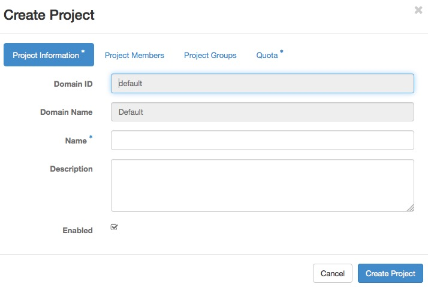

=================
Managing Projects
=================

Users must be associated with at least one project, though they may
belong to many. Therefore, you should add at least one project before
adding users.

Adding Projects
~~~~~~~~~~~~~~~

To create a project through the OpenStack dashboard:

#. Log in as an administrative user.

#. Select the :guilabel:`Identity` tab in the left navigation bar.

#. Under Identity tab, click :guilabel:`Projects`.

#. Click the :guilabel:`Create Project` button.

You are prompted for a project name and an optional, but recommended,
description. Select the check box at the bottom of the form to enable
this project. By default, it is enabled, as shown below:

It is also possible to add project members and adjust the project
quotas. We'll discuss those actions later, but in practice, it can be
quite convenient to deal with all these operations at one time.

To add a project through the command line, you must use the OpenStack
command line client.

.. code-block:: console

   # openstack project create demo --domain default

This command creates a project named ``demo``. Optionally, you can add a
description string by appending ``--description PROJECT_DESCRIPTION``,
which can be very useful. You can also
create a project in a disabled state by appending ``--disable`` to the
command. By default, projects are created in an enabled state.
