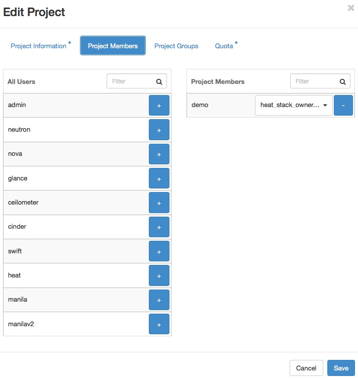

===============
User Management
===============

The OpenStack Dashboard provides a graphical interface to manage users.
This section describes user management with the Dashboard.

You can also `manage projects, users, and roles
<http://docs.openstack.org/admin-guide/cli-manage-projects-users-and-roles.html>`_
from the command-line clients.

In addition, many sites write custom tools for local needs to enforce
local policies and provide levels of self-service to users that are not
currently available with packaged tools.

Creating New Users
~~~~~~~~~~~~~~~~~~

To create a user, you need the following information:

* Username
* Description
* Email address
* Password
* Primary project
* Role
* Enabled

Username and email address are self-explanatory, though your site may
have local conventions you should observe. The primary project is simply
the first project the user is associated with and must exist prior to
creating the user. Role is almost always going to be "member." Out of
the box, OpenStack comes with two roles defined:

member
    A typical user

admin
    An administrative super user, which has full permissions across all
    projects and should be used with great care

It is possible to define other roles, but doing so is uncommon.

Once you've gathered this information, creating the user in the
dashboard is just another web form similar to what we've seen before and
can be found by clicking the :guilabel:`Users` link in the
:guilabel:`Identity` navigation bar and then clicking the
:guilabel:`Create User` button at the top right.

Modifying users is also done from this :guilabel:`Users` page. If you have a
large number of users, this page can get quite crowded. The :guilabel:`Filter`
search box at the top of the page can be used to limit the users listing. A
form very similar to the user creation dialog can be pulled up by selecting
:guilabel:`Edit` from the actions drop-down menu at the end of the line for
the user you are modifying.

Associating Users with Projects
~~~~~~~~~~~~~~~~~~~~~~~~~~~~~~~

Many sites run with users being associated with only one project. This
is a more conservative and simpler choice both for administration and
for users. Administratively, if a user reports a problem with an
instance or quota, it is obvious which project this relates to. Users
needn't worry about what project they are acting in if they are only in
one project. However, note that, by default, any user can affect the
resources of any other user within their project. It is also possible to
associate users with multiple projects if that makes sense for your
organization.

Associating existing users with an additional project or removing them
from an older project is done from the :guilabel:`Projects` page of the
dashboard by selecting :guilabel:`Manage Members` from the
:guilabel:`Actions` column, as shown in the screenshot below.

From this view, you can do a number of useful things, as well as a few
dangerous ones.

The first column of this form, named :guilabel:`All Users`, includes a list of
all the users in your cloud who are not already associated with this
project. The second column shows all the users who are. These lists can
be quite long, but they can be limited by typing a substring of the
username you are looking for in the filter field at the top of the
column.

From here, click the :guilabel:`+` icon to add users to the project.
Click the :guilabel:`-` to remove them.

The dangerous possibility comes with the ability to change member roles.
This is the dropdown list below the username in the
:guilabel:`Project Members` list. In virtually all cases,
this value should be set to :guilabel:`Member`. This example purposefully
shows an administrative user where this value is ``admin``.

.. warning::

   The admin is global, not per project, so granting a user the ``admin``
   role in any project gives the user administrative rights across the
   whole cloud.

Typical use is to only create administrative users in a single project,
by convention the admin project, which is created by default during
cloud setup. If your administrative users also use the cloud to launch
and manage instances, it is strongly recommended that you use separate
user accounts for administrative access and normal operations and that
they be in distinct projects.

Customizing Authorization
-------------------------

The default :term:`authorization` settings allow administrative users
only to create resources on behalf of a different project.
OpenStack handles two kinds of authorization policies:

Operation based
    Policies specify access criteria for specific operations, possibly
    with fine-grained control over specific attributes.

Resource based
    Whether access to a specific resource might be granted or not
    according to the permissions configured for the resource (currently
    available only for the network resource). The actual authorization
    policies enforced in an OpenStack service vary from deployment to
    deployment.

The policy engine reads entries from the ``policy.json`` file. The
actual location of this file might vary from distribution to
distribution: for nova, it is typically in ``/etc/nova/policy.json``.
You can update entries while the system is running, and you do not have
to restart services. Currently, the only way to update such policies is
to edit the policy file.

The OpenStack service's policy engine matches a policy directly. A rule
indicates evaluation of the elements of such policies. For instance, in
a ``compute:create: "rule:admin_or_owner"`` statement, the policy is
``compute:create``, and the rule is ``admin_or_owner``.

Policies are triggered by an OpenStack policy engine whenever one of
them matches an OpenStack API operation or a specific attribute being
used in a given operation. For instance, the engine tests the
``create:compute`` policy every time a user sends a
``POST /v2/{tenant_id}/servers`` request to the OpenStack Compute API
server. Policies can be also related to specific :term:`API extensions
<API extension>`. For instance, if a user needs an extension like
``compute_extension:rescue``, the attributes defined by the provider
extensions trigger the rule test for that operation.

An authorization policy can be composed by one or more rules. If more
rules are specified, evaluation policy is successful if any of the rules
evaluates successfully; if an API operation matches multiple policies,
then all the policies must evaluate successfully. Also, authorization
rules are recursive. Once a rule is matched, the rule(s) can be resolved
to another rule, until a terminal rule is reached. These are the rules
defined:

Role-based rules
    Evaluate successfully if the user submitting the request has the
    specified role. For instance, ``"role:admin"`` is successful if the
    user submitting the request is an administrator.

Field-based rules
    Evaluate successfully if a field of the resource specified in the
    current request matches a specific value. For instance,
    ``"field:networks:shared=True"`` is successful if the attribute
    shared of the network resource is set to ``true``.

Generic rules
    Compare an attribute in the resource with an attribute extracted
    from the user's security credentials and evaluates successfully if
    the comparison is successful. For instance,
    ``"tenant_id:%(tenant_id)s"`` is successful if the tenant identifier
    in the resource is equal to the tenant identifier of the user
    submitting the request.

Here are snippets of the default nova ``policy.json`` file:

.. code-block:: none

   {
           "context_is_admin":  "role:admin",
           "admin_or_owner":  "is_admin:True", "project_id:%(project_id)s", ~~~~(1)~~~~
           "default": "rule:admin_or_owner", ~~~~(2)~~~~
           "compute:create": "",
           "compute:create:attach_network": "",
           "compute:create:attach_volume": "",
           "compute:get_all": "",
           "admin_api": "is_admin:True",
           "compute_extension:accounts": "rule:admin_api",
           "compute_extension:admin_actions": "rule:admin_api",
           "compute_extension:admin_actions:pause": "rule:admin_or_owner",
           "compute_extension:admin_actions:unpause": "rule:admin_or_owner",
           ...
           "compute_extension:admin_actions:migrate": "rule:admin_api",
           "compute_extension:aggregates": "rule:admin_api",
           "compute_extension:certificates": "",
           ...
           "compute_extension:flavorextraspecs": "",
           "compute_extension:flavormanage": "rule:admin_api", ~~~~(3)~~~~
   }

1. Shows a rule that evaluates successfully if the current user is an
   administrator or the owner of the resource specified in the request
   (tenant identifier is equal).

2. Shows the default policy, which is always evaluated if an API
   operation does not match any of the policies in ``policy.json``.

3. Shows a policy restricting the ability to manipulate flavors to
   administrators using the Admin API only.

In some cases, some operations should be restricted to administrators
only. Therefore, as a further example, let us consider how this sample
policy file could be modified in a scenario where we enable users to
create their own flavors:

.. code-block:: none

   "compute_extension:flavormanage": "",

Users Who Disrupt Other Users
-----------------------------

Users on your cloud can disrupt other users, sometimes intentionally and
maliciously and other times by accident. Understanding the situation
allows you to make a better decision on how to handle the
disruption.

For example, a group of users have instances that are utilizing a large
amount of compute resources for very compute-intensive tasks. This is
driving the load up on compute nodes and affecting other users. In this
situation, review your user use cases. You may find that high compute
scenarios are common, and should then plan for proper segregation in
your cloud, such as host aggregation or regions.

Another example is a user consuming a very large amount of bandwidth.
Again, the key is to understand what the user is doing.
If she naturally needs a high amount of bandwidth,
you might have to limit her transmission rate as to not
affect other users or move her to an area with more bandwidth available.
On the other hand, maybe her instance has been hacked and is part of a
botnet launching DDOS attacks. Resolution of this issue is the same as
though any other server on your network has been hacked. Contact the
user and give her time to respond. If she doesn't respond, shut down the
instance.

A final example is if a user is hammering cloud resources repeatedly.
Contact the user and learn what he is trying to do. Maybe he doesn't
understand that what he's doing is inappropriate, or maybe there is an
issue with the resource he is trying to access that is causing his
requests to queue or lag.
