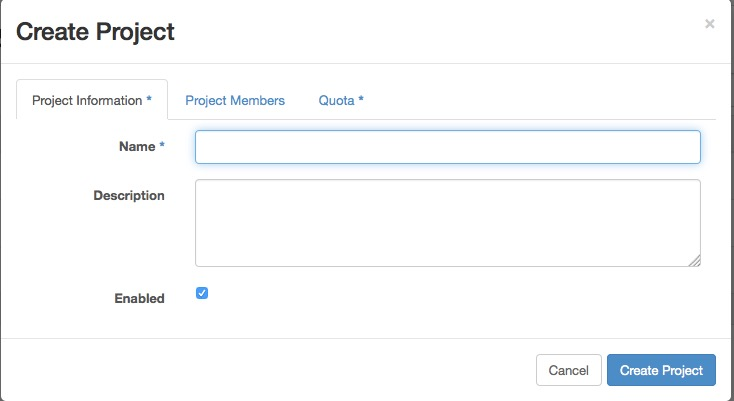
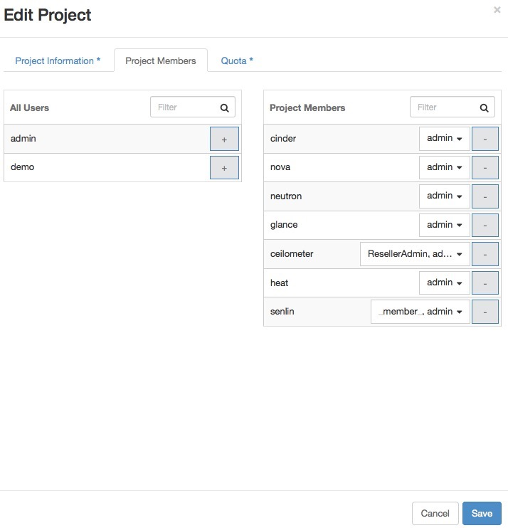

===========================
Managing Projects and Users
===========================

An OpenStack cloud does not have much value without users. This chapter
covers topics that relate to managing users, projects, and quotas. This
chapter describes users and projects as described by version 2 of the
OpenStack Identity API.

.. warning::

   While version 3 of the Identity API is available, the client tools
   do not yet implement those calls, and most OpenStack clouds are
   still implementing Identity API v2.0.

Projects or Tenants?
~~~~~~~~~~~~~~~~~~~~

In OpenStack user interfaces and documentation, a group of users is
referred to as a :term:`project` or :term:`tenant`.
These terms are interchangeable.

The initial implementation of OpenStack Compute had its own
authentication system and used the term ``project``. When authentication
moved into the OpenStack Identity (keystone) project, it used the term
``tenant`` to refer to a group of users. Because of this legacy, some of
the OpenStack tools refer to projects and some refer to tenants.

.. note::

   This guide uses the term ``project``, unless an example shows
   interaction with a tool that uses the term ``tenant``.

Managing Projects
~~~~~~~~~~~~~~~~~

Users must be associated with at least one project, though they may
belong to many. Therefore, you should add at least one project before
adding users.

Adding Projects
---------------

To create a project through the OpenStack dashboard:

#. Log in as an administrative user.

#. Select the :guilabel:`Identity` tab in the left navigation bar.

#. Under Identity tab, click :guilabel:`Projects`.

#. Click the :guilabel:`Create Project` button.

You are prompted for a project name and an optional, but recommended,
description. Select the checkbox at the bottom of the form to enable
this project. By default, it is enabled, as shown in
:ref:`figure_create_project`.

.. _figure_create_project:

   Figure Dashboard's Create Project form

It is also possible to add project members and adjust the project
quotas. We'll discuss those actions later, but in practice, it can be
quite convenient to deal with all these operations at one time.

To add a project through the command line, you must use the OpenStack
command line client.

.. code-block:: console

   # openstack project create demo

This command creates a project named "demo." Optionally, you can add a
description string by appending :option:`--description tenant-description`,
which can be very useful. You can also
create a group in a disabled state by appending :option:`--disable` to the
command. By default, projects are created in an enabled state.

Quotas
~~~~~~

To prevent system capacities from being exhausted without notification,
you can set up :term:`quotas <quota>`. Quotas are operational limits. For example,
the number of gigabytes allowed per tenant can be controlled to ensure that
a single tenant cannot consume all of the disk space. Quotas are
currently enforced at the tenant (or project) level, rather than the
user level.

.. warning::

   Because without sensible quotas a single tenant could use up all the
   available resources, default quotas are shipped with OpenStack. You
   should pay attention to which quota settings make sense for your
   hardware capabilities.

Using the command-line interface, you can manage quotas for the
OpenStack Compute service and the Block Storage service.

Typically, default values are changed because a tenant requires more
than the OpenStack default of 10 volumes per tenant, or more than the
OpenStack default of 1 TB of disk space on a compute node.

.. note::

   To view all tenants, run:

   .. code-block:: console

       $ openstack project list
       +---------------------------------+----------+
       | ID                              | Name     |
       +---------------------------------+----------+
       | a981642d22c94e159a4a6540f70f9f8 | admin    |
       | 934b662357674c7b9f5e4ec6ded4d0e | tenant01 |
       | 7bc1dbfd7d284ec4a856ea1eb82dca8 | tenant02 |
       | 9c554aaef7804ba49e1b21cbd97d218 | services |
       +---------------------------------+----------+

Set Image Quotas
----------------

You can restrict a project's image storage by total number of bytes.
Currently, this quota is applied cloud-wide, so if you were to set an
Image quota limit of 5 GB, then all projects in your cloud will be able
to store only 5 GB of images and snapshots.

To enable this feature, edit the ``/etc/glance/glance-api.conf`` file,
and under the ``[DEFAULT]`` section, add:

.. code-block:: ini

   user_storage_quota = <bytes>

For example, to restrict a project's image storage to 5 GB, do this:

.. code-block:: ini

   user_storage_quota = 5368709120

.. note::

   There is a configuration option in ``glance-api.conf`` that limits
   the number of members allowed per image, called
   ``image_member_quota``, set to 128 by default. That setting is a
   different quota from the storage quota.

Set Compute Service Quotas
--------------------------

As an administrative user, you can update the Compute service quotas for
an existing tenant, as well as update the quota defaults for a new
tenant.Compute Compute service See :ref:`table_compute_quota`.

.. _table_compute_quota:

.. list-table:: Compute quota descriptions
   :widths: 30 40 30
   :header-rows: 1

   * - Quota
     - Description
     - Property name
   * - Fixed IPs
     - Number of fixed IP addresses allowed per tenant.
       This number must be equal to or greater than the number
       of allowed instances.
     - fixed-ips
   * - Floating IPs
     - Number of floating IP addresses allowed per tenant.
     - floating-ips
   * - Injected file content bytes
     - Number of content bytes allowed per injected file.
     - injected-file-content-bytes
   * - Injected file path bytes
     - Number of bytes allowed per injected file path.
     - injected-file-path-bytes
   * - Injected files
     - Number of injected files allowed per tenant.
     - injected-files
   * - Instances
     - Number of instances allowed per tenant.
     - instances
   * - Key pairs
     - Number of key pairs allowed per user.
     - key-pairs
   * - Metadata items
     - Number of metadata items allowed per instance.
     - metadata-items
   * - RAM
     - Megabytes of instance RAM allowed per tenant.
     - ram
   * - Security group rules
     - Number of rules per security group.
     - security-group-rules
   * - Security groups
     - Number of security groups per tenant.
     - security-groups
   * - VCPUs
     - Number of instance cores allowed per tenant.
     - cores

View and update compute quotas for a tenant (project)
^^^^^^^^^^^^^^^^^^^^^^^^^^^^^^^^^^^^^^^^^^^^^^^^^^^^^

As an administrative user, you can use the :command:`nova quota-*`
commands, which are provided by the
``python-novaclient`` package, to view and update tenant quotas.

**To view and update default quota values**

#. List all default quotas for all tenants, as follows:

   .. code-block:: console

      $ nova quota-defaults

   For example:

   .. code-block:: console

      $ nova quota-defaults
      +-----------------------------+-------+
      | Property                    | Value |
      +-----------------------------+-------+
      | metadata_items              | 128   |
      | injected_file_content_bytes | 10240 |
      | ram                         | 51200 |
      | floating_ips                | 10    |
      | key_pairs                   | 100   |
      | instances                   | 10    |
      | security_group_rules        | 20    |
      | injected_files              | 5     |
      | cores                       | 20    |
      | fixed_ips                   | -1    |
      | injected_file_path_bytes    | 255   |
      | security_groups             | 10    |
      +-----------------------------+-------+

#. Update a default value for a new tenant, as follows:

   .. code-block:: console

      $ nova quota-class-update default key value

   For example:

   .. code-block:: console

      $ nova quota-class-update default --instances 15

**To view quota values for a tenant (project)**

#. Place the tenant ID in a variable:

   .. code-block:: console

      $ tenant=$(openstack project list | awk '/tenantName/ {print $2}')

#. List the currently set quota values for a tenant, as follows:

   .. code-block:: console

      $ nova quota-show --tenant $tenant

   For example:

   .. code-block:: console

      $ nova quota-show --tenant $tenant
      +-----------------------------+-------+
      | Property                    | Value |
      +-----------------------------+-------+
      | metadata_items              | 128   |
      | injected_file_content_bytes | 10240 |
      | ram                         | 51200 |
      | floating_ips                | 12    |
      | key_pairs                   | 100   |
      | instances                   | 10    |
      | security_group_rules        | 20    |
      | injected_files              | 5     |
      | cores                       | 20    |
      | fixed_ips                   | -1    |
      | injected_file_path_bytes    | 255   |
      | security_groups             | 10    |
      +-----------------------------+-------+

**To update quota values for a tenant (project)**

#. Obtain the tenant ID, as follows:

   .. code-block:: console

      $ tenant=$(openstack project list | awk '/tenantName/ {print $2}')

#. Update a particular quota value, as follows:

   .. code-block:: console

      # nova quota-update --quotaName quotaValue tenantID

   For example:

   .. code-block:: console

      # nova quota-update --floating-ips 20 $tenant
      # nova quota-show --tenant $tenant
      +-----------------------------+-------+
      | Property                    | Value |
      +-----------------------------+-------+
      | metadata_items              | 128   |
      | injected_file_content_bytes | 10240 |
      | ram                         | 51200 |
      | floating_ips                | 20    |
      | key_pairs                   | 100   |
      | instances                   | 10    |
      | security_group_rules        | 20    |
      | injected_files              | 5     |
      | cores                       | 20    |
      | fixed_ips                   | -1    |
      | injected_file_path_bytes    | 255   |
      | security_groups             | 10    |
      +-----------------------------+-------+

   .. note::

      To view a list of options for the ``quota-update`` command, run:

      .. code-block:: console

         $ nova help quota-update

Set Object Storage Quotas
-------------------------

There are currently two categories of quotas for Object Storage:

Container quotas
    Limit the total size (in bytes) or number of objects that can be
    stored in a single container.

Account quotas
    Limit the total size (in bytes) that a user has available in the
    Object Storage service.

To take advantage of either container quotas or account quotas, your
Object Storage proxy server must have ``container_quotas`` or
``account_quotas`` (or both) added to the ``[pipeline:main]`` pipeline.
Each quota type also requires its own section in the
``proxy-server.conf`` file:

.. code-block:: ini

   [pipeline:main]
   pipeline = catch_errors [...] slo dlo account_quotas proxy-server

   [filter:account_quotas]
   use = egg:swift#account_quotas

   [filter:container_quotas]
   use = egg:swift#container_quotas

To view and update Object Storage quotas, use the :command:`swift` command
provided by the ``python-swiftclient`` package. Any user included in the
project can view the quotas placed on their project. To update Object
Storage quotas on a project, you must have the role of ResellerAdmin in
the project that the quota is being applied to.

To view account quotas placed on a project:

.. code-block:: console

   $ swift stat
      Account: AUTH_b36ed2d326034beba0a9dd1fb19b70f9
   Containers: 0
      Objects: 0
        Bytes: 0
   Meta Quota-Bytes: 214748364800
   X-Timestamp: 1351050521.29419
   Content-Type: text/plain; charset=utf-8
   Accept-Ranges: bytes

To apply or update account quotas on a project:

.. code-block:: console

   $ swift post -m quota-bytes:
        <bytes>

For example, to place a 5 GB quota on an account:

.. code-block:: console

   $ swift post -m quota-bytes:
        5368709120

To verify the quota, run the :command:`swift stat` command again:

.. code-block:: console

   $ swift stat
      Account: AUTH_b36ed2d326034beba0a9dd1fb19b70f9
   Containers: 0
      Objects: 0
        Bytes: 0
   Meta Quota-Bytes: 5368709120
   X-Timestamp: 1351541410.38328
   Content-Type: text/plain; charset=utf-8
   Accept-Ranges: bytes

Set Block Storage Quotas
------------------------

As an administrative user, you can update the Block Storage service
quotas for a tenant, as well as update the quota defaults for a new
tenant. See :ref:`table_block_storage_quota`.

.. _table_block_storage_quota:

.. list-table:: Table: Block Storage quota descriptions
   :widths: 50 50
   :header-rows: 1

   * - Property name
     - Description
   * - gigabytes
     - Number of volume gigabytes allowed per tenant
   * - snapshots
     - Number of Block Storage snapshots allowed per tenant.
   * - volumes
     - Number of Block Storage volumes allowed per tenant

View and update Block Storage quotas for a tenant (project)
^^^^^^^^^^^^^^^^^^^^^^^^^^^^^^^^^^^^^^^^^^^^^^^^^^^^^^^^^^^

As an administrative user, you can use the :command:`cinder quota-*`
commands, which are provided by the
``python-cinderclient`` package, to view and update tenant quotas.

**To view and update default Block Storage quota values**

#. List all default quotas for all tenants, as follows:

   .. code-block:: console

      $ cinder quota-defaults

   For example:

   .. code-block:: console

      $ cinder quota-defaults
      +-----------+-------+
      |  Property | Value |
      +-----------+-------+
      | gigabytes |  1000 |
      | snapshots |   10  |
      |  volumes  |   10  |
      +-----------+-------+

#. To update a default value for a new tenant, update the property in the
   ``/etc/cinder/cinder.conf`` file.

**To view Block Storage quotas for a tenant (project)**

#. View quotas for the tenant, as follows:

   .. code-block:: console

      # cinder quota-show tenantName

   For example:

   .. code-block:: console

      # cinder quota-show tenant01
      +-----------+-------+
      |  Property | Value |
      +-----------+-------+
      | gigabytes |  1000 |
      | snapshots |   10  |
      |  volumes  |   10  |
      +-----------+-------+

**To update Block Storage quotas for a tenant (project)**

#. Place the tenant ID in a variable:

   .. code-block:: console

      $ tenant=$(openstack project list | awk '/tenantName/ {print $2}')

#. Update a particular quota value, as follows:

   .. code-block:: console

      # cinder quota-update --quotaName NewValue tenantID

   For example:

   .. code-block:: console

      # cinder quota-update --volumes 15 $tenant
      # cinder quota-show tenant01
      +-----------+-------+
      |  Property | Value |
      +-----------+-------+
      | gigabytes |  1000 |
      | snapshots |   10  |
      |  volumes  |   15  |
      +-----------+-------+

User Management
~~~~~~~~~~~~~~~

The command-line tools for managing users are inconvenient to use
directly. They require issuing multiple commands to complete a single
task, and they use UUIDs rather than symbolic names for many items. In
practice, humans typically do not use these tools directly. Fortunately,
the OpenStack dashboard provides a reasonable interface to this. In
addition, many sites write custom tools for local needs to enforce local
policies and provide levels of self-service to users that aren't
currently available with packaged tools.

Creating New Users
~~~~~~~~~~~~~~~~~~

To create a user, you need the following information:

* Username
* Email address
* Password
* Primary project
* Role
* Enabled

Username and email address are self-explanatory, though your site may
have local conventions you should observe. The primary project is simply
the first project the user is associated with and must exist prior to
creating the user. Role is almost always going to be "member." Out of
the box, OpenStack comes with two roles defined:

member
    A typical user

admin
    An administrative super user, which has full permissions across all
    projects and should be used with great care

It is possible to define other roles, but doing so is uncommon.

Once you've gathered this information, creating the user in the
dashboard is just another web form similar to what we've seen before and
can be found by clicking the Users link in the Identity navigation bar
and then clicking the Create User button at the top right.

Modifying users is also done from this Users page. If you have a large
number of users, this page can get quite crowded. The Filter search box
at the top of the page can be used to limit the users listing. A form
very similar to the user creation dialog can be pulled up by selecting
Edit from the actions dropdown menu at the end of the line for the user
you are modifying.

Associating Users with Projects
~~~~~~~~~~~~~~~~~~~~~~~~~~~~~~~

Many sites run with users being associated with only one project. This
is a more conservative and simpler choice both for administration and
for users. Administratively, if a user reports a problem with an
instance or quota, it is obvious which project this relates to. Users
needn't worry about what project they are acting in if they are only in
one project. However, note that, by default, any user can affect the
resources of any other user within their project. It is also possible to
associate users with multiple projects if that makes sense for your
organization.

Associating existing users with an additional project or removing them
from an older project is done from the Projects page of the dashboard by
selecting Modify Users from the Actions column, as shown in
:ref:`figure_edit_project_members`.

From this view, you can do a number of useful things, as well as a few
dangerous ones.

The first column of this form, named All Users, includes a list of all
the users in your cloud who are not already associated with this
project. The second column shows all the users who are. These lists can
be quite long, but they can be limited by typing a substring of the
username you are looking for in the filter field at the top of the
column.

From here, click the :guilabel:`+` icon to add users to the project.
Click the :guilabel:`-` to remove them.

.. _figure_edit_project_members:

   Edit Project Members tab

The dangerous possibility comes with the ability to change member roles.
This is the dropdown list below the username in the
:guilabel:`Project Members` list. In virtually all cases,
this value should be set to Member. This example purposefully shows
an administrative user where this value is admin.

.. warning::

   The admin is global, not per project, so granting a user the admin
   role in any project gives the user administrative rights across the
   whole cloud.

Typical use is to only create administrative users in a single project,
by convention the admin project, which is created by default during
cloud setup. If your administrative users also use the cloud to launch
and manage instances, it is strongly recommended that you use separate
user accounts for administrative access and normal operations and that
they be in distinct projects.

Customizing Authorization
-------------------------

The default :term:`authorization` settings allow administrative users
only to create resources on behalf of a different project.
OpenStack handles two kinds of authorization policies:

Operation based
    Policies specify access criteria for specific operations, possibly
    with fine-grained control over specific attributes.

Resource based
    Whether access to a specific resource might be granted or not
    according to the permissions configured for the resource (currently
    available only for the network resource). The actual authorization
    policies enforced in an OpenStack service vary from deployment to
    deployment.

The policy engine reads entries from the ``policy.json`` file. The
actual location of this file might vary from distribution to
distribution: for nova, it is typically in ``/etc/nova/policy.json``.
You can update entries while the system is running, and you do not have
to restart services. Currently, the only way to update such policies is
to edit the policy file.

The OpenStack service's policy engine matches a policy directly. A rule
indicates evaluation of the elements of such policies. For instance, in
a ``compute:create: [["rule:admin_or_owner"]]`` statement, the policy is
``compute:create``, and the rule is ``admin_or_owner``.

Policies are triggered by an OpenStack policy engine whenever one of
them matches an OpenStack API operation or a specific attribute being
used in a given operation. For instance, the engine tests the
``create:compute`` policy every time a user sends a
``POST /v2/{tenant_id}/servers`` request to the OpenStack Compute API
server. Policies can be also related to specific :term:`API extensions
<API extension>`. For instance, if a user needs an extension like
``compute_extension:rescue``, the attributes defined by the provider
extensions trigger the rule test for that operation.

An authorization policy can be composed by one or more rules. If more
rules are specified, evaluation policy is successful if any of the rules
evaluates successfully; if an API operation matches multiple policies,
then all the policies must evaluate successfully. Also, authorization
rules are recursive. Once a rule is matched, the rule(s) can be resolved
to another rule, until a terminal rule is reached. These are the rules
defined:

Role-based rules
    Evaluate successfully if the user submitting the request has the
    specified role. For instance, ``"role:admin"`` is successful if the
    user submitting the request is an administrator.

Field-based rules
    Evaluate successfully if a field of the resource specified in the
    current request matches a specific value. For instance,
    ``"field:networks:shared=True"`` is successful if the attribute
    shared of the network resource is set to ``true``.

Generic rules
    Compare an attribute in the resource with an attribute extracted
    from the user's security credentials and evaluates successfully if
    the comparison is successful. For instance,
    ``"tenant_id:%(tenant_id)s"`` is successful if the tenant identifier
    in the resource is equal to the tenant identifier of the user
    submitting the request.

Here are snippets of the default nova ``policy.json`` file:

.. code-block:: json

   {
           "context_is_admin":  [["role:admin"]],
           "admin_or_owner":  [["is_admin:True"], ["project_id:%(project_id)s"]], ~~~~(1)~~~~
           "default": [["rule:admin_or_owner"]], ~~~~(2)~~~~
           "compute:create": [ ],
           "compute:create:attach_network": [ ],
           "compute:create:attach_volume": [ ],
           "compute:get_all": [ ],
           "admin_api": [["is_admin:True"]],
           "compute_extension:accounts": [["rule:admin_api"]],
           "compute_extension:admin_actions": [["rule:admin_api"]],
           "compute_extension:admin_actions:pause": [["rule:admin_or_owner"]],
           "compute_extension:admin_actions:unpause": [["rule:admin_or_owner"]],
           ...
           "compute_extension:admin_actions:migrate": [["rule:admin_api"]],
           "compute_extension:aggregates": [["rule:admin_api"]],
           "compute_extension:certificates": [ ],
           ...
           "compute_extension:flavorextraspecs": [ ],
           "compute_extension:flavormanage": [["rule:admin_api"]], ~~~~(3)~~~~
   }

1. Shows a rule that evaluates successfully if the current user is an
   administrator or the owner of the resource specified in the request
   (tenant identifier is equal).

2. Shows the default policy, which is always evaluated if an API
   operation does not match any of the policies in ``policy.json``.

3. Shows a policy restricting the ability to manipulate flavors to
   administrators using the Admin API only.admin API

In some cases, some operations should be restricted to administrators
only. Therefore, as a further example, let us consider how this sample
policy file could be modified in a scenario where we enable users to
create their own flavors:

.. code-block:: console

   "compute_extension:flavormanage": [ ],

Users Who Disrupt Other Users
-----------------------------

Users on your cloud can disrupt other users, sometimes intentionally and
maliciously and other times by accident. Understanding the situation
allows you to make a better decision on how to handle the
disruption.

For example, a group of users have instances that are utilizing a large
amount of compute resources for very compute-intensive tasks. This is
driving the load up on compute nodes and affecting other users. In this
situation, review your user use cases. You may find that high compute
scenarios are common, and should then plan for proper segregation in
your cloud, such as host aggregation or regions.

Another example is a user consuming a very large amount of
bandwidthbandwidth recognizing DDOS attacks. Again, the key is to
understand what the user is doing. If she naturally needs a high amount
of bandwidth, you might have to limit her transmission rate as to not
affect other users or move her to an area with more bandwidth available.
On the other hand, maybe her instance has been hacked and is part of a
botnet launching DDOS attacks. Resolution of this issue is the same as
though any other server on your network has been hacked. Contact the
user and give her time to respond. If she doesn't respond, shut down the
instance.

A final example is if a user is hammering cloud resources repeatedly.
Contact the user and learn what he is trying to do. Maybe he doesn't
understand that what he's doing is inappropriate, or maybe there is an
issue with the resource he is trying to access that is causing his
requests to queue or lag.

Summary
~~~~~~~

One key element of systems administration that is often overlooked is
that end users are the reason systems administrators exist. Don't go the
BOFH route and terminate every user who causes an alert to go off. Work
with users to understand what they're trying to accomplish and see how
your environment can better assist them in achieving their goals. Meet
your users needs by organizing your users into projects, applying
policies, managing quotas, and working with them.
