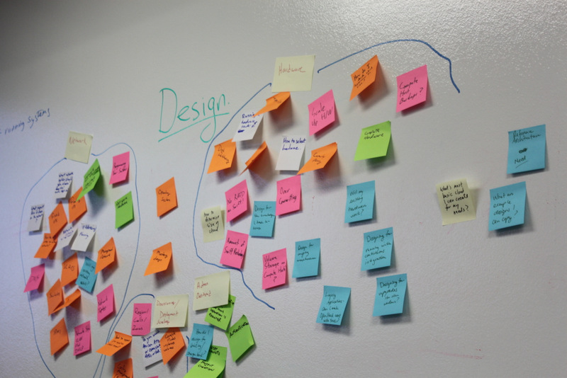

=======
Preface
=======

OpenStack is an open source platform that lets you build an
:term:`Infrastructure-as-a-Service (IaaS)` cloud that runs on commodity
hardware.

Introduction to OpenStack
~~~~~~~~~~~~~~~~~~~~~~~~~

OpenStack believes in open source, open design, and open development,
all in an open community that encourages participation by anyone. The
long-term vision for OpenStack is to produce a ubiquitous open source
cloud computing platform that meets the needs of public and private
cloud providers regardless of size. OpenStack services control large
pools of compute, storage, and networking resources throughout a data
center.

The technology behind OpenStack consists of a series of interrelated
projects delivering various components for a cloud infrastructure
solution. Each service provides an open API so that all of these
resources can be managed through a dashboard that gives administrators
control while empowering users to provision resources through a web
interface, a command-line client, or software development kits that
support the API. Many OpenStack APIs are extensible, meaning you can
keep compatibility with a core set of calls while providing access to
more resources and innovating through API extensions. The OpenStack
project is a global collaboration of developers and cloud computing
technologists. The project produces an open standard cloud computing
platform for both public and private clouds. By focusing on ease of
implementation, massive scalability, a variety of rich features, and
tremendous extensibility, the project aims to deliver a practical and
reliable cloud solution for all types of organizations.

Getting Started with OpenStack
~~~~~~~~~~~~~~~~~~~~~~~~~~~~~~

As an open source project, one of the unique aspects of OpenStack is
that it has many different levels at which you can begin to engage with
it—you don't have to do everything yourself.

Using OpenStack
---------------

You could ask, "Do I even need to build a cloud?" If you want to start
using a compute or storage service by just swiping your credit card, you
can go to eNovance, HP, Rackspace, or other organizations to start using
their public OpenStack clouds. Using their OpenStack cloud resources is
similar to accessing the publicly available Amazon Web Services Elastic
Compute Cloud (EC2) or Simple Storage Solution (S3).

Plug and Play OpenStack
-----------------------

However, the enticing part of OpenStack might be to build your own
private cloud, and there are several ways to accomplish this goal.
Perhaps the simplest of all is an appliance-style solution. You purchase
an appliance, unpack it, plug in the power and the network, and watch it
transform into an OpenStack cloud with minimal additional configuration.

However, hardware choice is important for many applications, so if that
applies to you, consider that there are several software distributions
available that you can run on servers, storage, and network products of
your choosing. Canonical (where OpenStack replaced Eucalyptus as the
default cloud option in 2011), Red Hat, and SUSE offer enterprise
OpenStack solutions and support. You may also want to take a look at
some of the specialized distributions, such as those from Rackspace,
Piston, SwiftStack, or Cloudscaling.

Alternatively, if you want someone to help guide you through the
decisions about the underlying hardware or your applications, perhaps
adding in a few features or integrating components along the way,
consider contacting one of the system integrators with OpenStack
experience, such as Mirantis or Metacloud.

If your preference is to build your own OpenStack expertise internally,
a good way to kick-start that might be to attend or arrange a training
session. The OpenStack Foundation has a `Training
Marketplace <https://www.openstack.org/marketplace/training>`_ where you
can look for nearby events. Also, the OpenStack community is `working to
produce <https://wiki.openstack.org/wiki/Training-guides>`_ open source
training materials.

Roll Your Own OpenStack
-----------------------

However, this guide has a different audience—those seeking flexibility
from the OpenStack framework by deploying do-it-yourself solutions.

OpenStack is designed for horizontal scalability, so you can easily add
new compute, network, and storage resources to grow your cloud over
time. In addition to the pervasiveness of massive OpenStack public
clouds, many organizations, such as PayPal, Intel, and Comcast, build
large-scale private clouds. OpenStack offers much more than a typical
software package because it lets you integrate a number of different
technologies to construct a cloud. This approach provides great
flexibility, but the number of options might be daunting at first.

Who This Book Is For
~~~~~~~~~~~~~~~~~~~~

This book is for those of you starting to run OpenStack clouds as well
as those of you who were handed an operational one and want to keep it
running well. Perhaps you're on a DevOps team, perhaps you are a system
administrator starting to dabble in the cloud, or maybe you want to get
on the OpenStack cloud team at your company. This book is for all of
you.

This guide assumes that you are familiar with a Linux distribution that
supports OpenStack, SQL databases, and virtualization. You must be
comfortable administering and configuring multiple Linux machines for
networking. You must install and maintain an SQL database and
occasionally run queries against it.

One of the most complex aspects of an OpenStack cloud is the networking
configuration. You should be familiar with concepts such as DHCP, Linux
bridges, VLANs, and iptables. You must also have access to a network
hardware expert who can configure the switches and routers required in
your OpenStack cloud.

.. note::

   Cloud computing is quite an advanced topic, and this book requires a
   lot of background knowledge. However, if you are fairly new to cloud
   computing, we recommend that you make use of the :doc:`common/glossary`
   at the back of the book, as well as the online documentation for OpenStack
   and additional resources mentioned in this book in :doc:`app-resources`.

Further Reading
---------------

There are other books on the `OpenStack documentation
website <https://docs.openstack.org>`_ that can help you get the job
done.

Installation Tutorials and Guides
    Describes a manual installation process, as in, by hand, without
    automation, for multiple distributions based on a packaging system:

    -  `OpenStack Installation Tutorial for openSUSE and SUSE Linux Enterprise
       <https://docs.openstack.org/newton/install-guide-obs/>`_

    -  `OpenStack Installation Tutorial for Red Hat Enterprise Linux and CentOS
       <https://docs.openstack.org/newton/install-guide-rdo/>`_

    -  `OpenStack Installation Tutorial for Ubuntu
       <https://docs.openstack.org/newton/install-guide-ubuntu/>`_

`OpenStack Configuration Reference <https://docs.openstack.org/newton/config-reference/>`_
    Contains a reference listing of all configuration options for core
    and integrated OpenStack services by release version

`OpenStack Administrator Guide <https://docs.openstack.org/admin-guide/>`_
    Contains how-to information for managing an OpenStack cloud as
    needed for your use cases, such as storage, computing, or
    software-defined-networking

`OpenStack High Availability Guide <https://docs.openstack.org/ha-guide/index.html>`_
    Describes potential strategies for making your OpenStack services
    and related controllers and data stores highly available

`OpenStack Security Guide <https://docs.openstack.org/sec/>`_
    Provides best practices and conceptual information about securing an
    OpenStack cloud

`Virtual Machine Image Guide <https://docs.openstack.org/image-guide/>`_
    Shows you how to obtain, create, and modify virtual machine images
    that are compatible with OpenStack

`OpenStack End User Guide <https://docs.openstack.org/user-guide/>`_
    Shows OpenStack end users how to create and manage resources in an
    OpenStack cloud with the OpenStack dashboard and OpenStack client
    commands

`OpenStack Networking Guide <https://docs.openstack.org/newton/networking-guide/>`_
    This guide targets OpenStack administrators seeking to deploy and
    manage OpenStack Networking (neutron).

`OpenStack API Guide <https://developer.openstack.org/api-guide/quick-start/>`_
    A brief overview of how to send REST API requests to endpoints for
    OpenStack services

How This Book Is Organized
~~~~~~~~~~~~~~~~~~~~~~~~~~

This book is organized into two parts: the architecture decisions for
designing OpenStack clouds and the repeated operations for running
OpenStack clouds.

**Part I:**

:doc:`arch-examples`
    Because of all the decisions the other chapters discuss, this
    chapter describes the decisions made for this particular book and
    much of the justification for the example architecture.

:doc:`arch-provision`
    While this book doesn't describe installation, we do recommend
    automation for deployment and configuration, discussed in this
    chapter.

:doc:`arch-cloud-controller`
    The cloud controller is an invention for the sake of consolidating
    and describing which services run on which nodes. This chapter
    discusses hardware and network considerations as well as how to
    design the cloud controller for performance and separation of
    services.

:doc:`arch-compute-nodes`
    This chapter describes the compute nodes, which are dedicated to
    running virtual machines. Some hardware choices come into play here,
    as well as logging and networking descriptions.

:doc:`arch-scaling`
    This chapter discusses the growth of your cloud resources through
    scaling and segregation considerations.

:doc:`arch-storage`
    As with other architecture decisions, storage concepts within
    OpenStack offer many options. This chapter lays out the choices for
    you.

:doc:`arch-network-design`
    Your OpenStack cloud networking needs to fit into your existing
    networks while also enabling the best design for your users and
    administrators, and this chapter gives you in-depth information
    about networking decisions.

**Part II:**

:doc:`ops-lay-of-the-land`
    This chapter is written to let you get your hands wrapped around
    your OpenStack cloud through command-line tools and understanding
    what is already set up in your cloud.

:doc:`ops-projects-users`
    This chapter walks through user-enabling processes that all admins
    must face to manage users, give them quotas to parcel out resources,
    and so on.

:doc:`ops-user-facing-operations`
    This chapter shows you how to use OpenStack cloud resources and how
    to train your users.

:doc:`ops-maintenance`
    This chapter goes into the common failures that the authors have
    seen while running clouds in production, including troubleshooting.

:doc:`ops-network-troubleshooting`
    Because network troubleshooting is especially difficult with virtual
    resources, this chapter is chock-full of helpful tips and tricks for
    tracing network traffic, finding the root cause of networking
    failures, and debugging related services, such as DHCP and DNS.

:doc:`ops-logging-monitoring`
    This chapter shows you where OpenStack places logs and how to best
    read and manage logs for monitoring purposes.

:doc:`ops-backup-recovery`
    This chapter describes what you need to back up within OpenStack as
    well as best practices for recovering backups.

:doc:`ops-customize`
    For readers who need to get a specialized feature into OpenStack,
    this chapter describes how to use DevStack to write custom
    middleware or a custom scheduler to rebalance your resources.

:doc:`ops-advanced-configuration`
    Much of OpenStack is driver-oriented, so you can plug in different
    solutions to the base set of services. This chapter describes some
    advanced configuration topics.

:doc:`ops-upgrades`
    This chapter provides upgrade information based on the architectures
    used in this book.

**Back matter:**

:doc:`app-usecases`
    You can read a small selection of use cases from the OpenStack
    community with some technical details and further resources.

:doc:`app-crypt`
    These are shared legendary tales of image disappearances, VM
    massacres, and crazy troubleshooting techniques that result in
    hard-learned lessons and wisdom.

:doc:`app-roadmaps`
    Read about how to track the OpenStack roadmap through the open and
    transparent development processes.

:doc:`app-resources`
    So many OpenStack resources are available online because of the
    fast-moving nature of the project, but there are also resources
    listed here that the authors found helpful while learning
    themselves.

:doc:`common/glossary`
    A list of terms used in this book is included, which is a subset of
    the larger OpenStack glossary available online.

Why and How We Wrote This Book
~~~~~~~~~~~~~~~~~~~~~~~~~~~~~~

We wrote this book because we have deployed and maintained OpenStack
clouds for at least a year and we wanted to share this knowledge with
others. After months of being the point people for an OpenStack cloud,
we also wanted to have a document to hand to our system administrators
so that they'd know how to operate the cloud on a daily basis—both
reactively and pro-actively. We wanted to provide more detailed
technical information about the decisions that deployers make along the
way.

We wrote this book to help you:

-  Design and create an architecture for your first nontrivial OpenStack
   cloud. After you read this guide, you'll know which questions to ask
   and how to organize your compute, networking, and storage resources
   and the associated software packages.

-  Perform the day-to-day tasks required to administer a cloud.

We wrote this book in a book sprint, which is a facilitated, rapid
development production method for books. For more information, see the
`BookSprints site <http://www.booksprints.net/>`_. Your authors cobbled
this book together in five days during February 2013, fueled by caffeine
and the best takeout food that Austin, Texas, could offer.

On the first day, we filled white boards with colorful sticky notes to
start to shape this nebulous book about how to architect and operate
clouds:

We wrote furiously from our own experiences and bounced ideas between
each other. At regular intervals we reviewed the shape and organization
of the book and further molded it, leading to what you see today.

The team includes:

Tom Fifield
    After learning about scalability in computing from particle physics
    experiments, such as ATLAS at the Large Hadron Collider (LHC) at
    CERN, Tom worked on OpenStack clouds in production to support the
    Australian public research sector. Tom currently serves as an
    OpenStack community manager and works on OpenStack documentation in
    his spare time.

Diane Fleming
    Diane works on the OpenStack API documentation tirelessly. She
    helped out wherever she could on this project.

Anne Gentle
    Anne is the documentation coordinator for OpenStack and also served
    as an individual contributor to the Google Documentation Summit in
    2011, working with the Open Street Maps team. She has worked on book
    sprints in the past, with FLOSS Manuals’ Adam Hyde facilitating.
    Anne lives in Austin, Texas.

Lorin Hochstein
    An academic turned software-developer-slash-operator, Lorin worked
    as the lead architect for Cloud Services at Nimbis Services, where
    he deploys OpenStack for technical computing applications. He has
    been working with OpenStack since the Cactus release. Previously, he
    worked on high-performance computing extensions for OpenStack at
    University of Southern California's Information Sciences Institute
    (USC-ISI).

Adam Hyde
    Adam facilitated this book sprint. He also founded the book sprint
    methodology and is the most experienced book-sprint facilitator
    around. See `BookSprints <http://www.booksprints.net>`_ for more
    information. Adam founded FLOSS Manuals—a community of some 3,000
    individuals developing Free Manuals about Free Software. He is also the
    founder and project manager for Booktype, an open source project for
    writing, editing, and publishing books online and in print.

Jonathan Proulx
    Jon has been piloting an OpenStack cloud as a senior technical
    architect at the MIT Computer Science and Artificial Intelligence
    Lab for his researchers to have as much computing power as they
    need. He started contributing to OpenStack documentation and
    reviewing the documentation so that he could accelerate his
    learning.

Everett Toews
    Everett is a developer advocate at Rackspace making OpenStack and
    the Rackspace Cloud easy to use. Sometimes developer, sometimes
    advocate, and sometimes operator, he's built web applications,
    taught workshops, given presentations around the world, and deployed
    OpenStack for production use by academia and business.

Joe Topjian
    Joe has designed and deployed several clouds at Cybera, a nonprofit
    where they are building e-infrastructure to support entrepreneurs
    and local researchers in Alberta, Canada. He also actively maintains
    and operates these clouds as a systems architect, and his
    experiences have generated a wealth of troubleshooting skills for
    cloud environments.

OpenStack community members
    Many individual efforts keep a community book alive. Our community
    members updated content for this book year-round. Also, a year after
    the first sprint, Jon Proulx hosted a second two-day mini-sprint at
    MIT with the goal of updating the book for the latest release. Since
    the book's inception, more than 30 contributors have supported this
    book. We have a tool chain for reviews, continuous builds, and
    translations. Writers and developers continuously review patches,
    enter doc bugs, edit content, and fix doc bugs. We want to recognize
    their efforts!

    The following people have contributed to this book: Akihiro Motoki,
    Alejandro Avella, Alexandra Settle, Andreas Jaeger, Andy McCallum,
    Benjamin Stassart, Chandan Kumar, Chris Ricker, David Cramer, David
    Wittman, Denny Zhang, Emilien Macchi, Gauvain Pocentek, Ignacio
    Barrio, James E. Blair, Jay Clark, Jeff White, Jeremy Stanley, K
    Jonathan Harker, KATO Tomoyuki, Lana Brindley, Laura Alves, Lee Li,
    Lukasz Jernas, Mario B. Codeniera, Matthew Kassawara, Michael Still,
    Monty Taylor, Nermina Miller, Nigel Williams, Phil Hopkins, Russell
    Bryant, Sahid Orentino Ferdjaoui, Sandy Walsh, Sascha Peilicke, Sean
    M. Collins, Sergey Lukjanov, Shilla Saebi, Stephen Gordon, Summer
    Long, Uwe Stuehler, Vaibhav Bhatkar, Veronica Musso, Ying Chun
    "Daisy" Guo, Zhengguang Ou, and ZhiQiang Fan.

How to Contribute to This Book
~~~~~~~~~~~~~~~~~~~~~~~~~~~~~~

The genesis of this book was an in-person event, but now that the book
is in your hands, we want you to contribute to it. OpenStack
documentation follows the coding principles of iterative work, with bug
logging, investigating, and fixing. We also store the source content on
GitHub and invite collaborators through the OpenStack Gerrit
installation, which offers reviews. For the O'Reilly edition of this
book, we are using the company's Atlas system, which also stores source
content on GitHub and enables collaboration among contributors.

Learn more about how to contribute to the OpenStack docs at `OpenStack
Documentation Contributor
Guide <https://docs.openstack.org/contributor-guide/>`_.

If you find a bug and can't fix it or aren't sure it's really a doc bug,
log a bug at `OpenStack
Manuals <https://bugs.launchpad.net/openstack-manuals>`_. Tag the bug
under Extra options with the ``ops-guide`` tag to indicate that the bug
is in this guide. You can assign the bug to yourself if you know how to
fix it. Also, a member of the OpenStack doc-core team can triage the doc
bug.
