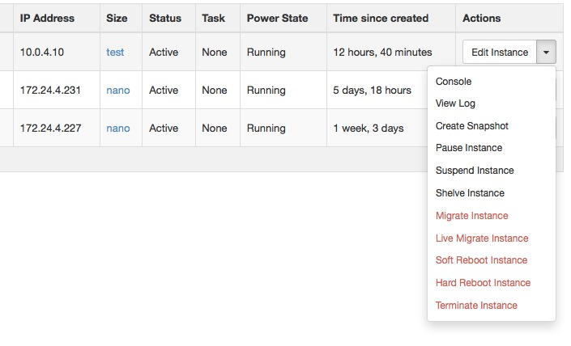

================
Manage instances
================

As an administrative user, you can manage instances for users in various
projects. You can view, terminate, edit, perform a soft or hard reboot,
create a snapshot from, and migrate instances. You can also view the
logs for instances or launch a VNC console for an instance.

For information about using the dashboard to launch instances as an end
user, see the `*OpenStack End User
Guide* <http://docs.openstack.org/user-guide/content/>`__.

Create instance snapshots
~~~~~~~~~~~~~~~~~~~~~~~~~

#. Log in to the dashboard and choose the admin project from the
   drop-down list at the top of the page.

#. On the :guilabel:`Admin` tab, click the :guilabel:`Instances` category.

#. Select an instance to create a snapshot from it. From the
   :guilabel:`Actions` drop-down list, select :guilabel:`Create Snapshot`.

#. In the :guilabel:`Create Snapshot` window, enter a name for the snapshot.

#. Click :guilabel:`Create Snapshot`. The dashboard shows the instance snapshot
   in the :guilabel:`Images & Snapshots` category.

#. To launch an instance from the snapshot, select the snapshot and
   click Launch. For information about launching instances, see the
   `*OpenStack End User
   Guide* <http://docs.openstack.org/user-guide/content/>`__.

Control the state of an instance
~~~~~~~~~~~~~~~~~~~~~~~~~~~~~~~~

#. Log in to the dashboard and choose the admin project from the
   drop-down list at the top of the page.

#. On the :guilabel:`Admin` tab, click the :guilabel:`Instances` category.

#. Select the instance for which you want to change the state.

#. In the :guilabel:`More` drop-down list in the :guilabel:`Actions` column,
   select the state.

   Depending on the current state of the instance, you can choose to
   pause, un-pause, suspend, resume, soft or hard reboot, or terminate
   an instance (items in red are disabled).

   **Figure Dashboard—Instance Actions**

Track usage
~~~~~~~~~~~

Use the Overview category to track usage of instances for each project.

You can track costs per month by showing metrics like number of VCPUs,
disks, RAM, and uptime of all your instances.

#. Log in to the dashboard and choose the admin project from the CURRENT
   PROJECT drop-down list.

#. On the :guilabel:`Admin` tab, click the :guilabel:`Instances` category.

#. Select a month and click :guilabel:`Submit` to query the instance usage for
   that month.

#. Click :guilabel:`Download CSV Summary` to download a CSV summary.

